# Anexos

## Anexo A. Entrevistas a usuarios

Las siguientes entrevistas corresponden al proceso de Requirements Elicitation realizado durante el AV1 para validar las necesidades, problemas y expectativas de los dos segmentos objetivo de LoadMatch.

### Segmento 1: Dueños de negocios y emprendedores

**Entrevista 1 — Pilar Jeannette Collado Urbina**  
Distrito: Breña, Lima, Perú  
Inicio: 00:01  
Duración: 6:25 minutos  

**Enlace al video:**  
https://upcedupe-my.sharepoint.com/:v:/g/personal/u202310342_upc_edu_pe/IQAt8Ki44tzjTLdPCxL9hSGQAVH7oO8GykclJBJsj6jRs4I?nav=eyJyZWZlcnJhbEluZm8iOnsicmVmZXJyYWxBcHAiOiJPbmVEcml2ZUZvckJ1c2luZXNzIiwicmVmZXJyYWxBcHBQbGF0Zm9ybSI6IldlYiIsInJlZmVycmFsTW9kZSI6InZpZXciLCJyZWZlcnJhbFZpZXciOiJNeUZpbGVzTGlua0NvcHkifX0&e=yq6rNK

---

**Entrevista 2 — Ronald Cortez Joseli**  
Distrito: San Martín de Porres, Lima, Perú  
Inicio: 00:02  
Duración: 6:37 minutos  

**Enlace al video:**  
https://upcedupe-my.sharepoint.com/:v:/g/personal/u202310342_upc_edu_pe/IQBAzfO4REFpQLwTj6NXeMnpAfz8bK1FQLdoZK5pQOoizkU?e=kh12X0

---

**Entrevista 3 — Diego Chuquillanqui Estrada**  
Distrito: San Martín de Porres, Lima, Perú  
Inicio: 00:01  
Duración: 05:59 minutos  

**Enlace al video:**  
https://upcedupe-my.sharepoint.com/:v:/g/personal/u202310342_upc_edu_pe/IQCdZoCTl1KTRoEP4Fh7fersAaq2Bhu8Wkqvswvk8HqreEI?e=jSlInn

---

### Segmento 2: Transportistas y dueños de vehículos de carga

**Entrevista 4 — Mateo Ignacio Vargas Huamán**  
Distrito: San Juan de Lurigancho, Lima, Perú  
Inicio: 00:00  
Duración: 6:41 minutos  

**Enlace al video:**  
https://upcedupe-my.sharepoint.com/:v:/g/personal/u202323551_upc_edu_pe/IQB202QxElaeSbRKuQOrZ3XgARvfvQPkIKKUwLtaRsqauuE?e=FRdDfF&nav=eyJyZWZlcnJhbEluZm8iOnsicmVmZXJyYWxBcHAiOiJTdHJlYW1XZWJBcHAiLCJyZWZlcnJhbFZpZXciOiJTaGFyZURpYWxvZy1MaW5rIiwicmVmZXJyYWxBcHBQbGF0Zm9ybSI6IldlYiIsInJlZmVycmFsTW9kZSI6InZpZXcifX0%3D

---

**Entrevista 5 — Tito Sifuentes**  
Distrito: Pueblo Libre, Lima, Perú  
Inicio: 01:00  
Duración: 5:20 minutos  

**Enlace al video:**  
https://upcedupe-my.sharepoint.com/personal/u202310342_upc_edu_pe/_layouts/15/stream.aspx?id=%2Fpersonal%2Fu202310342%5Fupc%5Fedu%5Fpe%2FDocuments%2FDesarrollo%20de%20Open%20Source%20%2D%202026%2D2%2FTransportistas%20y%20due%C3%B1os%20de%20veh%C3%ADculos%20de%20carga%2FEntrevistaTransportistaTitoSifuentes%2Emp4&referrer=StreamWebApp%2EWeb&referrerScenario=AddressBarCopied%2Eview%2E226abae8%2D7b5b%2D40ba%2Db438%2Dc6b82a93b0ee

---

**Entrevista 6 — Luciano Mateo Espinoza Vargas**  
Distrito: Puente Piedra, Lima, Perú  
Inicio: 00:00  
Duración: 6:50 minutos  

**Enlace al video:**  
https://upcedupe-my.sharepoint.com/:v:/g/personal/u202323551_upc_edu_pe/IQCXMP7YhDGBRIpNEYDMTaPxARBXZBXzhvbS1rtrUGrfBIA?nav=eyJyZWZlcnJhbEluZm8iOnsicmVmZXJyYWxBcHAiOiJTdHJlYW1XZWJBcHAiLCJyZWZlcnJhbFZpZXciOiJTaGFyZURpYWxvZy1MaW5rIiwicmVmZXJyYWxBcHBQbGF0Zm9ybSI6IldlYiIsInJlZmVycmFsTW9kZSI6InZpZXcifX0%3D&e=wCHiu7

---

## Anexo B. Prototipo de la aplicación

El prototipo interactivo de la Web Application de LoadMatch fue desarrollado en Figma con el propósito de representar los principales flujos de navegación e interacción definidos durante el Product Design.

**Prototipo de LoadMatch en Figma:**  
https://www.figma.com/proto/b2Bc4VRPXUGY61iyefa5I6/LoadMatch---Open-Source?node-id=120-3&p=f&t=lAU4l4ZzCTUcVxt6-0&scaling=scale-down&content-scaling=fixed&page-id=120%3A2&starting-point-node-id=120%3A3

---

## Anexo C. Gestión del Product Backlog

Las User Stories y tareas asociadas al desarrollo de LoadMatch son gestionadas mediante Jira Software.

**Product Backlog de LoadMatch en Jira:**  
https://upc-team-m57tll9j.atlassian.net/jira/software/projects/US/boards/2

---

## Anexo D. Repositorios del proyecto

El desarrollo de LoadMatch se encuentra organizado en repositorios independientes para cada uno de los productos y componentes principales del proyecto.

**Project Report:**  
https://github.com/Desarrollo-Open-Source-grupo-5/Loadmatch-report

**Landing Page:**  
https://github.com/Desarrollo-Open-Source-grupo-5/Loadmatch-landing-page

**Frontend Web Application:**  
https://github.com/Desarrollo-Open-Source-grupo-5/Loadmatch-frontend-application

**Backend Application:**  
https://github.com/Desarrollo-Open-Source-grupo-5/Loadmatch-backend-application

---

## Anexo E. Despliegue del Landing Page

La primera versión del Landing Page de LoadMatch fue desplegada públicamente mediante GitHub Pages durante el Sprint 1.

**Landing Page desplegada:**  
https://desarrollo-open-source-grupo-5.github.io/Loadmatch-landing-page/

**Release v1.0.0:**  
https://github.com/Desarrollo-Open-Source-grupo-5/Loadmatch-landing-page/releases/tag/v1.0.0

---

## Anexo F. Evidencias de colaboración

La colaboración del equipo durante el desarrollo del Landing Page se encuentra registrada mediante branches, commits y Pull Requests en GitHub.

**Pull Requests del Landing Page:**  
https://github.com/Desarrollo-Open-Source-grupo-5/Loadmatch-landing-page/pulls?q=is%3Apr+is%3Aclosed

---

## Anexo G. Video de Sprint Review

### Sprint 2 — TB1

El equipo proporcionó el video de demostración de la Web Application correspondiente al Sprint 2. Su recorrido debe cubrir las vistas de empresa y transportista, la navegación desde la landing y los límites del uso de datos de prueba; el contenido completo debe revisarse antes de entregar.

**Link:** [LoadMatch — Sprint 2 Execution Demo | Web Application](https://youtu.be/eCoQdmCrUJg).  
**Duración:** 4 minutos y 38 segundos, según la captura suministrada.  
**Disponibilidad:** No listado, según el reproductor mostrado.

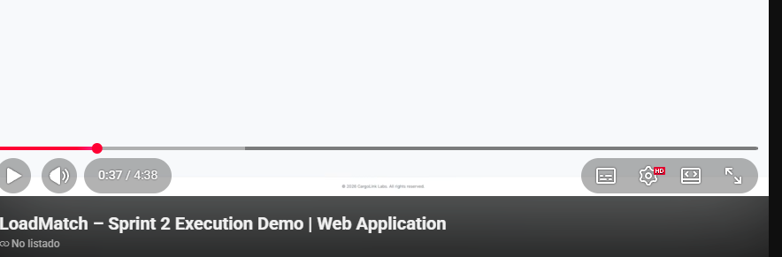

*Figura. Captura proporcionada por el equipo: título del video y contador 0:37 / 4:38.*

### Sprint 1 — AV1

El video del Sprint Review presenta la navegación y funcionamiento del incremento desarrollado durante el Sprint 1.

**Video de navegación del Sprint 1:**  
https://upcedupe-my.sharepoint.com/:v:/g/personal/u202310342_upc_edu_pe/IQDWUFuRbr2mTbmyHe5Unle2ARQ_Ohp6v-p65qkdM2X-FTM?e=1wbyk6

---

## Anexo H. Productos y configuración de Sprint 2

| Producto / recurso | Enlace |
| --- | --- |
| Landing Page actualizada | https://desarrollo-open-source-grupo-5.github.io/Loadmatch-landing-page/ |
| Web Application | https://loadmatch-frontend-application.vercel.app/home |
| API simulada de producción | https://loadmatch-api.onrender.com/api/v1 |
| Configuración Vercel del frontend | https://github.com/Desarrollo-Open-Source-grupo-5/Loadmatch-frontend-application/blob/main/vercel.json |
| Entorno de producción del frontend | https://github.com/Desarrollo-Open-Source-grupo-5/Loadmatch-frontend-application/blob/main/src/environments/environment.ts |
| Integraciones del frontend | https://github.com/Desarrollo-Open-Source-grupo-5/Loadmatch-frontend-application/pulls?q=is%3Apr+is%3Aclosed |

La API de Render es JSON Server y no se presenta como el backend definitivo. Los pasos, commits y evidencias correspondientes están detallados en 5.2.2.6–5.2.2.8.

## Anexo I. Videos de Exposiciones

**Exposición TB1**  
**Link:** pendiente de incorporar el enlace de Microsoft Stream/Clipchamp.  
**Duración:** pendiente de registrar; máximo 30 minutos según el enunciado.  
**Captura:** pendiente de incorporar.

El video de exposición del hito y el recorrido de navegación de Sprint 2 son evidencias distintas.

## Anexo J. Evidencia de Jira de Sprint 2

Las tres capturas originales del equipo se conservan en `assets/images/sprint2/`: `SprintReport.png`, `SprintBurndown.png` y `SprintScopeChange.png`. Están integradas en 5.2.2.3. El informe distingue claves Jira (`US-14`) e IDs funcionales (`US09`) y documenta el aumento del alcance de 22 a 49 puntos.

Las capturas `RemainingBacklog1.png` y `RemainingBacklog2.png`, también integradas en 5.2.2.3, muestran el Product Backlog posterior al sprint: 28 actividades y 95 Story Points pendientes del producto.

### J.1. Historias finalizadas del Sprint 2

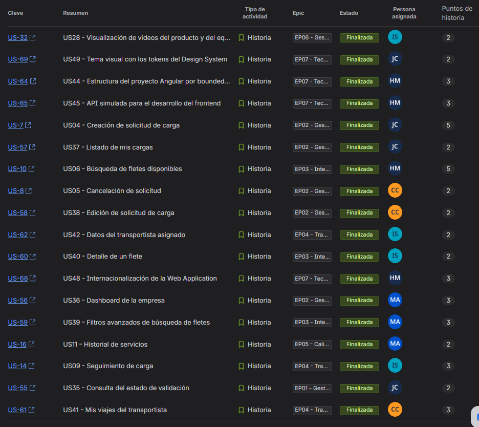

*Figura. Las 18 historias finalizadas con responsables y puntos de historia.*

### J.2. Burndown del Sprint 2

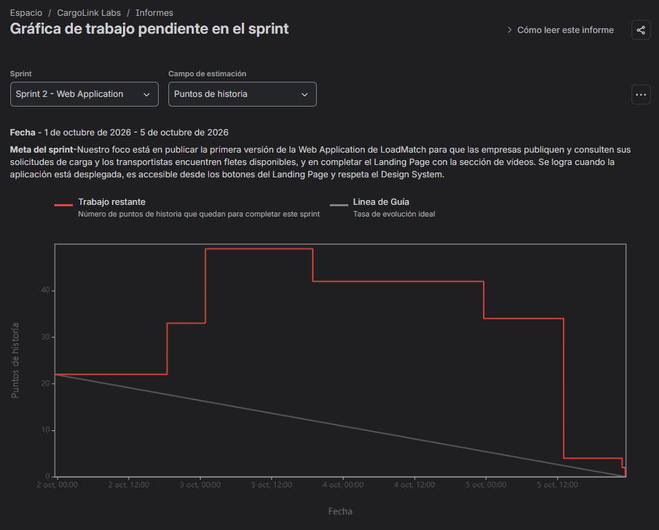

*Figura. Evolución del trabajo restante: 22 puntos iniciales, ampliación de alcance y descenso a cero al cierre.*

### J.3. Cambios de alcance

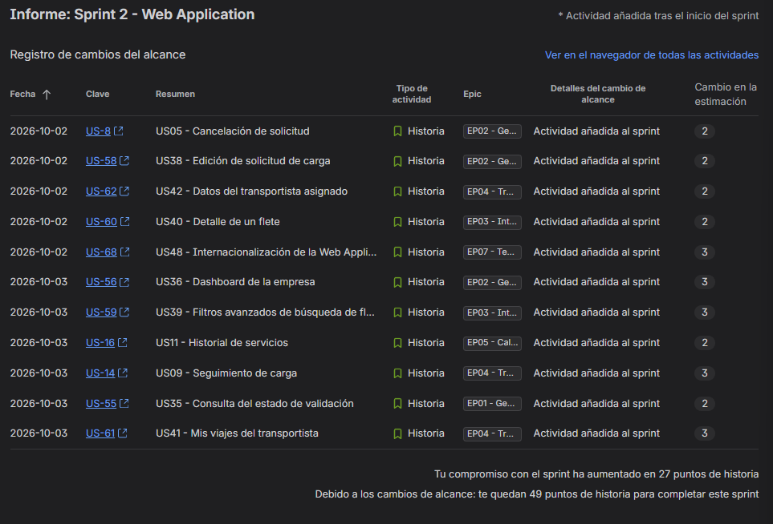

*Figura. Registro de 27 puntos incorporados durante el sprint, para un alcance final de 49 puntos.*

### J.4. Product Backlog restante

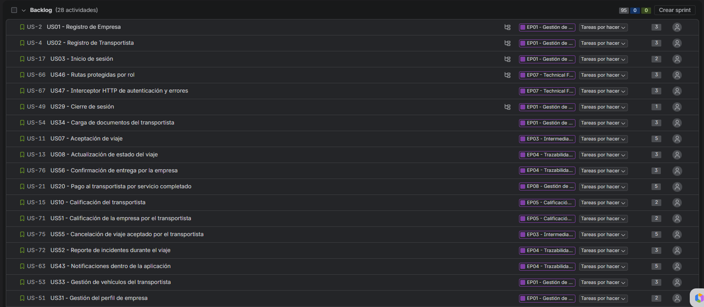

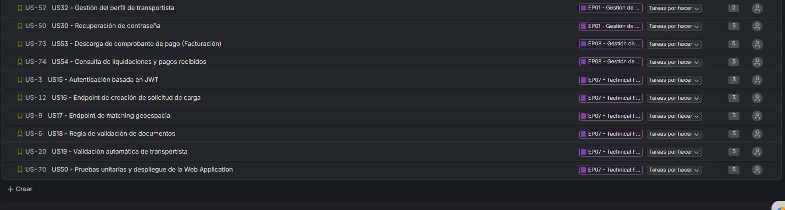

*Figuras. Las 28 historias por hacer y sus 95 puntos corresponden al alcance futuro del producto, no al trabajo restante del Sprint 2 cerrado.*

**Contraste directo con Atlassian, 06/10/2026:** tablero CL (ID 2), Sprint 2 (ID 67), estado cerrado; 18 historias finalizadas por 49 Story Points y 18 subtareas finalizadas. El cierre registrado corresponde al 05/10/2026 a las 11:30:17 p. m. en America/Lima. Los IDs, títulos y responsables de subtareas se detallan en 5.2.2.3; las horas no están registradas y no se convierten desde puntos. Se conservan las 10 diferencias de asignación entre historia y subtarea para revisión del equipo.

**Consulta de historias y subtareas:** [Jira: Sprint 2](https://upc-team-m57tll9j.atlassian.net/issues/?jql=project%20%3D%20US%20AND%20sprint%20%3D%2067), [Jira: ejemplo de subtarea T32 / US-97](https://upc-team-m57tll9j.atlassian.net/browse/US-97). Los enlaces requieren permisos del sitio. El backlog restante se contrastó mediante la consulta del tablero y confirma 28 historias por 95 puntos, excluyendo épicas y subtareas.

## Anexo K. Capturas de ejecución y respuesta de API

`LandingLocal.png` y `WebAppHome.png` se incorporan en 5.2.2.5 y muestran la landing local y el inicio de la aplicación desplegada en Vercel. `ApiRoot.png` se incorpora en 5.2.2.6 y muestra la respuesta de la raíz del servicio en Render; debe distinguirse de consultar los endpoints de recursos.

### K.1. Landing Page en ejecución local

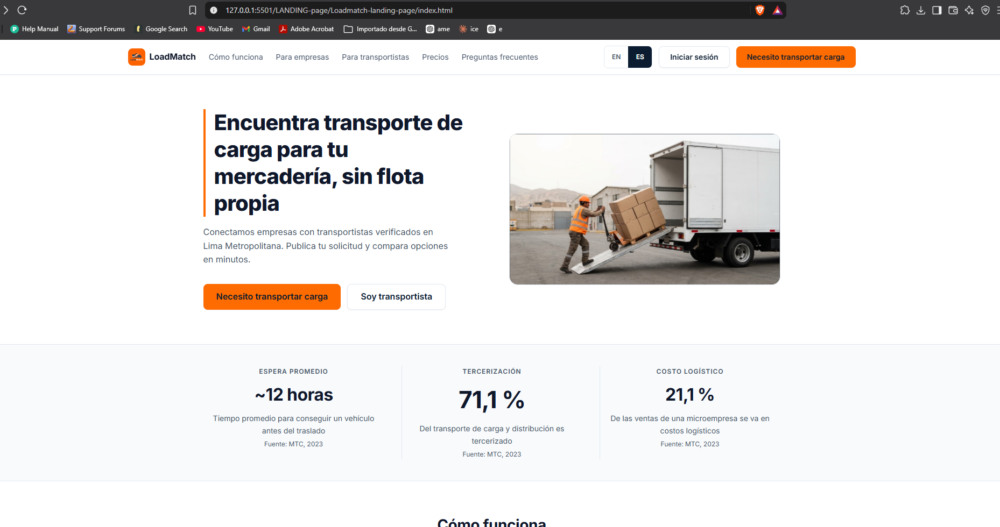

*Figura. Landing en español, ejecutada en `127.0.0.1:5501`, con los botones de acceso. Esta captura no corresponde a GitHub Pages.*

### K.2. Web Application desplegada

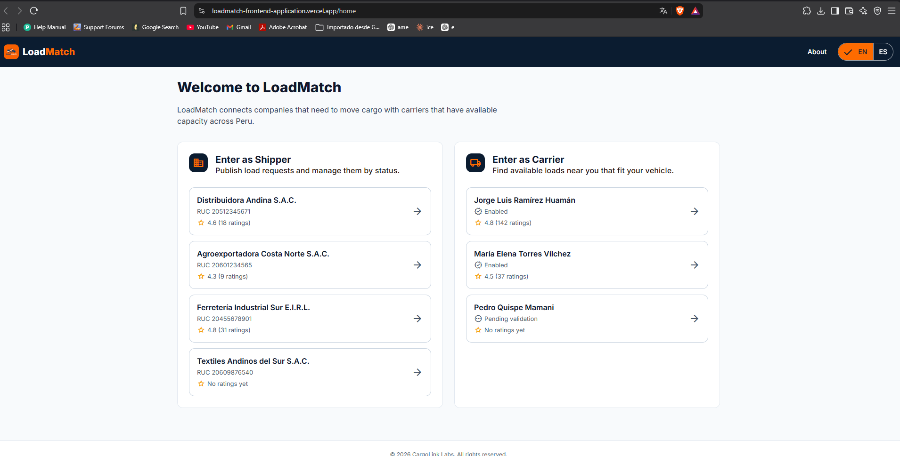

*Figura. Página `/home` en Vercel con perfiles de demostración de empresa y transportista. Muestra la entrada de la aplicación.*

### K.3. Respuesta de la raíz de la API

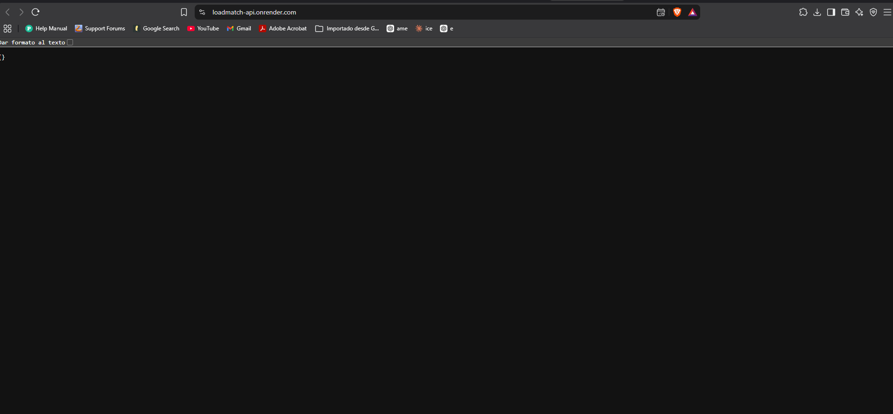

*Figura. Respuesta `{}` en la dirección raíz del servicio. No es una interfaz web ni demuestra por sí sola un error. La consulta del recurso `/api/v1/shippers` realizada durante la revisión respondió HTTP 200 con cuatro empresas, como se documenta en 5.2.2.6.*

### K.4. Landing publicada y Web Application en emulación móvil

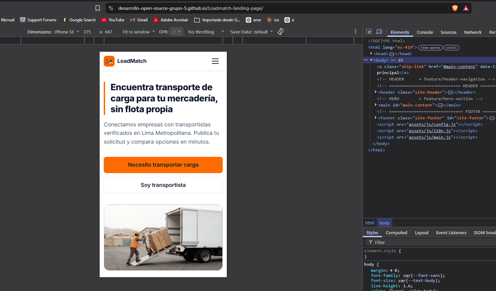

*Figura. Landing en español con dirección de GitHub Pages y vista inicial a 375 × 667.*

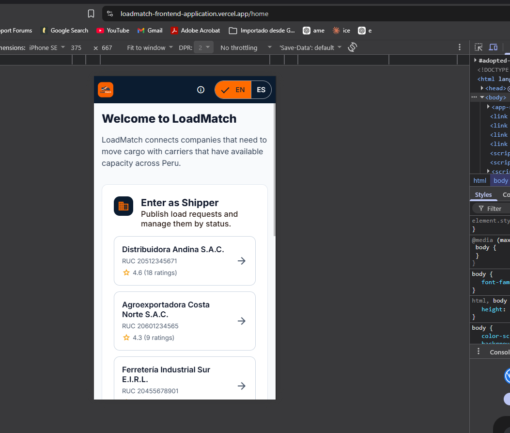

*Figura. Inicio de la aplicación en inglés con dirección de Vercel y tarjetas adaptadas al ancho móvil de 375 × 667. Ambas imágenes muestran emulación del navegador, no pruebas en un teléfono físico.*

### K.5. Configuración y resultado del despliegue de Vercel

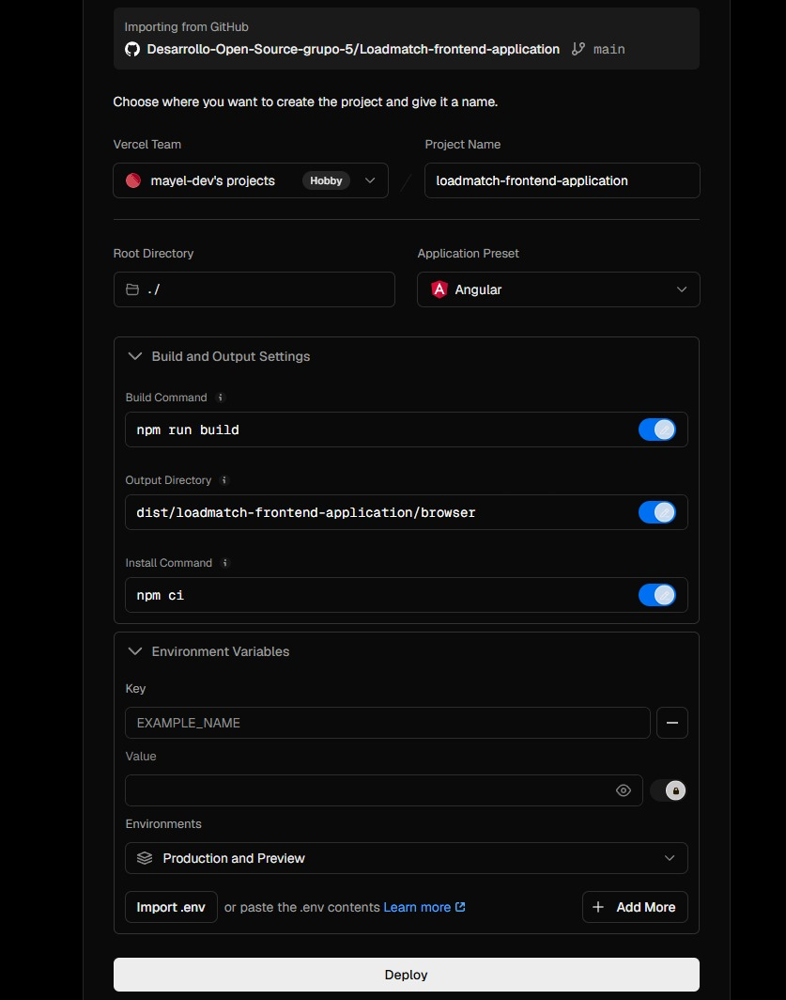

*Figura. Formulario de importación: Angular, `npm ci`, `npm run build` y directorio de salida del frontend.*

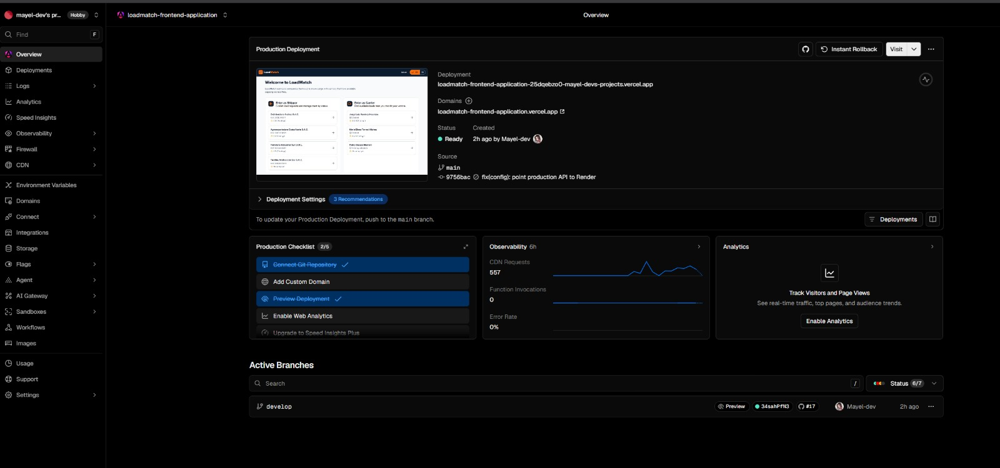

*Figura. Despliegue de producción Ready desde `main`, asociado al commit `9756bac` y al dominio público de la aplicación.*

### K.6. Configuración y despliegue de la API en Render

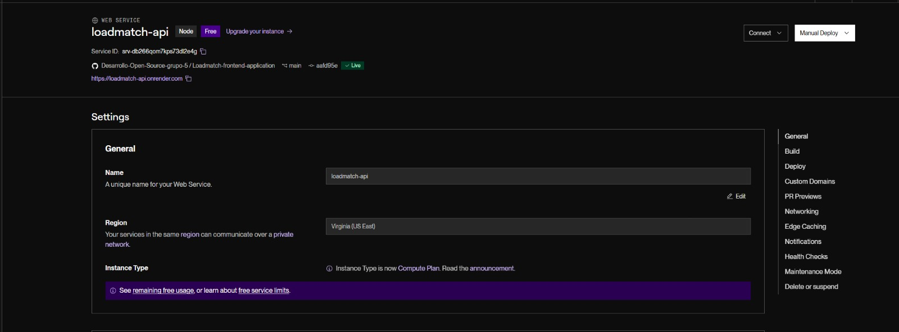

*Figura. Servicio real `loadmatch-api` con URL pública y estado Live.*

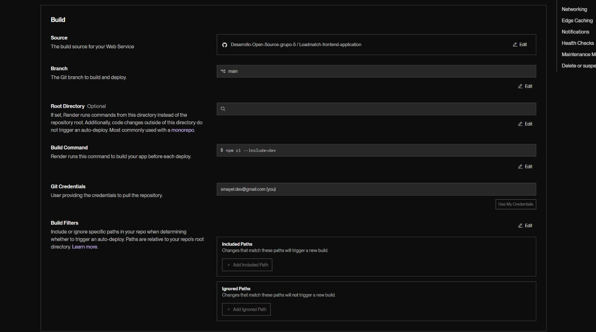

*Figura. Build `npm ci --include=dev` desde la raíz del repositorio y rama `main`.*

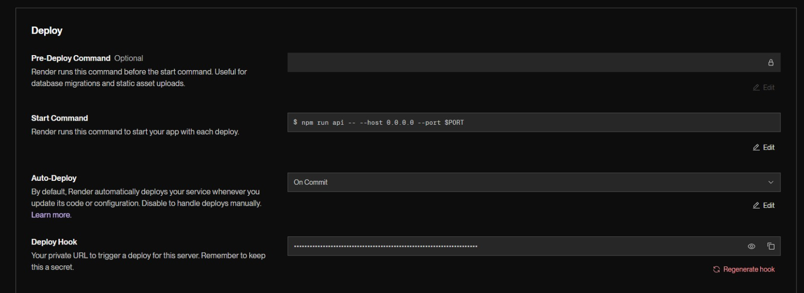

*Figura. Arranque `npm run api -- --host 0.0.0.0 --port $PORT` y despliegue automático On Commit; el Deploy Hook se mantiene oculto.*

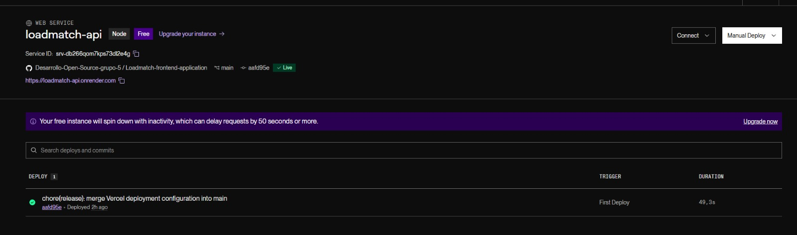

*Figura. Estado Live, despliegue exitoso del commit `aafd95e` y duración de 49,3 segundos. La configuración final se describe en 5.2.2.7.*

## Anexo L. GitHub Contributors de los productos y del informe

### L.1. Landing Page

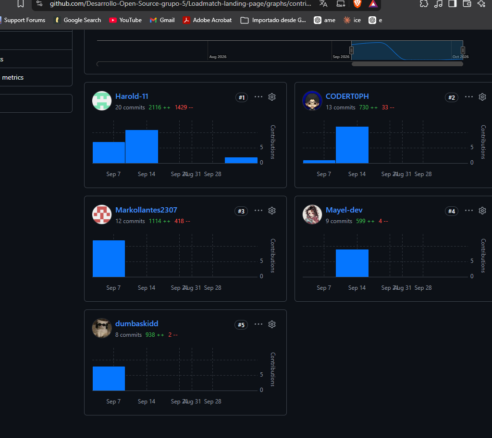

*Figura. Contributors de la Landing Page; la URL visible identifica el repositorio `Loadmatch-landing-page`.*

### L.2. Web Application

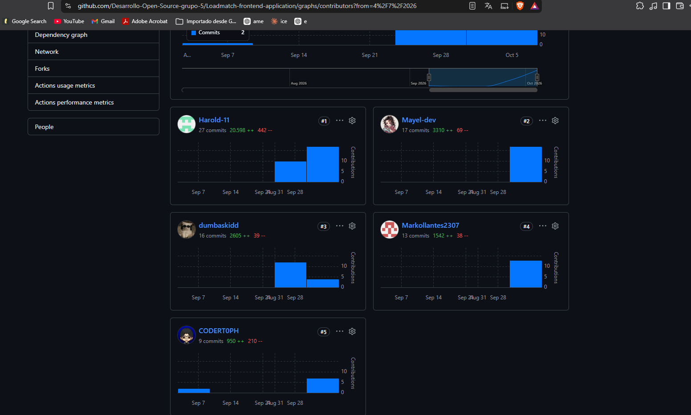

*Figura. Contributors de la Web Application; la URL visible identifica el repositorio `Loadmatch-frontend-application`.*

Ambas capturas se incorporan también en 5.2.2.8. Sus gráficos incluyen semanas anteriores al Sprint 2; los conteos corresponden al intervalo visible y no se presentan como commits exclusivos del sprint ni como aportes al repositorio del informe.

### L.3. Project Report

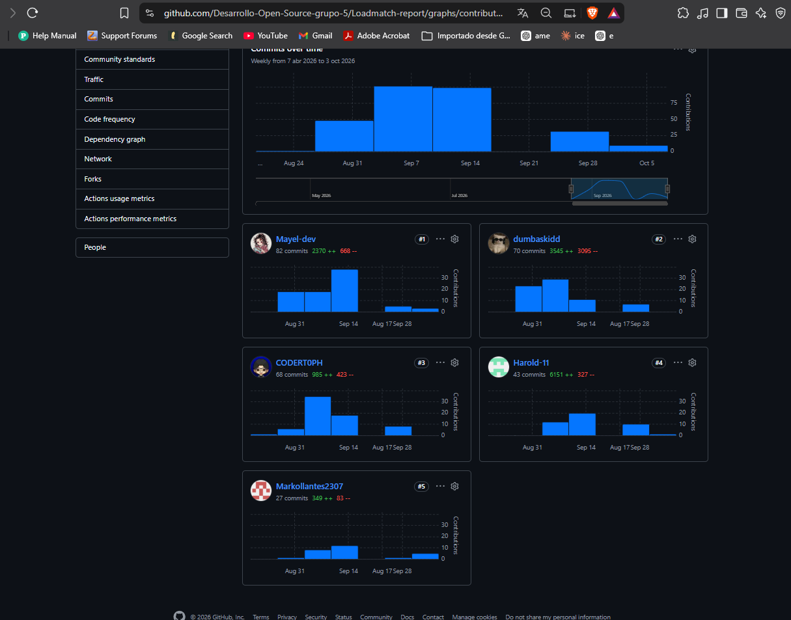

*Figura. Contributors de `Loadmatch-report`, con la URL del repositorio visible. Las tarjetas muestran Mayel-dev: 82, dumbaskidd: 70, CODERT0PH: 68, Harold-11: 43 y Markollantes2307: 27 commits; su suma es 290. Son cifras acumuladas del intervalo mostrado, que incluye actividad anterior al Sprint 2, no commits exclusivos de TB1 ni un conteo del historial completo con merges.*

La evidencia de colaboración documental y el registro de aportes por integrante se presentan en el README, en Project Report Collaboration Insights TB1.
