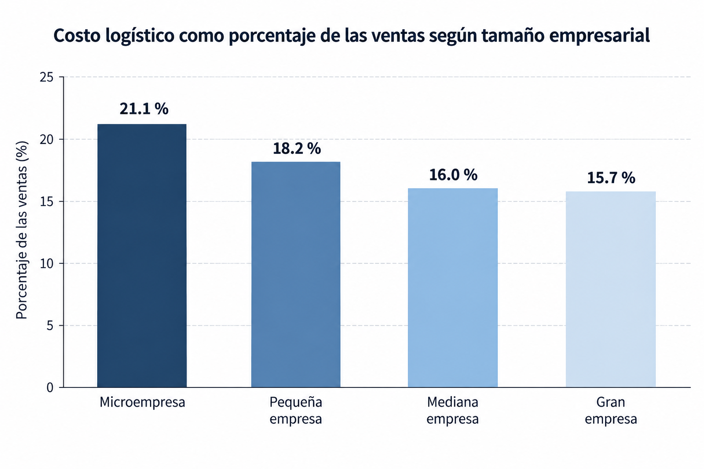
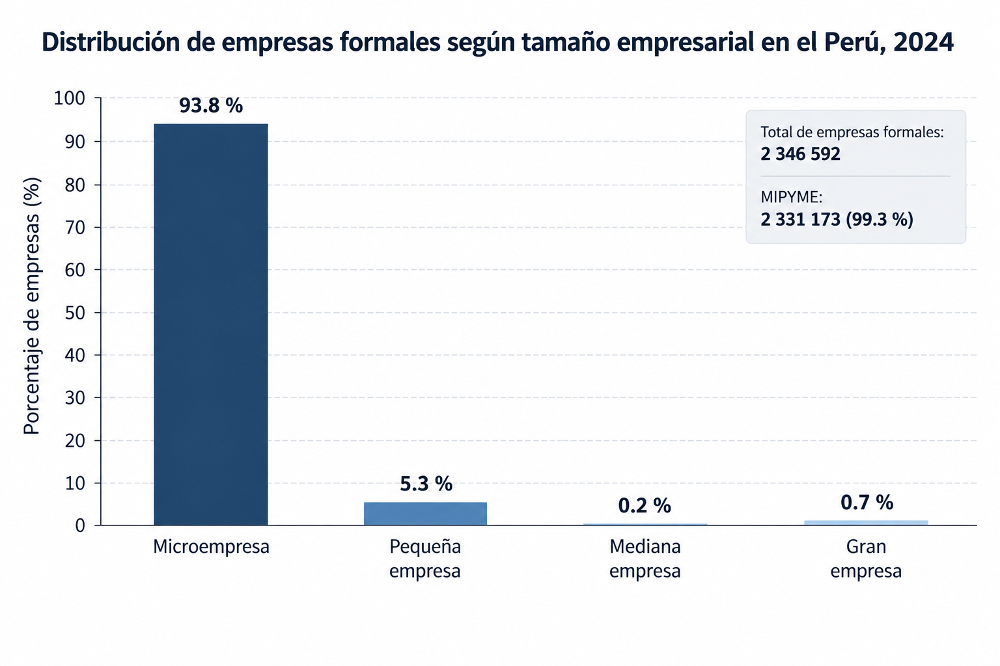
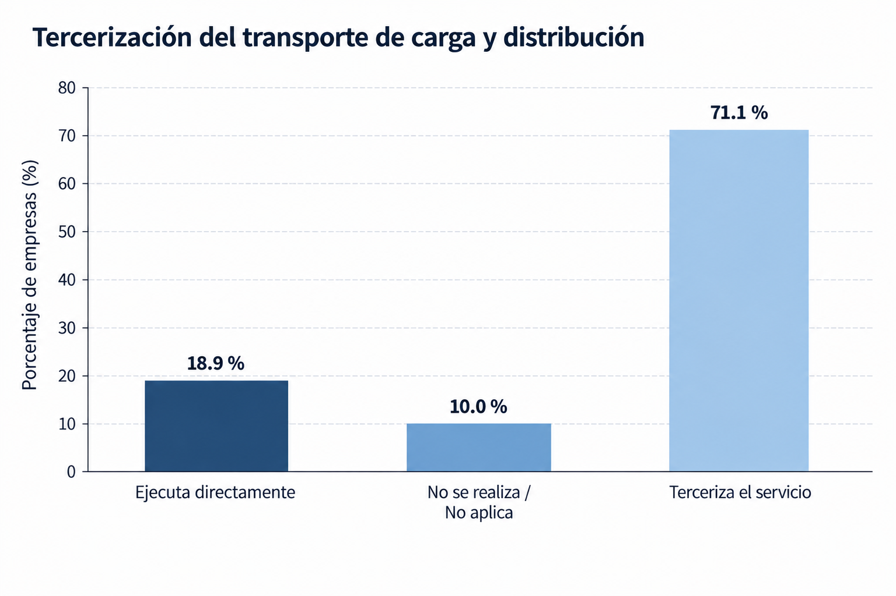

# Capítulo I: Introducción

## 1.1. Startup Profile

### 1.1.1. Descripción de la Startup

CargoLink Labs nace como una iniciativa tecnológica orientada a mejorar la forma en que los emprendimientos y las micro, pequeñas y medianas empresas acceden a servicios de transporte terrestre de carga cuando necesitan movilizar mercadería, pero no cuentan con una flota propia suficiente o con un proveedor de transporte fijo que pueda atender todas sus necesidades.

La startup propone LoadMatch, una plataforma digital de intermediación de transporte de carga bajo demanda que permitirá conectar empresas que necesitan trasladar productos entre proveedores, almacenes, establecimientos comerciales, centros de distribución o clientes con transportistas disponibles y previamente registrados en la plataforma.

A través de la solución, las empresas podrán registrar una solicitud indicando información como el punto de recojo, destino, características de la mercadería, fecha del servicio y tipo de vehículo requerido. A partir de estos datos, podrán encontrar transportistas que cuenten con vehículos compatibles con las necesidades del envío y consultar información relevante antes de confirmar la contratación.

Uno de los principales enfoques de CargoLink Labs será generar mayor confianza entre las partes involucradas. Para ello, la plataforma contemplará el registro y validación documental de los transportistas, conductores y vehículos, así como información relacionada con servicios realizados anteriormente, incidencias y calificaciones. De esta manera, una empresa que no haya trabajado previamente con determinado transportista podrá contar con mayores elementos para tomar una decisión.

Asimismo, la plataforma buscará proporcionar mayor trazabilidad durante el desarrollo del servicio mediante el seguimiento de sus diferentes estados y el registro de las operaciones realizadas. Por su parte, los transportistas podrán acceder a nuevas oportunidades de trabajo compatibles con las características de sus vehículos y gestionar desde un mismo entorno las solicitudes aceptadas y servicios efectuados.

A futuro, LoadMatch podrá incorporar tecnologías IoT mediante dispositivos instalados en los vehículos, como sistemas de posicionamiento y sensores relacionados con las condiciones de transporte. Esto permitiría automatizar la obtención de información sobre la ubicación y estado de los vehículos o de determinadas cargas, complementando las capacidades de seguimiento ofrecidas por la plataforma.

### 1.1.2. Perfiles de integrantes del equipo

<table border="1" cellspacing="0" cellpadding="2">
<thead>
<tr>
<th>Foto</th>
<th>Apellido y nombre</th>
<th>Carrera</th>
<th>Acerca de</th>
</tr>
</thead>

<tbody>

<tr>
<td align="center">
  
</td>
<td>
  Noriega Collado, Jean Fabio 
  <b>Código:</b> U202310342
</td>
<td>Ingeniería de Software</td>
<td>
  Estudiante de [PENDIENTE].
</td>
</tr>

<tr>
<td align="center">
  
</td>
<td>
  Rivas Castillo, Christoper Steven 
  <b>Código:</b> U202323551
</td>
<td>Ingeniería de Software</td>
<td>
  Estudiante de [PENDIENTE].
</td>
</tr>

<tr>
<td align="center">
  
</td>
<td>
  Simon Calderon, Ismael Sebastian 
  <b>Código:</b> U201823468
</td>
<td>Ingeniería de Software</td>
<td>
  Estudiante de [PENDIENTE].
</td>
</tr>

<tr>
<td align="center">
  
</td>
<td>
  Collantes Artola, Marco Antonio 
  <b>Código:</b> U201410183
</td>
<td>Ingeniería de Software</td>
<td>
  Me considero bueno trabajando en equipo dando apoyo y asesoría cuando se necesita aplicar el ir un paso a la vez a la hora de desarrollar proyectos. Soy bueno a la hora de trabajar en programas como el Visual Studio, WebStorm, Word y Excel con notas y trabajos satisfactoriamente exitosos. Disfruto mucho de investigar sobre nuevos temas y soy fanático acérrimo del cine y la buena música.
</td>
</tr>

<tr>
<td align="center">
  
</td>
<td>
  APELLIDOS, Emilia 
  <b>Código:</b> [CÓDIGO]
</td>
<td>Ingeniería de Software</td>
<td>
  Estudiante de [PENDIENTE].
</td>
</tr>

<tr>
<td align="center">
  
</td>
<td>
  Benigno Montero, Harold Fauskorp 
  <b>Código:</b> U202321086
</td>
<td>Ingeniería de Software</td>
<td>
  Soy Harold Benigno, estudiante de Ingeniería de Software. Para el presente proyecto estoy aportando con los wireframes, mockups y el modelado de base de datos. Cuento con conocimiento en git, github, C++, HTML, CSS, JS, POO, algoritmos y estructura de datos, modelamiento de bases de datos relacionales, no relacionales, MongoDB y muy buen dominio de PostgreSQL y SQL Server.
</td>
</tr>

</tbody>
</table>

 Nota: Información de los integrantes del equipo de desarrollo. 

## 1.2. Solution Profile

### 1.2.1. Antecedentes y problemática

El transporte de mercadería constituye una actividad fundamental para empresas que deben movilizar productos entre proveedores, almacenes, establecimientos comerciales, centros de distribución y clientes. Sin embargo, para los emprendimientos y empresas de menor tamaño, mantener una flota propia puede representar una inversión difícil de justificar cuando sus necesidades de transporte son variables o no requieren utilizar vehículos de carga permanentemente.

Esta situación adquiere relevancia debido al tamaño del segmento empresarial al que pertenece una parte importante de los potenciales usuarios. De acuerdo con el Ministerio de la Producción (2025), durante 2024 operaron en el Perú 2 331 173 micro, pequeñas y medianas empresas formales, equivalentes al 99,3 % del total de empresas formales del país.

Cuando una empresa no dispone de vehículos propios o necesita capacidad adicional, una alternativa consiste en recurrir a proveedores externos de transporte. Esta práctica tiene un peso considerable dentro de las operaciones logísticas del país. El Ministerio de Transportes y Comunicaciones (2023), tomando como base los resultados de la Encuesta Nacional de Logística, señala que el 71,1 % de los servicios relacionados con transporte de carga y distribución analizados son tercerizados por las empresas usuarias de servicios logísticos.

No obstante, acceder al vehículo requerido puede convertirse en un punto de fricción dentro del proceso. El mismo estudio identifica a la consecución de un vehículo como el componente que demanda mayor tiempo antes del traslado. En promedio, transcurren 12 horas y 13 minutos desde que surge la necesidad de contar con un vehículo hasta que este se encuentra disponible, dentro de un proceso logístico previo al tránsito que alcanza en promedio 22 horas y 8 minutos (Ministerio de Transportes y Comunicaciones, 2023).

El impacto tampoco es igual para organizaciones de diferente tamaño. Según el Plan Nacional de Servicios e Infraestructura Logística de Transporte al 2032, el costo logístico representa aproximadamente el 21,1 % de las ventas en microempresas y 18,2 % en pequeñas empresas, frente al 16,0 % de las medianas y 15,7 % de las grandes empresas. El MTC relaciona esta diferencia con factores como las economías de escala, el nivel de tecnificación y la capacidad de negociación con prestadores de servicios logísticos (Ministerio de Transportes y Comunicaciones, 2023).

Estos antecedentes evidencian una oportunidad para facilitar la relación entre empresas que demandan transporte y transportistas que poseen capacidad disponible. Una plataforma digital puede centralizar información que actualmente puede encontrarse distribuida entre diferentes contactos, llamadas, mensajes o proveedores, proporcionando además mecanismos de seguimiento y mayor información sobre quién realizará cada servicio.

La viabilidad de este tipo de propuesta cuenta también con antecedentes académicos locales. Mattos Lucero et al. (2024) evaluaron una plataforma digital de intermediación y consolidación de carga entre PYMES y transportistas en Lima Metropolitana. Su análisis identificó ineficiencias asociadas a altos costos y operaciones logísticas subóptimas y encontró que más del 70 % de las PYMES y transportistas participantes en su investigación mostraron interés en adoptar soluciones digitales para la gestión logística.

Para comprender con mayor claridad el problema, sus causas, participantes e impacto, se aplica a continuación la técnica de las 5W y 2H:

| Elemento | Pregunta | Análisis enfocado en el transporte de carga |
| :--- | :--- | :--- |
| **What** | ¿Qué está ocurriendo? | Emprendimientos y micro, pequeñas y medianas empresas necesitan movilizar mercadería sin contar necesariamente con una flota propia suficiente o un proveedor de transporte permanente. Ante cada necesidad deben encontrar un transportista y un vehículo que se ajusten a las características específicas del envío. |
| **Why** | ¿Por qué ocurre? | Mantener vehículos propios implica costos relacionados con adquisición, mantenimiento, combustible, operación y personal que pueden no justificarse cuando las necesidades de transporte son variables. Paralelamente, la oferta disponible se encuentra distribuida entre distintos transportistas y proveedores, por lo que conectar una necesidad concreta con un vehículo adecuado puede requerir múltiples coordinaciones. |
| **Who** | ¿A quién afecta? | Principalmente a propietarios, administradores, encargados de almacén, operaciones o logística de empresas que requieren transportar productos. También afecta a transportistas independientes y pequeñas empresas de transporte que disponen de vehículos y necesitan encontrar nuevos servicios para aprovechar su capacidad disponible. |
| **Where** | ¿Dónde ocurre? | La problemática puede presentarse en cualquier zona donde exista movimiento de mercadería. Para la primera etapa del producto se plantea un enfoque en Lima Metropolitana, considerando traslados entre proveedores, almacenes, establecimientos y clientes, con posibilidad de ampliar posteriormente la cobertura hacia rutas interprovinciales. |
| **When** | ¿Cuándo ocurre? | Cada vez que una empresa necesita realizar un traslado y no dispone inmediatamente de un vehículo propio o proveedor que pueda atenderlo. Puede tratarse de reposiciones planificadas, abastecimiento, movimientos entre almacenes, entregas a clientes o necesidades extraordinarias de transporte. |
| **How** | ¿Cómo ocurre? | Una empresa identifica su necesidad y comienza a contactar transportistas o proveedores hasta encontrar disponibilidad. Luego debe comunicar origen, destino, características de la carga y vehículo requerido, acordar las condiciones del servicio y posteriormente solicitar información sobre el avance del traslado. Estas interacciones pueden quedar distribuidas entre llamadas, mensajes y registros independientes. |
| **How much** | ¿Cuánto impacto tiene? | El MTC reporta que los costos logísticos equivalen aproximadamente al 21,1 % de las ventas de las microempresas y al 18,2 % de las pequeñas empresas. Además, dentro del proceso logístico analizado, conseguir un vehículo requiere en promedio 12 horas y 13 minutos, mientras que el 71,1 % del transporte de carga y distribución estudiado se realiza mediante servicios tercerizados (Ministerio de Transportes y Comunicaciones, 2023). |

**Figura 1:**

*Costo logístico como porcentaje de las ventas según tamaño empresarial*

   
  <i>Nota. Elaboración propia con datos del Ministerio de Transportes y Comunicaciones (2023), basados en la Encuesta Nacional de Logística.</i>

**Conclusión del análisis 5W2H:**

El análisis evidencia que la problemática no se limita a la inexistencia de vehículos para transportar mercadería, sino también a la dificultad de conectar de manera oportuna las necesidades específicas de las empresas con la capacidad disponible de los transportistas. La tercerización constituye una práctica relevante dentro del transporte de carga, mientras que la consecución del vehículo representa uno de los principales tiempos previos al traslado.

Asimismo, las empresas de menor tamaño enfrentan proporcionalmente mayores costos logísticos, por lo que mantener capacidad de transporte propia no siempre constituye una alternativa eficiente. La ausencia de un espacio centralizado donde pueda registrarse la necesidad, encontrar transportistas compatibles, consultar información relevante y dar seguimiento a la operación genera una oportunidad para desarrollar una solución de intermediación digital.

Por ello, LoadMatch busca reducir la fragmentación del proceso mediante una plataforma que conecte a empresas y transportistas, facilite la gestión de solicitudes, proporcione información para generar confianza entre las partes y mantenga trazabilidad desde la creación de la solicitud hasta la finalización del servicio.

**Enunciado del problema**

En la actualidad, emprendimientos y micro, pequeñas y medianas empresas que requieren trasladar mercadería y no disponen de una flota propia suficiente o de proveedores permanentes enfrentan dificultades para localizar oportunamente transportistas disponibles que se ajusten a las características de cada envío. La búsqueda, evaluación y coordinación del servicio puede desarrollarse mediante canales fragmentados que ofrecen información limitada sobre disponibilidad, características del vehículo, antecedentes del transportista y estado de la operación, incrementando el esfuerzo requerido y reduciendo la trazabilidad durante el traslado de la mercadería.

**Objetivos del proyecto**

* **Objetivo general:** Desarrollar una plataforma web de intermediación que facilite la conexión entre emprendimientos y micro, pequeñas y medianas empresas que necesitan realizar envíos de carga y transportistas disponibles, centralizando la solicitud, evaluación, coordinación y seguimiento de los servicios de transporte.

* **Objetivos específicos:**
  - Permitir que las empresas registren solicitudes de transporte especificando origen, destino, características de la mercadería, fecha y tipo de vehículo requerido.
  - Facilitar la identificación de transportistas y vehículos compatibles con las características de cada solicitud.
  - Proporcionar información relevante sobre los transportistas, conductores y vehículos registrados para incrementar la confianza durante la contratación.
  - Implementar mecanismos de validación documental para los transportistas y vehículos registrados en la plataforma.
  - Permitir el seguimiento del estado de un servicio desde su solicitud hasta su finalización.
  - Registrar las incidencias e historial de los servicios realizados para proporcionar mayor trazabilidad.
  - Facilitar a los transportistas el acceso a solicitudes compatibles con las características de sus vehículos y su disponibilidad.

**Restricciones del proyecto**

- La primera versión de LoadMatch funcionará como una plataforma de intermediación y gestión de servicios; la startup no dispondrá de una flota propia de vehículos.
- La disponibilidad de transporte dependerá de la cantidad de transportistas registrados y de que existan vehículos compatibles con las características de cada solicitud.
- La plataforma podrá solicitar y gestionar documentación de los transportistas, conductores y vehículos, pero la verificación automática con entidades oficiales dependerá de la disponibilidad y condiciones de acceso a fuentes o servicios externos.
- En la primera versión, el seguimiento dependerá de las capacidades de geolocalización de los dispositivos utilizados. La implementación de dispositivos IoT dedicados forma parte de una evolución futura del producto.
- La plataforma no reemplazará las obligaciones legales, contractuales, tributarias o de seguridad que correspondan a las empresas y transportistas participantes.
- Determinados tipos de carga pueden requerir vehículos, permisos o condiciones especiales que podrían encontrarse fuera del alcance de la primera versión.
- El desarrollo, validación y despliegue de la solución estará limitado por el tiempo y los recursos disponibles durante el ciclo académico.

### 1.2.2. Lean UX Process

Para el desarrollo de LoadMatch se aplicará Lean UX con el propósito de establecer las principales creencias sobre el negocio, los usuarios y las funcionalidades propuestas para posteriormente contrastarlas mediante investigación y validación.

Debido a que LoadMatch corresponde a una nueva iniciativa y no a la mejora de un producto previamente existente, se utilizará el enfoque de *Brand New Initiative* para formular el Lean UX Problem Statement.

#### 1.2.2.1. Lean UX Problem Statements

Para definir la propuesta de valor inicial del producto se plantea un único *Problem Statement* que contempla los dos segmentos involucrados en el modelo de intermediación: las empresas que necesitan transportar mercadería y los transportistas que ofrecen capacidad de carga.

**The current state of** la contratación y coordinación de servicios de transporte terrestre de carga para emprendimientos y empresas de menor tamaño **has focused mainly on** empresas que necesitan movilizar mercadería sin contar con una flota propia suficiente y transportistas que buscan oportunidades para aprovechar la disponibilidad de sus vehículos, utilizando diferentes contactos, proveedores y canales para localizar y coordinar cada servicio.

**What existing products/services fail to address is** la necesidad de centralizar de manera sencilla la búsqueda de transporte disponible, la información necesaria para evaluar al proveedor y su vehículo y la trazabilidad de toda la operación desde la solicitud del servicio hasta la entrega de la carga.

**Our product/service will address this gap by** ofrecer una plataforma web que permita registrar necesidades de transporte y conectarlas con transportistas previamente registrados que puedan atenderlas, incorporando perfiles de transportistas y vehículos, validación documental, gestión de solicitudes, seguimiento del servicio, incidencias, calificaciones e historial de operaciones.

**Our initial focus will be** emprendimientos y micro, pequeñas y medianas empresas de Lima Metropolitana que movilizan mercadería entre proveedores, almacenes, establecimientos o clientes sin contar necesariamente con una flota propia suficiente, junto con transportistas independientes y pequeñas empresas de transporte interesadas en acceder a nuevas solicitudes de carga.

**We'll know we are successful when we see** empresas utilizando recurrentemente la plataforma para solicitar transporte, transportistas aceptando y completando servicios compatibles con sus vehículos, una alta proporción de solicitudes atendidas satisfactoriamente y usuarios que reporten una reducción en el tiempo y esfuerzo empleados para encontrar y coordinar un servicio.

#### 1.2.2.2. Lean UX Assumptions

A continuación, se presentan las principales creencias sobre las cuales se sostiene inicialmente la propuesta de LoadMatch. Estas suposiciones deberán ser contrastadas posteriormente mediante las entrevistas y actividades de validación realizadas con representantes de los segmentos objetivo.

**1. Business Assumptions (Suposiciones del Negocio)**

- Creemos que existe una necesidad entre emprendimientos y empresas de menor tamaño de acceder a servicios de transporte de carga sin asumir permanentemente los costos de mantener una flota propia.
- Creemos que las empresas estarán dispuestas a utilizar una plataforma digital si esta disminuye el tiempo y esfuerzo requerido para encontrar y coordinar transporte.
- Creemos que transportistas independientes y pequeñas empresas de transporte tendrán interés en utilizar un canal digital adicional para encontrar solicitudes compatibles con sus vehículos.
- Creemos que la confianza, validación y trazabilidad serán elementos relevantes para diferenciar la plataforma frente a una coordinación realizada únicamente mediante contactos informales.
- Creemos que el modelo podrá escalar progresivamente hacia nuevos tipos de vehículos, cargas y zonas geográficas conforme aumente la cantidad de usuarios.

**2. Business Outcome Assumptions (Suposiciones de Resultados del Negocio)**

- Creemos que el producto tendrá éxito si las empresas vuelven a solicitar servicios después de completar satisfactoriamente su primera operación.
- Creemos que el aumento de transportistas activos permitirá incrementar la cantidad de solicitudes que pueden ser atendidas.
- Creemos que podremos aumentar progresivamente la proporción de solicitudes que terminan en servicios completados.
- Creemos que una experiencia satisfactoria favorecerá la retención tanto de empresas como de transportistas.
- Creemos que disminuir el tiempo requerido para conectar una solicitud con un transportista compatible constituirá un indicador importante del valor generado por la plataforma.

**3. User Assumptions (Suposiciones de los Usuarios)**

- Creemos que uno de nuestros principales segmentos está conformado por propietarios, administradores y responsables de operaciones, almacén o logística de emprendimientos y MIPYME que requieren transportar mercadería.
- Creemos que estas empresas presentan necesidades de transporte variables y que no todas disponen de una flota propia suficiente para atenderlas.
- Creemos que el segundo segmento estará conformado por transportistas independientes y pequeñas empresas de transporte con uno o más vehículos disponibles para brindar servicios a terceros.
- Creemos que ambos segmentos utilizan regularmente smartphones o computadoras con acceso a Internet para coordinar actividades relacionadas con sus negocios.
- Creemos que las empresas valoran poder conocer información acerca del transportista, conductor y vehículo antes de confirmar un servicio.
- Creemos que los transportistas tienen interés en reducir los periodos en los que sus vehículos permanecen disponibles sin realizar servicios.

**4. User Outcome and Benefit Assumptions (Suposiciones de Resultados y Beneficios para el Usuario)**

- Creemos que las empresas desean encontrar un transportista adecuado sin tener que contactar manualmente a múltiples proveedores.
- Creemos que las empresas obtendrán mayor confianza si pueden consultar información relevante y validada sobre quién realizará el servicio y qué vehículo utilizará.
- Creemos que las empresas valorarán conocer el estado de sus servicios desde un único lugar.
- Creemos que disponer de un historial de servicios e incidencias facilitará futuras decisiones de contratación.
- Creemos que los transportistas valorarán recibir oportunidades relacionadas con el tipo, capacidad y disponibilidad de sus vehículos.
- Creemos que los transportistas se beneficiarán de contar con un entorno centralizado para revisar, aceptar y gestionar sus servicios.

**5. Feature Assumptions (Suposiciones de Funcionalidades)**

- Creemos que la plataforma debe permitir crear solicitudes de transporte especificando origen, destino, características de la mercadería, fecha y tipo de vehículo requerido.
- Creemos que la plataforma debe permitir vincular las solicitudes con transportistas y vehículos compatibles con las características requeridas.
- Creemos que las empresas necesitan consultar perfiles de transportistas que incluyan información del conductor, vehículo, documentación y antecedentes de servicios dentro de la plataforma.
- Creemos que los usuarios necesitan visualizar el estado y seguimiento de sus servicios desde la aceptación de la solicitud hasta la entrega.
- Creemos que un sistema de incidencias, calificaciones e historial de operaciones ayudará a generar mayor confianza y trazabilidad entre los participantes.

#### 1.2.2.3. Lean UX Hypothesis Statements

A partir de los *Feature Assumptions* definidos previamente, se plantean los siguientes *Hypothesis Statements*. Cada hipótesis permitirá posteriormente evaluar si las funcionalidades propuestas producen los resultados esperados en los segmentos objetivo.

**Hipótesis 1: Creación estructurada de solicitudes de transporte**

- **We believe we will achieve** una reducción en el esfuerzo necesario para iniciar la búsqueda de transporte
- **If** los responsables de empresas que necesitan movilizar mercadería
- **Attain** la capacidad de comunicar desde el inicio todos los datos relevantes de su necesidad de transporte
- **With** una funcionalidad para crear solicitudes indicando origen, destino, características de la carga, fecha y tipo de vehículo requerido.

**Hipótesis 2: Vinculación con transportistas compatibles**

- **We believe we will achieve** una mayor cantidad de solicitudes atendidas mediante la plataforma
- **If** las empresas y transportistas registrados
- **Attain** una conexión más eficiente entre las necesidades de carga y los vehículos con capacidad disponible
- **With** una funcionalidad que permita identificar transportistas y solicitudes compatibles según las características del servicio.

**Hipótesis 3: Perfil y validación de transportistas**

- **We believe we will achieve** un mayor nivel de confianza al contratar transportistas que no hayan trabajado previamente con la empresa
- **If** los responsables de contratar el servicio de transporte
- **Attain** acceso previo a información relevante sobre el transportista, conductor y vehículo
- **With** perfiles que incorporen información del conductor, vehículo, documentación validada y antecedentes de servicios realizados dentro de la plataforma.

**Hipótesis 4: Seguimiento del servicio**

- **We believe we will achieve** una mayor percepción de control y trazabilidad sobre los envíos
- **If** las empresas que han contratado un servicio de transporte
- **Attain** información actualizada sobre la etapa en la que se encuentra el traslado de su mercadería
- **With** una funcionalidad de seguimiento que muestre los diferentes estados del servicio desde su aceptación hasta su finalización.

**Hipótesis 5: Historial, incidencias y calificaciones**

- **We believe we will achieve** mejores decisiones de contratación y una mayor confianza entre los participantes de la plataforma
- **If** las empresas y transportistas
- **Attain** acceso a información relacionada con el resultado y comportamiento de operaciones anteriores
- **With** un sistema que registre servicios completados, incidencias reportadas y calificaciones posteriores a cada operación.

#### 1.2.2.4. Lean UX Canvas

El Lean UX Canvas de LoadMatch sintetiza los principales problemas del negocio, resultados esperados, segmentos de usuarios, beneficios, soluciones e hipótesis definidos durante el proceso de Lean UX. Su elaboración permitirá visualizar la relación existente entre la problemática identificada y las funcionalidades que se propone validar durante el desarrollo del producto.

**Figura 2:**

*Lean UX Canvas*

   
  <i>Nota. Elaboración propia.</i>

 Enlace público del Lean UX Canvas elaborado por el equipo: https://canva.link/aoctcnllt1b16e2 

## 1.3. Segmentos objetivo

Para el desarrollo de LoadMatch se han definido inicialmente dos segmentos objetivo que participan directamente en el proceso de intermediación. El primer segmento representa la demanda de servicios de transporte dentro de la plataforma, mientras que el segundo representa la oferta disponible para atender dichas solicitudes.

### 1. Segmento 1: Emprendimientos y MIPYME que requieren servicios de transporte de carga

Este segmento está conformado por propietarios, administradores y responsables de operaciones, almacenes o logística de negocios que producen, comercializan o distribuyen productos y requieren movilizar mercadería entre proveedores, almacenes, establecimientos o clientes. La solución se enfoca particularmente en organizaciones que no disponen de una flota propia suficiente o cuyas necesidades de transporte son variables.

La dimensión de este segmento es significativa dentro del contexto empresarial peruano. Según el Ministerio de la Producción (2025), durante 2024 existían 2 331 173 MIPYME formales, equivalentes al 99,3 % de todas las empresas formales del país. Las microempresas representaban el 93,8 % del tejido empresarial formal, las pequeñas empresas el 5,3 % y las medianas el 0,2 %.

* **Perfil demográfico y organizacional:**
  - **Tipo de usuario:** Propietarios, emprendedores, administradores, encargados de operaciones, responsables de almacén o responsables de logística.
  - **Tipo de empresa:** Micro, pequeñas y medianas empresas con necesidades de distribución, abastecimiento o traslado de productos.
  - **Sectores potenciales:** Comercio, manufactura, distribución, abastecimiento, restaurantes, comercios mayoristas y otros negocios que gestionan productos físicos.
  - **Necesidad principal:** Contar con capacidad de transporte sin mantener permanentemente una flota propia suficiente para todos sus requerimientos.

* **Perfil geográfico:**
  - **Ubicación inicial:** Lima Metropolitana.
  - **Operaciones:** Traslados entre proveedores, almacenes, establecimientos, centros de distribución y clientes.
  - **Cobertura futura:** Rutas interprovinciales y otras ciudades del país.

* **Perfil psicográfico:**
  - **Preocupaciones:** Disponibilidad del transporte, cumplimiento del servicio, seguridad de la mercadería, confianza en el proveedor y capacidad de conocer el estado del envío.
  - **Motivaciones:** Cumplir entregas y movimientos de inventario sin asumir permanentemente los costos de una flota propia.
  - **Expectativas:** Encontrar transportistas disponibles con características adecuadas para cada carga y contar con información suficiente antes de confirmar un servicio.

* **Perfil comportamental:**
  - **Uso de tecnología:** Uso habitual de smartphones, correo electrónico, aplicaciones de mensajería y plataformas digitales para coordinar actividades empresariales.
  - **Comportamiento actual:** Contactar proveedores conocidos, solicitar recomendaciones o consultar distintos transportistas según su disponibilidad.
  - **Comportamiento esperado:** Centralizar progresivamente la búsqueda, evaluación, contratación y seguimiento de los servicios de transporte mediante una plataforma digital.

**Figura 3:**

*Distribución de empresas formales según tamaño empresarial en el Perú, 2024*

   
  <i>Nota. Elaboración propia con datos del Ministerio de la Producción (2025).</i>

La relevancia de ofrecer alternativas de transporte externo también se relaciona con el comportamiento observado en el sector logístico. De acuerdo con el Ministerio de Transportes y Comunicaciones (2023), el transporte de carga y distribución presenta un nivel de tercerización de 71,1 % entre los usuarios de servicios logísticos analizados. Esto evidencia que la contratación de terceros constituye una práctica importante dentro de las operaciones empresariales y respalda la existencia de un mercado para soluciones que faciliten dicha interacción.

**Figura 4:**

*Tercerización del transporte de carga y distribución*

    
  <i>Nota. Elaboración propia con datos del Ministerio de Transportes y Comunicaciones (2023), basados en la Encuesta Nacional de Logística.</i>

### 2. Segmento 2: Transportistas independientes y pequeñas empresas de transporte de carga

Este segmento está compuesto por transportistas independientes y pequeñas empresas que cuentan con uno o más vehículos destinados al traslado de mercancías y poseen capacidad para brindar servicios a terceros. Su participación es fundamental dentro de LoadMatch, debido a que representan la oferta encargada de atender las solicitudes creadas por las empresas.

La formalización y características de los vehículos constituyen información importante para este segmento. El Ministerio de Transportes y Comunicaciones mantiene un conjunto de datos del parque vehicular habilitado para el transporte terrestre de mercancías, actualizado con información hasta el 31 de diciembre de 2025. Este registro incluye datos como placa, marca, clase vehicular, número de ejes, carga útil, peso bruto y dimensiones del vehículo (Ministerio de Transportes y Comunicaciones, 2026).

La existencia de información oficial sobre empresas y vehículos habilitados refuerza la importancia de incorporar mecanismos de registro y validación en la plataforma, especialmente porque el tipo y capacidad del vehículo forman parte de los criterios necesarios para determinar si un transportista puede atender una solicitud específica.

* **Perfil demográfico y profesional:**
  - **Tipo de usuario:** Transportistas independientes, conductores propietarios de vehículos de carga, administradores de pequeñas empresas transportistas o responsables de asignación de unidades.
  - **Actividad:** Prestación de servicios de transporte terrestre de mercancías a terceros.
  - **Recursos:** Uno o varios vehículos con diferentes características y capacidades de carga.

* **Perfil geográfico:**
  - **Ubicación inicial:** Lima Metropolitana y transportistas que realizan servicios con origen o destino dentro de la ciudad.
  - **Cobertura futura:** Principales corredores logísticos y rutas interprovinciales del territorio nacional.

* **Perfil psicográfico:**
  - **Preocupaciones:** Mantener una frecuencia adecuada de servicios, reducir periodos de inactividad, trabajar con clientes confiables y recibir información clara sobre las características de una carga antes de aceptar un traslado.
  - **Motivaciones:** Incrementar la utilización de sus vehículos, obtener nuevas oportunidades de servicio y construir una reputación favorable.
  - **Expectativas:** Acceder a solicitudes compatibles con sus vehículos y disponibilidad, conocer las condiciones del servicio previamente y recibir una evaluación justa después de cada operación.

* **Perfil comportamental:**
  - **Uso de tecnología:** Uso frecuente de smartphones, aplicaciones de navegación, mensajería instantánea y llamadas telefónicas durante la prestación y coordinación de servicios.
  - **Comportamiento actual:** Obtener servicios mediante clientes recurrentes, contactos, intermediarios, recomendaciones u otros canales de coordinación.
  - **Comportamiento esperado:** Consultar solicitudes disponibles, aceptar aquellas compatibles con sus vehículos, actualizar el estado de sus servicios y construir un historial digital de operaciones.

### Sustento de los segmentos objetivo

La relación entre ambos segmentos constituye la base del modelo de intermediación propuesto. Las empresas generan necesidades variables de traslado de mercadería, mientras que los transportistas disponen de vehículos cuya ubicación, capacidad y disponibilidad varían a lo largo del tiempo. LoadMatch busca facilitar que ambas partes puedan encontrarse y coordinar una operación bajo condiciones previamente especificadas.

Además del sustento proporcionado por las estadísticas oficiales, existen antecedentes de investigación directamente relacionados con esta propuesta. Mattos Lucero et al. (2024) desarrollaron un estudio para evaluar la viabilidad de una plataforma colaborativa digital destinada a la intermediación y consolidación de carga entre PYMES y transportistas en Lima Metropolitana.

Los autores señalan que la propuesta surge frente a ineficiencias de la logística local asociadas con altos costos y operaciones subóptimas. Asimismo, su análisis de mercado encontró que más del 70 % de las PYMES y transportistas participantes mostraron interés en adoptar soluciones digitales para la gestión logística. Este resultado no representa al universo completo de empresas y transportistas peruanos, pero constituye evidencia preliminar relevante sobre la aceptación de una solución digital dentro de segmentos similares a los planteados por LoadMatch.

En conjunto, la representatividad de las MIPYME dentro del tejido empresarial peruano, el elevado nivel de tercerización del transporte de carga, los tiempos asociados con la consecución de vehículos y la existencia de un ecosistema formal de transportistas y vehículos habilitados respaldan la selección inicial de ambos segmentos para el desarrollo y posterior validación de la propuesta.
