# Capítulo II: Requirements Elicitation & Analysis

## 2.1. Competidores

### Competidor 1: inDrive Flete

* **Descripción:** Aplicación móvil que conecta directamente a personas y pequeñas empresas con conductores que ofrecen servicios de transporte de carga. Los usuarios pueden solicitar vehículos de diferentes tamaños según sus necesidades.
* **Ventaja competitiva:** Permite negociar las tarifas directamente con los conductores antes del viaje. Esto ayuda a que los negocios encuentren precios más económicos frente a las opciones tradicionales.
* **Público objetivo:** Emprendedores, comerciantes y público general que buscan un transporte de carga rápido y económico para situaciones puntuales.
* **Estrategia de marketing:** Publicidad en redes sociales enfocada en el ahorro y en la libertad de proponer el precio del servicio, atrayendo tanto a clientes como a conductores independientes.
* **Funciones principales:** Solicitud de transporte, negociación de tarifas mediante ofertas, seguimiento del vehículo en el mapa y comunicación con el conductor.
* **Modelo de costos:** El cliente paga el servicio directamente al conductor. La aplicación retiene un porcentaje del pago total por cada viaje realizado.
* **Distribución:** Disponible para descarga gratuita en las tiendas de aplicaciones móviles.

### Competidor 2: Lalamove

* **Descripción:** Plataforma logística que permite realizar entregas rápidas y transporte de carga dentro de la ciudad, ofreciendo desde motocicletas hasta camiones pequeños para negocios.
* **Ventaja competitiva:** Destaca por la rapidez de su servicio, la posibilidad de hacer múltiples entregas en una misma ruta y su sistema automatizado para negocios que venden por internet.
* **Público objetivo:** Pequeñas y medianas empresas, tiendas de comercio electrónico y restaurantes que necesitan enviar productos constantemente sin comprar vehículos propios.
* **Estrategia de marketing:** Presencia fuerte en canales digitales, alianzas comerciales y beneficios especiales para empresas que usan el servicio con frecuencia.
* **Funciones principales:** Cálculo automático de tarifas, rastreo del viaje en tiempo real, opciones adicionales para carga y descarga, y recarga de saldo empresarial.
* **Modelo de costos:** La tarifa varía de forma automática dependiendo del tamaño del vehículo, la distancia y la demanda del momento.
* **Distribución:** Cuenta con una aplicación móvil y un sitio web especialmente diseñado para la administración de las empresas.

### Competidor 3: Scharff

* **Descripción:** Empresa logística tradicional peruana que cuenta con plataformas digitales para facilitar el recojo y entrega de mercadería a nivel corporativo y comercial.
* **Ventaja competitiva:** Ofrece alta formalidad, facturación detallada, protección para la carga y un servicio logístico completo que va más allá del transporte.
* **Público objetivo:** Empresas formales que buscan un proveedor confiable y seguro para mover su mercadería de manera continua, valorando el respaldo legal.
* **Estrategia de marketing:** Relación directa con otras empresas, eventos informativos sobre logística y atención ejecutiva personalizada para mantener a sus clientes.
* **Funciones principales:** Programación de recojos regulares, envíos rápidos a nivel nacional y herramientas digitales para que las empresas hagan el seguimiento de sus despachos.
* **Modelo de costos:** Se basa en tarifas estandarizadas para negocios, las cuales suelen ser más elevadas debido a la garantía, los seguros y la formalidad del servicio.
* **Distribución:** Plataforma web corporativa para que las empresas gestionen sus envíos y aplicaciones de soporte.
### 2.1.1. Análisis competitivo

**¿Por qué realizar este análisis?**

Analizar a la competencia permite identificar sus estrategias, fortalezas y debilidades, lo que ayuda a **CargoLink Labs** a desarrollar mejores tácticas para el negocio. El objetivo es diferenciarse y competir de manera más efectiva en el mercado logístico peruano, detectando oportunidades de innovación y anticipando posibles amenazas del entorno para asegurar que la propuesta de **LoadMatch** entregue un valor único.

| Categoría | Atributo | LoadMatch | inDrive Flete | Lalamove | Scharff |
| :--- | :--- | :--- | :--- | :--- | :--- |
| | **Nombre** | **LoadMatch** | **inDrive Flete** | **Lalamove** | **Scharff** |
| | **Logotipo** | 
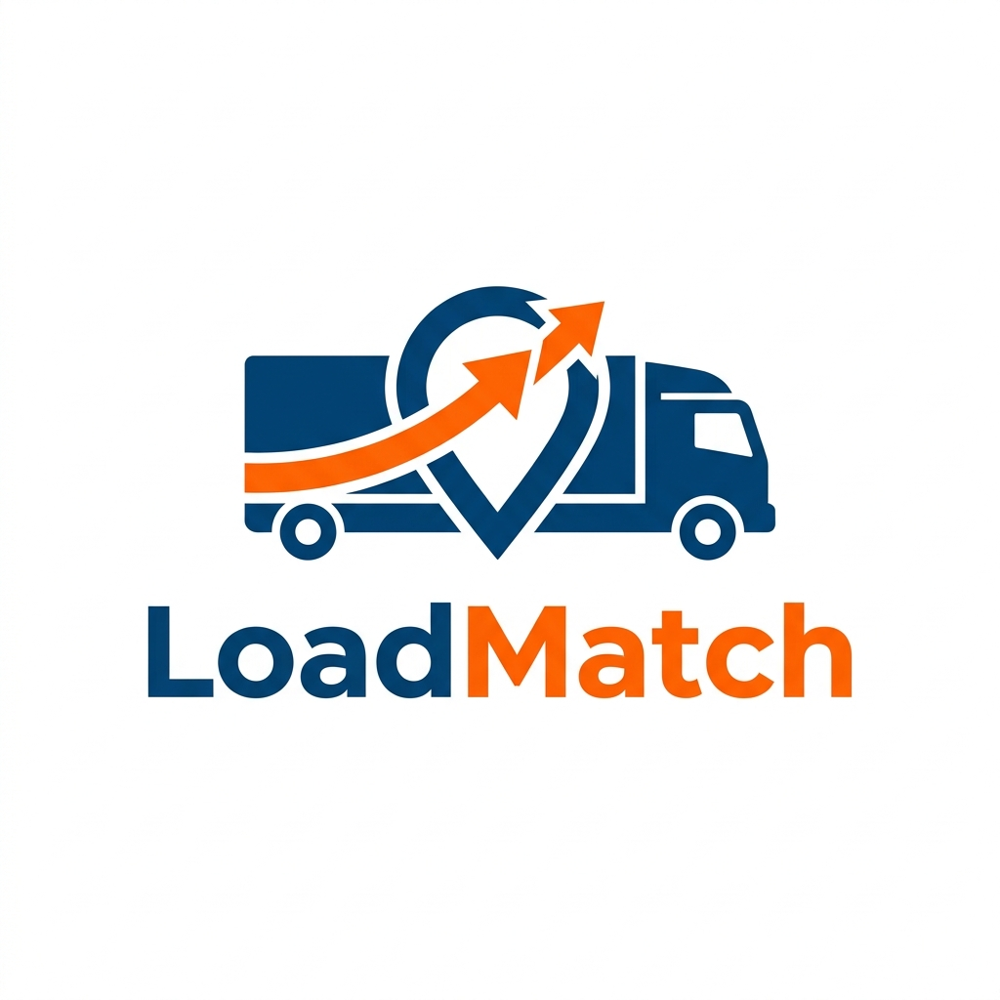
 | 

 | 

 | 

 |
| **Perfil** | **Overview** | Plataforma web de transporte de carga diseñada para negocios y emprendedores. Conecta a empresas que necesitan mover mercadería con transportistas validados, garantizando seguridad y seguimiento del servicio. | Aplicación global que conecta a conductores independientes con usuarios para el traslado libre de carga urbana. | Plataforma de entregas inmediatas para particulares y negocios, utilizando diversos tipos de vehículos. | Solución logística de una empresa tradicional que ofrece recojo, entrega y servicios corporativos completos. |
| | **Ventaja competitiva** | Exige documentos validados para choferes y vehículos, enfocándose netamente en brindar seguridad y trazabilidad al sector empresarial. | Precios económicos fijados mediante negociación directa con el conductor antes de iniciar el viaje. | Entregas inmediatas y posibilidad de hacer múltiples paradas en una sola ruta para distribuir mercadería. | Alta formalidad, facturación detallada, seguros para la carga y gran experiencia corporativa. |
| **Plan de marketing** | **Mercado objetivo** | Pequeñas y medianas empresas con necesidades de transporte recurrentes que valoran la seguridad. | Público general y pequeños comerciantes que buscan fletes ocasionales y baratos. | Tiendas de comercio electrónico y negocios que requieren despachos ágiles de última milla. | Empresas formales de tamaño mediano y grande que necesitan un aliado logístico estable a largo plazo. |
| | **Estrategias de marketing** | Acercamiento directo a asociaciones de emprendedores y campañas enfocadas en la confianza y seguridad del servicio. | Publicidad masiva en redes sociales promoviendo el ahorro al tener la libertad de "poner tu propio precio". | Fuerte presencia digital, cupones de descuento iniciales y beneficios económicos por uso frecuente de las empresas. | Ventas consultivas corporativas, eventos informativos sobre logística empresarial y trato personalizado. |
| **Plan de producto** | **Productos y servicios** | Búsqueda y asignación de transportistas validados, seguimiento del viaje, sistema de calificaciones y gestión de reclamos. | Fletes con vehículos desde minivans hasta camiones y chat directo con el conductor asignado. | Envíos rápidos, opciones para ayuda en carga y descarga, y recargas de saldo para corporaciones. | Transporte nacional, almacenamiento, envíos rápidos y herramientas digitales para seguir los despachos. |
| | **Precios y costos** | Se cobra una comisión sobre el precio del servicio finalizado, con opción a membresías para empresas de alta demanda. | Tarifas negociadas libremente entre el usuario y el conductor. La aplicación cobra una comisión al transportista. | Tarifas variables calculadas automáticamente por la plataforma según la distancia y el tamaño del vehículo. | Precios fijos para negocios bajo contrato corporativo, los cuales incluyen seguros y garantías. |
| | **Canales de distribución** | Plataforma web diseñada para ser accesible desde computadoras de almacén y dispositivos móviles. | Aplicación móvil dominante disponible para Android y iOS. | Aplicación móvil y portal web empresarial especializado. | Plataforma web corporativa y aplicaciones móviles de soporte. |
| **Análisis SWOT** | **Fortalezas** | Gran enfoque en la seguridad documental y diseño centrado en los requerimientos específicos de los negocios. | Enorme cantidad de conductores disponibles y reconocimiento masivo de la marca por el público. | Aplicación muy fácil de usar, disponibilidad las 24 horas y cálculo automático de rutas y tiempos. | Fuerte respaldo financiero, cumplimiento tributario e infraestructura logística real (almacenes físicos). |
| | **Oportunidades** | El alto grado de informalidad actual genera una fuerte necesidad por alternativas digitales seguras para mover mercadería de valor. | Expansión de pequeños negocios informales que necesitan transportar productos con bajo presupuesto. | Crecimiento de las ventas por internet y la creciente exigencia de los clientes por recibir entregas en el mismo día. | Empresas medianas en crecimiento que buscan formalizar toda su cadena de distribución. |
| | **Debilidades** | El desafío inicial de convencer a suficientes conductores para que pasen por el riguroso proceso de validación documental. | Pocos filtros de seguridad en el registro, lo que genera alta desconfianza de las empresas para encomendar mercadería costosa. | Precios altos en momentos de alta demanda y frecuente rotación de conductores independientes. | Procesos largos para afiliar nuevos clientes corporativos y poca agilidad para viajes de emergencia fuera de contrato. |
| | **Amenazas** | El ingreso de plataformas internacionales similares al mercado peruano que decidan enfocarse también en negocios formales. | Aumento de regulaciones estatales para aplicaciones de transporte y reclamos públicos por incidentes de seguridad. | Guerra de precios si entran aplicaciones con más capital de inversión que decidan subsidiar los envíos. | Startups logísticas más ágiles y económicas que modernicen el transporte y les quiten clientes tradicionales. |

**Nota:** Análisis competitivo de LoadMatch en comparación con las principales soluciones del mercado logístico local.

### 2.1.2. Estrategias y tácticas frente a competidores

**LoadMatch** plantea estrategias de diferenciación frente a cada competidor identificado. Estas estrategias se formulan para afrontar sus fortalezas y aprovechar sus debilidades, considerando además el contexto de oportunidades y amenazas actuales en el sector de transporte logístico.

#### Frente a inDrive Flete

- **Aprovechando su debilidad (baja confianza):** inDrive tiene pocos filtros de seguridad, lo que genera desconfianza al momento de encomendar carga de alto valor. Nuestra táctica principal es exigir y validar documentos formales (SOAT, revisión técnica, antecedentes) para garantizar seguridad total, posicionándonos como la opción confiable para las empresas.
- **Afrontando su fortaleza (gran cantidad de conductores):** para competir contra su masiva base de usuarios, nos enfocaremos estratégicamente en atraer primero a asociaciones de transportistas y ofrecerles clientes seguros y recurrentes (empresas), en lugar de viajes esporádicos.
- **Contexto de oportunidades y amenazas:** aprovecharemos la oportunidad que brinda la alta informalidad del mercado para destacar como una solución formal. De esta manera, nos anticipamos a la amenaza de posibles regulaciones estatales sobre aplicaciones de transporte, manteniendo un riguroso cumplimiento normativo desde el inicio.

#### Frente a Lalamove

- **Aprovechando su debilidad (asignación automática y precios dinámicos):** Lalamove impone precios que suben con la demanda y asigna conductores al azar. Nosotros permitiremos que la empresa elija a su transportista ideal basándose en su historial de calificaciones, fomentando relaciones de confianza.
- **Afrontando su fortaleza (rapidez y tecnología madura):** frente a su eficiente sistema de entregas inmediatas, nuestra estrategia no es competir en envíos pequeños de última milla, sino especializarnos exclusivamente en cargas más pesadas y movimientos entre proveedores, donde el cuidado de la mercadería vale más que la simple inmediatez.
- **Contexto de oportunidades y amenazas:** el constante crecimiento de las ventas por internet es una gran oportunidad que capitalizaremos ofreciendo transporte seguro para el abastecimiento de estas tiendas. Al competir por confianza empresarial y no por volumen masivo, nos protegemos de la amenaza de guerras de precios impulsadas por aplicaciones con mayor capital.

#### Frente a Scharff

- **Aprovechando su debilidad (rigidez corporativa):** los operadores tradicionales exigen contratos largos y procesos de afiliación lentos. Nuestra táctica es ofrecer una plataforma ágil donde cualquier negocio pueda registrarse y solicitar un camión formal en cuestión de minutos, eliminando la burocracia.
- **Afrontando su fortaleza (infraestructura física y formalidad):** en lugar de intentar construir almacenes propios, nuestro modelo cien por ciento digital y sin flota nos permite operar con mucha mayor agilidad y menores costos, brindando al mismo tiempo la emisión de facturas y el respaldo formal que la empresa necesita.
- **Contexto de oportunidades y amenazas:** dirigiremos nuestros esfuerzos hacia las pequeñas y medianas empresas que buscan formalizar su cadena de distribución pero no tienen el presupuesto para un gran operador logístico. Este enfoque directo en los emprendedores mitiga la amenaza de que otros operadores tradicionales intenten digitalizarse en el futuro.

## 2.2. Entrevistas

### 2.2.1. Diseño de entrevistas

| Sección | Preguntas de la entrevista |
| :--- | :--- |
| **Introducción, datos demográficos y background** | 1. ¿Podría indicar su nombre y apellido completo?   2. ¿Qué edad tiene?   3. ¿En qué distrito reside actualmente?   4. ¿A qué se dedica profesionalmente y cuánto tiempo lleva en este rubro? |
| **Hábitos tecnológicos, personalidad e influencias** | 5. ¿Cómo se describiría en términos de personalidad (por ejemplo: desconfiado, práctico, analítico, extrovertido)?   6. ¿Qué dispositivos tecnológicos (smartphone, tablet, computadora) prefiere utilizar para trabajar y por qué?   7. ¿Qué marcas, empresas o figuras en internet influyen en sus decisiones o le generan mayor confianza? |
| **Preguntas para Segmento 1: Dueños de negocios y emprendedores** | 8. ¿Cuáles son los objetivos principales que busca alcanzar al administrar la logística de su empresa?   9. ¿Cuáles son sus mayores frustraciones o miedos al contratar un servicio de transporte de carga desconocido?   10. ¿Qué canales o métodos utiliza actualmente para contactar transportistas cuando necesita mover mercadería de valor?   11. ¿Ha tenido alguna experiencia negativa (robo, pérdida o daño de carga)? ¿Cómo impactó eso a su negocio?   12. ¿Qué documentos legales o garantías le exige a un conductor antes de entregarle su carga?   13. Si existiera una plataforma digital enfocada en negocios que valide rigurosamente a los conductores, ¿qué características indispensables tendría que tener para que decida adoptarla en su empresa? |
| **Preguntas para Segmento 2: Transportistas y dueños de vehículos de carga** | 8. ¿Cuáles son sus principales objetivos financieros y profesionales trabajando en el rubro del transporte?   9. ¿Cuáles son las mayores frustraciones o riesgos que enfrenta al buscar empresas para realizar fletes?   10. ¿Qué aplicaciones o canales utiliza actualmente para conseguir viajes de carga y qué problemas encuentra en ellos?   11. ¿Alguna vez ha tenido problemas de seguridad, asaltos o clientes que no le pagaron el servicio acordado?   12. ¿Qué opina sobre la alta informalidad en su sector y de qué forma cree que le afecta?   13. ¿Estaría dispuesto a pasar por un proceso estricto de validación documental (antecedentes policiales, SOAT, revisión técnica) a cambio de acceder a una red segura de clientes empresariales? |

### 2.2.2. Registro de entrevistas

A continuación, se presenta el registro de las entrevistas realizadas a los representantes de cada segmento objetivo.

#### Entrevista 1: Segmento 1 (Dueño de negocio/Emprendedor)

| Campo | Detalle |
| :--- | :--- |
| **Nombres y Apellidos** | Pilar Jeannette Collado Urbina |
| **Edad** | 50 años |
| **Distrito** | Breña, Lima, Perú |
| **Enlace al video (Microsoft Stream/SharePoint)** | https://upcedupe-my.sharepoint.com/:v:/g/personal/u202310342_upc_edu_pe/IQAt8Ki44tzjTLdPCxL9hSGQAVH7oO8GykclJBJsj6jRs4I?nav=eyJyZWZlcnJhbEluZm8iOnsicmVmZXJyYWxBcHAiOiJPbmVEcml2ZUZvckJ1c2luZXNzIiwicmVmZXJyYWxBcHBQbGF0Zm9ybSI6IldlYiIsInJlZmVycmFsTW9kZSI6InZpZXciLCJyZWZlcnJhbFZpZXciOiJNeUZpbGVzTGlua0NvcHkifX0&e=yq6rNK |
| **Timing de inicio y duración** | Inicio: 00:01 - Duración: 6:25 minutos |
| **Evidencia fotográfica** |  |

**Resumen de la entrevista:**
La entrevistada es dueña de una repostería a pedido. Es pragmática y cautelosa, enfocada en minimizar riesgos. Usa su smartphone para interactuar con clientes en redes sociales y su laptop para tareas administrativas. Confía en marcas de electrodomésticos que ofrecen garantías (Oster, Imaco, Indurama).

Su objetivo principal es crecer, adquirir más equipos y vehículos propios. Su mayor frustración es el maltrato de sus productos durante el transporte, pues la presentación es crítica. Por ello, actualmente contrata a un chofer particular.

Para adoptar una nueva plataforma digital, exige conductores con antecedentes limpios, teléfono validado, vehículo a nombre del conductor y cajas herméticas para alimentos, priorizando la confianza y el cuidado extremo.

---

#### Entrevista 2: Segmento 1 (Dueño de negocio/Emprendedor)

| Campo | Detalle |
| :--- | :--- |
| **Nombres y Apellidos** | Ronald Cortez Joseli |
| **Edad** | 26 |
| **Distrito** | San Martin de Porres, Lima, Perú |
| **Enlace al video (Microsoft Stream)** | (https://upcedupe-my.sharepoint.com/:v:/g/personal/u202310342_upc_edu_pe/IQBAzfO4REFpQLwTj6NXeMnpAfz8bK1FQLdoZK5pQOoizkU?e=kh12X0) |
| **Timing de inicio y duración** | Inicio: 00:02 - Duración: 6:37 minutos |
| **Evidencia fotográfica** |  |

**Resumen de la entrevista:**

El entrevistado es dueño de su propio negocio de manufactura de diversos productos usando impresoras 3D. Es alguien analítico y atento al detalle, que valora mucho el orden y correcta organización de las cosas. Sus principales herramientas de trabajo, aparte de sus máquinas impresoras, son su smartphone y su laptop.

Nos comenta también que es usuario recurrente de inDrive y Shalom/Olva Courier para realizar el envío de sus productos, dependiendo del volumen y cantidad que sea necesaria; aunque también ha considerado la posibilidad de contratar servicios de terceros independientes mediante Facebook Marketplace. Su mayor frustración viene de sus malas experiencias con ambas soluciones, puesto que problemas como retrasos en la entrega o daños a la mercadería, afecta directamente a su logística y organización en general, lo que genera a veces insatisfacción con sus clientes. 

Para que él considere adoptar una solución como LoadMatch, Ronald nos hace saber que lo que más valoraría de dicha plataforma digital, sería la confiabilidad de que los conductores sean profesionales y confiables a la hora de manejar los envíos, además de la facilidad para poder contactarlos.

---

#### Entrevista 3: Segmento 1 (Dueño de negocio/Emprendedor)

| Campo | Detalle |
| :--- | :--- |
| **Nombres y Apellidos** | (Pendiente) |
| **Edad** | (Pendiente) |
| **Distrito** | (Pendiente) |
| **Enlace al video (Microsoft Stream)** | (Pendiente) |
| **Timing de inicio y duración** | Inicio: 00:00 - Duración: 0:00 minutos |
| **Evidencia fotográfica** | *(Pendiente - Captura de la entrevista)* |

**Resumen de la entrevista:**
(Pendiente)

---

#### Entrevista 4: Segmento 2 (Transportista/Conductor)

| Campo | Detalle |
| :--- | :--- |
| **Nombres y Apellidos** | Mateo Ignacio Vargas Huamán |
| **Edad** | 26 años |
| **Distrito** | San Juan de Lurigancho, Lima, Perú |
| **Enlace al video (Microsoft Stream)** | https://upcedupe-my.sharepoint.com/:v:/g/personal/u202323551_upc_edu_pe/IQB202QxElaeSbRKuQOrZ3XgARvfvQPkIKKUwLtaRsqauuE?e=FRdDfF&nav=eyJyZWZlcnJhbEluZm8iOnsicmVmZXJyYWxBcHAiOiJTdHJlYW1XZWJBcHAiLCJyZWZlcnJhbFZpZXciOiJTaGFyZURpYWxvZy1MaW5rIiwicmVmZXJyYWxBcHBQbGF0Zm9ybSI6IldlYiIsInJlZmVycmFsTW9kZSI6InZpZXcifX0%3D |
| **Timing de inicio y duración** | Inicio: 00:00 - Duración: 6:41 minutos |
| **Evidencia fotográfica** | 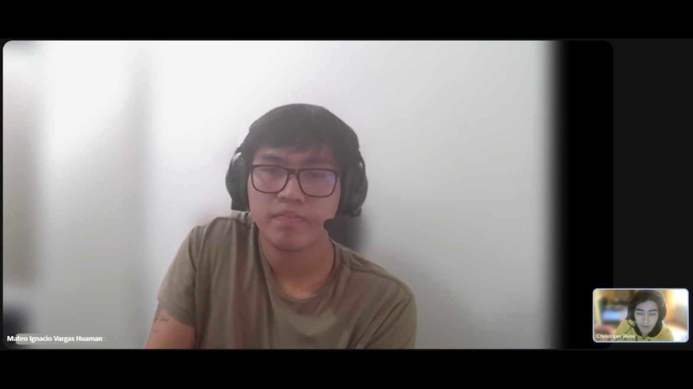 |

**Resumen de la entrevista:**

El entrevistado es copiloto y administrador operativo del negocio de transporte de carga familiar. Es analítico, nativo digital y pragmático, actuando como puente entre la "vieja escuela" de su padre y la modernización del rubro. Usa su smartphone como herramienta principal para todo el día a día (WhatsApp, Waze, Yape/Plin, GPS) y reserva la laptop solo para trámites formales en casa.

Su objetivo principal es dejar de depender de intermediarios informales, conseguir contratos directos con empresas medianas para tener un flujo de caja predecible y renovar su unidad. Su mayor frustración es la desconfianza de las empresas por la mala fama general del sector, los pagos a 60-90 días, los "clientes fantasma" y la competencia desleal del transporte informal.

Para adoptar una nueva plataforma digital, está totalmente dispuesto a pasar por un proceso estricto de validación documental. Exige que la plataforma le otorgue un distintivo visible de "Transportista Verificado" o "Socio Logístico Confiable", ya que considera que esta validación es su mejor argumento de venta para diferenciarse del informal y ganar la confianza de clientes empresariales serios.

---

#### Entrevista 5: Segmento 2 (Transportista/Conductor)

| Campo | Detalle |
| :--- | :--- |
| **Nombres y Apellidos** | Tito Sifuentes |
| **Edad** | 30 años |
| **Distrito** | Pueblo Libre |
| **Enlace al video (Microsoft Stream)** | https://upcedupe-my.sharepoint.com/personal/u202310342_upc_edu_pe/_layouts/15/stream.aspx?id=%2Fpersonal%2Fu202310342%5Fupc%5Fedu%5Fpe%2FDocuments%2FDesarrollo%20de%20Open%20Source%20%2D%202026%2D2%2FTransportistas%20y%20due%C3%B1os%20de%20veh%C3%ADculos%20de%20carga%2FEntrevistaTransportistaTitoSifuentes%2Emp4&referrer=StreamWebApp%2EWeb&referrerScenario=AddressBarCopied%2Eview%2E226abae8%2D7b5b%2D40ba%2Db438%2Dc6b82a93b0ee |
| **Timing de inicio y duración** | Inicio: 1:00 Duración: 5:20 |
| **Evidencia fotográfica** | 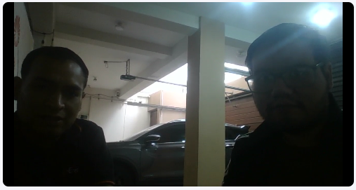 |

**Resumen de la entrevista:**
El entrevistado opera como transportista de mercadería en una empresa de lubricantes de motor con sede en Pueblo Libre, por la naturaleza de su trabajo tiene que realizar viajes de forma constante hacia los diferentes clientes del negocio y principalmente emplea aplicaciones como Whatsapp y los servicios de inDrive y Uber para contactar con sus clientes y jefes, y por el momento confía en empresas como Entel para su smartphone marca Samsung.

En sus 7 años de carrera como chofer este se mantiene en constante estado de aprendizaje, con la meta básica de seguir creciendo como persona y profesional en un negocio donde se expone a constantes riesgos producto de la situación política del país, y como muchos le preocupa el tema de la informalidad del transporte que se vive actualmente.

El señor Sifuentes expresó su interés en una aplicación como la nuestra, siempre que se atraviese por un diálogo entendible para definir su rol en nuestro servicio. 

---

#### Entrevista 6: Segmento 2 (Transportista/Conductor)

| Campo | Detalle |
| :--- | :--- |
| **Nombres y Apellidos** | (Pendiente) |
| **Edad** | (Pendiente) |
| **Distrito** | (Pendiente) |
| **Enlace al video (Microsoft Stream)** | (Pendiente) |
| **Timing de inicio y duración** | (Pendiente) |
| **Evidencia fotográfica** | *(Pendiente - Captura de la entrevista)* |

**Resumen de la entrevista:**
(Pendiente)

---

### 2.2.3. Análisis de entrevistas

#### Segmento 1: Dueños de negocios y emprendedores

**Entrevista 1 (Pilar Collado):** La entrevistada evidencia una alta aversión al riesgo en lo que respecta a la presentación y cuidado de sus productos (repostería), al punto de depender actualmente de un chofer de confianza contratado por tiempo en lugar de usar aplicativos de transporte estándar. Su testimonio demuestra que la falta de garantías en el manejo de la carga es su mayor frustración y pérdida de valor. Para mitigar este riesgo, valora positivamente que la plataforma exija filtros rigurosos a los conductores (antecedentes penales, validación vehicular) e indumentaria adecuada (cajas herméticas).

**Características más comunes del Segmento 1 (n=1):**

| Característica | % de entrevistados | Entrevistas | Evidencia |
| :--- | :--- | :--- | :--- |
| Perciben alta preocupación por el cuidado y presentación de la mercadería | 100% | #1 | Pilar señala como mayor frustración el maltrato de sus productos. |
| Prefieren métodos de transporte propios o conocidos frente a apps estándar | 100% | #1 | Actualmente usa un chofer particular contratado por tiempo. |
| Exigen validaciones rigurosas (antecedentes, titularidad) para confiar la carga | 100% | #1 | Exige conductores con antecedentes limpios y vehículo a nombre del conductor. |
| Demandan equipamiento especializado en los vehículos | 100% | #1 | Solicita cajas herméticas o aislantes para alimentos. |

**Conclusión del Segmento 1:**
La entrevista preliminar sugiere que para los emprendedores (especialmente del rubro alimentario o productos delicados), la seguridad de la mercadería está por encima de la inmediatez. La exigencia de antecedentes, vehículos validados y equipamiento adecuado confirma que la propuesta de valor de **LoadMatch** de brindar transporte seguro y verificado responde a una necesidad real. La principal limitación es el tamaño de muestra (n=1), por lo que se recomienda incorporar las Entrevistas #2 y #3 para validar estos porcentajes.

#### Segmento 2: Transportistas y conductores

**Resumen y características:**
(Pendiente - A la espera de entrevistas #4, #5 y #6)

---

## 2.3. Needfinding

### 2.3.1. User Personas

En esta sección se presentan las fichas de User Persona, construidas a partir de los patrones de comportamiento y necesidades identificados en el análisis de las entrevistas de nuestros segmentos. Estos arquetipos sintetizan la información demográfica, las motivaciones, las frustraciones y las dinámicas operativas de nuestros dos segmentos objetivo. La definición de estos perfiles garantiza que el diseño de las funcionalidades de **LoadMatch** responda directamente a las urgencias reales de quienes administran envíos de carga y de quienes proveen el servicio de transporte.

**User Persona 1: Carlos Mendoza - Dueño de negocio / Emprendedor**

  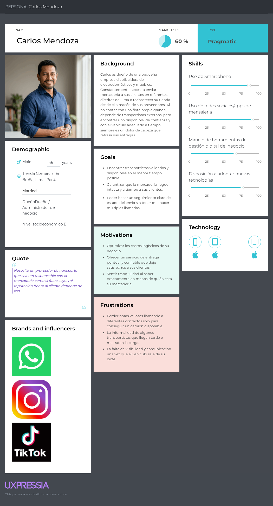

***Nota.*** Ficha que representa el arquetipo del Segmento 1. Detalla sus objetivos orientados a proteger la integridad de sus productos y su frustración ante la informalidad y descuido de las soluciones de transporte tradicionales.
*(Pendiente - Ficha UXPressia)*

**User Persona 2: Roberto Sánchez - Transportista / Dueño de vehículo de carga**

  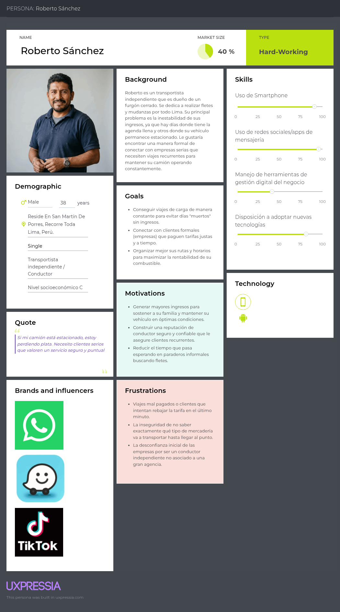

***Nota.*** Ficha que representa el arquetipo del Segmento 2. Expone su necesidad de conseguir viajes seguros y confiables, y su frustración por la informalidad, la inseguridad y los bajos márgenes en aplicaciones que no lo valoran.
*(Pendiente - Ficha UXPressia)*

### 2.3.2. User Task Matrix

En esta sección se presenta el User Task Matrix, una herramienta que concentra y evalúa las tareas cotidianas que realizan nuestros dos segmentos objetivo (Dueños de negocio y Transportistas) para cumplir sus objetivos comerciales y operativos. Es fundamental destacar que estas tareas representan acciones del mundo real, independientes de cualquier solución de software, orientadas a la gestión de envíos, la verificación de seguridad y la búsqueda de servicios.

A continuación, se detalla la matriz unificada, evaluando la frecuencia (Alta, Media, Baja) y la importancia (Alta, Media, Baja) de cada tarea para ambos arquetipos.

| Tareas del Usuario (Independientes del software) | Dueño de Negocio (Carlos) - Frecuencia | Dueño de Negocio (Carlos) - Importancia | Transportista (Roberto) - Frecuencia | Transportista (Roberto) - Importancia |
| :--- | :---: | :---: | :---: | :---: |
| Buscar conductores/clientes seguros y confiables | High | High | High | High |
| Verificar la integridad y cuidado de la mercadería | High | High | High | High |
| Solicitar documentos o garantías antes del viaje | Medium | High | Medium | Medium |
| Coordinar puntos de recojo y entrega | High | High | High | High |
| Monitorear el estado o ubicación del transporte | High | High | Medium | Low |
| Gestionar los pagos y cobros de los servicios | High | High | High | High |

**Análisis de la Matriz de Tareas:**
La matriz revela que tanto los dueños de negocio (Shipper) como los transportistas (Carrier) coinciden en que la búsqueda de contrapartes seguras, la coordinación de recojo/entrega, y la gestión de pagos son tareas de altísima frecuencia e importancia para ambos. Esto indica que la funcionalidad principal de la plataforma debe centrarse en facilitar un "match" rápido y confiable, integrando un sistema de pagos seguro. 
Por otro lado, se observan asimetrías clave: el monitoreo del estado del transporte es vital (High/High) para el Shipper, ya que necesita visibilidad sobre su mercadería de valor, pero es de baja prioridad para el Carrier (Medium/Low), cuyo enfoque operativo está en conducir. Asimismo, la solicitud de garantías documentales es más crítica para el Shipper, reflejando su aversión al riesgo. Estas diferencias nos indican que el sistema debe automatizar el tracking GPS y la validación de documentos en segundo plano, satisfaciendo las exigencias de seguridad del Shipper sin agregarle carga operativa manual al Transportista.

### 2.3.3. User Journey Mapping

### 2.3.4. Empathy Mapping

## 2.4. Big Picture Event Storming

En esta sección se documenta el proceso colaborativo de **Big Picture Event Storming**, realizado con el objetivo de entender el dominio general del negocio de LoadMatch. Durante esta sesión, nos enfocamos en explorar de manera visual y de alto nivel el panorama del negocio logístico.

**Figura 5:**
*Exploración inicial*

  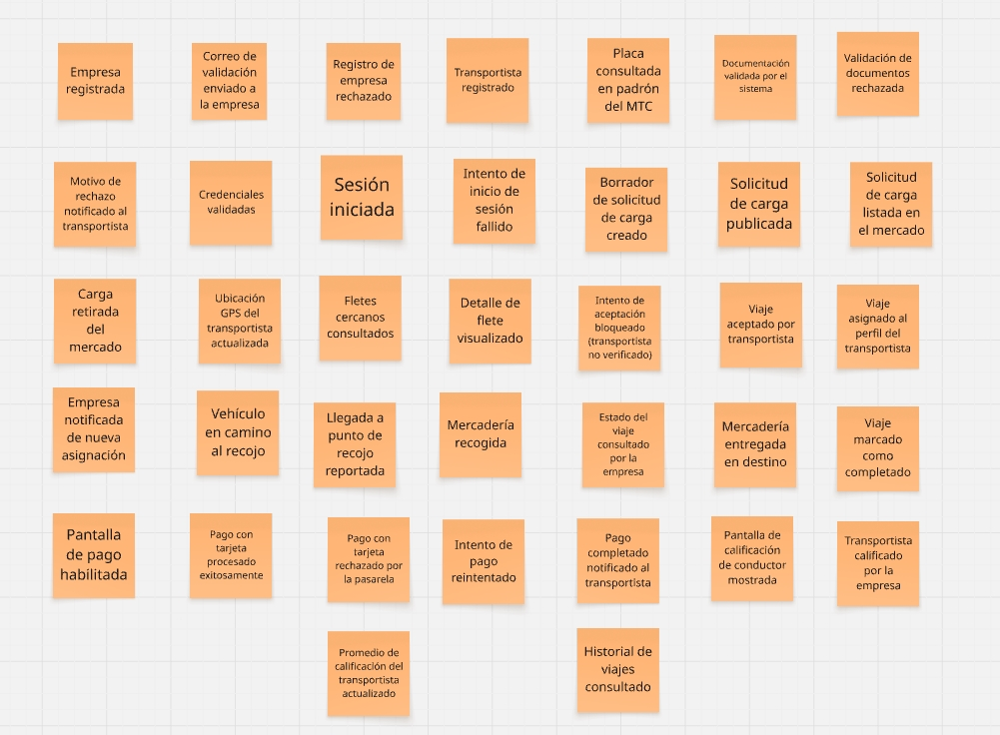

**Nota:** En esta fase exploratoria, logramos identificar un aproximado de 39 eventos de dominio clave que suceden en la interacción entre la empresa generadora de carga y el transportista.

A continuación, se presentan las capturas y explicaciones organizadas en los 4 pasos fundamentales que realizamos para construir nuestro Big Picture Event Storming:

### Paso 1: Generación de Eventos de Dominio (Domain Events)
En esta primera etapa, el equipo realizó una lluvia de ideas para identificar todos los eventos de dominio posibles (representados mediante post-its de color naranja). Estos eventos indican cambios de estado relevantes dentro del proceso logístico de LoadMatch.

**Figura 6:**
*Generación de Eventos de Dominio*

  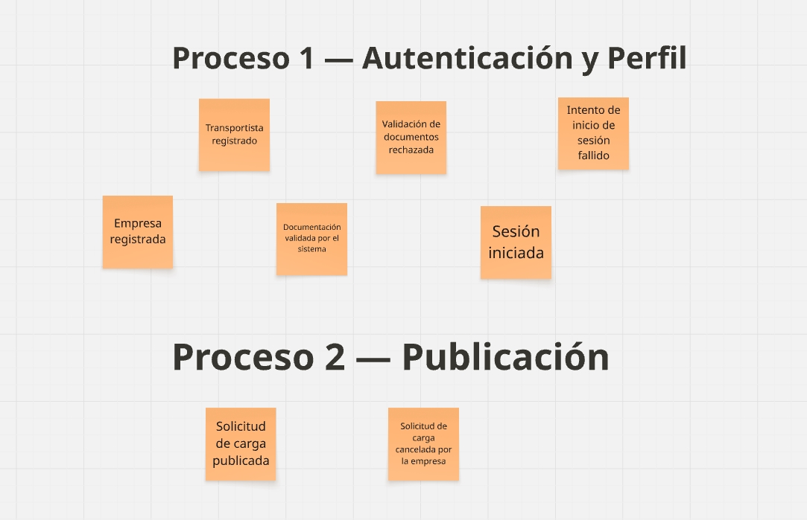

  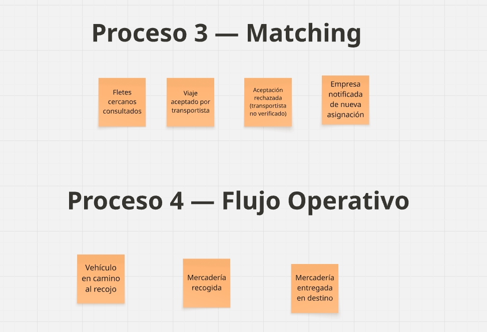

  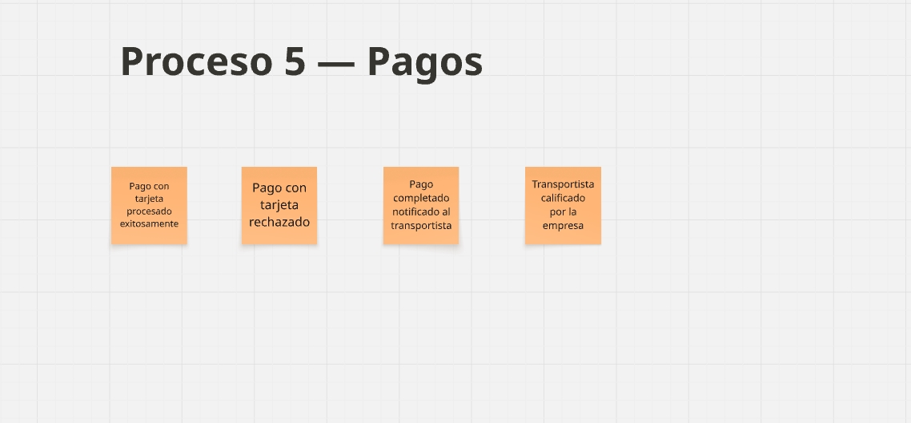

**Nota:** Eventos clave identificados en el dominio de negocio, sin un orden secuencial estricto.

### Paso 2: Ordenamiento Cronológico y Flujo de Trabajo
Una vez identificados los eventos, procedimos a ordenarlos lógicamente en una línea de tiempo horizontal. Esta cronología nos permitió visualizar el flujo de trabajo natural del sistema.

**Figura 7:**
*Ordenamiento Cronológico*

  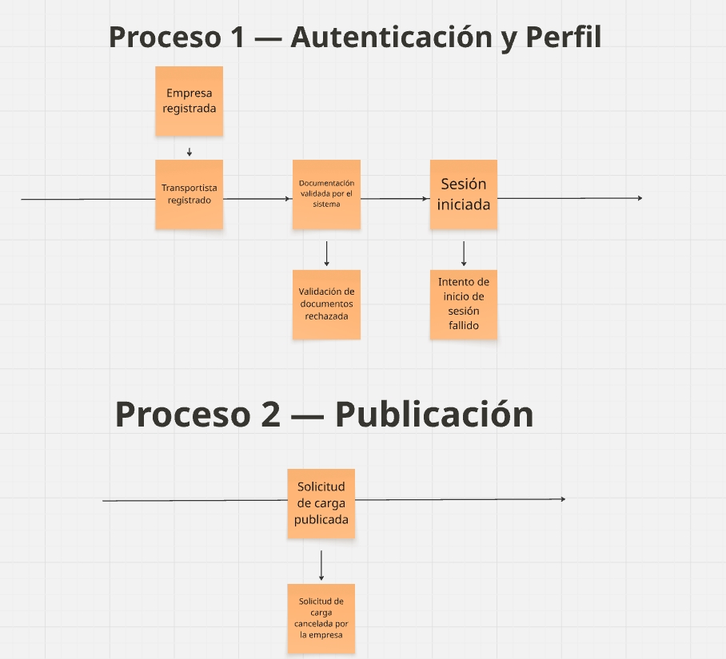

  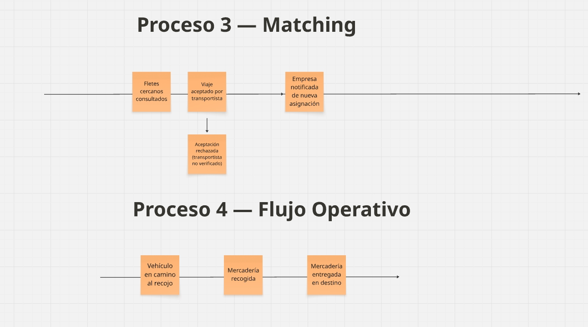

  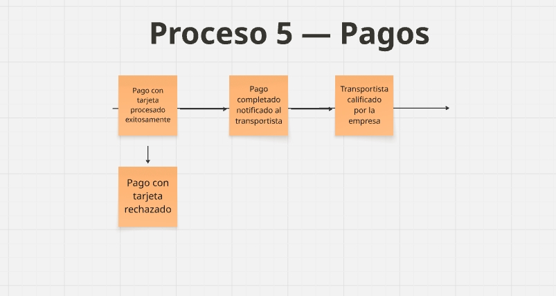

**Nota:** Eventos estructurados en el tiempo para definir el "Happy Path" o ruta esperada del servicio.

### Paso 3: Identificación de Actores y Sistemas Externos
En esta fase, enriquecimos el mapa base identificando quién o qué gatilla estos eventos, añadiendo a los usuarios involucrados (Shipper, Carrier, Administrador) y los sistemas externos necesarios.

**Figura 8:**
*Identificación de Actores y Sistemas Externos*

  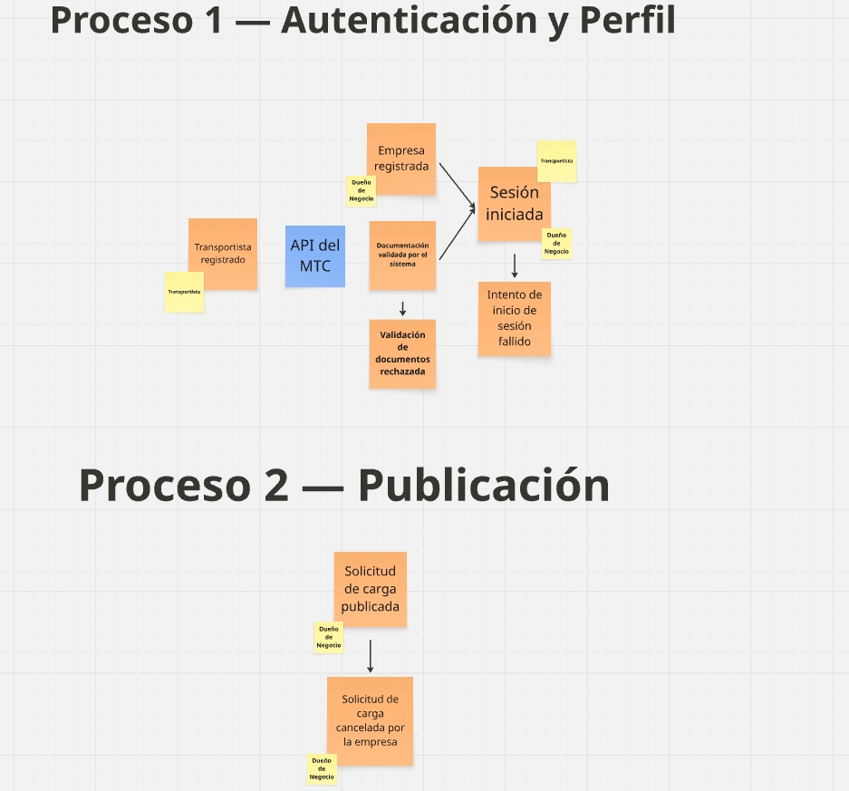

  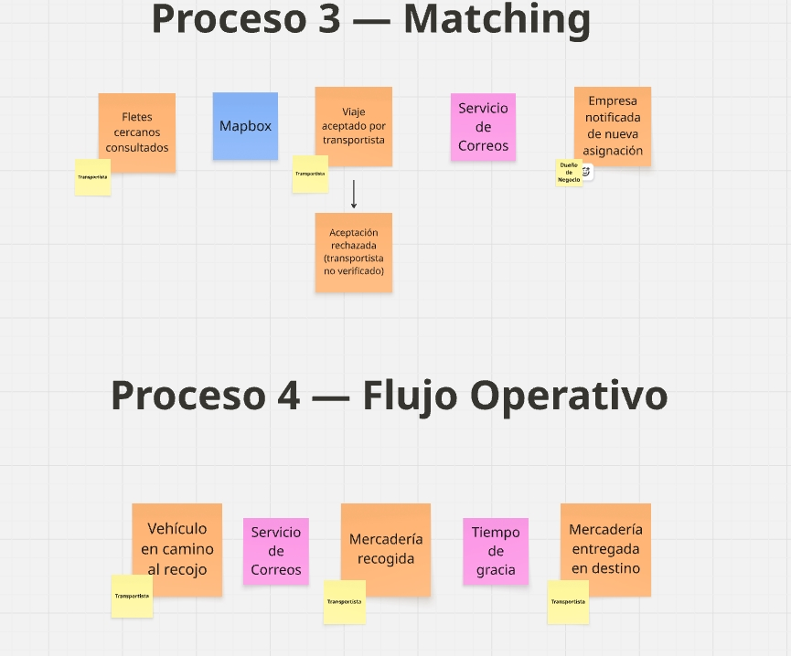

  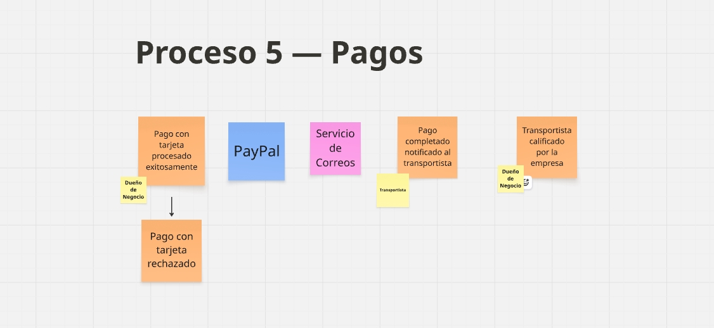

**Nota:** Agregado de componentes amarillos (actores) y rosados (sistemas externos) al flujo temporal.

### Paso 4: Big Picture (Vista Panorámica)
El resultado final es un mapa panorámico completo que sirve como pilar para entender el negocio de LoadMatch a gran escala, alineando los requisitos funcionales con los procesos operativos que se desarrollarán.

**Figura 9:**
*Vista Panorámica del Big Picture Event Storming*

  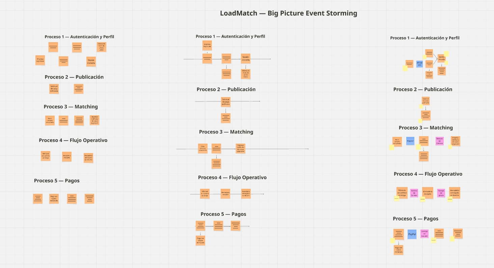

**Nota:** Resultado final de la sesión colaborativa, que muestra el end-to-end del modelo de negocio.

## 2.5. Ubiquitous Language

Para asegurar una comunicación clara y libre de ambigüedades entre todos los miembros del equipo, stakeholders y futuros desarrolladores, hemos definido el siguiente glosario de términos del **Ubiquitous Language** (Lenguaje Ubicuo). Este vocabulario está centrado puramente en el dominio del negocio logístico, evitando términos técnicos de ingeniería de software, y será la base para nombrar variables, clases y servicios en el código de LoadMatch.

| Término (Inglés) | Equivalente (Español) | Explicación / Definición en el Dominio |
| :--- | :--- | :--- |
| **Shipper** | Empresa generadora de carga | Persona jurídica o negocio registrado en la plataforma que tiene la necesidad de enviar mercadería de un punto a otro y publica solicitudes de flete. |
| **Carrier** | Transportista validado | Chofer o dueño de vehículo de carga que ha pasado satisfactoriamente los filtros de seguridad de LoadMatch y está habilitado para aceptar viajes. |
| **Load / Freight** | Carga / Mercadería | Los bienes físicos que el Shipper necesita transportar. Se clasifica por peso, volumen y requerimientos especiales (ej. refrigerado, frágil). |
| **Vehicle** | Vehículo de carga | La unidad de transporte registrada por el Carrier (camión, furgoneta, minivan) que cuenta con sus documentos vigentes (SOAT, Revisión Técnica). |
| **Dispatch / Trip** | Flete / Viaje | El proceso físico y contractual de mover la carga desde el punto de origen hasta el punto de destino acordados. |
| **Load Request** | Solicitud de Carga | El formulario o requerimiento publicado por el Shipper detallando origen, destino, tarifa base y especificaciones de la mercadería. |
| **Match** | Asignación | El momento crítico en el que un Shipper y un Carrier acuerdan formalmente realizar un viaje bajo ciertas condiciones de tarifa y tiempo. |
| **Offer / Bid** | Oferta / Propuesta | La tarifa propuesta por un Carrier en respuesta a una Load Request publicada por un Shipper, que puede ser aceptada o rechazada. |
| **Route** | Ruta | El trayecto geográfico planificado desde el almacén o punto de recojo hasta el lugar de entrega final. |
| **Tracking** | Trazabilidad / Rastreo | La capacidad de monitorear el estado y la ubicación del Dispatch en tiempo real, brindando visibilidad operativa al Shipper. |
| **Proof of Delivery (POD)** | Prueba de entrega | Evidencia documental (generalmente una foto de la guía de remisión firmada o de la carga en almacén) que confirma que el viaje ha finalizado con éxito. |
| **Rating** | Calificación | La evaluación en estrellas y comentarios que se otorgan mutuamente el Shipper y el Carrier al finalizar un Dispatch, fundamental para construir la reputación. |
| **Validation** | Validación Documental | El proceso de revisión de antecedentes, brevete, SOAT y tarjeta de propiedad que realiza LoadMatch para aprobar a un Carrier. |
