# Capítulo II: Requirements Elicitation & Analysis

## 2.1. Competidores

Para comprender el posicionamiento de **LoadMatch** dentro del mercado de transporte y logística, se analizaron soluciones que compiten directa o indirectamente con la propuesta de valor de la plataforma. El análisis considera servicios de transporte de carga, marketplaces logísticos y operadores de logística empresarial que presentan funcionalidades o modelos de negocio comparables.

La selección considera a **inDrive Flete**, **CargaYa** y **Sharf** como referencias relevantes para el mercado peruano. Estas soluciones representan diferentes enfoques dentro del sector: intermediación digital de transporte, marketplaces especializados en carga y operadores logísticos integrales.

### Competidor 1: inDrive Flete

* **Descripción:** inDrive es una plataforma global de movilidad y servicios urbanos que incluye una vertical dedicada al transporte de carga denominada **inDrive.Freight**. Dentro de este servicio, los transportistas pueden acceder a solicitudes de carga y seleccionar aquellas que se ajusten al tipo de vehículo que operan (inDrive, s. f.-a).

* **Ventaja competitiva:** Su modelo permite que usuarios y conductores participen directamente en la determinación de la tarifa del servicio, diferenciándose de modelos donde el precio es establecido únicamente mediante algoritmos. La plataforma también aprovecha la amplia presencia internacional y ecosistema tecnológico de inDrive.

* **Público objetivo:** Usuarios, emprendedores y negocios que requieren trasladar mercancías y buscan contratar directamente servicios de transporte disponibles mediante una plataforma digital.

* **Estrategia de marketing:** inDrive posiciona su propuesta alrededor de la libertad de elección y la negociación directa de precios. Además, durante 2025 lanzó en Perú funcionalidades específicas de entrega orientadas a negocios y pequeñas empresas (inDrive, 2025).

* **Funciones principales:** Consulta de solicitudes de carga, selección de órdenes disponibles, filtrado según tipo de vehículo, descripción de la carga, negociación de tarifas, calificaciones de usuarios y servicios asociados de seguimiento y entrega.

* **Modelo de costos:** El precio del transporte puede ser acordado entre las partes. La documentación oficial de inDrive.Freight indica además que se aplica una tarifa de servicio al transportista cuando una orden alcanza el estado de aceptación (inDrive, s. f.-a).

* **Seguridad:** inDrive ha implementado procesos automáticos de verificación de identidad para conductores mediante tecnología de Truora, contrastando documentos e identidad con registros oficiales en Latinoamérica (inDrive, 2025).

* **Distribución:** Aplicación móvil y ecosistema digital de inDrive.

**Evidencia oficial de servicios:** La documentación oficial de inDrive incluye servicios orientados al transporte y entrega de mercancías. Asimismo, en julio de 2025 la compañía anunció oficialmente en Perú el lanzamiento de un servicio de entregas dirigido a negocios, evidenciando su participación activa dentro del mercado logístico peruano.

  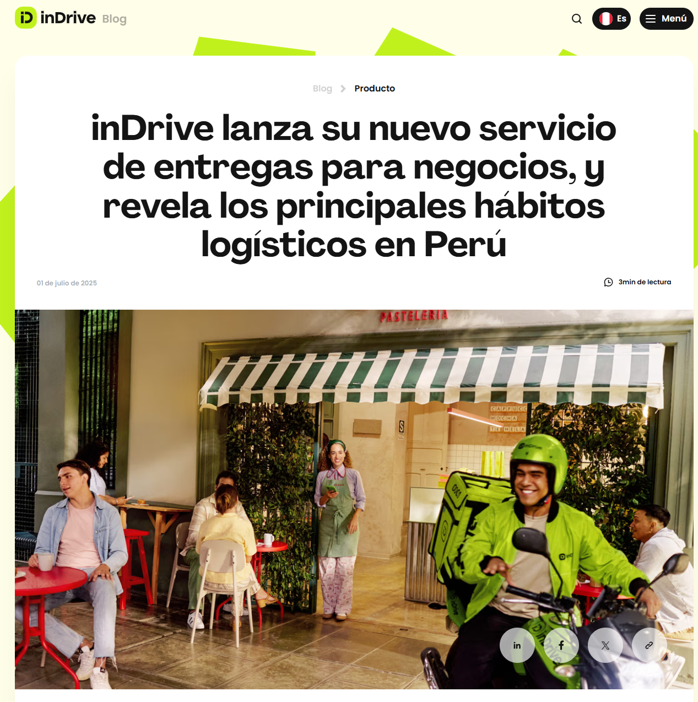 
  <i>Nota. inDrive anuncia oficialmente su servicio de entregas para negocios en Perú. Tomado de inDrive (2025).</i>

### Competidor 2: CargaYa

* **Descripción:** CargaYa es una plataforma peruana especializada en conectar empresas generadoras de carga con transportistas disponibles. Su propuesta se encuentra directamente orientada al mercado de transporte de carga y a las principales rutas logísticas del Perú (CargaYa, s. f.).

* **Ventaja competitiva:** Su especialización en transporte de carga peruano y su modelo de marketplace permiten que las empresas publiquen cargas y reciban propuestas de transportistas disponibles. La plataforma incorpora validación de identidad mediante RENIEC y SUNAT, negociación directa y reputación basada en servicios realizados.

* **Público objetivo:** Empresas que necesitan transportar mercancía y transportistas independientes o propietarios de vehículos de carga que buscan oportunidades de viaje.

* **Estrategia de marketing:** CargaYa comunica su propuesta alrededor de tres factores principales: encontrar carga disponible, reducir viajes de retorno vacíos y facilitar la conexión directa entre empresas y transportistas.

* **Funciones principales:** Publicación de cargas, búsqueda de cargas por ruta, recepción de ofertas, negociación mediante chat, visualización de cargas en mapa y lista, transportistas verificados, sistema de calificaciones, carga consolidada y noticias sobre el estado de las vías.

* **Modelo de costos:** De acuerdo con la información publicada actualmente por CargaYa, los transportistas tienen **0 % de comisión**, mientras que para empresas se promociona una comisión del **3 % en la primera carga y 5 % posteriormente** (CargaYa, s. f.).

* **Seguridad:** La plataforma declara validar DNI y RUC mediante RENIEC y SUNAT y utiliza un sistema de reputación construido a partir de viajes completados.

* **Distribución:** Plataforma digital accesible desde dispositivos móviles y computadoras mediante `cargaya.pe`.

**Evidencia oficial de servicios:** El sitio oficial de CargaYa evidencia directamente su funcionamiento como marketplace logístico en Perú. La plataforma permite a las empresas publicar cargas y recibir ofertas de transportistas, mientras que los transportistas pueden localizar cargas disponibles por ruta. Asimismo, comunica la verificación de transportistas mediante RENIEC y SUNAT, negociación directa y mecanismos de trazabilidad.

  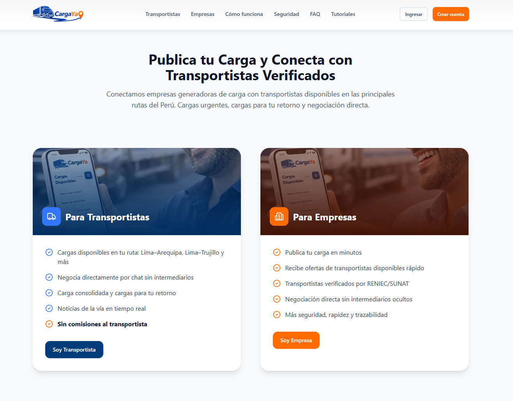 
  <i>Nota. CargaYa conecta empresas generadoras de carga con transportistas verificados y ofrece herramientas para publicación, búsqueda y negociación de cargas. Tomado de CargaYa (s. f.).</i>

### Competidor 3: Sharf

* **Descripción:** **Sharf, anteriormente denominada Scharff**, es una empresa logística peruana con más de cuatro décadas de trayectoria que ofrece servicios para personas, emprendedores y empresas. La compañía confirmó oficialmente el cambio de marca manteniendo sus operaciones y servicios (Sharf, s. f.-a).

* **Ventaja competitiva:** Su principal diferenciación se encuentra en su infraestructura logística, experiencia operativa y capacidad para integrar diferentes etapas de la cadena logística dentro de una misma organización.

* **Público objetivo:** Emprendedores, medianas y grandes empresas que requieren servicios logísticos formales, transporte de carga, almacenamiento, distribución o servicios especializados.

* **Estrategia de marketing:** Sharf se posiciona como operador logístico integral, enfatizando cobertura nacional, experiencia, infraestructura, tecnología y soluciones personalizadas para empresas.

* **Funciones principales:** Carga nacional e internacional, almacenamiento, distribución, última milla, logística inversa, planificación de rutas, seguimiento en tiempo real, evidencia de entrega e integración de sistemas mediante APIs (Sharf, s. f.-b).

* **Modelo de costos:** Para las soluciones empresariales, Sharf trabaja mediante servicios adaptados a las necesidades de cada operación y contacto comercial para su cotización. Para determinados servicios dirigidos a personas y emprendedores también publica tarifas específicas.

* **Distribución:** Red logística física y digital con operaciones a nivel nacional, centros logísticos, puntos de atención y plataformas de seguimiento.

**Evidencia oficial de servicios:** La plataforma oficial de Sharf muestra servicios de envíos nacionales para Perú y soluciones logísticas orientadas a medianas y grandes empresas. Asimismo, la compañía comunica una trayectoria de más de 40 años en el sector y una operación logística de alcance nacional.

  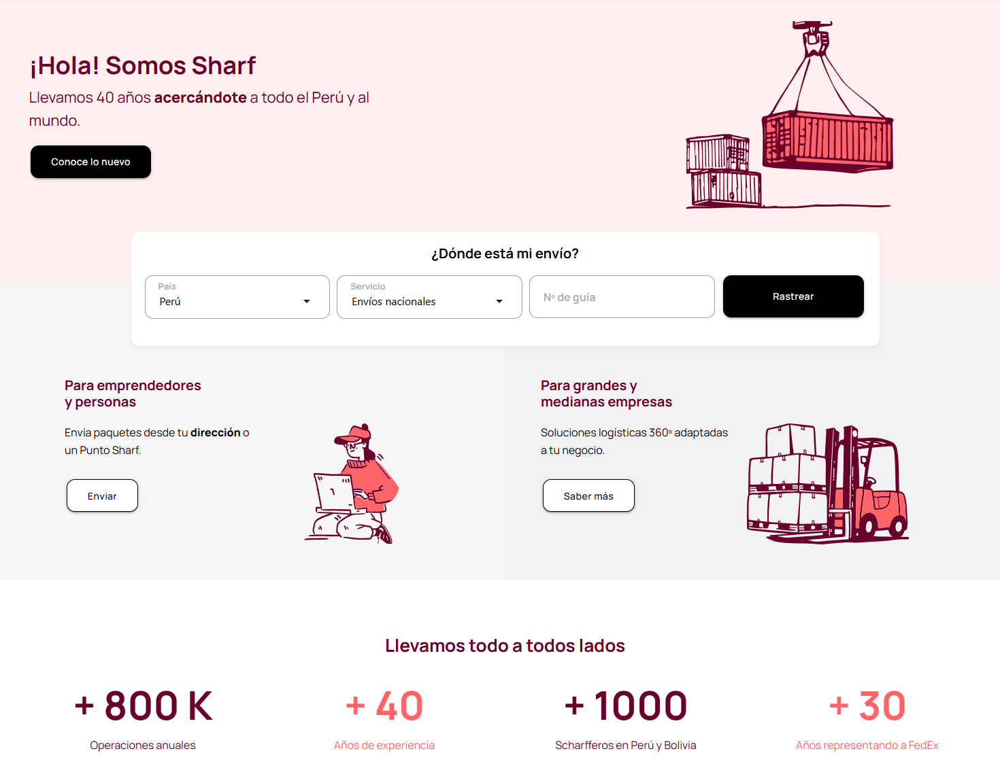 
  <i>Nota. Sharf ofrece envíos nacionales y soluciones logísticas para emprendedores, medianas y grandes empresas en Perú. Tomado de Sharf (s. f.).</i>

### 2.1.1. Análisis competitivo

**¿Por qué realizar este análisis?**

El análisis competitivo permite identificar cómo distintas empresas abordan actualmente el transporte, la intermediación y la gestión logística. Para **CargoLink Labs**, este análisis permite reconocer funcionalidades ya existentes en el mercado, evitar basar la propuesta únicamente en características que los competidores ya ofrecen y encontrar oportunidades reales de diferenciación para **LoadMatch**.

A partir de la investigación realizada, se observa que funcionalidades como seguimiento, negociación, publicación de cargas y validación de usuarios ya se encuentran presentes en algunas soluciones. En consecuencia, la propuesta de LoadMatch debe diferenciarse mediante la integración coherente de estas capacidades dentro de una experiencia orientada específicamente a empresas y transportistas de carga formal.

| Categoría | Atributo | LoadMatch | inDrive Flete | CargaYa | Sharf |
| :--- | :--- | :--- | :--- | :--- | :--- |
| | **Nombre** | **LoadMatch** | **inDrive Flete** | **CargaYa** | **Sharf** |
| | **Logotipo** | 
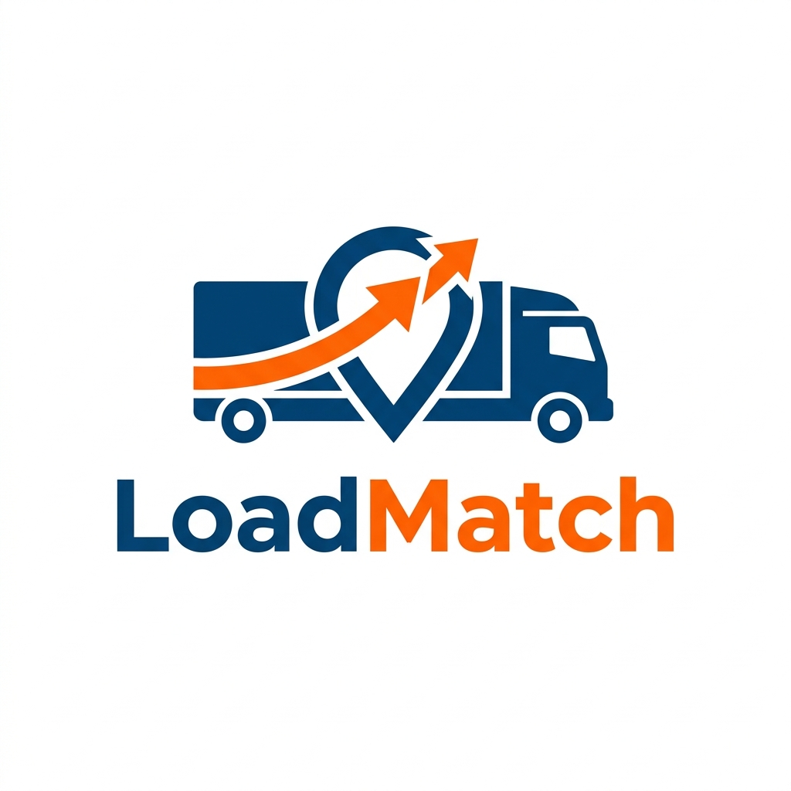
 | 

 | 

 | 

 |
| **Perfil** | **Overview** | Marketplace digital orientado a conectar empresas que requieren transportar carga con transportistas y vehículos validados. | Vertical de carga perteneciente al ecosistema global de movilidad de inDrive. | Marketplace peruano especializado en conectar empresas generadoras de carga y transportistas. | Operador logístico peruano integral, anteriormente denominado Scharff. |
| | **Ventaja competitiva** | Integración de matching, validación documental, seguimiento y gestión operativa para transporte empresarial. | Amplio ecosistema tecnológico y negociación directa de tarifas entre participantes. | Especialización directa en transporte de carga peruano, validación RENIEC/SUNAT y negociación directa. | Infraestructura logística, cobertura, experiencia y capacidad de gestionar diferentes etapas de la cadena logística. |
| **Plan de marketing** | **Mercado objetivo** | MIPYME y empresas con necesidades de transporte, junto con transportistas independientes y pequeñas flotas formales. | Usuarios, emprendedores y negocios que requieren servicios de transporte disponibles mediante una aplicación. | Empresas generadoras de carga y transportistas que operan rutas nacionales del Perú. | Emprendedores, medianas y grandes empresas con necesidades logísticas y de distribución. |
| | **Estrategia de marketing** | Confianza, formalización, transparencia operativa y conexión directa entre oferta y demanda de carga. | Libertad de elección y negociación directa del precio. | Disponibilidad de cargas, reducción de retornos vacíos, negociación directa y comunidad logística peruana. | Cobertura nacional, infraestructura, tecnología y soluciones logísticas integrales. |
| **Plan de producto** | **Productos y servicios** | Publicación de solicitudes de carga, matching, validación de transportistas y vehículos, seguimiento, historial y calificaciones. | Solicitudes de carga, selección de órdenes, negociación, diferentes vehículos y reputación mediante calificaciones. | Publicación y búsqueda de cargas, ofertas, chat, verificación, reputación, carga consolidada y noticias de la vía. | Carga nacional e internacional, almacenamiento, distribución, última milla, tracking y servicios logísticos integrales. |
| | **Precios y costos** | Publicar solicitudes es gratuito. El modelo contempla una comisión asociada al servicio confirmado/completado, sin planes de membresía en el alcance actual. | Tarifa negociada entre las partes y tarifa de servicio asociada a la orden aceptada. | Transportistas: 0 % de comisión. Empresas: promoción de 3 % en primera carga y 5 % posteriormente, según información publicada actualmente. | Tarifas o cotizaciones según el tipo y alcance de la operación logística contratada. |
| | **Canales de distribución** | Landing Page y Web Application responsive. | Aplicación móvil y ecosistema digital inDrive. | Plataforma web accesible desde dispositivos móviles y computadoras. | Red física de distribución y plataformas digitales de seguimiento y gestión. |
| **Análisis SWOT** | **Fortalezas** | Especialización en necesidades de empresas y transportistas de carga formal, con énfasis en validación y trazabilidad. | Escala internacional, reconocimiento de marca y modelo flexible de negociación. | Enfoque específico en transporte de carga peruano y propuesta muy cercana a las necesidades de empresas y transportistas locales. | Experiencia, infraestructura física, cobertura nacional y amplitud de servicios logísticos. |
| | **Oportunidades** | Digitalización de MIPYME, formalización del transporte y necesidad de conectar capacidad disponible con demanda empresarial. | Expansión de servicios empresariales y de carga dentro de su ecosistema actual. | Crecimiento del marketplace y de su red de empresas y transportistas dentro del Perú. | Crecimiento del comercio electrónico, tercerización logística y automatización de operaciones empresariales. |
| | **Debilidades / limitaciones relativas al segmento analizado** | Necesidad inicial de construir una masa crítica suficiente de empresas y transportistas. | Su ecosistema atiende múltiples verticales y no se encuentra dedicado exclusivamente al flujo B2B de carga empresarial que plantea LoadMatch. | Su similitud funcional con LoadMatch obliga a diferenciar la propuesta mediante experiencia, matching, gestión empresarial y profundidad de validación. | Su modelo corresponde a un operador logístico integral y no a un marketplace abierto de matching directo entre empresas y transportistas independientes. |
| | **Amenazas para LoadMatch** | — | Puede ampliar sus verticales de carga y servicios empresariales aprovechando su escala y reconocimiento. | Es actualmente uno de los competidores más cercanos a la propuesta de LoadMatch debido a su enfoque local y funcionalidades similares. | Su infraestructura y reputación pueden atraer a empresas que prefieren tercerizar integralmente su logística. |
| **Evidencia** | **Servicios comprobados** | Propuesta definida por CargoLink Labs. | Servicio de entregas para negocios oficialmente anunciado en Perú. | Marketplace activo para publicación de cargas y transportistas verificados. | Envíos nacionales y soluciones logísticas 360° para empresas. |

**Nota.** Elaboración propia a partir de información oficial publicada por inDrive, CargaYa y Sharf. Las capturas presentadas en la sección 2.1 evidencian la oferta real de servicios de cada competidor.

### 2.1.2. Estrategias y tácticas frente a competidores

**LoadMatch** plantea su estrategia competitiva a partir de las capacidades observadas en las soluciones analizadas. Debido a que varias funcionalidades inicialmente consideradas diferenciadoras —como seguimiento, reputación, negociación o verificación— ya existen en otros productos, la diferenciación debe provenir de cómo estas capacidades se integran en una experiencia especializada para el transporte empresarial de carga.

#### Frente a inDrive Flete

* **Diferenciación por especialización:** Mientras inDrive forma parte de un ecosistema amplio de movilidad y servicios, LoadMatch busca especializar su experiencia alrededor del transporte empresarial de carga, utilizando información sobre vehículos, documentación, rutas y requerimientos operativos específicos.

* **Aprovechamiento de la negociación flexible:** La negociación directa demuestra que los usuarios valoran tener participación en la definición de condiciones económicas. LoadMatch puede mantener transparencia en las condiciones del servicio sin depender únicamente de una tarifa automática.

* **Confianza como proceso integral:** Debido a que inDrive también cuenta con mecanismos de verificación, LoadMatch no debe plantear la seguridad únicamente como “verificar identidad”. Su propuesta debe combinar identidad, documentación del vehículo, estado de acreditaciones, historial del servicio y reputación dentro del contexto logístico.

#### Frente a CargaYa

* **Competencia directa:** CargaYa constituye actualmente la referencia más cercana a LoadMatch, ya que atiende los mismos dos grandes actores: empresas generadoras de carga y transportistas.

* **Diferenciación mediante profundidad operativa:** Debido a que CargaYa ya ofrece publicación de cargas, negociación, verificación y reputación, LoadMatch deberá diferenciarse mediante una experiencia de gestión empresarial más profunda, incluyendo compatibilidad entre requerimientos de carga y capacidad del vehículo, gestión documental, seguimiento operacional e historial consolidado del servicio.

* **Matching orientado a compatibilidad:** La propuesta de LoadMatch puede concentrarse en reducir el esfuerzo requerido para encontrar un transportista compatible con las características particulares de una carga, en lugar de limitar la experiencia a publicar una solicitud y esperar propuestas.

* **Confianza bilateral:** LoadMatch busca que tanto la empresa como el transportista puedan evaluar a su contraparte utilizando información verificable e historial de operaciones, respondiendo a la desconfianza detectada en ambos segmentos durante las entrevistas.

#### Frente a Sharf

* **Marketplace frente a operador logístico:** Sharf ofrece una solución logística integral respaldada por infraestructura propia y una extensa red de operación. LoadMatch no busca replicar esa infraestructura, sino facilitar que empresas y transportistas independientes puedan encontrarse y coordinar directamente dentro de un entorno digital.

* **Accesibilidad para MIPYME y pequeños transportistas:** LoadMatch puede concentrarse en organizaciones que necesitan flexibilidad para contratar transporte según demanda, así como transportistas independientes y pequeñas flotas que desean acceder a nuevas oportunidades.

* **Uso eficiente de un modelo digital:** En lugar de competir directamente con la infraestructura de un operador logístico consolidado, LoadMatch busca utilizar tecnología de intermediación, matching y seguimiento para reducir la fricción existente entre oferta y demanda de transporte.

## 2.2. Entrevistas

### 2.2.1. Diseño de entrevistas

| Sección | Preguntas de la entrevista |
| :--- | :--- |
| **Introducción, datos demográficos y background** | 1. ¿Podría indicar su nombre y apellido completo?   2. ¿Qué edad tiene?   3. ¿En qué distrito reside actualmente?   4. ¿A qué se dedica profesionalmente y cuánto tiempo lleva en este rubro? |
| **Hábitos tecnológicos, personalidad e influencias** | 5. ¿Cómo se describiría en términos de personalidad (por ejemplo: desconfiado, práctico, analítico, extrovertido)?   6. ¿Qué dispositivos tecnológicos (smartphone, tablet, computadora) prefiere utilizar para trabajar y por qué?   7. ¿Qué marcas, empresas o figuras en internet influyen en sus decisiones o le generan mayor confianza? |
| **Preguntas para Segmento 1: Dueños de negocios y emprendedores** | 8. ¿Cuáles son los objetivos principales que busca alcanzar al administrar la logística de su empresa?   9. ¿Cuáles son sus mayores frustraciones o miedos al contratar un servicio de transporte de carga desconocido?   10. ¿Qué canales o métodos utiliza actualmente para contactar transportistas cuando necesita mover mercadería de valor?   11. ¿Ha tenido alguna experiencia negativa (robo, pérdida o daño de carga)? ¿Cómo impactó eso a su negocio?   12. ¿Qué documentos legales o garantías le exige a un conductor antes de entregarle su carga?   13. Si existiera una plataforma digital enfocada en negocios que valide rigurosamente a los conductores, ¿qué características indispensables tendría que tener para que decida adoptarla en su empresa? |
| **Preguntas para Segmento 2: Transportistas y dueños de vehículos de carga** | 8. ¿Cuáles son sus principales objetivos financieros y profesionales trabajando en el rubro del transporte?   9. ¿Cuáles son las mayores frustraciones o riesgos que enfrenta al buscar empresas para realizar fletes?   10. ¿Qué aplicaciones o canales utiliza actualmente para conseguir viajes de carga y qué problemas encuentra en ellos?   11. ¿Alguna vez ha tenido problemas de seguridad, asaltos o clientes que no le pagaron el servicio acordado?   12. ¿Qué opina sobre la alta informalidad en su sector y de qué forma cree que le afecta?   13. ¿Estaría dispuesto a pasar por un proceso estricto de validación documental (antecedentes policiales, SOAT, revisión técnica) a cambio de acceder a una red segura de clientes empresariales? |

### 2.2.2. Registro de entrevistas

A continuación, se presenta el registro de las entrevistas realizadas a los representantes de cada segmento objetivo.

#### Entrevista 1: Segmento 1 (Dueño de negocio/Emprendedor)

| Campo | Detalle |
| :--- | :--- |
| **Nombres y Apellidos** | Pilar Jeannette Collado Urbina |
| **Edad** | 50 años |
| **Distrito** | Breña, Lima, Perú |
| **Enlace al video (Microsoft Stream/SharePoint)** | https://upcedupe-my.sharepoint.com/:v:/g/personal/u202310342_upc_edu_pe/IQAt8Ki44tzjTLdPCxL9hSGQAVH7oO8GykclJBJsj6jRs4I?nav=eyJyZWZlcnJhbEluZm8iOnsicmVmZXJyYWxBcHAiOiJPbmVEcml2ZUZvckJ1c2luZXNzIiwicmVmZXJyYWxBcHBQbGF0Zm9ybSI6IldlYiIsInJlZmVycmFsTW9kZSI6InZpZXciLCJyZWZlcnJhbFZpZXciOiJNeUZpbGVzTGlua0NvcHkifX0&e=yq6rNK |
| **Timing de inicio y duración** | Inicio: 00:01 - Duración: 6:25 minutos |
| **Evidencia fotográfica** | 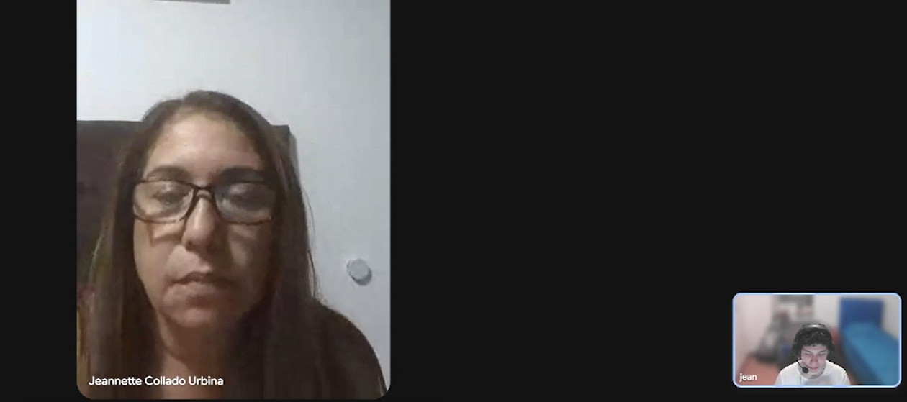 |

**Resumen de la entrevista:**
La entrevistada es dueña de una repostería a pedido. Es pragmática y cautelosa, enfocada en minimizar riesgos. Usa su smartphone para interactuar con clientes en redes sociales y su laptop para tareas administrativas. Confía en marcas de electrodomésticos que ofrecen garantías (Oster, Imaco, Indurama).

Su objetivo principal es crecer, adquirir más equipos y vehículos propios. Su mayor frustración es el maltrato de sus productos durante el transporte, pues la presentación es crítica. Por ello, actualmente contrata a un chofer particular.

Para adoptar una nueva plataforma digital, exige conductores con antecedentes limpios, teléfono validado, vehículo a nombre del conductor y cajas herméticas para alimentos, priorizando la confianza y el cuidado extremo.

---

#### Entrevista 2: Segmento 1 (Dueño de negocio/Emprendedor)

| Campo | Detalle |
| :--- | :--- |
| **Nombres y Apellidos** | Ronald Cortez Joseli |
| **Edad** | 26 |
| **Distrito** | San Martin de Porres, Lima, Perú |
| **Enlace al video (Microsoft Stream)** | https://shorturl.at/1purl |
| **Timing de inicio y duración** | Inicio: 00:02 - Duración: 6:37 minutos |
| **Evidencia fotográfica** |  |

**Resumen de la entrevista:**

El entrevistado es dueño de su propio negocio de manufactura de diversos productos usando impresoras 3D. Es alguien analítico y atento al detalle, que valora mucho el orden y correcta organización de las cosas. Sus principales herramientas de trabajo, aparte de sus máquinas impresoras, son su smartphone y su laptop.

Nos comenta también que es usuario recurrente de inDrive y Shalom/Olva Courier para realizar el envío de sus productos, dependiendo del volumen y cantidad que sea necesaria; aunque también ha considerado la posibilidad de contratar servicios de terceros independientes mediante Facebook Marketplace. Su mayor frustración viene de sus malas experiencias con ambas soluciones, puesto que problemas como retrasos en la entrega o daños a la mercadería, afecta directamente a su logística y organización en general, lo que genera a veces insatisfacción con sus clientes. 

Para que él considere adoptar una solución como LoadMatch, Ronald nos hace saber que lo que más valoraría de dicha plataforma digital, sería la confiabilidad de que los conductores sean profesionales y confiables a la hora de manejar los envíos, además de la facilidad para poder contactarlos.

---

#### Entrevista 3: Segmento 1 (Dueño de negocio/Emprendedor)

| Campo | Detalle |
| :--- | :--- |
| **Nombres y Apellidos** | Diego Chuquillanqui Estrada |
| **Edad** | 26 |
| **Distrito** | San Martin de Porres, Lima, Perú |
| **Enlace al video (Microsoft Stream)** | https://upcedupe-my.sharepoint.com/:v:/g/personal/u202310342_upc_edu_pe/IQCdZoCTl1KTRoEP4Fh7fersAaq2Bhu8Wkqvswvk8HqreEI?e=jSlInn |
| **Timing de inicio y duración** | Inicio: 00:01 - Duración: 05:59 minutos |
| **Evidencia fotográfica** |  |

**Resumen de la entrevista:**
El entrevistado es propietario de una óptica y se considera una persona trabajadora, responsable y atenta a la organización de su negocio. Actualmente suele trabajar con proveedores y servicios de transporte que ya conoce, ya que no confía demasiado en terceros desconocidos. Aunque se encuentra relativamente satisfecho con ellos, considera que los tiempos de entrega podrían mejorar, pues los retrasos terminan afectando la atención y generando molestias en sus clientes.

Para que considere utilizar una solución como LoadMatch, la seguridad sería un factor clave. Valoraría poder revisar información del transportista, como antecedentes, récord de licencia, documentación vigente y otros indicadores que permitan comprobar que se trata de una persona confiable. También consideraría importante contar con una comunicación directa y mayor transparencia durante el traslado.

---

#### Entrevista 4: Segmento 2 (Transportista/Conductor)

| Campo | Detalle |
| :--- | :--- |
| **Nombres y Apellidos** | Carmen Rosa Rojas |
| **Edad** | 41 años |
| **Distrito** | Los Olivos, Lima, Perú |
| **Enlace al video (Microsoft Stream)** | https://upcedupe-my.sharepoint.com/:v:/g/personal/u202323551_upc_edu_pe/IQDws6MfBH1bRqYTab-dHVruAU666AyoUz-YM2iI_pKQfb0?nav=eyJyZWZlcnJhbEluZm8iOnsicmVmZXJyYWxBcHAiOiJTdHJlYW1XZWJBcHAiLCJyZWZlcnJhbFZpZXciOiJTaGFyZURpYWxvZy1MaW5rIiwicmVmZXJyYWxBcHBQbGF0Zm9ybSI6IldlYiIsInJlZmVycmFsTW9kZSI6InZpZXcifX0%3D&e=w2ExaE |
| **Timing de inicio y duración** | Inicio: 00:00 - Duración: 6:22 minutos |
| **Evidencia fotográfica** |  |

**Resumen de la entrevista:**

La entrevistada es transportista y administradora de su propio camión de carga, con 12 años de experiencia en el rubro tras iniciarse ayudando a su padre. Se describe como una persona práctica, trabajadora y bastante desconfiada, una actitud preventiva que ha adoptado debido a la inseguridad en las calles. Utiliza su smartphone como herramienta principal para el día a día (GPS, WhatsApp para ubicaciones y coordinación de cargas) y reserva la computadora exclusivamente en casa para trámites formales como facturación electrónica y gestión en la SUNAT.

Su objetivo principal a corto plazo es liquidar el crédito de su vehículo actual, con la meta de adquirir a futuro una segunda unidad para contratar a un chofer de confianza y dedicarse de lleno a la gestión comercial. Sus mayores frustraciones son los pagos injustos que no contemplan los costos operativos (desgaste, peajes), la competencia desleal de la alta informalidad en el sector, y sobre todo, la inseguridad ciudadana (sufrió un asalto y robo de carga hace tres años). También padece la incertidumbre de los pagos atrasados o estafas al contactar clientes por grupos de Facebook o WhatsApp.

Para adoptar una nueva plataforma o red, está totalmente dispuesta a pasar por un proceso estricto de validación documental (antecedentes policiales, SOAT, revisión técnica). Considera que entregar esta documentación vale la pena si el sistema le garantiza operar en un entorno seguro, filtrando y conectándola únicamente con empresas formales que cumplan con los pagos de manera completa y puntual.

---

#### Entrevista 5: Segmento 2 (Transportista/Conductor)

| Campo | Detalle |
| :--- | :--- |
| **Nombres y Apellidos** | Tito Sifuentes |
| **Edad** | 30 años |
| **Distrito** | Pueblo Libre |
| **Enlace al video (Microsoft Stream)** | https://upcedupe-my.sharepoint.com/personal/u202310342_upc_edu_pe/_layouts/15/stream.aspx?id=%2Fpersonal%2Fu202310342%5Fupc%5Fedu%5Fpe%2FDocuments%2FDesarrollo%20de%20Open%20Source%20%2D%202026%2D2%2FTransportistas%20y%20due%C3%B1os%20de%20veh%C3%ADculos%20de%20carga%2FEntrevistaTransportistaTitoSifuentes%2Emp4&referrer=StreamWebApp%2EWeb&referrerScenario=AddressBarCopied%2Eview%2E226abae8%2D7b5b%2D40ba%2Db438%2Dc6b82a93b0ee |
| **Timing de inicio y duración** | Inicio: 1:00 Duración: 5:20 |
| **Evidencia fotográfica** | 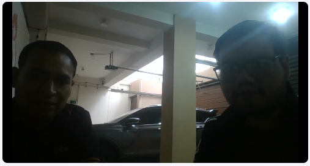 |

**Resumen de la entrevista:**

El entrevistado opera como transportista de mercadería en una empresa de lubricantes de motor con sede en Pueblo Libre, por la naturaleza de su trabajo tiene que realizar viajes de forma constante hacia los diferentes clientes del negocio y principalmente emplea aplicaciones como WhatsApp y los servicios de inDrive y Uber para contactar con sus clientes y jefes, y por el momento confía en empresas como Entel para su smartphone marca Samsung.

En sus 7 años de carrera como chofer este se mantiene en constante estado de aprendizaje, con la meta básica de seguir creciendo como persona y profesional en un negocio donde se expone a constantes riesgos producto de la situación política del país, y como muchos le preocupa el tema de la informalidad del transporte que se vive actualmente.

El señor Sifuentes expresó su interés en una aplicación como la nuestra, siempre que se atraviese por un diálogo entendible para definir su rol en nuestro servicio. 

---

#### Entrevista 6: Segmento 2 (Transportista/Conductor)

| Campo | Detalle |
| :--- | :--- |
| **Nombres y Apellidos** | Carlos Mendoza |
| **Edad** | 37 años |
| **Distrito** | Ate Vitarte, Lima, Perú |
| **Enlace al video (Microsoft Stream)** | https://upcedupe-my.sharepoint.com/:v:/g/personal/u202323551_upc_edu_pe/IQBOLkTZ-v24R5LzorknIiK-Ab79EzX5Oq-S2gDvYycx5KQ?nav=eyJyZWZlcnJhbEluZm8iOnsicmVmZXJyYWxBcHAiOiJTdHJlYW1XZWJBcHAiLCJyZWZlcnJhbFZpZXciOiJTaGFyZURpYWxvZy1MaW5rIiwicmVmZXJyYWxBcHBQbGF0Zm9ybSI6IldlYiIsInJlZmVycmFsTW9kZSI6InZpZXcifX0%3D&e=4Wq3cj |
| **Timing de inicio y duración** | Inicio: 00:00 - Duración: 5:15 minutos |
| **Evidencia fotográfica** |  |

**Resumen de la entrevista:**

El entrevistado es un transportista independiente y dueño de su propio camión de carga, con 10 años de experiencia en el rubro tras iniciar como estibador y copiloto. Se describe como un perfil práctico, directo y muy desconfiado, una actitud que considera vital para sobrevivir a la inseguridad y a los malos clientes. Utiliza su smartphone como herramienta principal y exclusiva durante el día a día (Waze, WhatsApp, ubicación en tiempo real), apoyándose ocasionalmente en su esposa y una laptop en casa para temas puntuales de facturación y SUNAT.

Su objetivo principal a corto plazo es cancelar el préstamo de su vehículo actual, con miras a adquirir un furgón más grande o una segunda unidad para dedicarse de lleno a la gestión comercial y administración de contratos. Su mayor frustración es la competencia desleal de transportistas informales que tiran los precios al piso, los clientes que retrasan pagos a 30 o 60 días, y la constante amenaza de la delincuencia al transitar o cargar en zonas peligrosas.

Para adoptar una nueva plataforma digital, está completamente dispuesto a someterse a un proceso estricto de validación documental (antecedentes policiales, SOAT, revisión técnica, brevete). Considera que entregar esta documentación es un requisito necesario y justo si el sistema le garantiza un distintivo de confianza y, sobre todo, lo conecta únicamente con empresas serias que aseguren depósitos puntuales y operaciones seguras.

---

### 2.2.3. Análisis de entrevistas

#### Segmento 1: Dueños de negocios y emprendedores

**Entrevista 1 (Pilar Jeannette Collado Urbina):** La entrevistada evidencia una alta aversión al riesgo en lo que respecta a la presentación y cuidado de sus productos (repostería), al punto de depender actualmente de un chofer de confianza contratado por tiempo en lugar de usar aplicativos de transporte estándar. Su testimonio demuestra que la falta de garantías en el manejo de la carga es su mayor frustración y pérdida de valor. Para mitigar este riesgo, valora positivamente que la plataforma exija filtros rigurosos a los conductores (antecedentes penales, validación vehicular) e indumentaria adecuada (cajas herméticas).

**Entrevista 2 (Ronald Cortez Joseli):** El entrevistado dirige un negocio de manufactura con impresoras 3D y utiliza servicios de paquetería estándar y fletes por aplicativos, pero se encuentra muy insatisfecho debido a los daños a sus productos y los retrasos en las entregas, lo que afectan directamente su reputación ante sus clientes. Para él, es crucial la profesionalidad y cuidado de los conductores, y para adoptar una plataforma nueva, requeriría la máxima facilidad para contactarlos y total confiabilidad en el transporte.

**Entrevista 3 (Diego Chuquillanqui Estrada):** Diego, propietario de una óptica, confía solo en transportistas conocidos debido a malas experiencias y desconfianza. Sin embargo, sufre por la lentitud e ineficiencia que a veces esto conlleva. Él destaca que la transparencia, el seguimiento y la verificación formal del transportista (antecedentes, licencia y documentación) serían factores determinantes para empezar a confiar en una plataforma de intermediación logística.

**Características más comunes del Segmento 1 (n=3):**

| Característica | % de entrevistados | Entrevistas | Evidencia |
| :--- | :--- | :--- | :--- |
| Preocupación por el cuidado y la integridad de la mercadería | 100% | #1, #2, #3 | Los tres entrevistados reportan que el maltrato a su carga es su principal dolor. |
| Desconfianza general hacia servicios informales o desconocidos | 100% | #1, #2, #3 | Pilar y Diego usan proveedores conocidos; Ronald evita a independientes del marketplace. |
| Exigencia de validaciones rigurosas y antecedentes del conductor | 100% | #1, #2, #3 | Todos señalan la validación documental y antecedentes como factor clave de adopción. |
| Perjudicados por retrasos en entregas afectando al cliente final | 66% | #2, #3 | Ronald y Diego coinciden en que la impuntualidad merma la relación con sus propios clientes. |
| Necesidad de comunicación directa y transparencia/seguimiento | 66% | #2, #3 | Ronald y Diego solicitan facilidad de contacto y trazabilidad durante el traslado. |

**Conclusión del Segmento 1:**
El análisis confirma que para los emprendedores formales y dueños de pequeños negocios, la seguridad, formalidad y el cuidado de sus productos priman por sobre la simple rapidez o el bajo costo. La totalidad de los encuestados está dispuesto a utilizar herramientas digitales, siempre y cuando estas garanticen un filtro estricto de transportistas (validación de documentos, antecedentes y propiedad). Esto valida fuertemente la hipótesis de negocio de LoadMatch: el mercado empresarial necesita intermediación logística basada en la confianza y la transparencia para dejar de depender únicamente de "choferes conocidos".

#### Segmento 2: Transportistas y conductores

**Entrevista 4 (Mateo Ignacio Vargas Huamán):** Como joven administrador de flota familiar, Mateo utiliza intensamente su smartphone para organizar su operación. Su mayor problema es la informalidad que abarata los costos, la inseguridad frente a "clientes fantasma" y los retrasos en los pagos de las empresas (60-90 días). Ve en el registro y validación rigurosa una gran oportunidad: un distintivo de "verificado" le serviría como carta de presentación comercial para conseguir empresas medianas confiables.

**Entrevista 5 (Tito Sifuentes):** Conductor de reparto para una empresa de lubricantes, Tito es un trabajador formal que se expone a los riesgos del transporte diario y la informalidad. Maneja aplicativos básicos para conectarse y valora una plataforma estructurada y formal que dignifique el trabajo y le brinde mayor seguridad operativa. 

**Entrevista 6 (Luciano Mateo Espinoza Vargas):** Luciano gestiona una pequeña flota de 3 camiones y resiente los largos plazos de pago y los tiempos muertos de espera en almacenes. Para él, las apps actuales no valoran su formalidad. Está completamente dispuesto a entregar documentación completa si, a cambio, obtiene un sello de garantía que le dé acceso prioritario a empresas formales y seguras que paguen a tiempo.

**Características más comunes del Segmento 2 (n=3):**

| Característica | % de entrevistados | Entrevistas | Evidencia |
| :--- | :--- | :--- | :--- |
| Preocupación y rechazo frente a la informalidad del sector logístico | 100% | #4, #5, #6 | Todos perciben la informalidad como competencia desleal o riesgo de seguridad. |
| Uso intensivo de smartphone y aplicaciones móviles para el trabajo | 100% | #4, #5, #6 | Mateo, Tito y Luciano se apoyan en sus móviles como centro de operaciones diarias. |
| Buscan clientes corporativos seguros para flujo constante | 66% | #4, #6 | Mateo y Luciano explícitamente buscan empresas formales/medianas. |
| Disposición total a validaciones documentales estrictas | 66% | #4, #6 | Mateo y Luciano ven la validación como ventaja competitiva, no como traba. |
| Frustración por pagos aplazados y horas muertas no remuneradas | 66% | #4, #6 | Mateo y Luciano critican las condiciones financieras que asfixian su capital. |

**Conclusión del Segmento 2:**
El análisis revela que los transportistas formales (quienes tienen sus documentos en regla y operan unidades formales) se ven muy perjudicados por la informalidad y las malas condiciones de las empresas que pagan a plazos muy largos. Contradiciendo la creencia de que un registro largo aleja a los usuarios, este segmento (66%) ve las validaciones documentales rigurosas como un "Sello de Verificación" deseable, ya que les permite diferenciarse y acceder a empresas formales que valoren la seguridad. LoadMatch, por tanto, ofrece un ecosistema mutuo: brinda a los transportistas los clientes formales que buscan, a cambio de que pasen los filtros que exigen dichos clientes empresariales.

---

## 2.3. Needfinding

### 2.3.1. User Personas

En esta sección se presentan las fichas de User Persona, construidas a partir de los patrones de comportamiento y necesidades identificados en el análisis de las entrevistas de nuestros segmentos. Estos arquetipos sintetizan la información demográfica, las motivaciones, las frustraciones y las dinámicas operativas de nuestros dos segmentos objetivo. La definición de estos perfiles garantiza que el diseño de las funcionalidades de **LoadMatch** responda directamente a las urgencias reales de quienes administran envíos de carga y de quienes proveen el servicio de transporte.

**User Persona 1: Carlos Mendoza - Dueño de negocio / Emprendedor**

  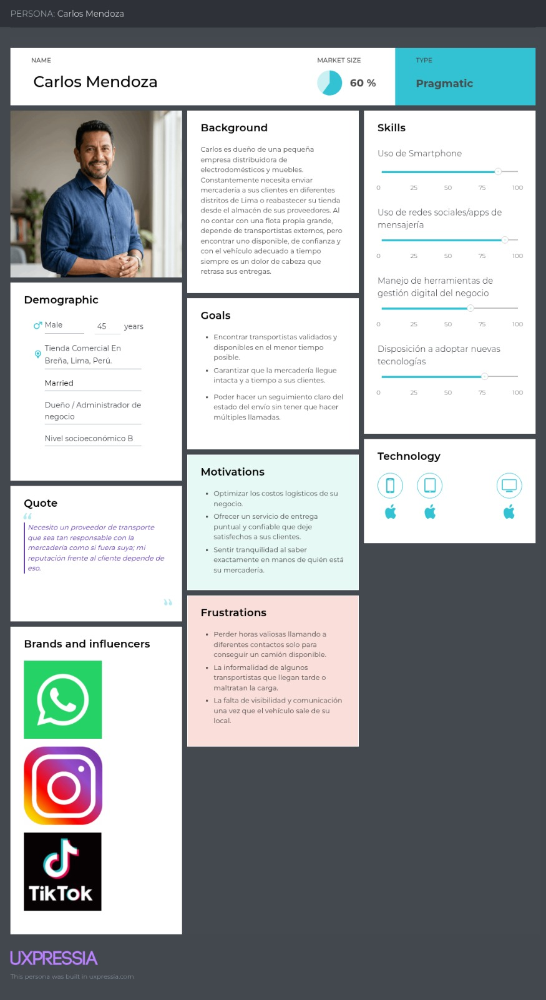

***Nota.*** Ficha que representa el arquetipo del Segmento 1. Detalla sus objetivos orientados a proteger la integridad de sus productos y su frustración ante la informalidad y descuido de las soluciones de transporte tradicionales.

**User Persona 2: Roberto Sánchez - Transportista / Dueño de vehículo de carga**

  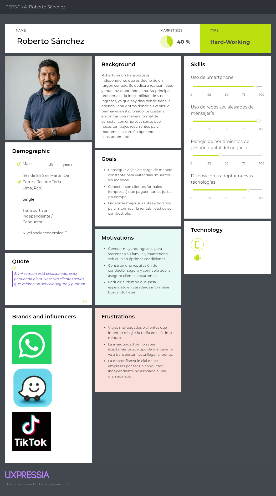

***Nota.*** Ficha que representa el arquetipo del Segmento 2. Expone su necesidad de conseguir viajes seguros y confiables, y su frustración por la informalidad, la inseguridad y los bajos márgenes en aplicaciones que no lo valoran.
*(Pendiente - Ficha UXPressia)*

### 2.3.2. User Task Matrix

En esta sección se presenta el User Task Matrix, una herramienta que concentra y evalúa las tareas cotidianas que realizan nuestros dos segmentos objetivo (Dueños de negocio y Transportistas) para cumplir sus objetivos comerciales y operativos. Es fundamental destacar que estas tareas representan acciones del mundo real, independientes de cualquier solución de software, orientadas a la gestión de envíos, la verificación de seguridad y la búsqueda de servicios.

A continuación, se detalla la matriz unificada, evaluando la frecuencia (Alta, Media, Baja) y la importancia (Alta, Media, Baja) de cada tarea para ambos arquetipos.

| Tareas del Usuario (Independientes del software) | Dueño de Negocio (Carlos) - Frecuencia | Dueño de Negocio (Carlos) - Importancia | Transportista (Roberto) - Frecuencia | Transportista (Roberto) - Importancia |
| :--- | :---: | :---: | :---: | :---: |
| Buscar conductores/clientes seguros y confiables | High | High | High | High |
| Verificar la integridad y cuidado de la mercadería | High | High | High | High |
| Solicitar documentos o garantías antes del viaje | Medium | High | Medium | Medium |
| Coordinar puntos de recojo y entrega | High | High | High | High |
| Monitorear el estado o ubicación del transporte | High | High | Medium | Low |
| Gestionar los pagos y cobros de los servicios | High | High | High | High |

**Análisis de la Matriz de Tareas:**
La matriz revela que tanto los dueños de negocio (Shipper) como los transportistas (Carrier) coinciden en que la búsqueda de contrapartes seguras, la coordinación de recojo/entrega, y la gestión de pagos son tareas de altísima frecuencia e importancia para ambos. Esto indica que la funcionalidad principal de la plataforma debe centrarse en facilitar un "match" rápido y confiable, integrando un sistema de pagos seguro. 
Por otro lado, se observan asimetrías clave: el monitoreo del estado del transporte es vital (High/High) para el Shipper, ya que necesita visibilidad sobre su mercadería de valor, pero es de baja prioridad para el Carrier (Medium/Low), cuyo enfoque operativo está en conducir. Asimismo, la solicitud de garantías documentales es más crítica para el Shipper, reflejando su aversión al riesgo. Estas diferencias nos indican que el sistema debe automatizar el tracking GPS y la validación de documentos en segundo plano, satisfaciendo las exigencias de seguridad del Shipper sin agregarle carga operativa manual al Transportista.

### 2.3.3. User Journey Mapping

A partir de los hallazgos obtenidos durante las entrevistas y de los User Personas definidos previamente, se elaboraron los User Journey Maps correspondientes a los dos segmentos objetivo de **LoadMatch**. Estos artefactos permiten representar las principales etapas que atraviesan los usuarios en su contexto actual, considerando sus objetivos, los canales que utilizan, las acciones que realizan, los problemas que enfrentan y las oportunidades de mejora identificadas.

#### Segmento 1: Dueños de negocio y emprendedores

El primer Journey Map representa el recorrido de **Carlos Mendoza**, arquetipo del dueño de negocio que necesita trasladar mercadería de forma segura y confiable.

Su recorrido comienza cuando surge una necesidad de transporte y continúa con la búsqueda de opciones, la evaluación de transportistas, la coordinación del servicio, el seguimiento de la carga y finalmente la confirmación de la entrega. A lo largo de este proceso se identifican problemas relacionados con la informalidad del mercado, la falta de información sobre los transportistas, la dificultad para comparar alternativas y la limitada visibilidad sobre el estado del envío.

Estas dificultades generan oportunidades para **LoadMatch**, como la incorporación de perfiles de transportistas verificados, comparación transparente de ofertas, coordinación centralizada, seguimiento en tiempo real e historial de servicios y calificaciones.

  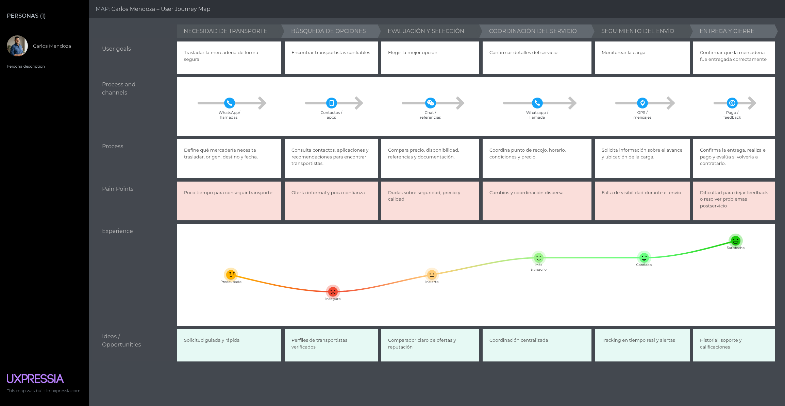

***Nota.*** User Journey Map correspondiente al Segmento 1: Dueños de negocio y emprendedores.

#### Segmento 2: Transportistas y dueños de vehículos de carga

El segundo Journey Map representa el recorrido de **Roberto Sánchez**, arquetipo del transportista independiente que busca oportunidades de trabajo constantes y clientes confiables.

Su recorrido comprende la búsqueda de oportunidades de carga, la evaluación del flete, la negociación de la tarifa y las condiciones del servicio, la coordinación del recojo, la ejecución del transporte y finalmente el cobro y cierre del servicio. Entre los principales problemas identificados se encuentran la informalidad del sector, la información incompleta sobre las cargas, las tarifas poco competitivas, los tiempos de espera, los riesgos durante el transporte y la incertidumbre respecto al pago.

A partir de estos hallazgos se identifican oportunidades para **LoadMatch**, como un marketplace de fletes disponibles, solicitudes y clientes verificados, condiciones de servicio transparentes, coordinación centralizada, información detallada de las cargas y mecanismos que permitan construir una reputación verificable dentro de la plataforma.

  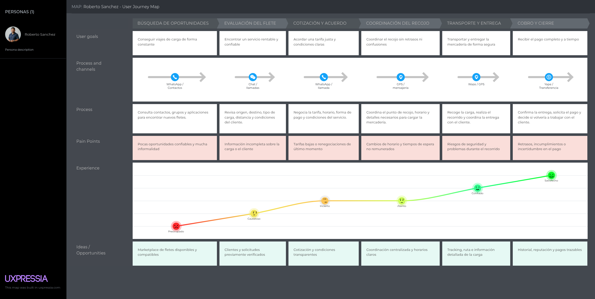

***Nota.*** User Journey Map correspondiente al Segmento 2: Transportistas y dueños de vehículos de carga.

### 2.3.4. Empathy Mapping

A partir de la información obtenida durante las entrevistas y de los User Personas definidos previamente, se elaboraron los Empathy Maps correspondientes a los dos segmentos objetivo de **LoadMatch**. Estos artefactos permiten profundizar en la perspectiva de cada usuario, identificando lo que piensa y siente, lo que observa, lo que escucha, lo que expresa y realiza, así como sus principales frustraciones y expectativas.

#### Segmento 1: Dueños de negocio y emprendedores

El primer Empathy Map corresponde a **Carlos Mendoza**, representante del segmento de dueños de negocio y emprendedores.

Carlos busca contar con un servicio de transporte confiable que le permita proteger su mercadería y mantener una buena relación con sus clientes. Entre sus principales preocupaciones se encuentran la informalidad del sector, la falta de garantías y la dificultad para encontrar transportistas profesionales de manera rápida.

Asimismo, valora especialmente la posibilidad de realizar seguimiento a sus envíos, acceder a transportistas verificados y reducir el riesgo de pérdidas ocasionadas por retrasos, daños o servicios poco confiables.

  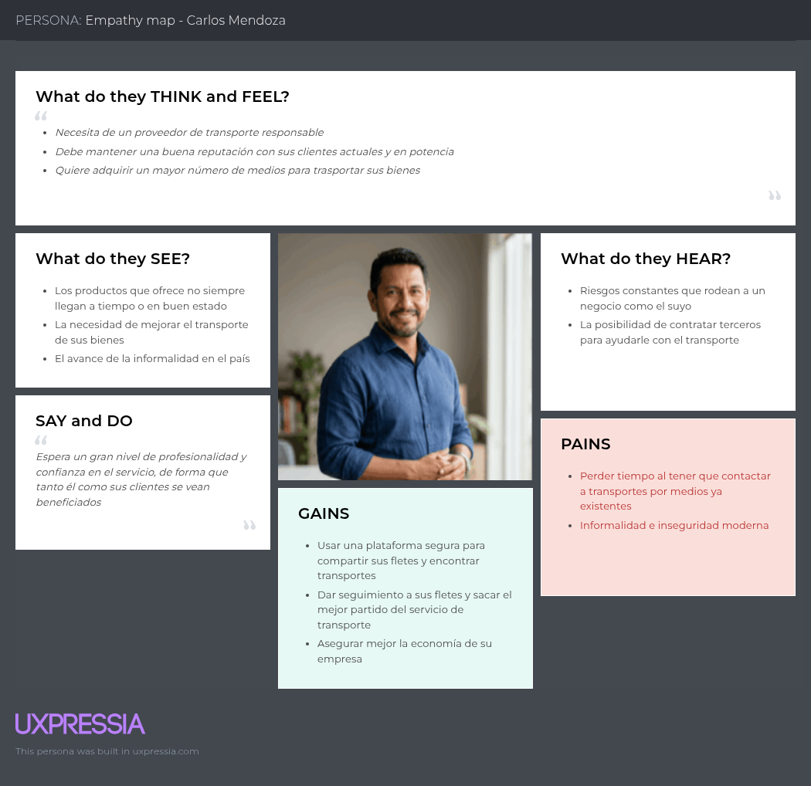

***Nota.*** Empathy Map correspondiente al Segmento 1: Dueños de negocio y emprendedores.

#### Segmento 2: Transportistas y dueños de vehículos de carga

El segundo Empathy Map corresponde a **Roberto Sánchez**, representante del segmento de transportistas y dueños de vehículos de carga.

Roberto busca obtener ingresos constantes mediante servicios de transporte rentables y clientes confiables. Su principal preocupación se relaciona con la informalidad del mercado, la dificultad para encontrar oportunidades de trabajo estables, la desconfianza entre transportistas y empresas y el riesgo de recibir pagos tardíos o insuficientes.

Entre sus principales expectativas se encuentran acceder a una red de clientes empresariales confiables, organizar mejor sus horarios, reducir el tiempo invertido buscando fletes y construir una reputación verificable que le permita obtener más oportunidades de trabajo.

  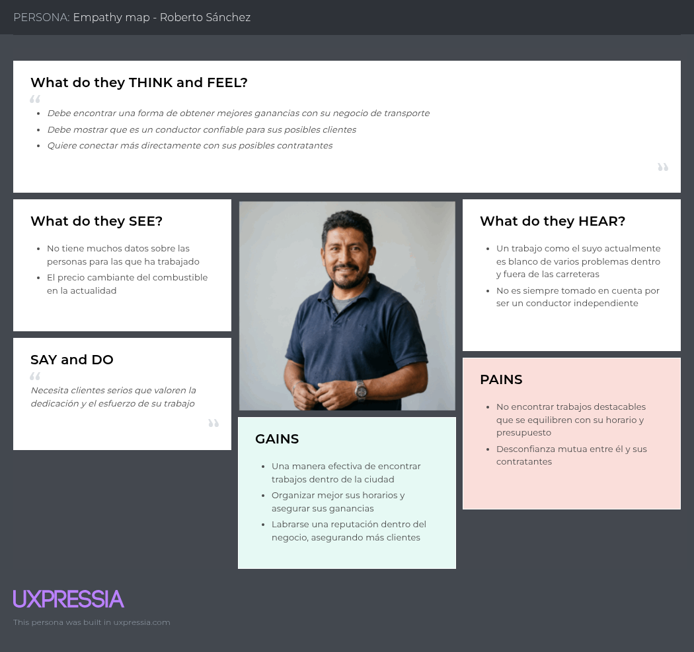

***Nota.*** Empathy Map correspondiente al Segmento 2: Transportistas y dueños de vehículos de carga.

## 2.4. Big Picture Event Storming

En esta sección se documenta el proceso colaborativo de **Big Picture Event Storming**, realizado con el objetivo de entender el dominio general del negocio de LoadMatch. Durante esta sesión, nos enfocamos en explorar de manera visual y de alto nivel el panorama del negocio logístico.

**Figura 5:**
*Exploración inicial*

  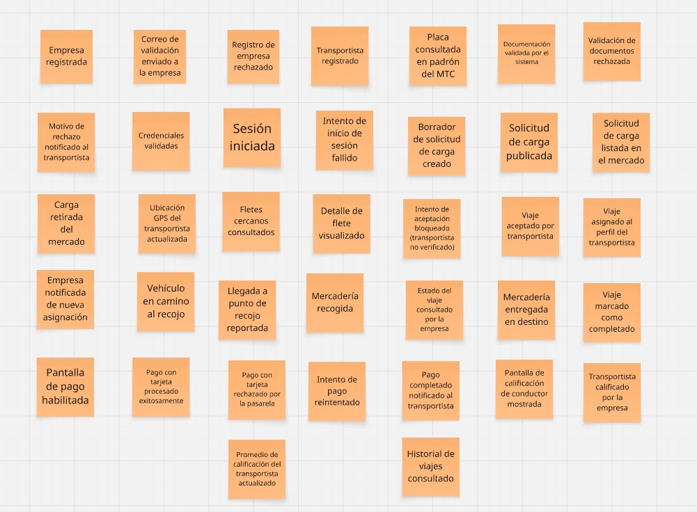

**Nota:** En esta fase exploratoria, logramos identificar un aproximado de 39 eventos de dominio clave que suceden en la interacción entre la empresa generadora de carga y el transportista.

A continuación, se presentan las capturas y explicaciones organizadas en los 4 pasos fundamentales que realizamos para construir nuestro Big Picture Event Storming:

### Paso 1: Generación de Eventos de Dominio (Domain Events)
En esta primera etapa, el equipo realizó una lluvia de ideas para identificar todos los eventos de dominio posibles (representados mediante post-its de color naranja). Estos eventos indican cambios de estado relevantes dentro del proceso logístico de LoadMatch.

**Figura 6:**
*Generación de Eventos de Dominio*

  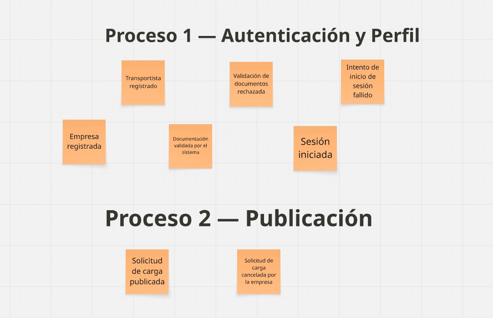

  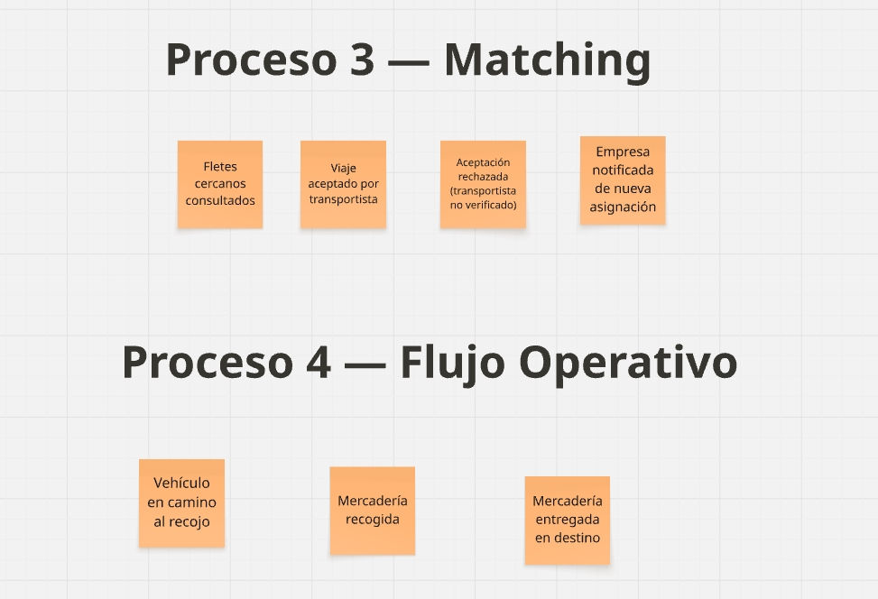

  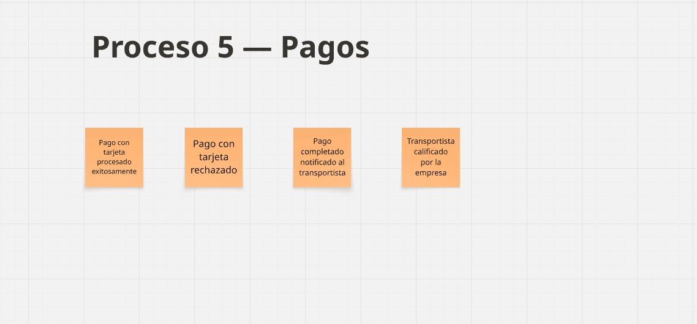

**Nota:** Eventos clave identificados en el dominio de negocio, sin un orden secuencial estricto.

### Paso 2: Ordenamiento Cronológico y Flujo de Trabajo
Una vez identificados los eventos, procedimos a ordenarlos lógicamente en una línea de tiempo horizontal. Esta cronología nos permitió visualizar el flujo de trabajo natural del sistema.

**Figura 7:**
*Ordenamiento Cronológico*

  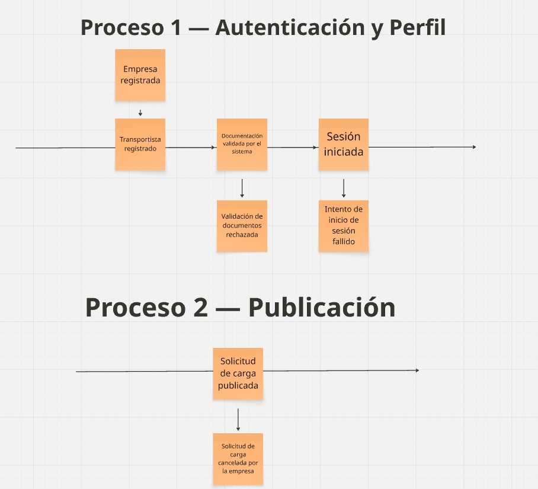

  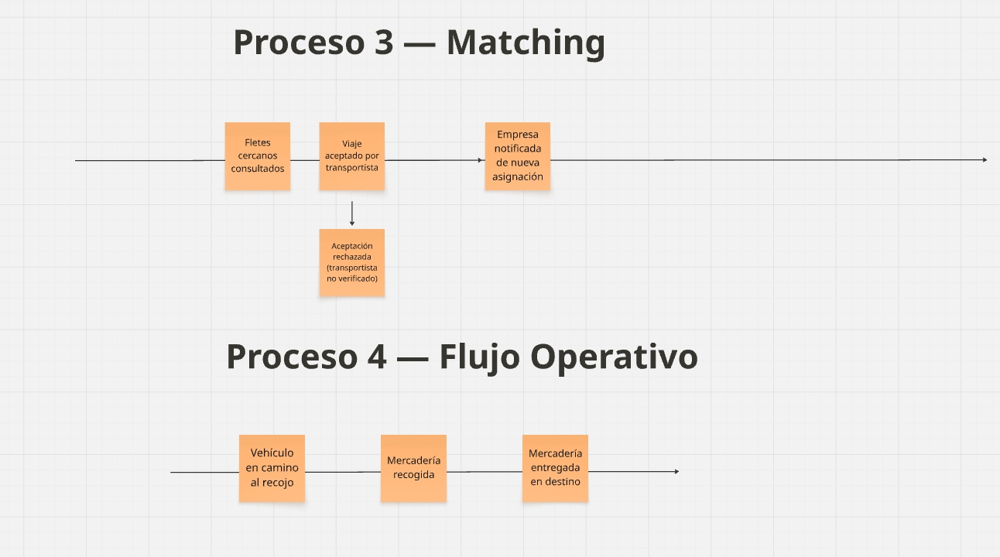

  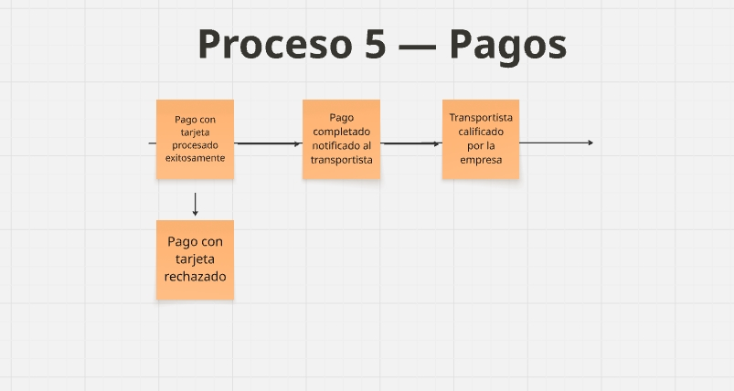

**Nota:** Eventos estructurados en el tiempo para definir el "Happy Path" o ruta esperada del servicio.

### Paso 3: Identificación de Actores y Sistemas Externos
En esta fase, enriquecimos el mapa base identificando quién o qué gatilla estos eventos, añadiendo a los usuarios involucrados (Shipper, Carrier, Administrador) y los sistemas externos necesarios.

**Figura 8:**
*Identificación de Actores y Sistemas Externos*

  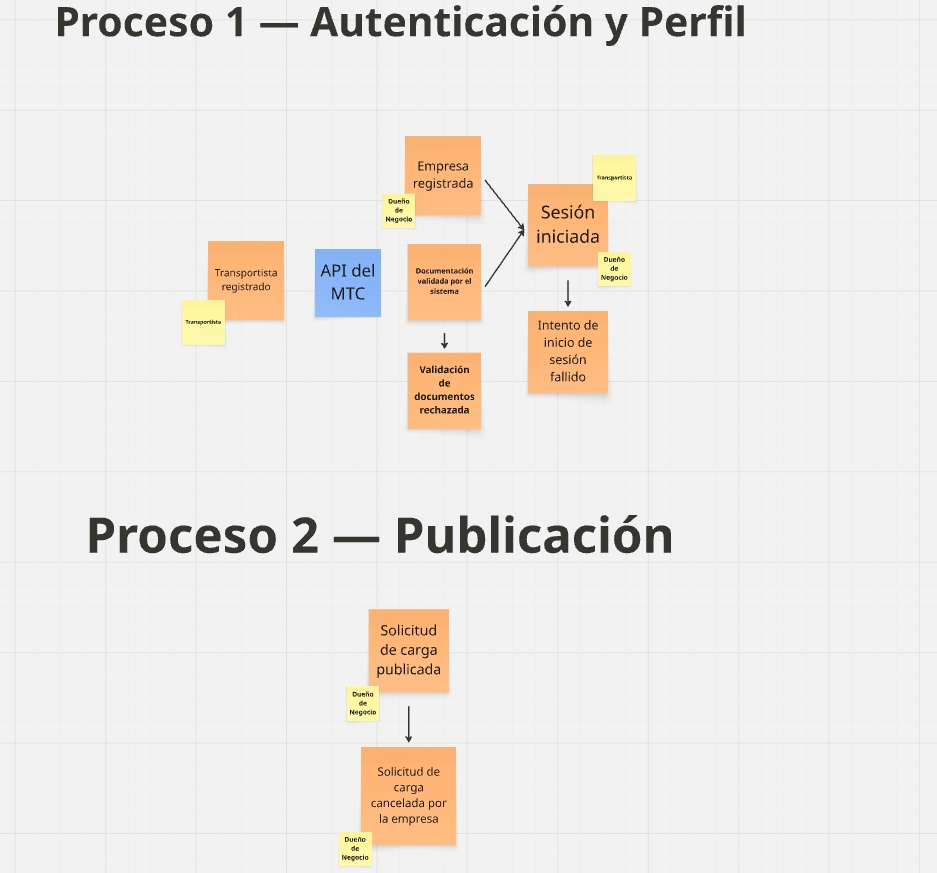

  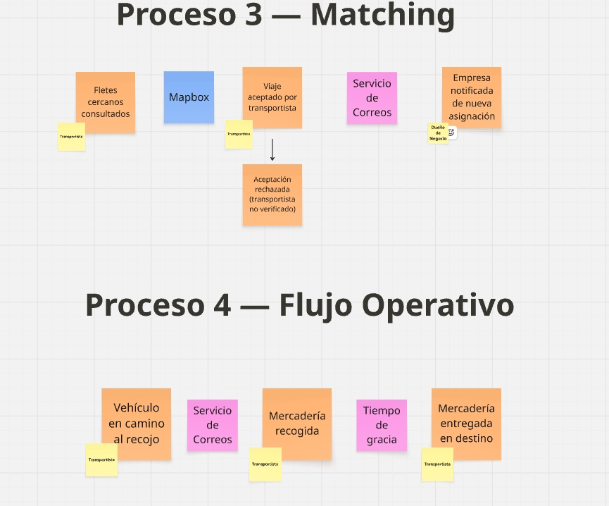

  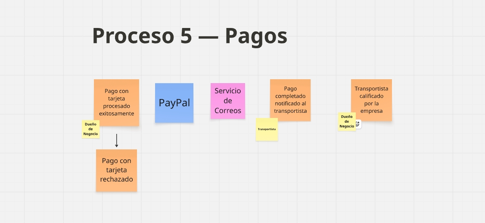

**Nota:** Agregado de componentes amarillos (actores) y rosados (sistemas externos) al flujo temporal.

### Paso 4: Big Picture (Vista Panorámica)
El resultado final es un mapa panorámico completo que sirve como pilar para entender el negocio de LoadMatch a gran escala, alineando los requisitos funcionales con los procesos operativos que se desarrollarán.

**Figura 9:**
*Vista Panorámica del Big Picture Event Storming*

  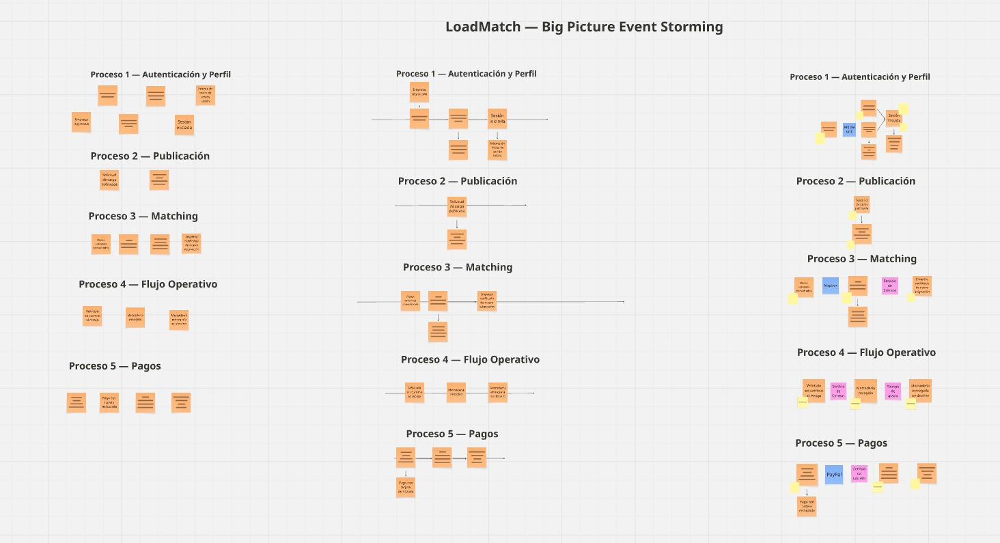

**Nota:** Resultado final de la sesión colaborativa, que muestra el end-to-end del modelo de negocio.

## 2.5. Ubiquitous Language

Para asegurar una comunicación clara y libre de ambigüedades entre todos los miembros del equipo, stakeholders y futuros desarrolladores, hemos definido el siguiente glosario de términos del **Ubiquitous Language** (Lenguaje Ubicuo). Este vocabulario está centrado puramente en el dominio del negocio logístico, evitando términos técnicos de ingeniería de software, y será la base para nombrar variables, clases y servicios en el código de LoadMatch.

| Término (Inglés) | Equivalente (Español) | Explicación / Definición en el Dominio |
| :--- | :--- | :--- |
| **Shipper** | Empresa generadora de carga | Persona jurídica o negocio registrado en la plataforma que tiene la necesidad de enviar mercadería de un punto a otro y publica solicitudes de flete. |
| **Carrier** | Transportista validado | Chofer o dueño de vehículo de carga que ha pasado satisfactoriamente los filtros de seguridad de LoadMatch y está habilitado para aceptar viajes. |
| **Load / Freight** | Carga / Mercadería | Los bienes físicos que el Shipper necesita transportar. Se clasifica por peso, volumen y requerimientos especiales (ej. refrigerado, frágil). |
| **Vehicle** | Vehículo de carga | La unidad de transporte registrada por el Carrier (camión, furgoneta, minivan) que cuenta con sus documentos vigentes (SOAT, Revisión Técnica). |
| **Dispatch / Trip** | Flete / Viaje | El proceso físico y contractual de mover la carga desde el punto de origen hasta el punto de destino acordados. |
| **Load Request** | Solicitud de Carga | El formulario o requerimiento publicado por el Shipper detallando origen, destino, tarifa base y especificaciones de la mercadería. |
| **Match** | Asignación | El momento crítico en el que un Shipper y un Carrier acuerdan formalmente realizar un viaje bajo ciertas condiciones de tarifa y tiempo. |
| **Offer / Bid** | Oferta / Propuesta | La tarifa propuesta por un Carrier en respuesta a una Load Request publicada por un Shipper, que puede ser aceptada o rechazada. |
| **Route** | Ruta | El trayecto geográfico planificado desde el almacén o punto de recojo hasta el lugar de entrega final. |
| **Tracking** | Trazabilidad / Rastreo | La capacidad de monitorear el estado y la ubicación del Dispatch en tiempo real, brindando visibilidad operativa al Shipper. |
| **Proof of Delivery (POD)** | Prueba de entrega | Evidencia documental (generalmente una foto de la guía de remisión firmada o de la carga en almacén) que confirma que el viaje ha finalizado con éxito. |
| **Rating** | Calificación | La evaluación en estrellas y comentarios que se otorgan mutuamente el Shipper y el Carrier al finalizar un Dispatch, fundamental para construir la reputación. |
| **Validation** | Validación Documental | El proceso de revisión de antecedentes, brevete, SOAT y tarjeta de propiedad que realiza LoadMatch para aprobar a un Carrier. |
