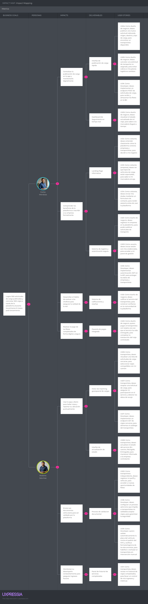
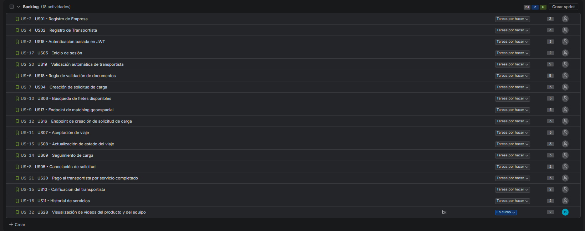

# Capítulo III: Requirements Specification

## 3.1. User Stories

En esta sección se definen los requisitos funcionales del proyecto LoadMatch utilizando Epics y User Stories. Los criterios de aceptación están redactados siguiendo la estructura Gherkin (Given-When-Then) en inglés, redactados en tiempo presente, tercera persona y sin referenciar elementos específicos de la interfaz gráfica.

Se han definido los siguientes Epics:
- **EP01:** Gestión de Identidad y Cuentas (Empresas y Transportistas).
- **EP02:** Gestión de Solicitudes de Transporte de Carga.
- **EP03:** Intermediación y Búsqueda de Viajes (Matching).
- **EP04:** Trazabilidad y Seguimiento de Operaciones.
- **EP05:** Calificación y Reputación.
- **EP06:** Gestión del Landing Page.
- **EP07:** Technical Features & RESTful API.
- **EP08:** Gestión de Pagos.

| Epic / Story ID | Título | Descripción | Criterios de Aceptación | Relacionado con (Epic ID) |
|---|---|---|---|---|
| **EP01** | **Gestión de Identidad y Cuentas** | Agrupa funcionalidades de registro y autenticación para ambos segmentos. | - | - |
| US01 | Registro de Empresa | Como dueño de negocio, deseo registrar mi empresa en la plataforma, para poder publicar solicitudes de transporte. | **Scenario 1: Registro exitoso** _Given_ que el visitante desea registrar su empresa _When_ provee el RUC, razón social y datos válidos _Then_ el sistema crea la cuenta de empresa _And_ envía un correo de validación.  **Scenario 2: RUC ya registrado** _Given_ que el visitante intenta registrarse _When_ provee un RUC que ya existe en el sistema _Then_ el sistema rechaza la solicitud _And_ muestra un error indicando duplicidad. | EP01 |
| US02 | Registro de Transportista | Como transportista independiente, deseo registrar mi perfil y vehículo, para acceder a nuevas oportunidades de fletes. | **Scenario 1: Registro exitoso** _Given_ que el visitante desea registrarse como transportista _When_ provee sus datos personales y la información requerida de su vehículo _Then_ el sistema crea la cuenta _And_ la mantiene pendiente de validación documental.  **Scenario 2: Datos de vehículo inválidos** _Given_ que el visitante intenta registrarse como transportista _When_ provee una placa o información del vehículo con formato inválido _Then_ el sistema rechaza el registro _And_ informa qué información debe corregirse. | EP01 |
| US03 | Inicio de sesión | Como usuario, deseo iniciar sesión con mis credenciales, para acceder a mi panel de gestión. | **Scenario 1: Login correcto** _Given_ que el usuario solicita autenticarse _When_ provee credenciales correctas _Then_ el sistema otorga acceso al panel.  **Scenario 2: Credenciales erróneas** _Given_ que el usuario solicita autenticarse _When_ provee una contraseña incorrecta _Then_ el sistema deniega el acceso y muestra error. | EP01 |
| **EP02** | **Gestión de Solicitudes de Transporte de Carga** | Publicación y administración de los requerimientos de carga por parte de la empresa. | - | - |
| US04 | Creación de solicitud de carga | Como dueño de negocio, deseo publicar una nueva solicitud indicando origen, destino y tipo de carga, para encontrar un transportista disponible. | **Scenario 1: Publicación exitosa** _Given_ que la empresa tiene sesión activa _When_ provee todos los datos requeridos del traslado y de la carga _Then_ el sistema registra la solicitud _And_ la publica como disponible para matching.  **Scenario 2: Información incompleta** _Given_ que la empresa intenta publicar una solicitud _When_ falta información obligatoria del traslado o de la carga _Then_ el sistema rechaza la publicación _And_ solicita completar los datos pendientes. | EP02 |
| US05 | Cancelación de solicitud | Como dueño de negocio, deseo cancelar una solicitud de transporte no asignada, para evitar cobros si mis planes logísticos cambian. | **Scenario 1: Cancelación antes de asignación** _Given_ que la empresa tiene una solicitud en estado pendiente _When_ solicita cancelar el viaje _Then_ el sistema retira la solicitud del mercado y la marca como cancelada. | EP02 |
| **EP03** | **Intermediación y Búsqueda de Viajes** | Funciones para que los transportistas encuentren viajes. | - | - |
| US06 | Búsqueda de fletes disponibles | Como transportista, deseo visualizar una lista de solicitudes de carga cercanas, para seleccionar viajes compatibles con mi camión. | **Scenario 1: Fletes disponibles** _Given_ que el transportista busca viajes disponibles _When_ existen solicitudes activas compatibles con su ubicación y unidad _Then_ el sistema muestra una lista de fletes ordenada según los criterios de búsqueda.  **Scenario 2: Sin resultados disponibles** _Given_ que el transportista realiza una búsqueda _When_ no existen solicitudes compatibles con los criterios seleccionados _Then_ el sistema informa que no se encontraron fletes disponibles. | EP03 |
| US07 | Aceptación de viaje | Como transportista, deseo aceptar una solicitud de carga, para asegurar mi participación en el servicio y obtener los datos de recojo. | **Scenario 1: Aceptación exitosa** _Given_ que el transportista posee un perfil habilitado y revisa una solicitud disponible _When_ confirma la aceptación del viaje _Then_ el sistema asigna el servicio a su perfil _And_ notifica a la empresa dueña de la carga.  **Scenario 2: Transportista no habilitado** _Given_ que un transportista con documentación pendiente intenta aceptar una solicitud _When_ confirma la aceptación _Then_ el sistema rechaza la operación _And_ le indica que debe completar la validación de su perfil. | EP03 |
| **EP04** | **Trazabilidad y Seguimiento de Operaciones** | Monitoreo del estado del viaje. | - | - |
| US08 | Actualización de estado del viaje | Como transportista, deseo actualizar el estado del servicio, para mantener informada a la empresa contratante. | **Scenario 1: Actualización válida de estado** _Given_ que el transportista tiene un viaje en curso _When_ registra un cambio válido en el estado del servicio _Then_ el sistema actualiza el viaje _And_ pone la nueva información a disposición de la empresa.  **Scenario 2: Finalización del viaje** _Given_ que el transportista ha llegado al destino _When_ confirma la entrega y registra la evidencia requerida _Then_ el sistema marca el servicio como completado _And_ habilita el proceso posterior de liquidación. | EP04 |
| US09 | Seguimiento de carga | Como dueño de negocio, deseo visualizar el estado actualizado de mi viaje, para saber si la mercadería llegará a tiempo. | **Scenario 1: Consulta de seguimiento** _Given_ que la empresa tiene un viaje en curso _When_ consulta el seguimiento de la operación _Then_ el sistema muestra el estado actual, la información de ruta y los datos disponibles del servicio.  **Scenario 2: Viaje no disponible para seguimiento** _Given_ que la empresa intenta consultar una operación que todavía no posee un viaje activo _When_ solicita su seguimiento _Then_ el sistema informa que el seguimiento aún no se encuentra disponible. | EP04 |
| **EP05** | **Calificación y Reputación** | Reviews al finalizar el servicio. | - | - |
| US10 | Calificación del transportista | Como dueño de negocio, deseo calificar el servicio del transportista, para construir confianza en la comunidad de la plataforma. | **Scenario 1: Envío de reseña** _Given_ que un viaje acaba de ser completado _When_ la empresa envía una calificación de 1 a 5 estrellas _Then_ el sistema actualiza el promedio del transportista. | EP05 |
| US11 | Historial de servicios | Como transportista, deseo revisar mi historial de viajes completados, para llevar un control de mis ingresos y métricas. | **Scenario 1: Visualización de historial** _Given_ que el transportista accede a sus métricas _When_ el sistema consulta los viajes pasados _Then_ muestra una lista cronológica de servicios completados. | EP05 |
| **EP06** | **Gestión del Landing Page** | Funciones para visitantes. | - | - |
| US12 | Visualización de propuesta de valor | Como visitante, deseo entender claramente cómo la plataforma conecta empresas y transportistas, para decidir si me registro. | **Scenario 1: Carga del Landing** _Given_ que el visitante accede al Landing Page _When_ la página carga completamente _Then_ el sistema muestra la propuesta de valor y los beneficios clave. | EP06 |
| US13 | Consulta de tipos de vehículos | Como visitante (empresa), deseo ver qué tipos de vehículos de carga están soportados, para saber si mi mercadería encaja. | **Scenario 1: Visualización de flota** _Given_ que el visitante navega a la sección de servicios _When_ interactúa con el catálogo _Then_ el sistema lista las capacidades de carga soportadas. | EP06 |
| US14 | Formulario de contacto | Como visitante, deseo enviar mis dudas mediante un formulario de contacto, para recibir asesoría antes de usar la plataforma. | **Scenario 1: Envío de duda comercial** _Given_ que el visitante completa el formulario _When_ envía datos válidos _Then_ el sistema almacena el mensaje y notifica al área de soporte. | EP06 |
| **EP07** | **Technical Features & RESTful API** | Agrupa las historias técnicas y de backend necesarias para que los desarrolladores integren las plataformas. | - | - |
| US15 | Autenticación basada en JWT | Como Developer, deseo implementar autenticación JWT en la API, para proteger los datos de empresas y transportistas. | **Scenario 1: Acceso con JWT válido** _Given_ que la API recibe una petición _When_ incluye un token válido _Then_ procesa la operación. | EP07 |
| US16 | Endpoint de creación de solicitud de carga | Como Developer, deseo implementar un endpoint POST para registrar solicitudes de carga, para recibir y almacenar los requerimientos de transporte publicados por las empresas. | **Scenario 1: Creación exitosa de solicitud** _Given_ que una empresa autenticada envía los datos requeridos para una solicitud de carga _When_ el payload es válido _Then_ el sistema registra la solicitud _And_ retorna HTTP 201 Created.  **Scenario 2: Payload inválido** _Given_ que una empresa autenticada intenta registrar una solicitud de carga _When_ el payload contiene información incompleta o inválida _Then_ el sistema rechaza la solicitud _And_ retorna HTTP 400 Bad Request. | EP07 |
| US17 | Endpoint de matching geoespacial | Como Developer, deseo implementar un endpoint GET de viajes cercanos, para alimentar el catálogo del transportista. | **Scenario 1: Retorno de lista** _Given_ que el cliente envía una ubicación _When_ la API procesa el radio de cercanía _Then_ retorna los viajes en formato JSON (HTTP 200). | EP07 |
| US18 | Regla de validación de documentos | Como Developer, deseo configurar un proceso asíncrono que impida a transportistas no validados aceptar viajes, para garantizar la seguridad. | **Scenario 1: Intento de aceptación sin validar** _Given_ que un conductor sin documentos aprobados intenta aceptar un viaje _When_ la API evalúa su estado _Then_ rechaza la operación (HTTP 403 Forbidden). | EP07 |
| US19 | Validación automática de transportista | Como Developer, quiero validar automáticamente la placa del vehículo contra el padrón del MTC y verificar formato/vigencia de los documentos, para habilitar o rechazar al transportista sin intervención manual. | **Scenario 1: Validación exitosa** _Given_ que un transportista registra su vehículo con placa existente en el padrón del MTC y documentos con formato y vigencia válidos _When_ el sistema verifica la información _Then_ aprueba automáticamente al transportista _And_ lo habilita para aceptar viajes.  **Scenario 2: Validación fallida** _Given_ que la placa no se encuentra en el padrón o un documento presenta una inconsistencia _When_ el sistema evalúa la información _Then_ rechaza el registro _And_ notifica al transportista el motivo para que pueda corregirlo y reintentar. | EP07 |
| **EP08** | **Gestión de Pagos** | Agrupa las funcionalidades relacionadas con el cobro y pago del servicio de transporte una vez completada la entrega. | - | - |
| US20 | Pago al transportista por servicio completado | Como dueño de negocio, quiero pagar al transportista con tarjeta una vez que el servicio ha sido entregado, para completar la transacción del viaje contratado. | **Scenario 1: Pago exitoso tras entrega** _Given_ que el viaje se encuentra en estado Entregado _When_ la empresa paga con tarjeta y la pasarela confirma la transacción _Then_ el sistema registra el pago como completado _And_ notifica al transportista.  **Scenario 2: Pago rechazado por la pasarela** _Given_ que la empresa ingresa los datos de una tarjeta _When_ la pasarela rechaza la transacción _Then_ el sistema marca el pago como fallido _And_ permite reintentar con otra tarjeta.  **Scenario 3: Calificación posterior al pago exitoso** _Given_ que el pago fue registrado como completado _When_ el sistema confirma la transacción _Then_ muestra a la empresa la pantalla para calificar al conductor (US10). | EP08 |

## 3.2. Impact Mapping

El Impact Mapping de LoadMatch fue elaborado colaborativamente mediante **UXPressia** con el propósito de relacionar los objetivos de negocio del producto con los actores involucrados, los cambios de comportamiento esperados y las funcionalidades necesarias para alcanzarlos.

La estructura del mapa sigue cuatro niveles principales:

- **Business Goals:** representan los resultados que LoadMatch busca alcanzar como solución digital.
- **Personas:** corresponden a los principales segmentos identificados previamente durante el proceso de Requirements Elicitation: empresas que requieren transportar mercadería y transportistas que buscan nuevas oportunidades de servicio.
- **Impacts:** describen los cambios de comportamiento que se espera generar en cada tipo de usuario para contribuir al cumplimiento de los objetivos del negocio.
- **Deliverables:** representan las funcionalidades y capacidades que debe proporcionar la solución para producir dichos impactos.

Los deliverables definidos en el Impact Mapping mantienen correspondencia con las User Stories presentadas en la sección 3.1. De esta forma, funcionalidades como el registro de usuarios, publicación de solicitudes de carga, búsqueda y aceptación de fletes, seguimiento de operaciones, validación documental, historial, reputación y pagos pueden rastrearse desde una necesidad del usuario hasta el objetivo de negocio al que contribuyen.

Para el segmento de **empresas**, el mapa se orienta principalmente a reducir la dificultad para localizar transportistas confiables, facilitar la publicación de requerimientos de transporte y mejorar la visibilidad sobre el estado de las operaciones.

Para el segmento de **transportistas**, el impacto esperado se relaciona con facilitar el acceso a nuevas oportunidades de carga, proporcionar información suficiente antes de aceptar un servicio y mejorar la organización y trazabilidad de sus viajes.

Esta relación entre objetivos, actores, impactos y funcionalidades permite evitar que el Product Backlog se convierta únicamente en una lista de características, manteniendo cada User Story vinculada con una necesidad concreta del negocio y de los usuarios.

A continuación se presenta la vista panorámica del Impact Mapping desarrollado para LoadMatch:

  
   
  <em>Figura 1. Vista panorámica del Impact Mapping de LoadMatch elaborado en UXPressia.</em>

## 3.3. Product Backlog

A continuación se presenta el Product Backlog del proyecto LoadMatch, priorizado estrictamente en función del valor entregado al negocio. Siguiendo las directrices del marco de trabajo ágil, las User Stories relacionadas al sitio web estático (Landing Page) y la funcionalidad core del producto se han considerado en la prioridad más alta, desplazando a posiciones posteriores las tareas de soporte técnico como el registro y la autenticación.

Para la estimación del esfuerzo se ha utilizado la secuencia de Fibonacci (1, 2, 3, 5, 8). La gestión del Product Backlog se lleva a cabo mediante la herramienta **Jira Software**.

  
   <em>Figura 2: Captura del Product Backlog priorizado por valor de negocio</em>

| # Orden | User Story Id | Título | Descripción | Story Points (1 / 2 / 3 / 5 / 8) |
|---|---|---|---|---|
| 1 | US12 | Visualización de propuesta de valor | Como visitante, deseo entender claramente cómo la plataforma conecta empresas y transportistas, para decidir si me registro. | 3 |
| 2 | US13 | Consulta de tipos de vehículos | Como visitante (empresa), deseo ver qué tipos de vehículos de carga están soportados, para saber si mi mercadería encaja. | 2 |
| 3 | US14 | Formulario de contacto | Como visitante, deseo enviar mis dudas mediante un formulario de contacto, para recibir asesoría antes de usar la plataforma. | 2 |
| 4 | US04 | Creación de solicitud de carga | Como dueño de negocio, deseo publicar una nueva solicitud indicando origen, destino y tipo de carga, para encontrar un transportista disponible. | 5 |
| 5 | US06 | Búsqueda de fletes disponibles | Como transportista, deseo visualizar una lista de solicitudes de carga cercanas, para seleccionar viajes compatibles con mi camión. | 5 |
| 6 | US07 | Aceptación de viaje | Como transportista, deseo aceptar una solicitud de carga, para asegurar mi participación en el servicio y obtener los datos de recojo. | 5 |
| 7 | US08 | Actualización de estado del viaje | Como transportista, deseo actualizar el estado del servicio (En camino, Recogido, Entregado), para mantener informada a la empresa contratante. | 3 |
| 8 | US09 | Seguimiento de carga | Como dueño de negocio, deseo visualizar el estado actualizado de mi viaje, para saber si la mercadería llegará a tiempo. | 3 |
| 9 | US16 | Endpoint de creación de viaje | Como Developer, deseo implementar un endpoint POST de solicitudes de carga, para recibir y almacenar los fletes en la BD. | 3 |
| 10 | US17 | Endpoint de matching geoespacial | Como Developer, deseo implementar un endpoint GET de viajes cercanos, para alimentar el catálogo del transportista. | 5 |
| 11 | US01 | Registro de Empresa | Como dueño de negocio, deseo registrar mi empresa en la plataforma, para poder publicar solicitudes de transporte. | 3 |
| 12 | US02 | Registro de Transportista | Como transportista independiente, deseo registrar mi perfil y vehículo, para acceder a nuevas oportunidades de fletes. | 3 |
| 13 | US03 | Inicio de sesión | Como usuario, deseo iniciar sesión con mis credenciales, para acceder a mi panel de gestión. | 2 |
| 14 | US15 | Autenticación basada en JWT | Como Developer, deseo implementar autenticación JWT en la API, para proteger los datos de empresas y transportistas. | 3 |
| 15 | US18 | Regla de validación de documentos | Como Developer, deseo configurar un proceso asíncrono que impida a transportistas no validados aceptar viajes, para garantizar la seguridad. | 5 |
| 16 | US10 | Calificación del transportista | Como dueño de negocio, deseo calificar el servicio del transportista, para construir confianza en la comunidad de la plataforma. | 2 |
| 17 | US11 | Historial de servicios | Como transportista, deseo revisar mi historial de viajes completados, para llevar un control de mis ingresos y métricas. | 2 |
| 18 | US05 | Cancelación de solicitud | Como dueño de negocio, deseo cancelar una solicitud de transporte no asignada, para evitar cobros si mis planes logísticos cambian. | 2 |
| 19 | US19 | Validación automática de transportista | Como Developer, quiero validar automáticamente la placa del vehículo contra el padrón del MTC y verificar formato/vigencia de los documentos, para habilitar o rechazar al transportista sin intervención manual. | 5 |
| 20 | US20 | Pago al transportista por servicio completado | Como dueño de negocio, quiero pagar al transportista con tarjeta una vez que el servicio ha sido entregado, para completar la transacción del viaje contratado. | 5 |

### Acceso al Product Backlog en Jira

El Product Backlog del proyecto se gestiona mediante Jira Software, donde se registran y organizan las User Stories definidas para LoadMatch, junto con su prioridad y estimación correspondiente.

El tablero puede consultarse mediante el siguiente enlace:

[Product Backlog de LoadMatch en Jira](https://upc-team-m57tll9j.atlassian.net/jira/software/projects/US/boards/2?sprintStarted=true&filter=&groupBy=none)

> **Nota:** El acceso al tablero requiere autenticación en Atlassian y los permisos correspondientes del proyecto.
