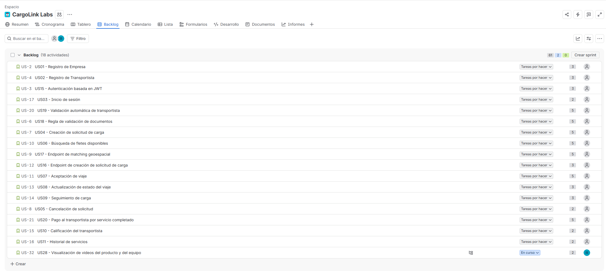

# Capítulo III: Requirements Specification

## 3.1. User Stories

En esta sección se definen los requisitos funcionales del proyecto LoadMatch utilizando Epics y User Stories. Los criterios de aceptación están redactados siguiendo la estructura Gherkin (Given-When-Then) en inglés, redactados en tiempo presente, tercera persona y sin referenciar elementos específicos de la interfaz gráfica.

Se han definido los siguientes Epics:
- **EP01:** Gestión de Identidad y Cuentas (Empresas y Transportistas).
- **EP02:** Gestión de Solicitudes de Transporte de Carga.
- **EP03:** Intermediación y Búsqueda de Viajes (Matching).
- **EP04:** Trazabilidad y Seguimiento de Operaciones.
- **EP05:** Calificación y Reputación.
- **EP06:** Gestión del Landing Page.
- **EP07:** Technical Features & RESTful API.
- **EP08:** Gestión de Pagos.

| Epic / Story ID | Título | Descripción | Criterios de Aceptación | Relacionado con (Epic ID) |
|---|---|---|---|---|
| **EP01** | **Gestión de Identidad y Cuentas** | Agrupa funcionalidades de registro y autenticación para ambos segmentos. | - | - |
| US01 | Registro de Empresa | Como dueño de negocio, deseo registrar mi empresa en la plataforma, para poder publicar solicitudes de transporte. | **Scenario 1: Registro exitoso** _Given_ que el visitante desea registrar su empresa _When_ provee el RUC, razón social y datos válidos _Then_ el sistema crea la cuenta de empresa _And_ envía un correo de validación.  **Scenario 2: RUC ya registrado** _Given_ que el visitante intenta registrarse _When_ provee un RUC que ya existe en el sistema _Then_ el sistema rechaza la solicitud _And_ muestra un error indicando duplicidad. | EP01 |
| US02 | Registro de Transportista | Como transportista independiente, deseo registrar mi perfil y vehículo, para acceder a nuevas oportunidades de fletes. | **Scenario 1: Registro exitoso** _Given_ que el visitante desea registrarse como transportista _When_ provee sus datos personales y la información requerida de su vehículo _Then_ el sistema crea la cuenta _And_ la mantiene pendiente de validación documental.  **Scenario 2: Datos de vehículo inválidos** _Given_ que el visitante intenta registrarse como transportista _When_ provee una placa o información del vehículo con formato inválido _Then_ el sistema rechaza el registro _And_ informa qué información debe corregirse. | EP01 |
| US03 | Inicio de sesión | Como usuario, deseo iniciar sesión con mis credenciales, para acceder a mi panel de gestión. | **Scenario 1: Login correcto** _Given_ que el usuario solicita autenticarse _When_ provee credenciales correctas _Then_ el sistema otorga acceso al panel.  **Scenario 2: Credenciales erróneas** _Given_ que el usuario solicita autenticarse _When_ provee una contraseña incorrecta _Then_ el sistema deniega el acceso y muestra error. | EP01 |
| **EP02** | **Gestión de Solicitudes de Transporte de Carga** | Publicación y administración de los requerimientos de carga por parte de la empresa. | - | - |
| US04 | Creación de solicitud de carga | Como dueño de negocio, deseo publicar una nueva solicitud indicando origen, destino y tipo de carga, para encontrar un transportista disponible. | **Scenario 1: Publicación exitosa** _Given_ que la empresa tiene sesión activa _When_ provee todos los datos requeridos del traslado y de la carga _Then_ el sistema registra la solicitud _And_ la publica como disponible para matching.  **Scenario 2: Información incompleta** _Given_ que la empresa intenta publicar una solicitud _When_ falta información obligatoria del traslado o de la carga _Then_ el sistema rechaza la publicación _And_ solicita completar los datos pendientes. | EP02 |
| US05 | Cancelación de solicitud | Como dueño de negocio, deseo cancelar una solicitud de transporte no asignada, para evitar cobros si mis planes logísticos cambian. | **Scenario 1: Cancelación antes de asignación** _Given_ que la empresa tiene una solicitud en estado pendiente _When_ solicita cancelar el viaje _Then_ el sistema retira la solicitud del mercado y la marca como cancelada. | EP02 |
| **EP03** | **Intermediación y Búsqueda de Viajes** | Funciones para que los transportistas encuentren viajes. | - | - |
| US06 | Búsqueda de fletes disponibles | Como transportista, deseo visualizar una lista de solicitudes de carga cercanas, para seleccionar viajes compatibles con mi camión. | **Scenario 1: Fletes disponibles** _Given_ que el transportista busca viajes disponibles _When_ existen solicitudes activas compatibles con su ubicación y unidad _Then_ el sistema muestra una lista de fletes ordenada según los criterios de búsqueda.  **Scenario 2: Sin resultados disponibles** _Given_ que el transportista realiza una búsqueda _When_ no existen solicitudes compatibles con los criterios seleccionados _Then_ el sistema informa que no se encontraron fletes disponibles. | EP03 |
| US07 | Aceptación de viaje | Como transportista, deseo aceptar una solicitud de carga, para asegurar mi participación en el servicio y obtener los datos de recojo. | **Scenario 1: Aceptación exitosa** _Given_ que el transportista posee un perfil habilitado y revisa una solicitud disponible _When_ confirma la aceptación del viaje _Then_ el sistema asigna el servicio a su perfil _And_ notifica a la empresa dueña de la carga.  **Scenario 2: Transportista no habilitado** _Given_ que un transportista con documentación pendiente intenta aceptar una solicitud _When_ confirma la aceptación _Then_ el sistema rechaza la operación _And_ le indica que debe completar la validación de su perfil. | EP03 |
| **EP04** | **Trazabilidad y Seguimiento de Operaciones** | Monitoreo del estado del viaje. | - | - |
| US08 | Actualización de estado del viaje | Como transportista, deseo actualizar el estado del servicio, para mantener informada a la empresa contratante. | **Scenario 1: Actualización válida de estado** _Given_ que el transportista tiene un viaje en curso _When_ registra un cambio válido en el estado del servicio _Then_ el sistema actualiza el viaje _And_ pone la nueva información a disposición de la empresa.  **Scenario 2: Finalización del viaje** _Given_ que el transportista ha llegado al destino _When_ confirma la entrega y registra la evidencia requerida _Then_ el sistema marca el servicio como completado _And_ habilita el proceso posterior de liquidación. | EP04 |
| US09 | Seguimiento de carga | Como dueño de negocio, deseo visualizar el estado actualizado de mi viaje, para saber si la mercadería llegará a tiempo. | **Scenario 1: Consulta de seguimiento** _Given_ que la empresa tiene un viaje en curso _When_ consulta el seguimiento de la operación _Then_ el sistema muestra el estado actual, la información de ruta y los datos disponibles del servicio.  **Scenario 2: Viaje no disponible para seguimiento** _Given_ que la empresa intenta consultar una operación que todavía no posee un viaje activo _When_ solicita su seguimiento _Then_ el sistema informa que el seguimiento aún no se encuentra disponible. | EP04 |
| **EP05** | **Calificación y Reputación** | Reviews al finalizar el servicio. | - | - |
| US10 | Calificación del transportista | Como dueño de negocio, deseo calificar el servicio del transportista, para construir confianza en la comunidad de la plataforma. | **Scenario 1: Envío de reseña** _Given_ que un viaje acaba de ser completado _When_ la empresa envía una calificación de 1 a 5 estrellas _Then_ el sistema actualiza el promedio del transportista. | EP05 |
| US11 | Historial de servicios | Como transportista, deseo revisar mi historial de viajes completados, para llevar un control de mis ingresos y métricas. | **Scenario 1: Visualización de historial** _Given_ que el transportista accede a sus métricas _When_ el sistema consulta los viajes pasados _Then_ muestra una lista cronológica de servicios completados. | EP05 |
| **EP06** | **Gestión del Landing Page** | Funciones para visitantes. | - | - |
| US12 | Visualización de propuesta de valor | Como visitante, deseo entender claramente cómo la plataforma conecta empresas y transportistas, para decidir si me registro. | **Scenario 1: Carga del Landing** _Given_ que el visitante accede al Landing Page _When_ la página carga completamente _Then_ el sistema muestra la propuesta de valor y los beneficios clave. | EP06 |
| US13 | Consulta de tipos de vehículos | Como visitante (empresa), deseo ver qué tipos de vehículos de carga están soportados, para saber si mi mercadería encaja. | **Scenario 1: Visualización de flota** _Given_ que el visitante navega a la sección de servicios _When_ interactúa con el catálogo _Then_ el sistema lista las capacidades de carga soportadas. | EP06 |
| US14 | Formulario de contacto | Como visitante, deseo enviar mis dudas mediante un formulario de contacto, para recibir asesoría antes de usar la plataforma. | **Scenario 1: Envío válido de consulta** _Given_ que el visitante accede al formulario de contacto _When_ completa los campos obligatorios con información válida y envía el formulario _Then_ el sistema valida los datos ingresados _And_ muestra un mensaje de confirmación indicando que la consulta fue enviada correctamente.  **Scenario 2: Datos inválidos o incompletos** _Given_ que el visitante intenta enviar una consulta _When_ existen campos obligatorios vacíos o el correo electrónico tiene un formato inválido _Then_ el sistema impide el envío del formulario _And_ muestra mensajes indicando los campos que deben corregirse. | EP06 |
| US21 | Cambio de idioma del Landing Page | Como visitante, deseo cambiar el idioma del Landing Page entre inglés y español, para entender la propuesta en el idioma que prefiero. | **Scenario 1: Cambio a español** _Given_ que el visitante está en el Landing Page en inglés _When_ selecciona la opción "ES" del selector de idioma _Then_ todos los textos de la página se muestran en español latinoamericano _And_ el botón "ES" queda marcado como activo.  **Scenario 2: Idioma recordado** _Given_ que el visitante eligió un idioma _When_ vuelve a abrir el Landing Page _Then_ la página se muestra en el último idioma elegido. | EP06 |
| US22 | Consulta de planes y precios | Como visitante (empresa o transportista), deseo conocer cómo cobra LoadMatch, para evaluar si el servicio me conviene antes de registrarme. | **Scenario 1: Visualización del modelo de cobro** _Given_ que el visitante navega a la sección de precios _When_ la sección se muestra _Then_ el sistema presenta el modelo de comisión por viaje, sus condiciones y el plan destacado.  **Scenario 2: Acceso desde el menú** _Given_ que el visitante está en cualquier parte de la página _When_ selecciona "Precios" en la navegación _Then_ la página se desplaza a la sección de precios. | EP06 |
| US23 | Consulta de preguntas frecuentes | Como visitante, deseo consultar las preguntas frecuentes, para resolver mis dudas sin tener que contactar al equipo. | **Scenario 1: Expandir una respuesta** _Given_ que el visitante está en la sección de preguntas frecuentes _When_ selecciona una pregunta _Then_ el sistema muestra su respuesta _And_ indica el estado expandido a las tecnologías de asistencia.  **Scenario 2: Uso con teclado** _Given_ que el visitante navega solo con teclado _When_ enfoca una pregunta y presiona Enter o Espacio _Then_ la respuesta se expande o se contrae. | EP06 |
| US24 | Navegación adaptable del Landing Page | Como visitante que usa computadora, tablet o celular, deseo navegar el Landing Page con comodidad en mi dispositivo, para encontrar rápidamente la información que busco. | **Scenario 1: Menú en pantallas pequeñas** _Given_ que el visitante abre la página en una pantalla menor a 1360 px _When_ presiona el botón de menú _Then_ el sistema muestra el panel de navegación _And_ lo cierra al presionar Escape o elegir una opción, devolviendo el foco al botón.  **Scenario 2: Contenido adaptado** _Given_ que el visitante abre la página en tablet o celular _When_ la página carga _Then_ las secciones se reorganizan en una columna sin desplazamiento horizontal. | EP06 |
| US25 | Acceso a la aplicación por segmento | Como visitante (empresa o transportista), deseo que los botones del Landing Page me lleven a la vista que me corresponde en la aplicación web, para registrarme o iniciar sesión sin buscar dónde hacerlo. | **Scenario 1: Redirección por segmento** _Given_ que la aplicación web está desplegada _When_ el visitante presiona "Necesito transportar carga", "Soy transportista" o "Iniciar sesión" _Then_ el sistema lo lleva al registro de empresa, al registro de transportista o al inicio de sesión, respectivamente.  **Scenario 2: Aplicación aún no disponible** _Given_ que la aplicación web todavía no está desplegada _When_ el visitante presiona uno de esos botones _Then_ el sistema lo lleva a la sección correspondiente del Landing Page, sin enlaces rotos. | EP06 |
| US26 | Visualización de testimonios de usuarios | Como visitante, deseo leer opiniones de otras empresas y transportistas, para confiar en la plataforma antes de registrarme. | **Scenario 1: Lista de testimonios** _Given_ que el visitante llega a la sección de testimonios _When_ la sección se muestra _Then_ el sistema presenta al menos tres testimonios con nombre, rol y empresa _And_ indica si el contenido es de ejemplo.  **Scenario 2: Carrusel en celular** _Given_ que el visitante usa un celular _When_ desliza los testimonios o presiona un indicador _Then_ el sistema muestra el testimonio correspondiente y actualiza el contador. | EP06 |
| US27 | Consulta de información legal y de contacto | Como visitante, deseo consultar los términos, la política de privacidad y los datos de contacto, para saber cómo se tratan mis datos y a quién acudir. | **Scenario 1: Pie de página** _Given_ que el visitante llega al final de la página _When_ se muestra el pie de página _Then_ el sistema presenta enlaces de producto, empresa, legal y datos de contacto.  **Scenario 2: Páginas legales** _Given_ que el visitante está en el pie de página _When_ selecciona "Términos y condiciones", "Política de privacidad", "Política de cookies" o "Accesibilidad" _Then_ el sistema abre la sección legal correspondiente. | EP06 |
| US28 | Visualización de videos del producto y del equipo | Como visitante, deseo ver un video del producto y otro del equipo, para entender rápidamente cómo funciona LoadMatch y quién lo desarrolla. | **Scenario 1: Reproducción de videos** _Given_ que el visitante llega a la sección de videos _When_ presiona reproducir en uno de los videos _Then_ el sistema reproduce el video About-the-Product o About-the-Team incrustado desde YouTube.  **Scenario 2: Adaptación a pantallas pequeñas** _Given_ que el visitante usa tablet o celular _When_ se muestra la sección _Then_ los videos se apilan en una columna y conservan su proporción 16:9. | EP06 |
| **EP07** | **Technical Features & RESTful API** | Agrupa las historias técnicas y de backend necesarias para que los desarrolladores integren las plataformas. | - | - |
| US15 | Autenticación basada en JWT | Como Developer, deseo implementar autenticación JWT en la API, para proteger los datos de empresas y transportistas. | **Scenario 1: Acceso con JWT válido** _Given_ que la API recibe una petición _When_ incluye un token válido _Then_ procesa la operación. | EP07 |
| US16 | Endpoint de creación de solicitud de carga | Como Developer, deseo implementar un endpoint POST para registrar solicitudes de carga, para recibir y almacenar los requerimientos de transporte publicados por las empresas. | **Scenario 1: Creación exitosa de solicitud** _Given_ que una empresa autenticada envía los datos requeridos para una solicitud de carga _When_ el payload es válido _Then_ el sistema registra la solicitud _And_ retorna HTTP 201 Created.  **Scenario 2: Payload inválido** _Given_ que una empresa autenticada intenta registrar una solicitud de carga _When_ el payload contiene información incompleta o inválida _Then_ el sistema rechaza la solicitud _And_ retorna HTTP 400 Bad Request. | EP07 |
| US17 | Endpoint de matching geoespacial | Como Developer, deseo implementar un endpoint GET de viajes cercanos, para alimentar el catálogo del transportista. | **Scenario 1: Retorno de lista** _Given_ que el cliente envía una ubicación _When_ la API procesa el radio de cercanía _Then_ retorna los viajes en formato JSON (HTTP 200). | EP07 |
| US18 | Regla de validación de documentos | Como Developer, deseo configurar un proceso asíncrono que impida a transportistas no validados aceptar viajes, para garantizar la seguridad. | **Scenario 1: Intento de aceptación sin validar** _Given_ que un conductor sin documentos aprobados intenta aceptar un viaje _When_ la API evalúa su estado _Then_ rechaza la operación (HTTP 403 Forbidden). | EP07 |
| US19 | Validación automática de transportista | Como Developer, quiero validar automáticamente la placa del vehículo contra el padrón del MTC y verificar formato/vigencia de los documentos, para habilitar o rechazar al transportista sin intervención manual. | **Scenario 1: Validación exitosa** _Given_ que un transportista registra su vehículo con placa existente en el padrón del MTC y documentos con formato y vigencia válidos _When_ el sistema verifica la información _Then_ aprueba automáticamente al transportista _And_ lo habilita para aceptar viajes.  **Scenario 2: Validación fallida** _Given_ que la placa no se encuentra en el padrón o un documento presenta una inconsistencia _When_ el sistema evalúa la información _Then_ rechaza el registro _And_ notifica al transportista el motivo para que pueda corregirlo y reintentar. | EP07 |
| **EP08** | **Gestión de Pagos** | Agrupa las funcionalidades relacionadas con el cobro y pago del servicio de transporte una vez completada la entrega. | - | - |
| US20 | Pago al transportista por servicio completado | Como dueño de negocio, quiero pagar al transportista con tarjeta una vez que el servicio ha sido entregado, para completar la transacción del viaje contratado. | **Scenario 1: Pago exitoso tras entrega** _Given_ que el viaje se encuentra en estado Entregado _When_ la empresa paga con tarjeta y la pasarela confirma la transacción _Then_ el sistema registra el pago como completado _And_ notifica al transportista.  **Scenario 2: Pago rechazado por la pasarela** _Given_ que la empresa ingresa los datos de una tarjeta _When_ la pasarela rechaza la transacción _Then_ el sistema marca el pago como fallido _And_ permite reintentar con otra tarjeta.  **Scenario 3: Calificación posterior al pago exitoso** _Given_ que el pago fue registrado como completado _When_ el sistema confirma la transacción _Then_ muestra a la empresa la pantalla para calificar al conductor (US10). | EP08 |

### 3.1.1. Evil User Stories y Requisitos de Seguridad

Las Evil User Stories describen lo que un actor malicioso intentaría hacer con el sistema. Sirven para descubrir riesgos y derivar historias de contramedidas que protejan la plataforma y a sus usuarios.

| Story ID | Título | Descripción y Riesgo | Contramedida y Criterios de Aceptación | Relacionado con (US ID) |
|---|---|---|---|---|
|  |  | **Evil User Story:**   **Riesgo:**  | **Contramedida ():**    |  |
| EUS01 | Documentos adulterados | **Evil User Story:** Como transportista fraudulento, quiero subir un SOAT vencido o una licencia adulterada, para aceptar fletes sin estar habilitado.  **Riesgo:** Mercadería en manos de un conductor sin seguro ni licencia válida; responsabilidad legal para la plataforma. | **Contramedida (Control de vigencia de documentos.):** Como Developer, deseo rechazar documentos vencidos y suspender la habilitación cuando un documento aprobado vence, para que solo operen transportistas con documentación vigente.  *Scenario 1: Documento vencido al cargarlo* _Given_ que un transportista carga su SOAT _When_ la fecha de vencimiento es anterior a la fecha actual _Then_ el sistema rechaza el documento _And_ registra el motivo "Documento vencido".  *Scenario 2: Vencimiento durante el uso* _Given_ que un transportista habilitado tiene un documento aprobado _When_ la fecha de vencimiento del documento se cumple _Then_ el sistema cambia su estado a Vencido _And_ impide que el transportista acepte nuevos fletes hasta que lo renueve. | US18, US19, US34, US35 |
| EUS02 | Suplantación de vehículo | **Evil User Story:** Como transportista fraudulento, quiero registrar la placa de un camión que no es mío, para aparentar una capacidad de carga que no tengo.  **Riesgo:** Fletes asignados a unidades que no existen o no son del transportista; pérdida de confianza de las empresas. | **Contramedida (Verificación de titularidad del vehículo.):** Como Developer, deseo verificar que la placa registrada coincida con la tarjeta de propiedad y no esté asociada a otro transportista, para impedir que se registren vehículos ajenos.  *Scenario 1: Placa asociada a otra cuenta* _Given_ que la placa ABC-123 ya pertenece a un transportista habilitado _When_ otro transportista intenta registrarla _Then_ el sistema rechaza el registro _And_ notifica al titular original del intento.  *Scenario 2: Datos que no coinciden* _Given_ que un transportista registra un vehículo _When_ la placa no coincide con la tarjeta de propiedad adjunta _Then_ el sistema deja el vehículo en estado Rechazado _And_ indica que los datos del vehículo no coinciden con el documento. | US02, US19, US33 |
| EUS03 | Empresa con RUC ajeno | **Evil User Story:** Como estafador, quiero registrarme con el RUC de una empresa conocida, para que los transportistas confíen en mis cargas y luego no pagarles.  **Riesgo:** Transportistas que realizan viajes que nunca se pagan; daño a la reputación de una empresa real. | **Contramedida (Validación del RUC y del correo de la empresa.):** Como empresa dadora de carga, deseo que la plataforma verifique que mi RUC está activo y que el correo de registro fue confirmado, para que nadie pueda operar en nombre de mi empresa.  *Scenario 1: RUC inactivo o inexistente* _Given_ que un visitante registra una empresa _When_ el RUC no existe o figura como no activo en SUNAT _Then_ el sistema rechaza el registro _And_ indica que el RUC no es válido para operar.  *Scenario 2: Correo no confirmado* _Given_ que una empresa se registró _When_ aún no confirma el enlace enviado a su correo _Then_ el sistema no le permite publicar solicitudes de carga. | US01 |
| EUS04 | Cargas fantasma para robar datos | **Evil User Story:** Como actor malicioso, quiero publicar cargas inexistentes, para obtener los teléfonos y datos personales de los transportistas que se interesen.  **Riesgo:** Filtración de datos personales y estafas por teléfono. | **Contramedida (Datos de contacto visibles solo tras la aceptación.):** Como transportista independiente, deseo que mis datos de contacto solo sean visibles para la empresa cuyo flete acepté, para evitar que terceros los obtengan con publicaciones falsas.  *Scenario 1: Antes de la aceptación* _Given_ que una empresa tiene una solicitud en estado Publicada _When_ consulta a los transportistas que ven su solicitud _Then_ el sistema no muestra teléfonos ni documentos de identidad.  *Scenario 2: Después de la aceptación* _Given_ que un transportista aceptó el flete de una empresa _When_ la empresa consulta la solicitud _Then_ el sistema muestra el nombre y teléfono del transportista asignado _And_ los oculta de nuevo 7 días después de completado el viaje. | US07, US40, US42 |
| EUS05 | Reputación inflada | **Evil User Story:** Como transportista deshonesto, quiero crear cuentas de empresa falsas y calificarme con 5 estrellas, para aparecer primero en las preferencias de las empresas.  **Riesgo:** Reputación que no refleja el servicio real; las empresas eligen mal. | **Contramedida (Calificación solo sobre viajes reales.):** Como empresa dadora de carga, deseo que solo se pueda calificar un viaje completado y pagado, una única vez, para confiar en la reputación que veo de cada transportista.  *Scenario 1: Viaje no pagado* _Given_ que un viaje está en estado Entregado pero sin pago registrado _When_ la empresa intenta calificar al transportista _Then_ el sistema no permite la calificación.  *Scenario 2: Segunda calificación* _Given_ que la empresa ya calificó un viaje _When_ intenta calificarlo de nuevo _Then_ el sistema rechaza la operación _And_ mantiene la calificación original. | US10, US20 |
| EUS06 | Adivinar contraseñas | **Evil User Story:** Como atacante, quiero probar miles de contraseñas en el inicio de sesión, para entrar a la cuenta de una empresa y desviar sus pagos.  **Riesgo:** Robo de cuentas, pagos y datos de operaciones. | **Contramedida (Bloqueo por intentos fallidos.):** Como Developer, deseo bloquear temporalmente una cuenta después de 5 intentos fallidos de inicio de sesión, para impedir ataques de fuerza bruta.  *Scenario 1: Bloqueo temporal* _Given_ que una cuenta registra 5 intentos fallidos seguidos _When_ se realiza un sexto intento _Then_ el sistema rechaza el acceso durante 15 minutos aunque la contraseña sea correcta _And_ notifica al titular por correo.  *Scenario 2: Reinicio del contador* _Given_ que una cuenta tiene intentos fallidos _When_ el titular inicia sesión correctamente antes del bloqueo _Then_ el sistema reinicia el contador de intentos. | US03, US15, US30 |
| EUS07 | Acceso a datos de otra cuenta | **Evil User Story:** Como transportista curioso, quiero cambiar el identificador de un viaje en la dirección o en la petición a la API, para ver las cargas, tarifas y datos de otras empresas.  **Riesgo:** Exposición de información comercial y personal de terceros. | **Contramedida (Validación del propietario de cada recurso.):** Como Developer, deseo que la API verifique que el recurso solicitado pertenece al usuario autenticado, para que nadie consulte datos ajenos cambiando un identificador.  *Scenario 1: Recurso ajeno* _Given_ que una empresa autenticada solicita GET /api/v1/freight-requests/{id} _When_ la solicitud pertenece a otra empresa _Then_ la API responde HTTP 404 Not Found sin revelar que el recurso existe.  *Scenario 2: Recurso propio* _Given_ que una empresa autenticada solicita una de sus propias solicitudes _When_ la API procesa la petición _Then_ responde HTTP 200 con los datos de la solicitud. | US15, US46, US47 |
| EUS08 | Extracción masiva de fletes | **Evil User Story:** Como competidor, quiero descargar automáticamente todos los fletes publicados, para copiar las tarifas y ofrecer precios más bajos por fuera de la plataforma.  **Riesgo:** Pérdida de ventaja comercial y sobrecarga del servidor. | **Contramedida (Límite de peticiones por cuenta.):** Como Developer, deseo limitar el número de consultas de búsqueda por cuenta, para impedir la extracción masiva de fletes sin afectar el uso normal.  *Scenario 1: Límite superado* _Given_ que una cuenta realizó 60 búsquedas de fletes en el último minuto _When_ envía una nueva búsqueda _Then_ la API responde HTTP 429 Too Many Requests _And_ indica en cuántos segundos puede reintentar.  *Scenario 2: Uso normal* _Given_ que un transportista realiza búsquedas por debajo del límite _When_ consulta los fletes _Then_ la API responde normalmente. | US06, US17, US39 |
| EUS09 | Entrega falsa para cobrar | **Evil User Story:** Como transportista deshonesto, quiero marcar un viaje como entregado sin haber llegado al destino, para que se libere mi pago.  **Riesgo:** Pagos por servicios no realizados; mercadería perdida. | **Contramedida (Confirmación de entrega con evidencia.):** Como empresa dadora de carga, deseo que la entrega solo se confirme con evidencia y con mi validación, para no pagar por un servicio que no se completó.  *Scenario 1: Entrega sin evidencia* _Given_ que un transportista tiene un viaje en curso _When_ intenta marcarlo como entregado sin adjuntar la guía de remisión firmada o una foto de la entrega _Then_ el sistema no cambia el estado del viaje.  *Scenario 2: Validación de la empresa* _Given_ que el transportista marcó el viaje como entregado con evidencia _When_ la empresa no confirma ni observa la entrega en 24 horas _Then_ el sistema la da por confirmada _And_ si la empresa la observa, el pago queda retenido hasta resolver la observación. | US08, US09, US20 |
| EUS10 | Acaparamiento de fletes | **Evil User Story:** Como transportista oportunista, quiero aceptar muchos fletes a la vez y abandonar los que no me convienen, para quedarme con las mejores opciones y bloquear a otros transportistas.  **Riesgo:** Cargas sin atender a tiempo; empresas que pierden confianza en la plataforma. | **Contramedida (Límite de viajes y penalidad por abandono.):** Como empresa dadora de carga, deseo que un transportista no pueda aceptar más viajes simultáneos que vehículos habilitados tiene y que se registre cuando cancela un viaje aceptado, para que mis cargas no queden retenidas por alguien que no las atenderá.  *Scenario 1: Límite de viajes simultáneos* _Given_ que un transportista tiene un solo vehículo habilitado y un viaje aceptado para la misma fecha _When_ intenta aceptar otro flete para esa fecha _Then_ el sistema rechaza la aceptación _And_ le indica que no tiene unidades disponibles.  *Scenario 2: Cancelación de un viaje aceptado* _Given_ que un transportista cancela un viaje aceptado con menos de 24 horas de anticipación _When_ el sistema registra la cancelación _Then_ publica de nuevo la solicitud para otros transportistas _And_ suma la cancelación al historial visible del transportista. | US07, US33, US41 |
| EUS11 | Falsificación de ubicación GPS (GPS Spoofing) | **Evil User Story:** Como transportista deshonesto, quiero usar una app de falsificación de GPS para que el sistema crea que ya llegué al punto de recojo, para evitar que la empresa cancele el viaje si estoy muy lejos y me demoro.  **Riesgo:** Secuestro virtual de la carga; empresas molestas esperando a un camión que físicamente no está ahí. | **Contramedida (Validación cruzada de check-in mediante código QR o PIN.):** Como dueño de negocio, deseo que el transportista deba ingresar un PIN numérico que solo yo conozco al momento de iniciar el viaje, para garantizar que físicamente está en mi local antes de llevarse la carga.  *Scenario 1: Inicio de viaje verificado* _Given_ que el transportista marca que ha llegado al punto de origen _When_ intenta cambiar el estado a "En curso" _Then_ el sistema le solicita un PIN de 4 dígitos _And_ solo inicia el viaje si el PIN coincide con el generado en la app de la empresa. | US08, US09 |
| EUS12 | Colusión para manipular reputación | **Evil User Story:** Como transportista recién registrado, quiero ponerme de acuerdo con un amigo dueño de negocio para publicar viajes falsos a S/ 1.00, aceptarlos y ponernos 5 estrellas mutuamente, para inflar mi reputación rápidamente.  **Riesgo:** Transportistas pésimos o estafadores pareciendo muy confiables ante clientes reales. | **Contramedida (Tarifa mínima por kilómetro y auditoría de viajes recurrentes.):** Como Developer, deseo implementar una validación que impida publicar viajes con una tarifa irrisoria según la distancia, para desincentivar la creación de viajes falsos.  *Scenario 1: Tarifa por debajo del umbral* _Given_ que una empresa publica un flete _When_ ingresa un monto que equivale a menos del mínimo histórico por kilómetro para ese tipo de camión _Then_ el sistema rechaza la publicación _And_ sugiere un rango de precio válido para esa ruta. | US04, US10 |
| EUS13 | Cancelaciones masivas para sabotaje | **Evil User Story:** Como empresa competidora encubierta, quiero publicar docenas de cargas atractivas y cancelarlas cuando el transportista esté en camino, para hacerles perder tiempo y combustible, y que abandonen LoadMatch.  **Riesgo:** Fuga masiva de transportistas por falta de seriedad en la plataforma. | **Contramedida (Política de penalidad por cancelación tardía.):** Como Developer, deseo implementar un cobro automático de penalidad a la tarjeta de la empresa si cancela el viaje cuando el transportista ya ha marcado que está en camino, para compensar al conductor.  *Scenario 1: Cancelación con transportista en ruta* _Given_ que una solicitud ya fue aceptada y el transportista está en camino _When_ la empresa presiona el botón de cancelar _Then_ el sistema le advierte que se cobrará una tarifa de compensación _And_ al confirmar, retiene el monto de su tarjeta registrada. | US05, US20 |

## 3.2. Impact Mapping

El Impact Mapping de LoadMatch fue elaborado colaborativamente mediante **UXPressia** con el propósito de relacionar los objetivos de negocio del producto con los actores involucrados, los cambios de comportamiento esperados y las funcionalidades necesarias para alcanzarlos.

La estructura del mapa sigue cuatro niveles principales:

- **Business Goals:** representan los resultados que LoadMatch busca alcanzar como solución digital.
- **Personas:** corresponden a los principales segmentos identificados previamente durante el proceso de Requirements Elicitation: empresas que requieren transportar mercadería y transportistas que buscan nuevas oportunidades de servicio.
- **Impacts:** describen los cambios de comportamiento que se espera generar en cada tipo de usuario para contribuir al cumplimiento de los objetivos del negocio.
- **Deliverables:** representan las funcionalidades y capacidades que debe proporcionar la solución para producir dichos impactos.

Los deliverables definidos en el Impact Mapping mantienen correspondencia con las User Stories presentadas en la sección 3.1. De esta forma, funcionalidades como el registro de usuarios, publicación de solicitudes de carga, búsqueda y aceptación de fletes, seguimiento de operaciones, validación documental, historial, reputación y pagos pueden rastrearse desde una necesidad del usuario hasta el objetivo de negocio al que contribuyen.

Para el segmento de **empresas**, el mapa se orienta principalmente a reducir la dificultad para localizar transportistas confiables, facilitar la publicación de requerimientos de transporte y mejorar la visibilidad sobre el estado de las operaciones.

Para el segmento de **transportistas**, el impacto esperado se relaciona con facilitar el acceso a nuevas oportunidades de carga, proporcionar información suficiente antes de aceptar un servicio y mejorar la organización y trazabilidad de sus viajes.

Esta relación entre objetivos, actores, impactos y funcionalidades permite evitar que el Product Backlog se convierta únicamente en una lista de características, manteniendo cada User Story vinculada con una necesidad concreta del negocio y de los usuarios.

A continuación se presenta la vista panorámica del Impact Mapping desarrollado para LoadMatch:

  
   
  <em>Figura 1. Vista panorámica del Impact Mapping de LoadMatch elaborado en UXPressia.</em>

## 3.3. Product Backlog

A continuación se presenta el Product Backlog del proyecto LoadMatch, priorizado estrictamente en función del valor entregado al negocio. Siguiendo las directrices del marco de trabajo ágil, las User Stories relacionadas al sitio web estático (Landing Page) y la funcionalidad core del producto se han considerado en la prioridad más alta, desplazando a posiciones posteriores las tareas de soporte técnico como el registro y la autenticación.

Para la estimación del esfuerzo se ha utilizado la secuencia de Fibonacci (1, 2, 3, 5, 8). La gestión del Product Backlog se lleva a cabo mediante la herramienta **Jira Software**.

  
   <em>Figura 2: Captura del Product Backlog priorizado por valor de negocio</em>

| # Orden | User Story Id | Título | Descripción | Story Points (1 / 2 / 3 / 5 / 8) |
|---|---|---|---|---|
| 1 | US12 | Visualización de propuesta de valor | Como visitante, deseo entender claramente cómo la plataforma conecta empresas y transportistas, para decidir si me registro. | 3 |
| 2 | US13 | Consulta de tipos de vehículos | Como visitante (empresa), deseo ver qué tipos de vehículos de carga están soportados, para saber si mi mercadería encaja. | 2 |
| 3 | US14 | Formulario de contacto | Como visitante, deseo enviar mis dudas mediante un formulario de contacto, para recibir asesoría antes de usar la plataforma. | 2 |
| 4 | US21 | Cambio de idioma del Landing Page | Como visitante, deseo cambiar el idioma del Landing Page entre inglés y español, para entender la propuesta en el idioma que prefiero. | 3 |
| 5 | US22 | Consulta de planes y precios | Como visitante (empresa o transportista), deseo conocer cómo cobra LoadMatch, para evaluar si el servicio me conviene antes de registrarme. | 2 |
| 6 | US23 | Consulta de preguntas frecuentes | Como visitante, deseo consultar las preguntas frecuentes, para resolver mis dudas sin tener que contactar al equipo. | 2 |
| 7 | US24 | Navegación adaptable del Landing Page | Como visitante que usa computadora, tablet o celular, deseo navegar el Landing Page con comodidad en mi dispositivo, para encontrar rápidamente la información que busco. | 3 |
| 8 | US25 | Acceso a la aplicación por segmento | Como visitante (empresa o transportista), deseo que los botones del Landing Page me lleven a la vista que me corresponde en la aplicación web, para registrarme o iniciar sesión sin buscar dónde hacerlo. | 2 |
| 9 | US26 | Visualización de testimonios de usuarios | Como visitante, deseo leer opiniones de otras empresas y transportistas, para confiar en la plataforma antes de registrarme. | 2 |
| 10 | US27 | Consulta de información legal y de contacto | Como visitante, deseo consultar los términos, la política de privacidad y los datos de contacto, para saber cómo se tratan mis datos y a quién acudir. | 2 |
| 11 | US28 | Visualización de videos del producto y del equipo | Como visitante, deseo ver un video del producto y otro del equipo, para entender rápidamente cómo funciona LoadMatch y quién lo desarrolla. | 2 |
| 12 | US04 | Creación de solicitud de carga | Como dueño de negocio, deseo publicar una nueva solicitud indicando origen, destino y tipo de carga, para encontrar un transportista disponible. | 5 |
| 13 | US06 | Búsqueda de fletes disponibles | Como transportista, deseo visualizar una lista de solicitudes de carga cercanas, para seleccionar viajes compatibles con mi camión. | 5 |
| 14 | US07 | Aceptación de viaje | Como transportista, deseo aceptar una solicitud de carga, para asegurar mi participación en el servicio y obtener los datos de recojo. | 5 |
| 15 | US08 | Actualización de estado del viaje | Como transportista, deseo actualizar el estado del servicio (En camino, Recogido, Entregado), para mantener informada a la empresa contratante. | 3 |
| 16 | US09 | Seguimiento de carga | Como dueño de negocio, deseo visualizar el estado actualizado de mi viaje, para saber si la mercadería llegará a tiempo. | 3 |
| 17 | US16 | Endpoint de creación de solicitud de carga | Como Developer, deseo implementar un endpoint POST de solicitudes de carga, para recibir y almacenar los fletes en la BD. | 3 |
| 18 | US17 | Endpoint de matching geoespacial | Como Developer, deseo implementar un endpoint GET de viajes cercanos, para alimentar el catálogo del transportista. | 5 |
| 19 | US01 | Registro de Empresa | Como dueño de negocio, deseo registrar mi empresa en la plataforma, para poder publicar solicitudes de transporte. | 3 |
| 20 | US02 | Registro de Transportista | Como transportista independiente, deseo registrar mi perfil y vehículo, para acceder a nuevas oportunidades de fletes. | 3 |
| 21 | US03 | Inicio de sesión | Como usuario, deseo iniciar sesión con mis credenciales, para acceder a mi panel de gestión. | 2 |
| 22 | US15 | Autenticación basada en JWT | Como Developer, deseo implementar autenticación JWT en la API, para proteger los datos de empresas y transportistas. | 3 |
| 23 | US18 | Regla de validación de documentos | Como Developer, deseo configurar un proceso asíncrono que impida a transportistas no validados aceptar viajes, para garantizar la seguridad. | 5 |
| 24 | US10 | Calificación del transportista | Como dueño de negocio, deseo calificar el servicio del transportista, para construir confianza en la comunidad de la plataforma. | 2 |
| 25 | US11 | Historial de servicios | Como transportista, deseo revisar mi historial de viajes completados, para llevar un control de mis ingresos y métricas. | 2 |
| 26 | US05 | Cancelación de solicitud | Como dueño de negocio, deseo cancelar una solicitud de transporte no asignada, para evitar cobros si mis planes logísticos cambian. | 2 |
| 27 | US19 | Validación automática de transportista | Como Developer, quiero validar automáticamente la placa del vehículo contra el padrón del MTC y verificar formato/vigencia de los documentos, para habilitar o rechazar al transportista sin intervención manual. | 5 |
| 28 | US20 | Pago al transportista por servicio completado | Como dueño de negocio, quiero pagar al transportista con tarjeta una vez que el servicio ha sido entregado, para completar la transacción del viaje contratado. | 5 |

### Acceso al Product Backlog en Jira

El Product Backlog del proyecto se gestiona mediante Jira Software, donde se registran y organizan las User Stories definidas para LoadMatch, junto con su prioridad y estimación correspondiente.

El tablero puede consultarse mediante el siguiente enlace:

[Product Backlog de LoadMatch en Jira](https://upc-team-m57tll9j.atlassian.net/jira/software/projects/US/boards/2?sprintStarted=true&filter=&groupBy=none)

> **Nota:** El acceso al tablero requiere autenticación en Atlassian y los permisos correspondientes del proyecto.
