# Capítulo IV: Product Design

## 4.1. Style Guidelines

LoadMatch es una plataforma digital orientada a facilitar la conexión entre empresas que requieren servicios de transporte de carga y transportistas con capacidad disponible. Debido a que la solución involucra procesos de coordinación, contratación, seguimiento y validación de servicios, la interfaz debe transmitir confianza, claridad y eficiencia durante toda la experiencia de uso.

Las Style Guidelines de LoadMatch establecen los principales lineamientos visuales y de comunicación que deberán mantenerse de forma consistente en la Landing Page y en la Web Application. Estos lineamientos comprenden aspectos como tipografía, colores, iconografía, espaciado, componentes de interfaz y tono de comunicación.

El objetivo de esta guía es mantener una identidad visual coherente en todos los puntos de interacción con el usuario y facilitar que el equipo de diseño y desarrollo trabaje bajo un mismo criterio. De esta manera, se busca que la plataforma resulte fácil de comprender, visualmente consistente y adecuada para usuarios que necesitan consultar información, crear solicitudes de transporte o gestionar servicios de manera rápida y ordenada.

### 4.1.1. General Style Guidelines

La identidad visual de LoadMatch está orientada a transmitir confianza, profesionalismo y eficiencia, características importantes dentro de una plataforma que facilita la coordinación de servicios de transporte de carga entre diferentes participantes.

El diseño busca mantener una apariencia moderna, limpia y funcional, evitando elementos visuales innecesarios que puedan dificultar la comprensión de la información. Se priorizará una jerarquía visual clara, una distribución ordenada de los elementos y una adecuada legibilidad, especialmente en secciones donde el usuario necesite consultar información relacionada con solicitudes, transportistas, vehículos o estados de servicio.

Asimismo, la interfaz deberá mantener consistencia entre sus diferentes secciones, utilizando patrones visuales y componentes reconocibles que permitan al usuario identificar fácilmente acciones, estados e información relevante. Esto permitirá reducir la carga cognitiva durante la navegación y facilitar el aprendizaje progresivo del funcionamiento de la plataforma.

En cuanto al tono de comunicación, LoadMatch se posiciona como una plataforma:

- **Profesional**, debido a que facilita operaciones relacionadas con transporte y actividades empresariales.
- **Confiable**, especialmente al presentar información sobre transportistas, vehículos, documentación y servicios.
- **Clara**, utilizando textos y mensajes fáciles de comprender y evitando términos innecesariamente complejos.
- **Directa**, priorizando instrucciones y acciones concretas durante la interacción con la plataforma.
- **Cercana**, manteniendo una comunicación accesible tanto para empresas como para transportistas independientes.

Estos principios servirán como base para definir posteriormente la tipografía, paleta de colores, iconografía, espaciado y componentes visuales utilizados en LoadMatch.

#### 4.1.1.1. Typography

La tipografía de LoadMatch ha sido definida con el objetivo de mantener una interfaz clara, profesional y legible en contextos donde los usuarios necesitan consultar información operativa de manera rápida, como solicitudes de carga, estados de servicio, rutas, documentación y seguimiento.

La familia tipográfica principal de la plataforma es **Inter**, utilizada en la mayor parte de la interfaz por su alta legibilidad en entornos digitales y su versatilidad para establecer diferentes niveles de jerarquía visual. Se emplean distintos pesos tipográficos, entre ellos Regular, Medium, SemiBold, Bold y ExtraBold, de acuerdo con la relevancia de cada elemento dentro de la interfaz.

Como tipografía complementaria se utiliza **Liberation Serif** en determinados títulos y elementos destacados de identidad visual. Su uso se mantiene limitado a encabezados específicos con el propósito de generar contraste visual sin afectar la consistencia general de la plataforma.

La jerarquía tipográfica de LoadMatch se organiza de la siguiente manera:

- **Page Title / H1:** Inter ExtraBold, 30 px.
- **Section Heading / H2:** Inter Bold, entre 20 px y 24 px.
- **Subheading:** Inter SemiBold, 16 px.
- **Body Text:** Inter Regular, 14 px.
- **Small / Caption:** Inter Regular, 12 px.
- **Micro / Labels:** Inter Regular, 11 px.

El interlineado se adapta aproximadamente entre 1.3 y 1.5 veces el tamaño de la fuente, favoreciendo la lectura tanto en bloques de contenido como en interfaces con alta densidad de información. Para etiquetas y elementos pequeños se aplica un ligero espaciado entre caracteres con el fin de mejorar su diferenciación visual.

  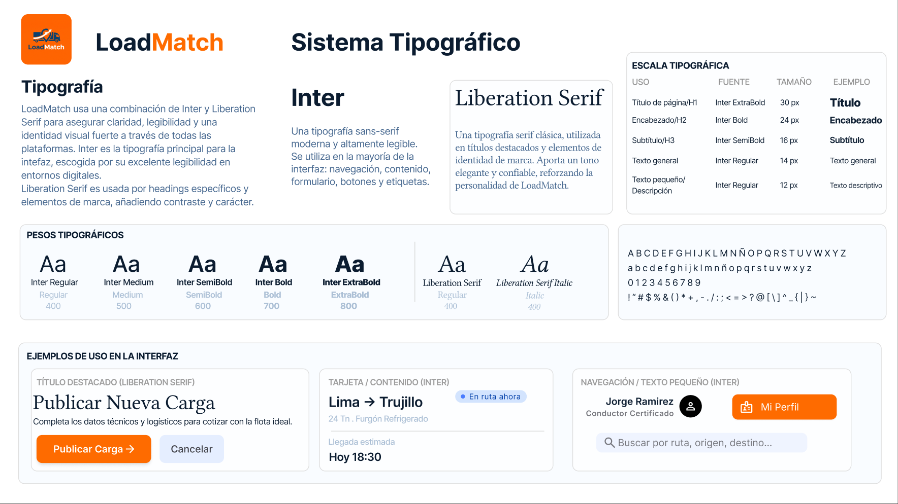 
  <i>Nota. Sistema tipográfico utilizado en la identidad visual de LoadMatch</i>

#### 4.1.1.2. Colors

La paleta de colores de LoadMatch ha sido definida con el propósito de transmitir una identidad visual moderna, confiable y vinculada al entorno logístico. El sistema combina colores de marca con tonos neutros y colores semánticos que permiten diferenciar acciones, estados e información dentro de la plataforma.

El **naranja (#FE6B00)** constituye el color principal de LoadMatch y se utiliza especialmente en acciones importantes, botones principales, elementos seleccionados, indicadores y puntos de énfasis dentro de la interfaz. Su uso permite dirigir rápidamente la atención del usuario hacia las acciones prioritarias.

Como variación para estados de interacción se utiliza el tono **Orange Pressed (#A04100)**, principalmente en estados activos o presionados de componentes interactivos, y como color de texto cuando se requiere aplicar el énfasis de marca sobre fondos claros.

Los tonos **Dark Navy (#0B1C30)** y **Sidebar Dark (#131B2E)** son empleados en elementos estructurales y de navegación, especialmente en fondos oscuros, barras laterales, encabezados y determinadas áreas de alto contraste. Estos colores permiten equilibrar visualmente el naranja principal y contribuyen a transmitir una imagen profesional y confiable.

Para los fondos y superficies se utilizan principalmente **White (#FFFFFF)**, **Background Light (#F8FAFC)** y **Blue Tint Background (#EFF4FF)**. Estos tonos claros permiten mantener una interfaz limpia y facilitan la separación visual entre secciones, tarjetas, formularios y otros componentes.

LoadMatch también utiliza colores semánticos para comunicar el estado de determinadas operaciones. El **Success Green (#059669)** identifica estados positivos, como elementos verificados o procesos completados; el **Error Red (#DC2626)** se emplea para errores, cancelaciones o acciones destructivas; el **Warning Yellow (#F59E0B)** señala advertencias o información que requiere atención del usuario; y el **Info Blue (#3B82F6)** se utiliza para mensajes informativos y elementos de orientación general.

Finalmente, se utiliza una escala de tonos **Slate** para textos, bordes, iconos, separadores y elementos secundarios de la interfaz. Los valores empleados son Slate 900 (#0F172A) para títulos, Slate 700 (#334155) para texto de cuerpo, Slate 600 (#475569) para texto secundario, Slate 300 (#CBD5E1) y Slate 200 (#E2E8F0) para bordes y separadores. Esta escala permite establecer distintos niveles de jerarquía visual sin recurrir constantemente a los colores principales de la marca.

##### Criterios de accesibilidad de la paleta

La paleta fue verificada contra el criterio WCAG 2.1 nivel AA (1.4.3 Contraste mínimo), que exige una relación de contraste de 4.5:1 para texto normal y de 3:1 para texto grande y componentes de interfaz.

De esta verificación se desprende una regla de aplicación obligatoria: **el Primary Orange y el Warning Yellow son colores de luminancia alta y requieren texto oscuro, mientras que el Orange Pressed, el Error Red y los tonos Navy son de luminancia baja y admiten texto blanco.**

| Color de fondo | Texto blanco | Texto Dark Navy | Combinación válida |
| :--- | :--- | :--- | :--- |
| Primary Orange #FE6B00 | 2.87 | **5.98** | Texto Dark Navy |
| Warning Yellow #F59E0B | 2.15 | **8.00** | Texto Dark Navy |
| Success Green #059669 | 3.77 | **4.56** | Texto Dark Navy |
| Info Blue #3B82F6 | 3.68 | **4.67** | Texto Dark Navy |
| Orange Pressed #A04100 | **6.46** | 2.66 | Texto blanco |
| Error Red #DC2626 | **4.83** | 3.56 | Texto blanco |
| Dark Navy #0B1C30 | **17.17** | — | Texto blanco |
| Sidebar Dark #131B2E | **17.16** | — | Texto blanco |

Cuando un color semántico se utiliza como **texto** sobre fondo claro, se emplea su variante oscura, dado que los tonos base no alcanzan el mínimo requerido:

| Uso como texto | Tono base | Ratio | Variante a utilizar | Ratio |
| :--- | :--- | :--- | :--- | :--- |
| Énfasis de marca | #FE6B00 | 2.87 | **#A04100** | 6.46 |
| Advertencia | #F59E0B | 2.15 | **#B45309** | 5.02 |
| Éxito | #059669 | 3.77 | **#047857** | 5.48 |
| Información | #3B82F6 | 3.68 | **#1D4ED8** | 6.70 |

Asimismo, se establecen las siguientes restricciones de uso:

- El **Primary Orange (#FE6B00)** no se utiliza como color de texto sobre fondos claros ni como indicador de foco sobre fondo blanco, dado que no alcanza el 3:1 exigido por el criterio 1.4.11 para componentes de interfaz. El indicador de foco emplea Dark Navy.
- El tono **Slate 400 (#94A3B8)** se reserva para bordes e iconografía decorativa; no se utiliza como color de texto, ya que alcanza únicamente 2.56 sobre blanco.
- Sobre el **Blue Tint Background (#EFF4FF)** el texto debe emplear Slate 600 o un tono más oscuro.
- Ningún estado se comunica exclusivamente mediante color: los indicadores combinan color, iconografía y texto, conforme al criterio 1.4.1 (Uso del color).

El uso consistente de esta paleta facilita la identificación de acciones y estados, mantiene una adecuada jerarquía visual, garantiza la legibilidad conforme a WCAG 2.1 AA y refuerza la identidad gráfica de LoadMatch.

   
  <i>Nota. Sistema de color utilizado en la identidad visual de LoadMatch.</i>

#### 4.1.1.3. Spacing

El sistema de espaciado de LoadMatch se basa en una cuadrícula de **4 píxeles**, permitiendo mantener consistencia visual entre los diferentes componentes de la interfaz. A partir de esta unidad base se utilizan principalmente valores de **4, 8, 12, 16, 24 y 32 píxeles**, dependiendo del nivel de separación requerido.

Los espacios de **4 px** se emplean principalmente entre elementos muy próximos, como iconos y textos; **8 px** para agrupaciones compactas y componentes pequeños; **12 px** para separaciones internas frecuentes; **16 px** para el contenido de tarjetas y formularios; **24 px** para secciones con mayor separación visual; y **32 px** para dividir bloques principales dentro de una página.

Este sistema permite organizar la información de manera clara y predecible, evitando la saturación visual y facilitando la lectura de elementos operativos como solicitudes de carga, formularios, estados y rutas. Asimismo, contribuye a mantener una experiencia consistente en las distintas vistas de la plataforma.

#### 4.1.1.4. Iconography

La iconografía de LoadMatch sigue un estilo **simple, reconocible y consistente**, orientado a facilitar la comprensión rápida de las principales acciones y funcionalidades de la plataforma. Los iconos se utilizan como apoyo visual en elementos de navegación, formularios, estados, botones y diferentes componentes relacionados con la gestión del transporte de carga.

Se priorizan iconos de apariencia limpia y principalmente lineal, manteniendo proporciones y tamaños consistentes dentro de cada contexto de uso. En elementos activos o acciones prioritarias, los iconos pueden adoptar el color principal de LoadMatch, **Primary Orange (#FE6B00)**, mientras que los elementos secundarios utilizan principalmente tonos de la escala Slate.

Entre los principales usos de la iconografía se encuentran acciones como **buscar cargas, publicar una carga, consultar rutas, acceder al historial, gestionar el perfil, configurar la cuenta, visualizar notificaciones y consultar información relacionada con vehículos o documentación**.

El uso de iconos junto con etiquetas textuales permite disminuir la carga cognitiva y facilita la navegación tanto para empresas que requieren servicios de transporte como para transportistas que buscan nuevas oportunidades de carga.

   
  <i>Nota. Sistema de iconografía utilizado en la interfaz de LoadMatch.</i>

#### 4.1.1.5. Tone of Communication and Applied Language

El tono de comunicación de LoadMatch es **claro, directo, profesional y orientado a la acción**. Debido a que la plataforma se utiliza para gestionar operaciones relacionadas con transporte y logística, la información debe presentarse de manera sencilla y comprensible, evitando términos innecesariamente complejos o mensajes ambiguos.

Los textos de la interfaz priorizan instrucciones breves y acciones fácilmente identificables, especialmente en procesos como la publicación de una carga, búsqueda de oportunidades, seguimiento de servicios, actualización de documentación y gestión del perfil.

Algunos ejemplos del lenguaje utilizado dentro de la plataforma son:

- **“Publicar nueva carga”**
- **“Buscar fletes”**
- **“Mis cargas”**
- **“En ruta ahora”**
- **“Verificado”**
- **“Cuenta en revisión”**
- **“Completa los datos técnicos y logísticos”**

Los mensajes relacionados con estados, advertencias o validaciones mantienen el mismo enfoque, informando al usuario de manera precisa sobre lo que ocurre y, cuando corresponde, indicando la acción que debe realizar.

Este estilo de comunicación busca generar confianza y facilitar la interacción de usuarios con diferentes niveles de experiencia digital, manteniendo al mismo tiempo una identidad profesional acorde con el contexto logístico de LoadMatch.

### 4.1.2. Web Style Guidelines

El diseño visual de la aplicación web de LoadMatch sigue una línea moderna, clara y funcional, orientada a facilitar la gestión de operaciones logísticas y la consulta rápida de información relevante. La interfaz prioriza la legibilidad, la jerarquía visual y la consistencia entre los diferentes módulos de la plataforma.

La estructura visual se apoya en el uso de **Inter** como tipografía principal de interfaz, combinada de manera puntual con **Liberation Serif** en determinados encabezados destacados. La paleta de colores utiliza el **Primary Orange (#FE6B00)** como color de énfasis para acciones principales, estados activos y elementos seleccionados, mientras que los tonos **Dark Navy (#0B1C30)**, **Sidebar Dark (#131B2E)** y la escala **Slate** se emplean en navegación, textos, bordes y elementos secundarios.

Los componentes interactivos mantienen patrones visuales consistentes. Los botones principales utilizan fondo naranja y texto blanco, mientras que las acciones secundarias emplean fondos claros, bordes suaves y tonos neutros. Los formularios utilizan campos con bordes redondeados, etiquetas claras y estados visuales diferenciados para foco, validación y error.

La navegación principal de la aplicación se organiza mediante una barra lateral oscura, donde el estado activo se resalta con el color naranja de la marca. El encabezado superior mantiene un fondo claro e integra elementos como búsqueda, información del usuario y accesos rápidos, facilitando la orientación dentro de la plataforma.

Las tarjetas, tablas, formularios, modales y paneles de seguimiento utilizan fondos claros, bordes sutiles, radios de esquina consistentes y una jerarquía de espaciado basada en múltiplos de 4 píxeles. Esto permite separar visualmente la información sin sobrecargar la interfaz.

La aplicación también emplea colores semánticos y badges para representar estados como **verificado, completado, en tránsito, pendiente o cancelado**, permitiendo que el usuario identifique rápidamente el estado de una operación.

Finalmente, el diseño web de LoadMatch considera principios de diseño responsive, buscando mantener la claridad, funcionalidad y consistencia de la interfaz en distintos tamaños de pantalla. Todos los elementos visuales se plantean con un propósito funcional, priorizando una experiencia sencilla, profesional y orientada a la ejecución rápida de tareas.

## 4.2. Information Architecture.

La arquitectura de información de LoadMatch se ha definido con el propósito de organizar el contenido y las funcionalidades de manera clara, consistente y fácil de recorrer. Debido a que la solución atiende a dos segmentos principales —empresas que requieren transportar carga y transportistas que buscan oportunidades de servicio—, la estructura se adapta a las necesidades y tareas de cada tipo de usuario.

Para ello, se emplean sistemas de organización jerárquicos y secuenciales, etiquetas breves y comprensibles, mecanismos de búsqueda y filtrado, y patrones de navegación que permiten localizar información y completar las principales tareas dentro de la Landing Page y la Web Application.

### 4.2.1. Organization Systems.

LoadMatch utiliza principalmente una organización **jerárquica**, debido a que las funcionalidades se agrupan desde categorías generales hacia opciones más específicas. Esta estructura se aplica tanto en la Landing Page como en la Web Application.

En la **Landing Page**, el contenido se organiza por tópicos como **Cómo funciona**, **Para empresas**, **Para transportistas** y **Preguntas frecuentes**. Asimismo, se aplica una categorización según audiencia al diferenciar contenidos y llamadas a la acción para empresas y transportistas.

La estructura principal de la Landing Page considera:

- Inicio.
- Cómo funciona.
- Para empresas.
- Para transportistas.
- Preguntas frecuentes.
- Iniciar sesión.
- Registrarse.

También se utilizan flujos **secuenciales** en acciones como el registro y autenticación, donde el usuario debe completar una serie de pasos antes de acceder a la plataforma.

  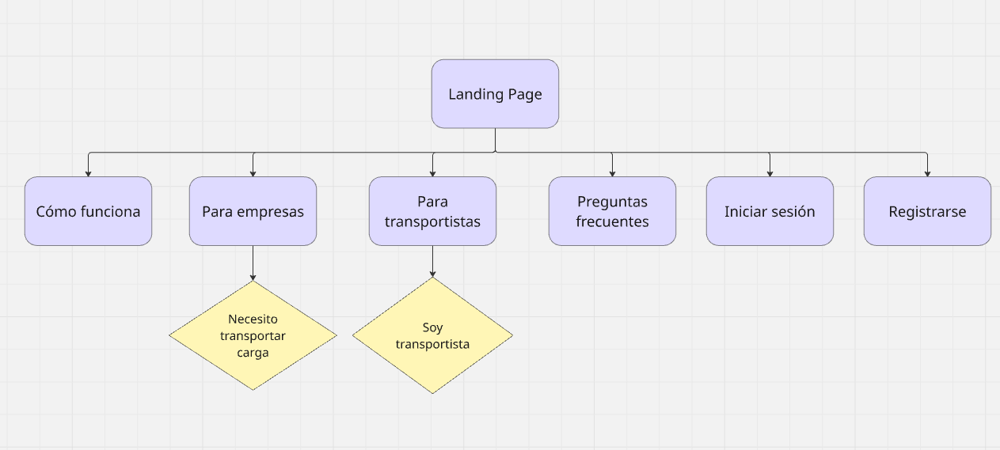 
  <i>Nota. Sistema de organización jerárquica de la Landing Page de LoadMatch.</i>

En la **Web Application**, la información se organiza principalmente según la audiencia o tipo de usuario.

Para empresas, las principales categorías son:

- Dashboard.
- Mis Cargas.
- Historial.
- Configuración.

A partir de estas secciones se accede a funciones específicas como publicar una nueva carga, gestionar solicitudes o realizar el seguimiento de un servicio.

Para transportistas, las principales categorías son:

- Buscar Fletes.
- Mis Viajes.
- Historial.
- Mi Perfil.

Dentro de estas secciones se encuentran funcionalidades más específicas como aplicar filtros de búsqueda, consultar viajes en progreso, visualizar el seguimiento de una ruta o gestionar documentación.

También se utiliza una organización **cronológica** para separar operaciones actuales de anteriores, como ocurre en Historial y en la clasificación de viajes en progreso y completados.

La organización matricial no constituye la estructura principal de LoadMatch, aunque se utiliza de manera puntual en sistemas de búsqueda donde el usuario puede combinar diferentes criterios, como ruta, distancia, tipo de vehículo, peso y tarifa.

  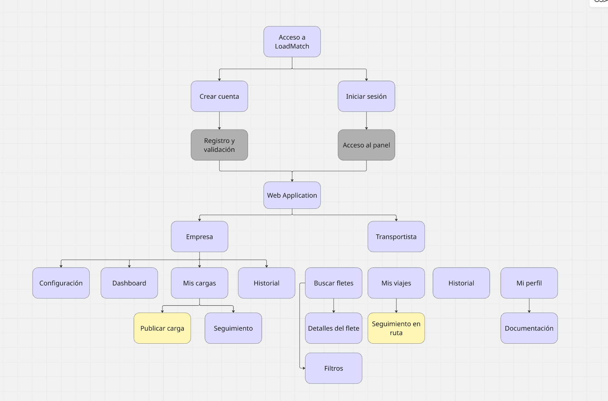 
  <i>Nota. Sistema de organización de la Web Application de LoadMatch según el tipo de usuario.</i>

### 4.2.2. Labeling Systems.

El sistema de etiquetado de LoadMatch utiliza términos breves, descriptivos y orientados a la acción. Se busca reducir la ambigüedad y utilizar el menor número de palabras posible para que el usuario pueda comprender rápidamente la función de cada sección o elemento.

Las etiquetas se mantienen consistentes según el contexto de uso:

| CONTEXTO | ETIQUETAS PRINCIPALES |
| :--- | :--- |
| **Landing Page** | Cómo funciona, Para empresas, Para transportistas, Preguntas frecuentes, Iniciar sesión, Registrarse |
| **Empresa** | Dashboard, Mis Cargas, Historial, Configuración, Publicar Nueva Carga, Ver Seguimiento |
| **Transportista** | Buscar Fletes, Mis Viajes, Historial, Mi Perfil, Ver Detalles, Ir al Mapa |
| **Estados** | En Tránsito, Buscando Unidad, Completado, En Camino, Aprobado, Pendiente |

Las etiquetas correspondientes a acciones utilizan principalmente verbos, como **Publicar**, **Buscar**, **Gestionar**, **Ver** o **Cancelar**, mientras que las etiquetas de estado describen directamente la condición actual de una carga, viaje o documento.

Esta diferenciación facilita que el usuario pueda reconocer rápidamente si un elemento representa una sección, una acción o un estado.

  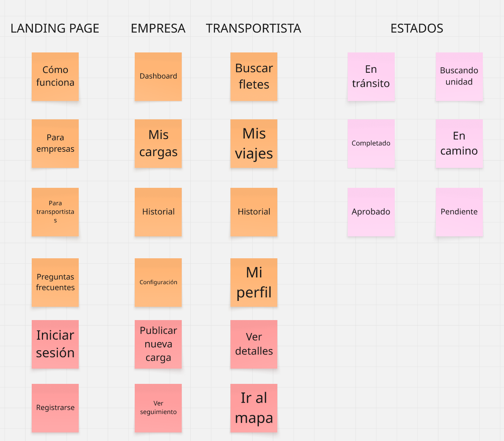 
  <i>Nota. Sistema de etiquetado utilizado en la Landing Page y Web Application de LoadMatch.</i>

### 4.2.3. SEO Tags and Meta Tags.

Los SEO Tags y Meta Tags de LoadMatch se definen con el objetivo de describir correctamente el contenido de las principales páginas de la Landing Page y la Web Application.

En la Landing Page se priorizan términos relacionados con transporte de carga, logística, empresas y transportistas. Para las vistas internas de la aplicación, los metadatos describen la función específica de cada página.

| PÁGINA | TITLE | DESCRIPTION | KEYWORDS | AUTHOR |
| :--- | :--- | :--- | :--- | :--- |
| **Landing Page** | LoadMatch \| Transporte de carga para empresas y transportistas | Conecta empresas que necesitan transportar carga con transportistas y unidades disponibles mediante LoadMatch. | transporte de carga, transportistas, fletes, logística, empresas, MYPE | LoadMatch Development Team |
| **Login / Registro** | Accede a LoadMatch \| Empresas y Transportistas | Inicia sesión o crea una cuenta para gestionar servicios de transporte de carga con LoadMatch. | LoadMatch, iniciar sesión, registro, transportista, empresa | LoadMatch Development Team |
| **Dashboard Empresa** | Dashboard \| LoadMatch | Gestiona cargas, servicios en tránsito y operaciones de transporte desde el panel de LoadMatch. | dashboard, cargas, seguimiento, transporte, logística | LoadMatch Development Team |
| **Buscar Fletes** | Buscar Fletes \| LoadMatch | Consulta oportunidades de carga disponibles y encuentra fletes compatibles con tu unidad. | buscar fletes, cargas disponibles, transportistas, rutas | LoadMatch Development Team |

Adicionalmente, las páginas utilizan `lang="es"` y el Meta Tag `viewport` para asegurar una correcta presentación en diferentes tamaños de pantalla.

En el caso de las vistas autenticadas, estos metadatos también permiten identificar claramente cada página dentro del navegador, aunque su objetivo principal no sea el posicionamiento público en motores de búsqueda.

### 4.2.4. Searching Systems.

LoadMatch incorpora mecanismos de búsqueda y filtrado para evitar que el usuario tenga que recorrer manualmente grandes cantidades de información. Los criterios disponibles dependen del tipo de usuario y de la tarea realizada.

#### Searching System para empresas

Las empresas disponen de una barra de búsqueda orientada a localizar operaciones específicas.

| CRITERIO | DESCRIPCIÓN |
| :--- | :--- |
| **Código de carga** | Permite localizar directamente una solicitud mediante su identificador. |
| **Ruta** | Permite encontrar cargas relacionadas con un origen o destino determinado. |
| **Transportista** | Permite localizar operaciones asociadas a un transportista. |
| **Estado** | Facilita la identificación de cargas en tránsito, buscando unidad o completadas. |

Los resultados se presentan principalmente mediante tablas y tarjetas donde se muestran datos como **ID de carga, ruta, estado y acciones disponibles**.

#### Searching System para transportistas

La sección **Buscar Fletes** permite buscar oportunidades mediante ID de carga, ruta, origen o destino. También incorpora filtros para reducir los resultados según las necesidades del transportista.

| FILTRO | DESCRIPCIÓN |
| :--- | :--- |
| **Ruta / Origen / Destino** | Permite localizar oportunidades según el recorrido del servicio. |
| **Distancia máxima** | Define el radio máximo de búsqueda en kilómetros. |
| **Tipo de vehículo / carga** | Filtra oportunidades compatibles con la unidad del transportista. |
| **Peso mínimo** | Permite establecer el tonelaje mínimo requerido. |
| **Tarifa mínima** | Permite mostrar únicamente fletes que alcancen un monto mínimo. |
| **Coincidencia con mi vehículo** | Muestra oportunidades compatibles con las especificaciones de la unidad registrada. |
| **Ordenamiento** | Permite ordenar los resultados, por ejemplo, desde los más recientes. |

Los resultados se presentan mediante tarjetas que muestran información como **origen, destino, peso, tipo de mercadería, vehículo requerido, horario y tarifa**, acompañadas de una opción para acceder al detalle del flete.

La interfaz también incorpora una representación geográfica que permite visualizar las oportunidades disponibles en relación con la ubicación del transportista.

### 4.2.5. Navigation Systems.

El sistema de navegación de LoadMatch se ha diseñado para que los usuarios puedan recorrer el contenido de manera predecible y acceder rápidamente a las funciones relacionadas con sus objetivos.

Se diferencia entre la navegación de la Landing Page y la navegación correspondiente a cada perfil de la Web Application.

#### Navigation System de la Landing Page

La Landing Page utiliza una navegación horizontal en escritorio y un menú adaptable en dispositivos móviles.

| NOMBRE | DESCRIPCIÓN |
| :--- | :--- |
| **Cómo funciona** | Explica el funcionamiento general de LoadMatch. |
| **Para empresas** | Presenta información y beneficios para empresas que necesitan transportar carga. |
| **Para transportistas** | Presenta información y oportunidades para transportistas. |
| **Preguntas frecuentes** | Permite resolver dudas comunes sobre el servicio. |
| **Iniciar sesión** | Permite acceder a una cuenta existente. |
| **Registrarse** | Permite iniciar el proceso de creación de una cuenta. |

También se utilizan llamadas a la acción como **Necesito transportar carga** y **Soy transportista**, que permiten dirigir rápidamente al visitante hacia el flujo correspondiente.

#### Navigation System para empresas

La Web Application de empresas utiliza una barra lateral persistente.

| NOMBRE | DESCRIPCIÓN |
| :--- | :--- |
| **Dashboard** | Presenta un resumen de cargas y operaciones activas. |
| **Mis Cargas** | Permite consultar y gestionar las solicitudes registradas. |
| **Historial** | Permite revisar operaciones realizadas anteriormente. |
| **Configuración** | Permite administrar opciones relacionadas con la cuenta. |

Acciones como **Publicar Nueva Carga**, **Ver Seguimiento**, **Gestionar** o **Cancelar Carga** se presentan de manera contextual dentro de las secciones correspondientes.

#### Navigation System para transportistas

Para los transportistas también se utiliza una barra lateral persistente adaptada a sus principales tareas.

| NOMBRE | DESCRIPCIÓN |
| :--- | :--- |
| **Buscar Fletes** | Permite localizar oportunidades de carga disponibles. |
| **Mis Viajes** | Permite consultar viajes en progreso y completados. |
| **Historial** | Permite revisar servicios realizados anteriormente. |
| **Mi Perfil** | Permite gestionar datos personales y documentación. |

Dentro de **Mis Viajes**, el usuario puede recorrer secuencialmente el proceso de un servicio mediante acciones como **Ir al Mapa**, **Reportar Llegada a Destino** y **Finalizar Viaje**.

De esta manera, LoadMatch combina una navegación principal sencilla con acciones contextuales y flujos secuenciales, evitando sobrecargar los menús con opciones que únicamente son necesarias en momentos específicos.

## 4.3. Landing Page UI Design

Esta sección presenta la propuesta de interfaz para el sitio web estático de LoadMatch. El diseño traduce las decisiones tomadas en la sección 4.2 de Arquitectura de Información: el Organization System define el orden de las secciones según el recorrido del visitante, el Labeling System aporta las etiquetas de navegación y de los llamados a la acción, y el Navigation System determina que el visitante pueda alcanzar cualquier sección desde la cabecera fija y volver a un llamado a la acción desde cualquier punto del recorrido.

El trabajo se organizó en dos etapas. Primero el wireframe, que fija estructura, jerarquía y flujo sin comprometer decisiones visuales. Después el mock-up, que aplica sobre esa misma estructura el Design System definido en la sección 4.1. Ambas etapas se elaboraron para las dos experiencias que exige el alcance del proyecto: Desktop Web Browser a 1440 px y Mobile Web Browser a 390 px.

La landing page se compone de nueve bloques, presentados aquí en el mismo orden en que los recorre el visitante:

| # | Bloque | Propósito |
| :-: | :--- | :--- |
| 01 | Cabecera y sección principal | Presentar la propuesta de valor y ofrecer el llamado a la acción de cada segmento |
| 02 | Franja de indicadores del mercado | Sustentar la problemática con datos verificables |
| 03 | Cómo funciona | Explicar el proceso de tres pasos, diferenciado por segmento |
| 04 | Confianza y bloques por segmento | Responder a la principal objeción del cliente y separar los beneficios por perfil |
| 05 | Lo que dicen nuestros usuarios | Aportar prueba social |
| 06 | Precios transparentes | Despejar la incertidumbre sobre el costo |
| 07 | Preguntas frecuentes | Resolver las dudas restantes sin abandonar la página |
| 08 | Videos explicativos | Presentar el producto y al equipo en formato audiovisual |
| 09 | Cierre y pie de página | Última oportunidad de conversión y acceso a información legal |

### 4.3.1. Landing Page Wireframe

El wireframe se elaboró en baja fidelidad, en escala de grises y sin fotografías, de manera deliberada. El objetivo de esta etapa es validar la estructura, la jerarquía de la información y el flujo de navegación sin que el color o la imagen influyan en la evaluación. Las decisiones cromáticas se posponen a la etapa de mock-up.

#### Wireframe para Desktop Web Browser

**Bloque 01 — Cabecera y sección principal**

La composición sigue el patrón Z de lectura. La marca ocupa la esquina superior izquierda, que es el punto donde inicia el barrido visual. La navegación recorre horizontalmente hacia la derecha y termina en el llamado a la acción principal, ubicado en la esquina superior derecha. El titular arranca el segundo trazo diagonal y la mirada desciende hacia la izquierda hasta encontrar los dos botones, con la imagen de apoyo cerrando el recorrido a la derecha.

Los dos llamados a la acción del bloque principal responden a los dos segmentos objetivo. El botón primario corresponde al segmento de empresas y el secundario al de transportistas, con una diferencia de peso visual que refleja la prioridad del modelo de negocio sin ocultar la segunda opción.

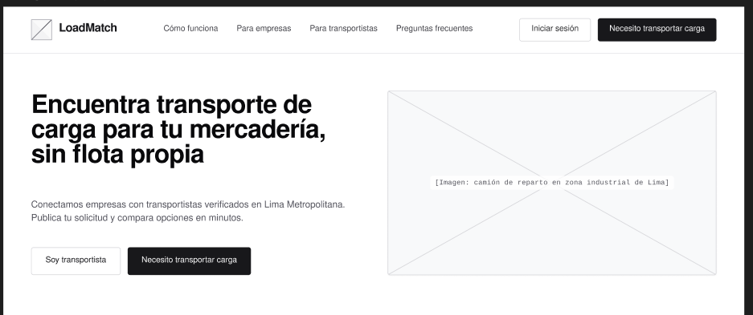

**Bloque 02 — Franja de indicadores del mercado**

Tres indicadores dispuestos en columnas de igual ancho, separados por líneas verticales. La repetición de la estructura —etiqueta, cifra, descripción, fuente— activa el principio de similitud de la Gestalt: el visitante reconoce que los tres elementos pertenecen a la misma categoría y puede compararlos sin esfuerzo. Cada cifra incluye su fuente, lo que sostiene la credibilidad del dato.

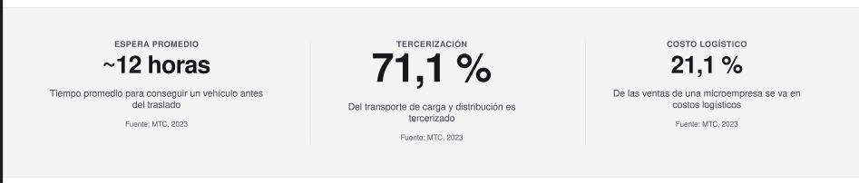

**Bloque 03 — Cómo funciona**

El control de pestañas resuelve un problema de arquitectura de información: los dos segmentos recorren procesos distintos, y presentarlos simultáneamente duplicaría el contenido y aumentaría la carga cognitiva. Al segmentar mediante pestañas se aplica la ley de Hick, reduciendo el número de opciones visibles en un mismo momento.

Los tres pasos van numerados y ordenados de izquierda a derecha, siguiendo la dirección de lectura. La numeración explícita comunica secuencia, no simple agrupación.

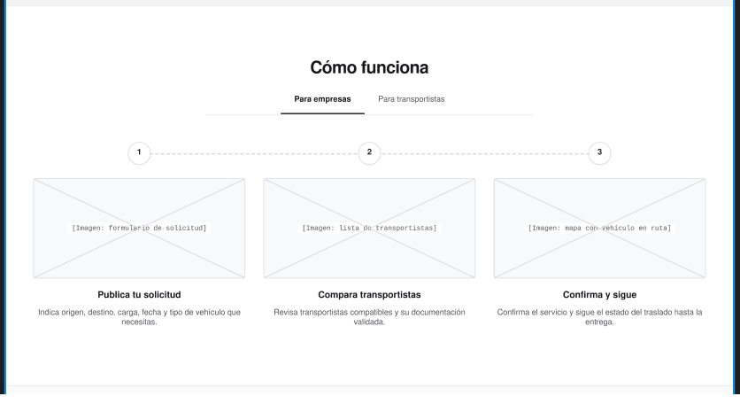

**Bloque 04 — Confianza y bloques por segmento**

Las cuatro tarjetas de verificación responden directamente a la principal objeción detectada en las entrevistas: la desconfianza sobre quién transporta la mercadería. Se ubican inmediatamente después de la explicación del proceso, que es el momento en el que esa objeción aparece.

Debajo, los dos bloques por segmento ocupan mitades simétricas del ancho disponible. La simetría comunica que ninguno de los dos perfiles es secundario, y cada bloque cierra con su propio llamado a la acción, de modo que el visitante puede convertir sin regresar a la cabecera.

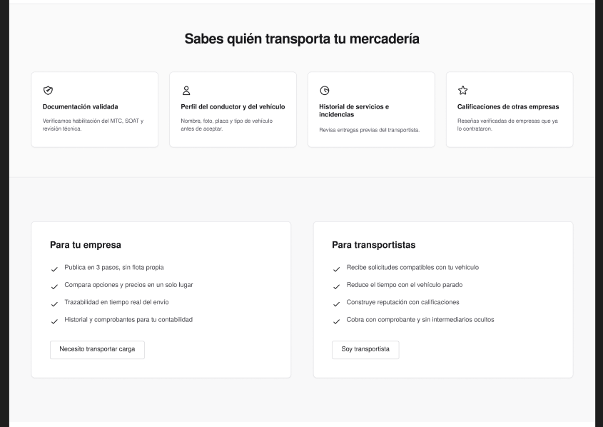

**Bloque 05 — Lo que dicen nuestros usuarios**

Tres testimonios en columnas de igual ancho. Cada uno identifica a la persona con sus iniciales, su nombre y su cargo, porque un testimonio anónimo no aporta prueba social. La etiqueta superior advierte que se trata de contenido ilustrativo; esta decisión se sostiene en el compromiso de honestidad sobre las capacidades del producto que se detalla en la sección de ética profesional.

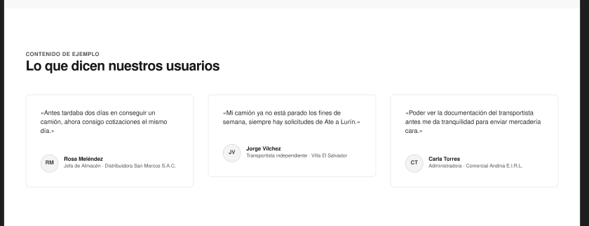

**Bloque 06 — Precios transparentes**

La tarjeta central concentra el modelo de negocio real —la comisión sobre el servicio confirmado— y se destaca mediante un borde más grueso y una etiqueta de texto. El énfasis no depende del color, de modo que la jerarquía se mantiene para una persona que no distingue tonos. Las tarjetas laterales despejan las dos dudas más frecuentes sobre el costo: si publicar tiene precio y si existe una mensualidad.

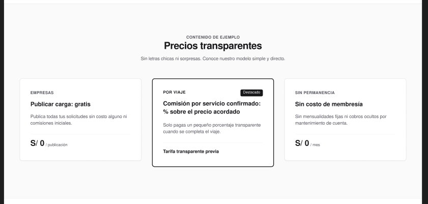

**Bloque 07 — Preguntas frecuentes**

El acordeón permite revisar los cinco títulos de un vistazo y desplegar solo la respuesta que interesa, lo que evita una pared de texto. La primera pregunta se muestra desplegada para comunicar de entrada que las filas son interactivas. El estado abierto o cerrado se indica con los signos menos y más, es decir mediante forma y no únicamente por color.

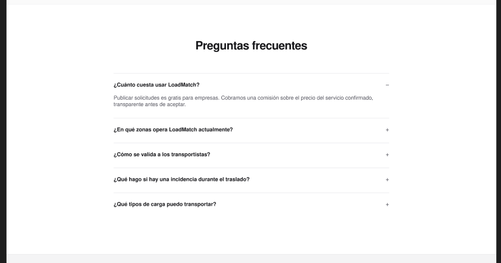

**Bloque 08 — Videos explicativos**

Dos reproductores en proporción 16:9 alojan el video sobre el producto y el video sobre el equipo. Cada uno lleva un pie de foto que anticipa el contenido, de modo que el visitante decide si invertir el tiempo antes de reproducir. El botón de reproducción centrado es el indicador convencional de contenido audiovisual y no requiere aprendizaje.

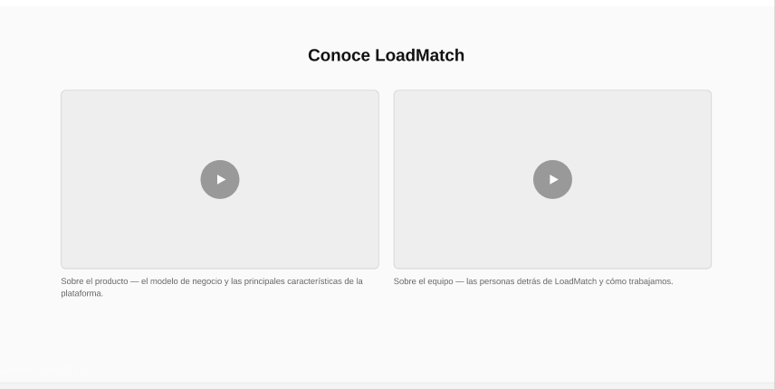

**Bloque 09 — Cierre y pie de página**

La banda de cierre repite los dos llamados a la acción, porque el visitante que llegó hasta el final de la página no debería tener que desplazarse de vuelta a la cabecera para convertir. El pie de página organiza los enlaces en cuatro grupos temáticos —Producto, Empresa, Legal y Contacto— aplicando el principio de proximidad de la Gestalt. La columna Legal aloja el enlace a los términos y condiciones, requisito del alcance del proyecto.

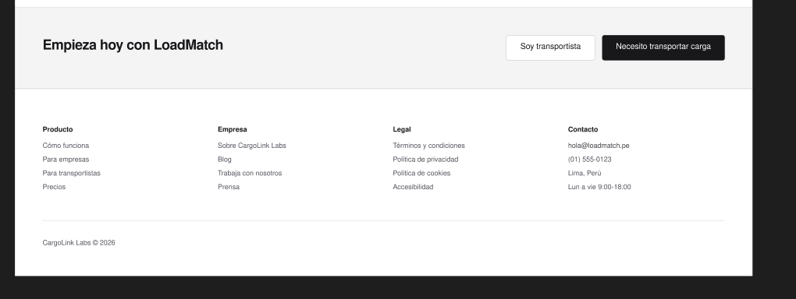

#### Wireframe para Mobile Web Browser

**Bloque 01 — Cabecera y sección principal**

En móvil el patrón de lectura cambia de Z a F, porque el ancho ya no permite un recorrido diagonal. Los elementos se apilan verticalmente en orden de importancia. La navegación se contrae en un botón de menú, liberando el ancho para la propuesta de valor. Los dos botones ocupan el ancho completo y quedan uno debajo del otro: al aumentar el área del objetivo se reduce el tiempo de adquisición según la ley de Fitts, lo que en una pantalla táctil se traduce en menos errores de pulsación.

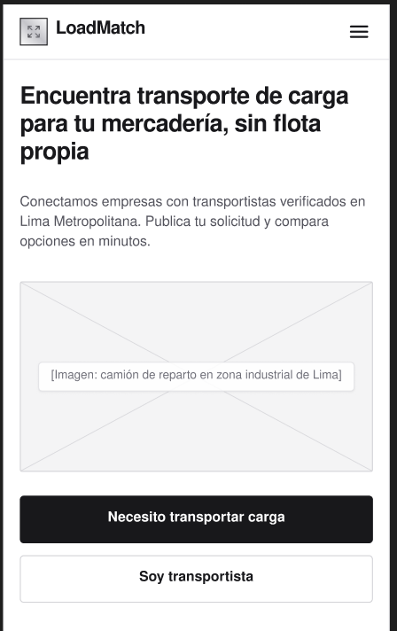

**Bloque 02 — Franja de indicadores del mercado**

Los tres indicadores pasan de columnas a una sola pila. La línea divisoria cambia de vertical a horizontal para conservar la separación entre unidades de información sin ocupar ancho.

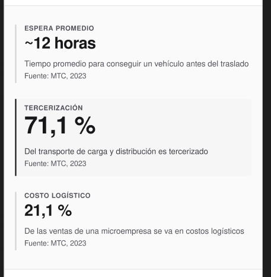

**Bloque 03 — Cómo funciona**

Las pestañas se conservan, porque la necesidad de segmentar por perfil no depende del dispositivo. Los tres pasos se apilan y cada uno queda contenido en su propia tarjeta, lo que mantiene visible la frontera entre un paso y el siguiente cuando ya no existe la separación por columnas.

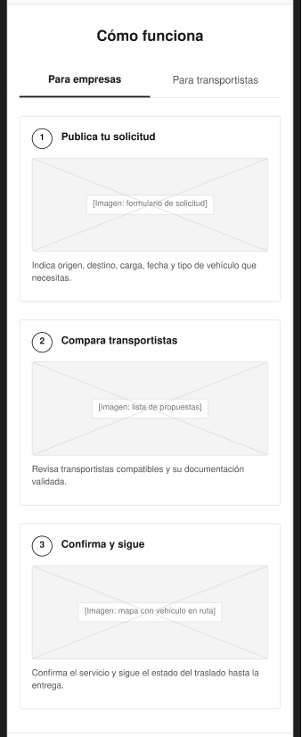

**Bloque 04 — Confianza y bloques por segmento**

Las cuatro tarjetas de verificación y los dos bloques por segmento pasan a una sola columna. El orden se conserva, de modo que el recorrido de la información es equivalente al de escritorio y el visitante que cambia de dispositivo encuentra el mismo relato.

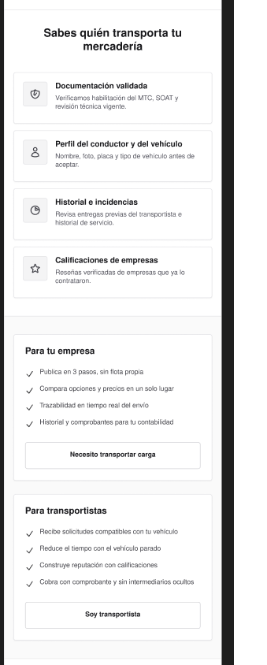

**Bloque 05 — Lo que dicen nuestros usuarios**

Los testimonios se convierten en un carrusel de desplazamiento horizontal. La tarjeta siguiente asoma parcialmente por el borde derecho: ese recorte es intencional y comunica que existe más contenido, resolviendo el criterio de visibilidad del estado del sistema. Los tres puntos indicadores y el contador «1 de 3» refuerzan la misma información de forma explícita, de modo que el estado no se comunica únicamente mediante una señal visual sutil.

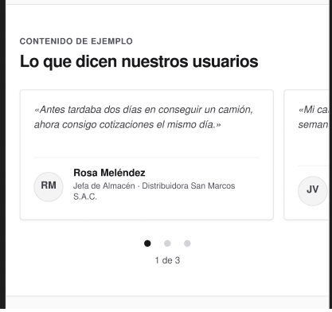

**Bloque 06 — Precios transparentes**

Las tres tarjetas se apilan conservando el énfasis de la tarjeta central, que mantiene su borde destacado y su etiqueta.

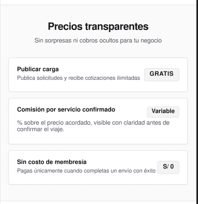

**Bloque 07 — Preguntas frecuentes**

El acordeón es el patrón que mejor se adapta al ancho reducido, porque comprime cinco respuestas extensas en cinco títulos de una o dos líneas.

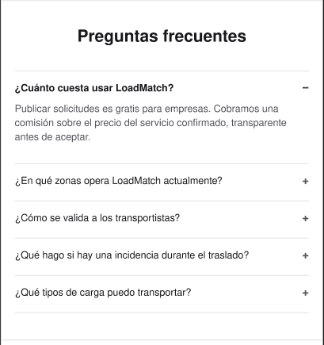

**Bloque 08 — Videos explicativos**

Los dos reproductores pasan a una sola columna conservando la proporción 16:9, de modo que el video se muestra sin franjas negras ni recortes.

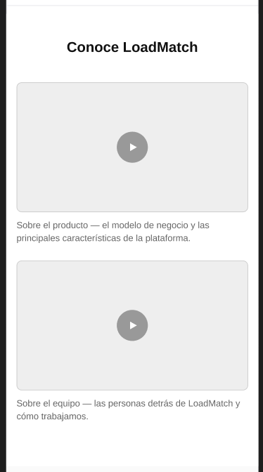

**Bloque 09 — Cierre y pie de página**

La banda de cierre apila titular y botones, y estos ocupan el ancho completo. Los cuatro grupos del pie de página pasan a una sola columna conservando sus encabezados, que actúan como separadores temáticos.

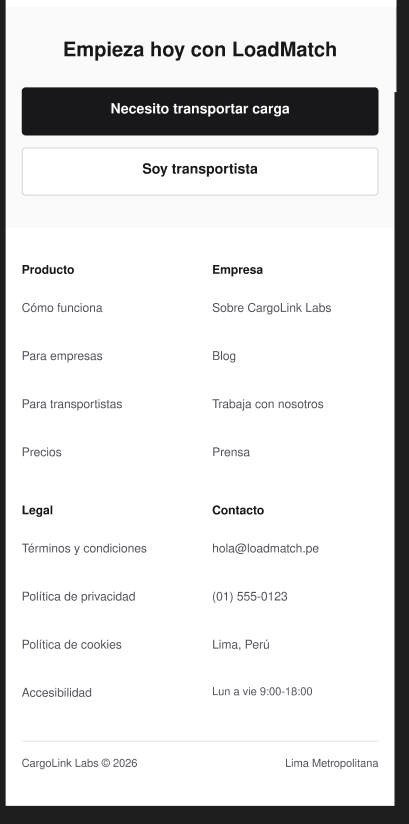

#### Aplicación de principios de diseño, diseño inclusivo y arquitectura de información

**Patrones de lectura.** En escritorio la cabecera y la sección principal siguen el patrón Z, que corresponde a pantallas con poca densidad de texto donde la mirada recorre en diagonal. A partir del segundo bloque, y en toda la experiencia móvil, la lectura se rige por el patrón F: los títulos de sección y los inicios de línea concentran la atención, por lo que la información determinante se ubica al comienzo de cada bloque.

**Principios de la Gestalt.** La proximidad agrupa los enlaces del pie de página en cuatro conjuntos temáticos. La similitud hace que los tres indicadores, las cuatro tarjetas de verificación y los tres testimonios se lean como conjuntos homogéneos. El cerramiento delimita cada tarjeta mediante su borde, sin necesidad de separadores adicionales.

**Ley de Fitts.** Los llamados a la acción principales tienen mayor superficie que los secundarios, y en móvil ocupan el ancho completo del contenedor. Todos los elementos interactivos mantienen un área táctil mínima de 44 × 44 píxeles.

**Ley de Hick.** La navegación se limita a cinco enlaces. El contenido diferenciado por segmento se distribuye en dos pestañas en lugar de exponerse de forma simultánea. El acordeón muestra una sola respuesta a la vez.

**Diseño inclusivo.** Ningún estado se comunica exclusivamente mediante el color: la pestaña activa se marca además con un subrayado, el acordeón con los signos menos y más, la tarjeta de precio destacada con un borde y una etiqueta de texto, y el carrusel con un contador numérico. La jerarquía de encabezados es continua y sin saltos de nivel. La estructura prevé un enlace para omitir la navegación e ir directamente al contenido principal, dirigido a quienes navegan mediante teclado.

**Arquitectura de información.** El orden de los nueve bloques reproduce el recorrido de decisión del visitante: qué es el servicio, por qué existe el problema, cómo funciona, por qué confiar, quién lo respalda, cuánto cuesta, qué dudas quedan, cómo verlo en detalle y dónde convertir. Los enlaces de navegación se corresponden uno a uno con las secciones definidas en el Organization System de la sección 4.2.1, y las etiquetas provienen del Labeling System de la sección 4.2.2.

### 4.3.2. Landing Page Mock-up

El mock-up aplica sobre la estructura ya validada el Design System definido en la sección 4.1: la paleta de color, la tipografía Inter, la escala de espaciado y el radio de esquina establecidos para todos los productos digitales de LoadMatch. La estructura, la jerarquía y el flujo no cambian respecto del wireframe; lo que se incorpora es la capa visual.

#### Mock-up para Desktop Web Browser

**Bloque 01 — Cabecera y sección principal**

El titular lleva una barra vertical naranja a su izquierda, que ancla visualmente el inicio del recorrido de lectura. El botón primario emplea el color de marca y el secundario un contorno neutro, de modo que la jerarquía entre ambos es inmediata. La fotografía muestra una operación de carga real en un entorno reconocible de Lima, lo que refuerza la cercanía con el contexto del usuario.

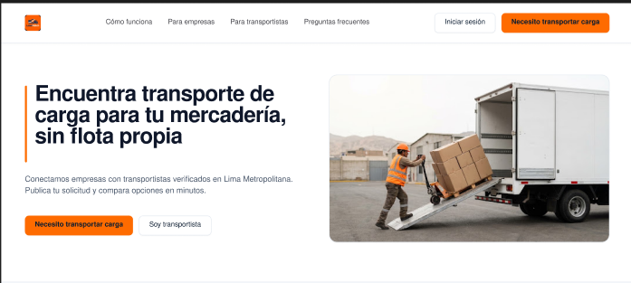

**Bloque 02 — Franja de indicadores del mercado**

La franja usa el fondo alternativo de la paleta para diferenciarse de las secciones contiguas sin introducir un color nuevo. Las cifras se destacan por tamaño y peso tipográfico; las fuentes se mantienen en el gris de texto secundario, presente pero sin competir.

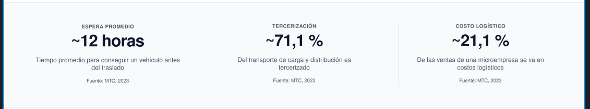

**Bloque 03 — Cómo funciona**

La pestaña activa se marca con un subrayado naranja y un peso tipográfico mayor. Los números de paso se presentan en círculos con el color de marca. Las capturas de la aplicación aparecen dentro de un marco que simula una ventana de navegador, lo que comunica que el contenido corresponde a la aplicación web y no a la propia landing page.

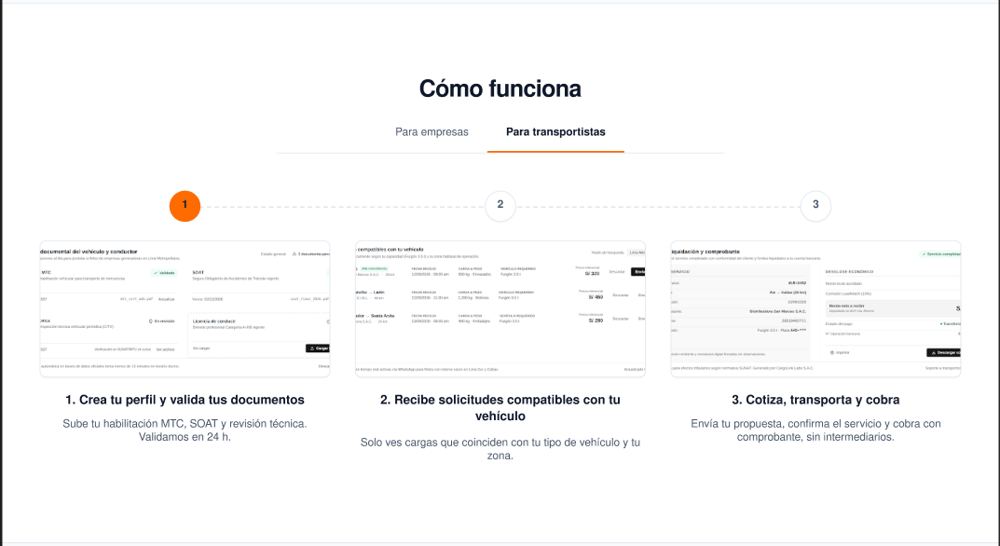

**Bloque 04 — Confianza y bloques por segmento**

Los iconos de las tarjetas de verificación se presentan sobre un fondo naranja tenue, lo que los integra a la paleta sin recurrir a un color de acento adicional. En los bloques por segmento, el de empresas cierra con el botón primario y el de transportistas con el secundario, reflejando la misma jerarquía de la cabecera.

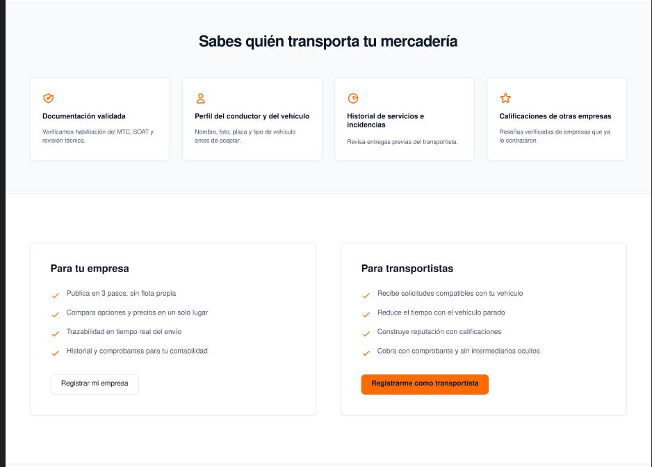

**Bloque 05 — Lo que dicen nuestros usuarios**

Las iniciales sustituyen a la fotografía de perfil. La decisión es deliberada: al tratarse de contenido ilustrativo, emplear rostros de personas reales o generados induciría a error sobre la existencia de esos clientes.

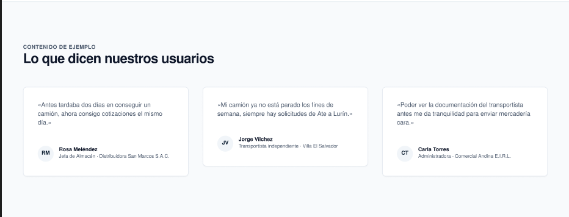

**Bloque 06 — Precios transparentes**

La tarjeta central se destaca mediante un borde más grueso en azul marino y una etiqueta oscura. El énfasis se construye con forma y contraste, no con color, de modo que la jerarquía se conserva íntegra para quien no distingue tonos.

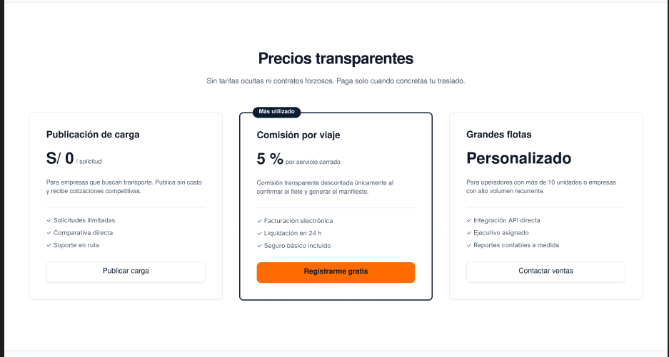

**Bloque 07 — Preguntas frecuentes**

Las preguntas emplean el color de encabezado y las respuestas el de texto secundario. La diferencia de peso y tono establece la relación jerárquica entre pregunta y respuesta sin recurrir a recuadros ni fondos adicionales.

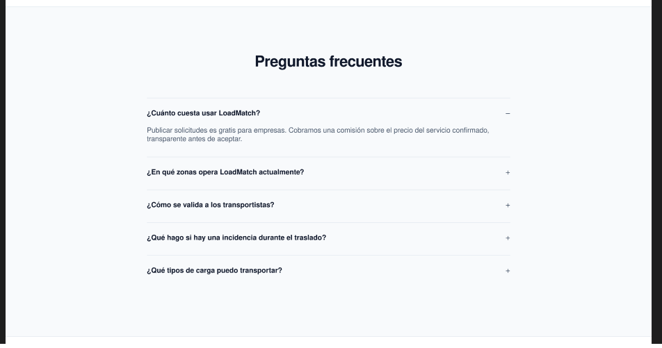

**Bloque 08 — Videos explicativos**

El botón de reproducción emplea un círculo naranja con el triángulo en azul marino. Esta combinación alcanza una relación de contraste de 5.98:1, superando el mínimo de 3:1 que el criterio 1.4.11 de la WCAG 2.1 exige para componentes de interfaz. Se descartó el triángulo blanco, que sobre el mismo naranja alcanza solo 2.87:1.

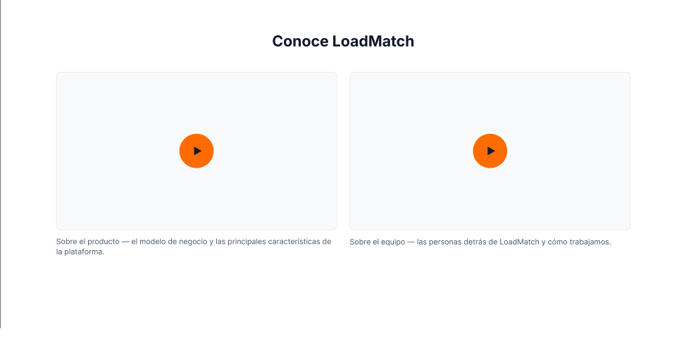

**Bloque 09 — Cierre y pie de página**

El pie de página invierte la relación de color: fondo azul marino con texto blanco. El cambio delimita el final del documento y aumenta el contraste de los enlaces legales, que son los que un visitante busca de forma deliberada.

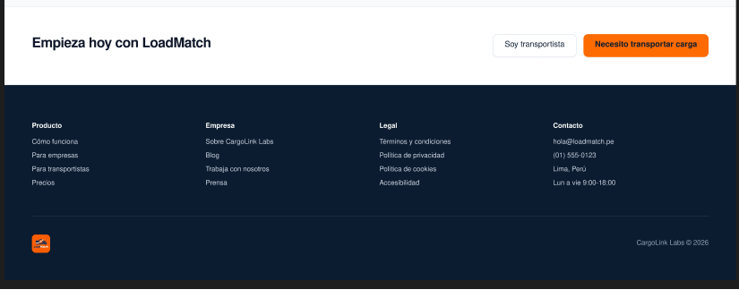

#### Mock-up para Mobile Web Browser

La versión móvil de la Landing Page conserva la misma estructura, jerarquía visual e identidad definida para la versión de escritorio, adaptando la disposición de los componentes a un viewport reducido. Los elementos que en desktop se organizan horizontalmente pasan a disponerse en una sola columna, priorizando la legibilidad, el área táctil y la navegación vertical.

**Bloque 01 — Cabecera y sección principal**

La cabecera reduce su navegación principal a un botón de menú, manteniendo visible el logotipo de LoadMatch. En la sección principal, el titular, la descripción, la imagen y los llamados a la acción se reorganizan verticalmente. Los botones ocupan el ancho disponible para facilitar su interacción desde dispositivos táctiles.

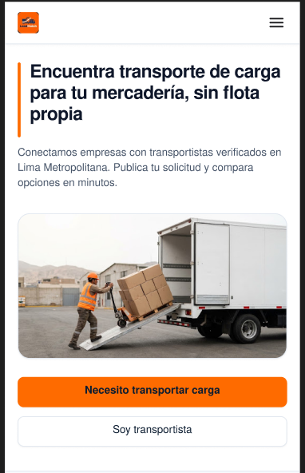

**Bloque 02 — Franja de indicadores del mercado**

Los tres indicadores se apilan conservando el fondo alternativo de la paleta. La línea divisoria cambia de vertical a horizontal, de modo que la separación entre unidades de información se mantiene sin consumir ancho adicional.

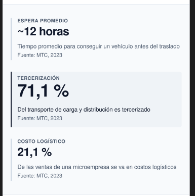

**Bloque 03 — Cómo funciona**

Las pestañas para empresas y transportistas se conservan en la parte superior, ya que la segmentación por perfil sigue siendo necesaria en dispositivos móviles. Los tres pasos del proceso se disponen en una sola columna, manteniendo la numeración, las capturas de la aplicación y la jerarquía visual definida en la versión de escritorio.

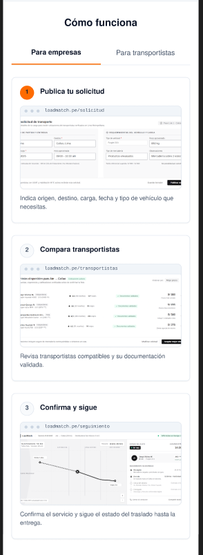

**Bloque 04 — Confianza y bloques por segmento**

Las tarjetas de verificación conservan su iconografía y estructura, pero pasan a organizarse verticalmente. Los bloques dirigidos a empresas y transportistas también se presentan en una sola columna, utilizando botones de ancho completo para facilitar la interacción.

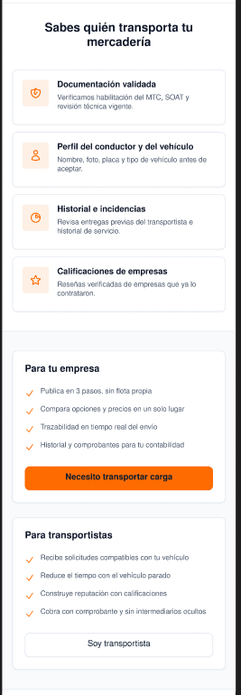

**Bloque 05 — Lo que dicen nuestros usuarios**

El carrusel de testimonios mantiene una tarjeta principal visible, permitiendo reconocer que existen más testimonios disponibles. El punto activo se diferencia visualmente y el contador numérico complementa esta señal para evitar depender únicamente del color.

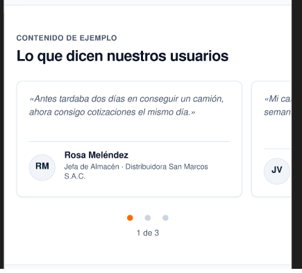

**Bloque 06 — Precios transparentes**

Las tarjetas de precios dejan de mostrarse lado a lado y se apilan verticalmente. La opción destacada conserva su borde, etiqueta y jerarquía visual, permitiendo comparar los planes mediante desplazamiento vertical sin reducir el tamaño del contenido.

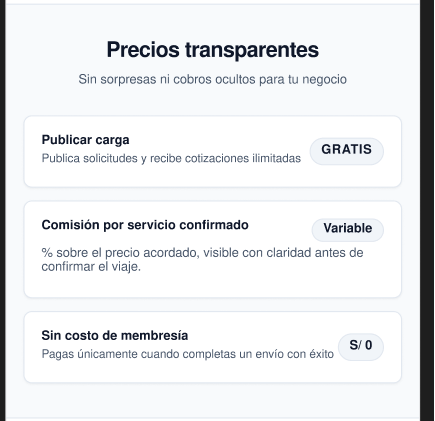

**Bloque 07 — Preguntas frecuentes**

El acordeón ocupa el ancho disponible de la pantalla. Las preguntas y respuestas mantienen una separación clara, mientras que los controles de expansión permanecen alineados al borde derecho y dentro de un área fácilmente accesible mediante interacción táctil.

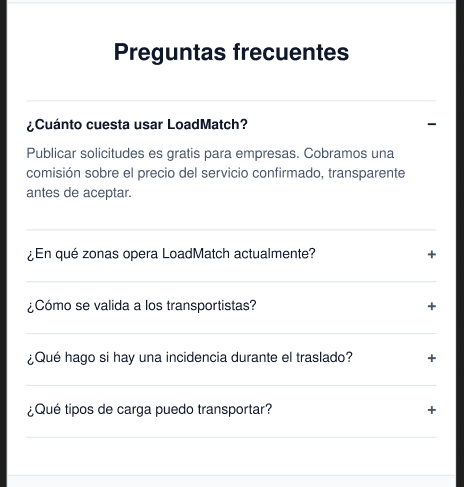

**Bloque 08 — Videos explicativos**

Los videos, que en escritorio pueden disponerse en columnas, pasan a mostrarse uno debajo del otro. Cada video mantiene su proporción 16:9 y su texto descriptivo, permitiendo visualizar el contenido sin reducir excesivamente el área disponible.

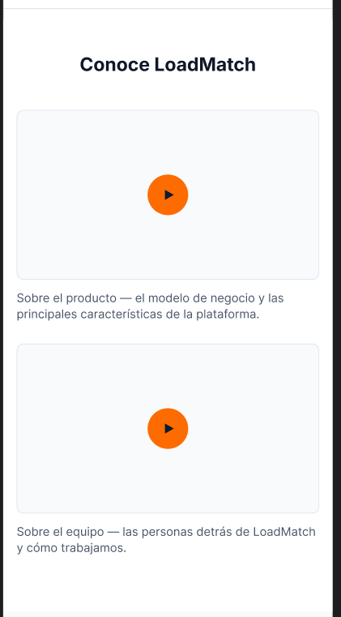

**Bloque 09 — Cierre y pie de página**

La banda final de llamada a la acción reorganiza su contenido verticalmente y presenta los botones a ancho completo. El pie de página conserva el fondo azul marino y distribuye sus grupos de enlaces en una sola columna, manteniendo los encabezados como separadores visuales.

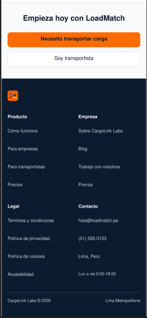

#### Aplicación del Design System

**Color.** El mock-up emplea exclusivamente los roles de color definidos en la sección 4.1.1.2. El naranja `#FE6B00` se reserva para el acento de marca y los llamados a la acción principales; el azul marino `#0B1C30` para encabezados, pie de página y texto sobre naranja; los grises de la escala Slate para cuerpo de texto, bordes y fondos alternativos. No se introduce ningún color fuera de esos roles.

**Contraste.** Todos los pares de texto y fondo cumplen el nivel AA de la WCAG 2.1: el texto de cuerpo alcanza 7.58:1 y los encabezados 17.85:1 sobre blanco. El caso crítico es el botón primario, donde el texto va en azul marino sobre el naranja de marca, alcanzando 5.98:1. La combinación de blanco sobre ese mismo naranja alcanza únicamente 2.87:1 y queda descartada en todo el sistema.

**Tipografía.** Se emplea la familia Inter en toda la landing page, con la escala definida en la sección 4.1.1.1. La variación de peso —400 para cuerpo, 600 para subtítulos y elementos interactivos, 700 para titulares— construye la jerarquía sin necesidad de introducir una segunda familia tipográfica.

**Espaciado y forma.** El espaciado sigue la escala de múltiplos de 4 px definida en la sección 4.1.1.3. El radio de esquina de 8 px se aplica de manera uniforme a botones, tarjetas y marcos de video, lo que produce una lectura visual coherente entre componentes.

**Iconografía.** Los iconos mantienen un trazo lineal uniforme, según lo establecido en la sección 4.1.1.4, y siempre acompañan a una etiqueta de texto. Ninguno actúa como portador único de significado.

**Consistencia con la aplicación web.** Los mismos roles de color, la misma familia tipográfica y el mismo radio de esquina se aplican en la aplicación web, de modo que el visitante que pasa de la landing page a la aplicación percibe continuidad visual. Esta correspondencia responde al requisito de consistencia de experiencia entre ambos productos.

## 4.4. Web Applications UX/UI Design

### 4.4.1. Web Applications Wireframes

Los wireframes de la Web Application de **LoadMatch** fueron elaborados con el propósito de definir la estructura, jerarquía de información, navegación y principales estados de interacción antes de aplicar la identidad visual definitiva del producto.

La aplicación considera dos perfiles principales: el **dador de carga o empresa**, encargado de publicar y gestionar solicitudes de transporte, y el **transportista**, quien puede buscar fletes, administrar sus viajes y gestionar la documentación necesaria para operar dentro de la plataforma.

Además de las pantallas principales, se diseñaron estados alternativos, mensajes de error, confirmaciones y ventanas modales que permiten representar el comportamiento esperado de la aplicación ante diferentes acciones del usuario.

#### Autenticación y registro

El acceso a LoadMatch parte de una interfaz de autenticación común para ambos perfiles. El wireframe contempla el ingreso mediante correo electrónico y contraseña, así como enlaces hacia los procesos de registro correspondientes.

  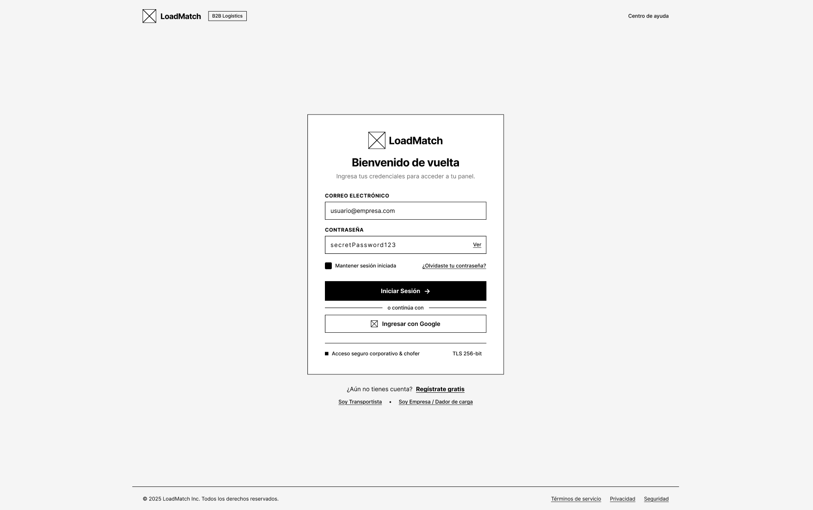

***Figura.*** Wireframe del formulario de inicio de sesión.

También se diseñó el estado de autenticación fallida, mediante el cual el sistema informa al usuario cuando las credenciales proporcionadas no son válidas y permite intentar nuevamente el acceso.

  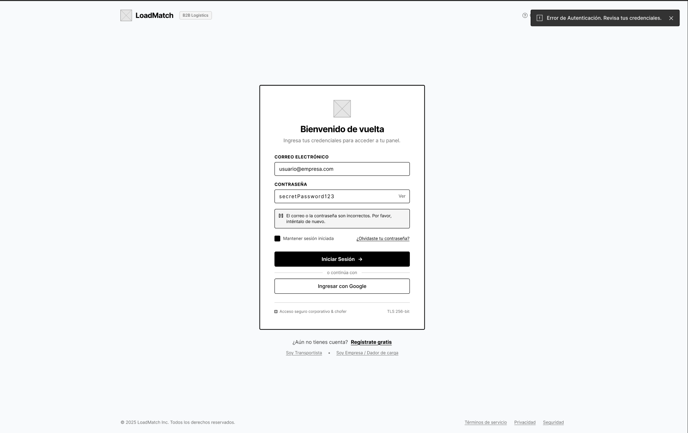

***Figura.*** Estado de error durante el inicio de sesión.

Para el registro del segmento empresarial, la interfaz solicita información como RUC, razón social, correo electrónico corporativo y contraseña, permitiendo identificar y validar a las empresas que utilizarán la plataforma como dadores de carga.

  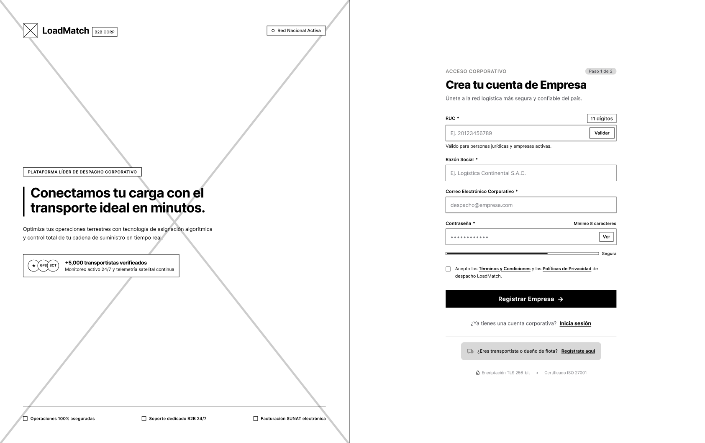

***Figura.*** Wireframe del proceso de registro de empresa.

Una vez completado correctamente el registro empresarial, se presenta una pantalla de confirmación que informa sobre la creación de la cuenta y ofrece accesos hacia el panel principal o hacia la publicación de la primera carga.

  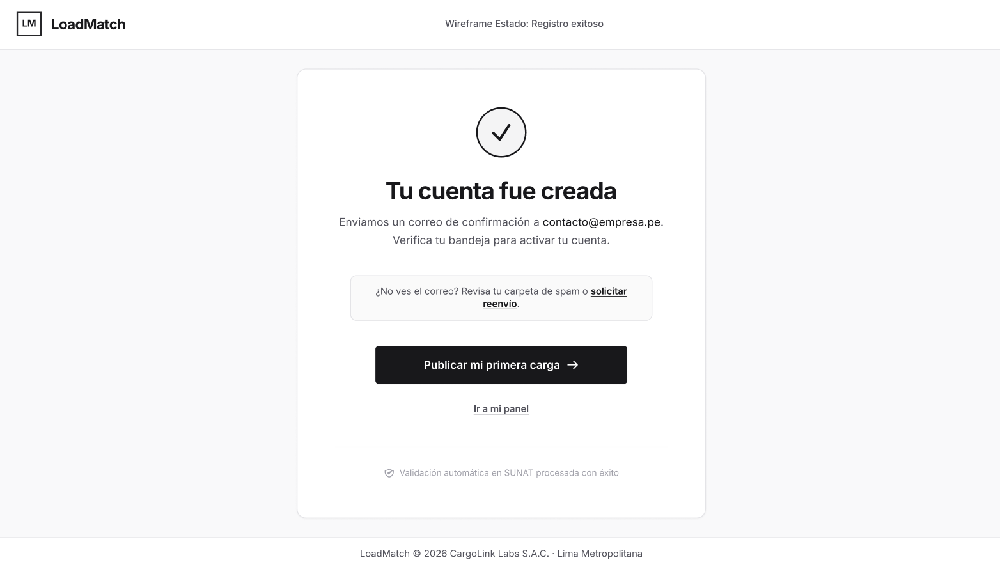

***Figura.*** Confirmación de registro exitoso.

Para los transportistas se definió un flujo de registro independiente, orientado a recopilar información personal y datos del vehículo necesarios para posteriormente validar su capacidad para prestar servicios mediante LoadMatch.

  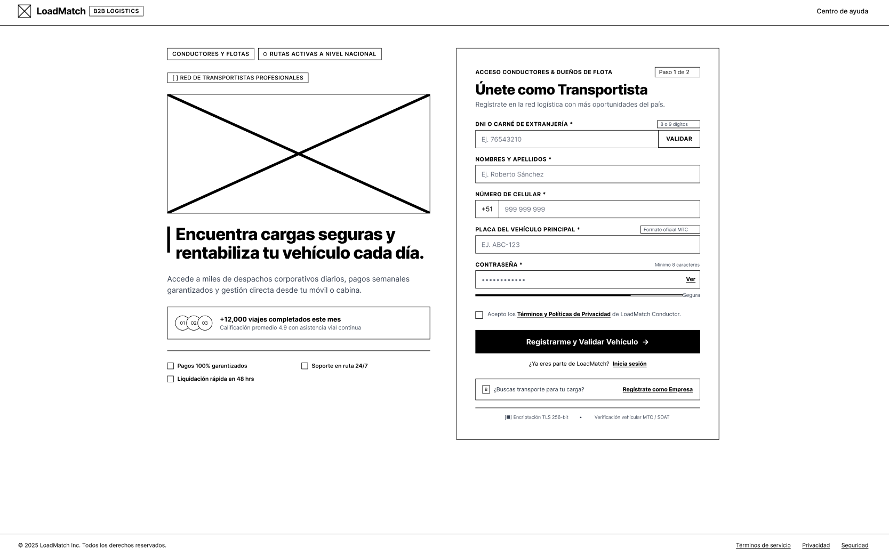

***Figura.*** Wireframe del proceso de registro de transportista.

#### Web Application para empresas y dadores de carga

Una vez autenticado, el usuario empresarial accede a un dashboard que resume el estado de sus operaciones. La interfaz presenta cargas activas, unidades en tránsito, servicios completados y accesos directos hacia las principales funciones de gestión.

  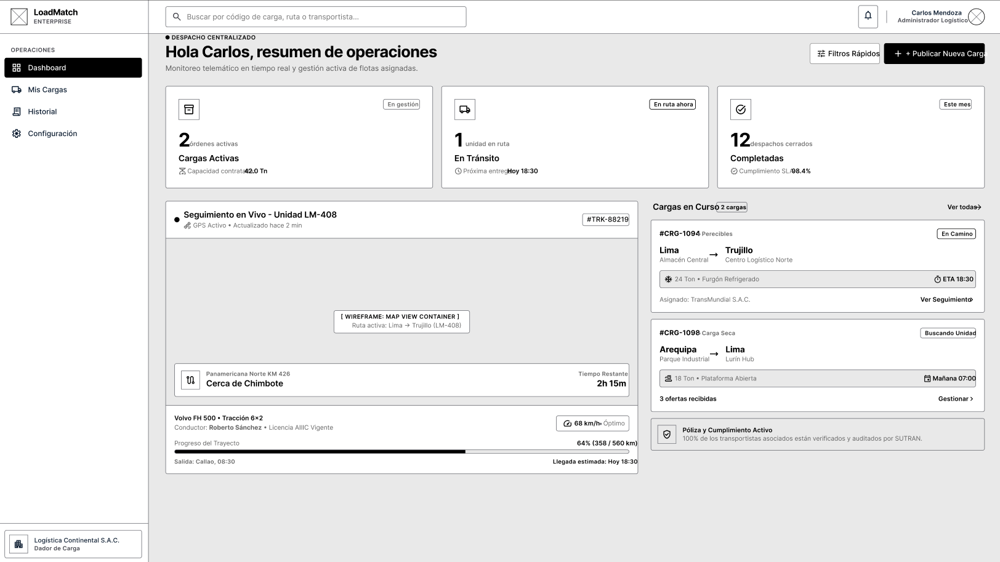

***Figura.*** Dashboard principal del usuario empresarial.

Desde este panel, el usuario puede iniciar la publicación de una nueva carga. La interfaz recopila información sobre origen, destino, tipo de vehículo, tipo de mercadería, fecha, horario, peso y otras condiciones necesarias para definir el servicio.

  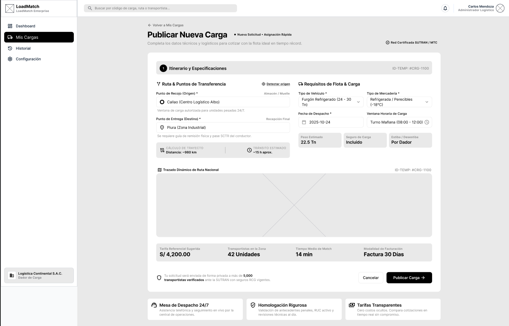

***Figura.*** Formulario para publicar una nueva carga.

Después de registrar correctamente la solicitud, el sistema muestra una confirmación con los datos principales del servicio y permite continuar hacia la gestión de las cargas publicadas.

  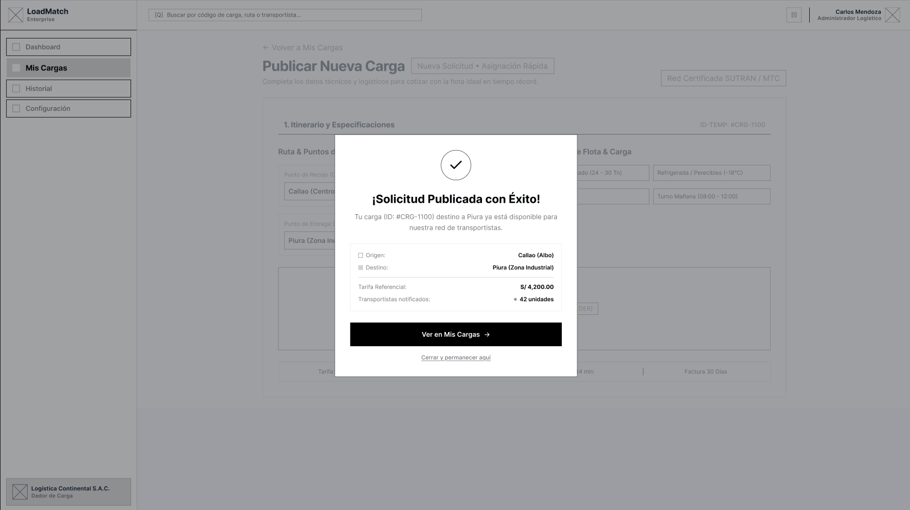

***Figura.*** Confirmación de publicación de una solicitud de carga.

La sección **Mis Cargas** permite visualizar las solicitudes registradas, sus rutas, estados actuales y acciones disponibles. Desde esta pantalla el usuario puede realizar seguimiento, gestionar o cancelar determinadas solicitudes.

  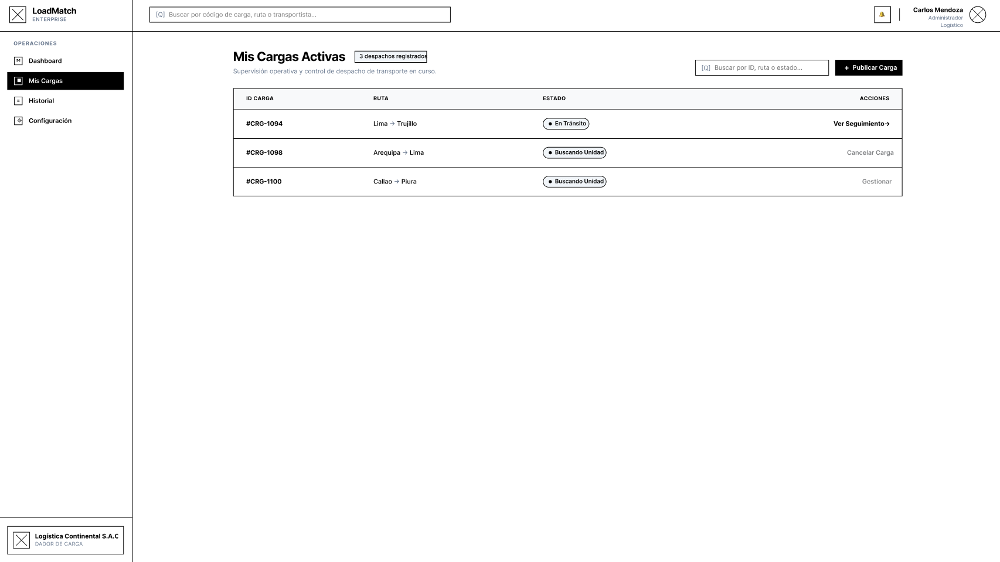

***Figura.*** Gestión de cargas activas de la empresa.

Para evitar acciones accidentales, la cancelación de una solicitud requiere una confirmación explícita mediante una ventana modal.

  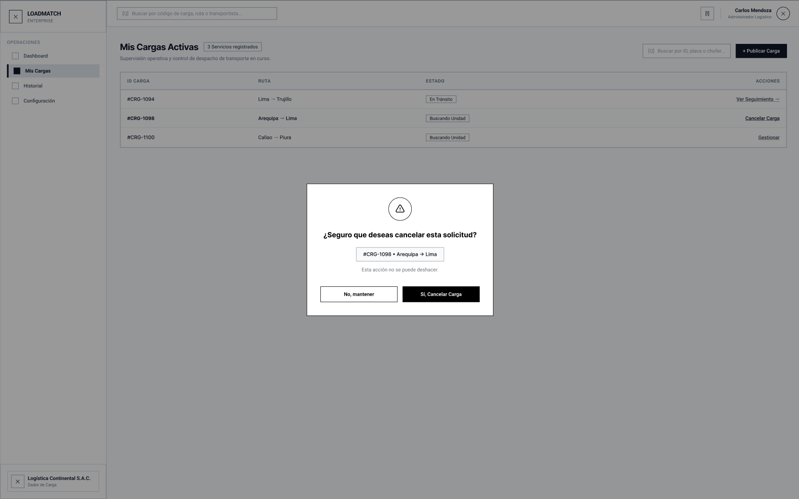

***Figura.*** Confirmación para cancelar una solicitud de carga.

Cuando un servicio se encuentra en ejecución, el usuario empresarial puede acceder al seguimiento de la carga. La pantalla presenta información sobre la ruta, ubicación del vehículo, conductor asignado, distancia restante y hora estimada de llegada.

  

***Figura.*** Seguimiento de una carga durante el transporte.

Una vez completada la entrega, el proceso continúa con la liquidación del servicio. El usuario puede ingresar la información correspondiente al método de pago antes de confirmar la transacción.

  

***Figura.*** Modal para el procesamiento del pago del servicio.

En caso de que la operación se complete correctamente, el sistema presenta una confirmación y permite al usuario calificar al transportista y registrar un comentario sobre el servicio recibido.

  

***Figura.*** Estado de pago exitoso y calificación del servicio.

También se contempla el escenario en el que la transacción sea rechazada. En este caso, la plataforma informa el motivo general del error y ofrece la posibilidad de reintentar el pago.

  

***Figura.*** Estado alternativo correspondiente a una transacción rechazada.

#### Web Application para transportistas

El transportista dispone de una interfaz orientada a la búsqueda y gestión de oportunidades de carga. La pantalla principal permite visualizar fletes disponibles y consultar información relacionada con ubicación, ruta, tipo de mercancía y tarifa ofrecida.

  

***Figura.*** Pantalla principal de búsqueda de fletes disponibles.

Para facilitar la identificación de oportunidades compatibles, el usuario puede aplicar filtros relacionados con distancia máxima, tipo de vehículo, peso mínimo y tarifa esperada.

  

***Figura.*** Filtros avanzados para la búsqueda de fletes.

Al seleccionar una oportunidad, el transportista puede acceder al detalle del servicio y consultar el origen, destino, características de la carga, información del dador y tarifa ofrecida antes de aceptar el viaje.

  

***Figura.*** Detalle de un flete y opción para aceptar el viaje.

Los viajes aceptados se administran desde la sección **Mis Viajes**, donde se muestran los servicios en progreso y completados, junto con las acciones disponibles para continuar su seguimiento.

  

***Figura.*** Gestión de viajes del transportista.

Durante la ejecución del servicio, el transportista dispone de una vista de monitoreo con información de la ruta, ubicación actual y progreso del viaje.

  

***Figura.*** Monitoreo del viaje durante su ejecución.

Cuando el conductor llega al destino, la plataforma solicita confirmar la llegada y adjuntar la documentación correspondiente que permita acreditar la entrega de la mercadería.

  

***Figura.*** Confirmación de llegada y finalización del viaje.

Los servicios completados pueden consultarse posteriormente desde el historial del transportista, donde se visualizan las rutas realizadas, clientes, montos y estados correspondientes.

  

***Figura.*** Historial de servicios completados.

#### Perfil y validación del transportista

LoadMatch considera un proceso de validación previo a la aceptación de determinados servicios. Cuando la cuenta todavía se encuentra en revisión, la plataforma bloquea la aceptación del viaje e informa al transportista sobre la necesidad de completar la verificación de sus documentos.

  

***Figura.*** Estado de cuenta en proceso de revisión.

La sección de perfil permite consultar los datos personales del transportista y administrar documentación relacionada con su habilitación, como el SOAT y la licencia de conducir.

  

***Figura.*** Gestión del perfil y documentación del transportista.

El proceso de carga documental contempla también escenarios de validación fallida, informando al usuario cuando un documento no cumple con los requisitos establecidos y permitiendo realizar una nueva carga.

  

***Figura.*** Validación de la licencia de conducir y estado de documento rechazado.

Una vez aprobada la documentación requerida, el sistema informa al transportista que su cuenta se encuentra habilitada para continuar con la aceptación de servicios disponibles dentro de la plataforma.

  

***Figura.*** Confirmación de cuenta verificada.

### 4.4.2. Web Applications Wireflow Diagrams

### 4.4.3. Web Applications Mock-ups

Registro de empresarios:


Registro de transportistas:


Login para usuarios registrados:


Dashboard de empresarios:


Publicar Nueva Carga:


Mis Cargas Activas:


Cancelación de cargas:


Seguimiento de Carga:


Pago por servicio:


Confirmaciones de pago:


Dashboard de transportistas:


Filtros de Búsqueda:


Detalles de Flete:


Estado de cuenta (licencias):


Perfil de Transportistas:


Carga de documentos (licencia):


Mis Viajes:


Seguimiento de Viajes y Llegada a destino:


Historial de Viajes:


### 4.4.4. Web Applications User Flow Diagrams

Ingreso y registro en la aplicación:


Ingreso de usuarios registrados:


Configuración de perfil (registro de SOAT y licencia):


Registro de nuevas cargas para transportar:


Seguimiento de cargas:


Búsqueda de fletes:


## 4.5. Web Applications Prototyping

A continuación veremos el funcionamiento preliminar de la aplicación por medio de un prototipo creado en la plataforma Figma, en donde se buscó reflejar el funcionamiento preliminar de los user flow diagrams mencionados anteriormente así como otras funciones básicas de la aplicación web:


<a href="https://www.figma.com/proto/b2Bc4VRPXUGY61iyefa5I6/LoadMatch---Open-Source?node-id=120-3&p=f&t=lAU4l4ZzCTUcVxt6-0&scaling=scale-down&content-scaling=fixed&page-id=120%3A2&starting-point-node-id=120%3A3">Prototipo en Figma de LoadMatch</a>

## 4.6. Domain-Driven Software Architecture

En esta sección se presenta la arquitectura de software de LoadMatch construida bajo el enfoque de Domain-Driven Design. El punto de partida es el Big Picture Event Storming desarrollado en el Capítulo II, sobre el cual el equipo profundizó mediante una sesión de Design-Level Event Storming para identificar con mayor precisión los eventos de dominio, comandos, políticas, modelos de lectura, agregados y bounded contexts que componen la solución.

A partir de los bounded contexts identificados se elaboró la representación de la arquitectura aplicando el Modelo C4, descendiendo desde el diagrama de contexto hasta los diagramas de componentes de cada contenedor. El orden no es casual: los bounded contexts descubiertos en el Event Storming son los que determinan la descomposición en componentes del Nivel 3, de modo que cada componente de la arquitectura puede rastrearse hasta un agrupamiento del tablero.

### 4.6.1. Design-Level Event Storming

Como referencia del punto de partida, se presenta el Big Picture Event Storming elaborado en el Capítulo II, ya con la notación de colores unificada respecto del Design-Level. El tablero recorre tres momentos: el registro libre de eventos por proceso, su ordenamiento cronológico, y la incorporación de actores, sistemas externos y la primera política identificada.

   
  <i>Nota. Big Picture Event Storming con actores y sistemas externos, elaborado en Miro.</i>

El equipo desarrolló una sesión de Design-Level Event Storming con una duración aproximada de dos horas, utilizando la herramienta Miro. La sesión partió de los cinco procesos identificados en el Big Picture Event Storming del Capítulo II —Autenticación y Perfil, Publicación, Matching, Flujo Operativo y Pagos— y avanzó por las diez etapas del método hasta llegar a la identificación de los bounded contexts.

**Step 1 — Unstructured Exploration.** El equipo registró de forma libre todos los eventos de dominio que ocurren en la operación de LoadMatch, sin preocuparse por el orden ni por las relaciones entre ellos. El objetivo de esta etapa es maximizar la cobertura del dominio antes de imponer cualquier estructura.

   
  <i>Nota. Exploración no estructurada de eventos de dominio, elaborada en Miro.</i>

**Step 2 — Chronology.** Los eventos se ordenaron en una línea de tiempo. Se emplearon dos carriles paralelos, uno para el recorrido de la Empresa y otro para el del Transportista, dado que ambos actores avanzan por caminos distintos que convergen en el momento de la asignación del viaje.

   
  <i>Nota. Ordenamiento cronológico de los eventos de dominio en carriles por actor.</i>

**Step 3 — Pain Points.** Se marcaron los puntos donde el proceso presenta fricción, ambigüedad o riesgo. Entre los principales se identificaron: la posibilidad de que la empresa elija entre varios transportistas o quede asignada automáticamente al primero que acepte; el abandono del viaje por parte del transportista asignado; el reporte de incidencias durante el traslado; y la garantía de cumplimiento para la empresa cuando el pago se habilita al final del servicio.

   
  <i>Nota. Identificación de pain points sobre la línea de tiempo del dominio. Los rombos magenta señalan los puntos de incertidumbre; su contenido se transcribe en la Tabla 4.1.</i>

**Tabla 4.1**

*Pain points identificados durante el Design-Level Event Storming*

| # | Etapa del flujo | Pain point | Estado |
| :--- | :--- | :--- | :--- |
| 1 | Matching | ¿Qué pasa si el transportista asignado no se presenta o abandona el viaje a mitad de camino? ¿Puede la empresa reasignarlo? | Fuera del alcance del MVP |
| 2 | Matching | ¿Debe la empresa poder elegir entre varios transportistas interesados, o queda asignada automáticamente al primero que acepta? | Resuelto: asignación automática |
| 3 | Trip Execution | ¿Cómo se reporta una incidencia durante el traslado —demora, avería, mercadería dañada— y quién la resuelve? | Fuera del alcance del MVP |
| 4 | Payment | Si el pago se habilita al finalizar el servicio, ¿qué garantiza a la empresa que el transportista cumplirá, y al transportista que cobrará? | Fuera del alcance del MVP |

**Step 4 — Pivotal Points.** Se delimitaron los momentos que cambian de manera irreversible el estado del negocio y que, por lo tanto, anticipan fronteras entre contextos: el registro validado del usuario, la publicación de la solicitud de carga, la aceptación del viaje, la entrega de la mercadería y la confirmación del pago.

   
  <i>Nota. Pivotal points que delimitan las fronteras entre etapas del dominio.</i>

**Step 5 — Commands.** Se identificaron las acciones que disparan cada evento, junto con el actor responsable de ejecutarlas. Entre los comandos principales se encuentran Crear Usuario Empresa, Crear Usuario Transportista, Registrar Vehículo, Subir Documento, Crear Solicitud de Carga, Cancelar Solicitud de Carga, Consultar Fletes Cercanos, Aceptar Viaje, Actualizar Estado del Viaje, Marcar Viaje como Completado, Pagar con Tarjeta y Calificar Transportista.

   
  <i>Nota. Comandos y actores que disparan cada evento de dominio.</i>

**Step 6 — Policies.** Se documentaron las reglas de reacción automática del sistema, expresadas con la estructura "cuando ocurre tal evento, entonces el sistema debe ejecutar tal acción". Las más relevantes son: cuando un documento es subido, validarlo automáticamente contra el padrón del MTC; cuando la documentación queda aprobada, habilitar el perfil del transportista; cuando un transportista no validado intenta aceptar un viaje, bloquear la operación; cuando un viaje queda asignado, retirar la solicitud del mercado; cuando la mercadería es entregada en destino, marcar el viaje como completado; y cuando el pago es procesado exitosamente, notificar al transportista.

   
  <i>Nota. Políticas de negocio identificadas sobre los eventos de dominio.</i>

**Step 7 — Read Models.** Se identificó la información que cada actor necesita consultar para poder decidir y ejecutar sus comandos: el panel principal, el detalle del flete, el historial de viajes, el mapa con la ruta al destino, los detalles del envío, las pantallas de pago y la pantalla de calificación. Durante esta etapa el equipo detectó que diez elementos registrados inicialmente como eventos de dominio eran en realidad modelos de lectura: describían pantallas o consultas —"detalle de flete visualizado", "historial de viajes consultado"— y no hechos de negocio ocurridos en el pasado. Se reclasificaron al color correspondiente y se fusionaron con los modelos de lectura equivalentes cuando ya existían, evitando la duplicación del mismo concepto bajo dos categorías.

   
  <i>Nota. Modelos de lectura requeridos por los actores del dominio.</i>

**Step 8 — External Systems.** Se identificaron los sistemas fuera del control de LoadMatch de los cuales depende la operación: el Padrón del MTC para validar placas, SOAT y licencias de conducir; Mapbox para geocodificación, rutas y cálculo de distancias; PayPal para procesar el cobro y la liquidación; el Servicio de Correo Electrónico para las notificaciones transaccionales; y el Object Storage para almacenar los documentos que sube el transportista.

   
  <i>Nota. Sistemas externos de los que depende la operación de LoadMatch.</i>

**Step 9 — Aggregates.** Los eventos y comandos se agruparon alrededor de las entidades que protegen sus invariantes de negocio. Se identificaron doce agregados: Usuario, Empresa, Transportista, Vehículo, Tipo de Vehículo, Documento, Tipo de Documento, Solicitud de Carga, Viaje, Pago, Clasificación y Mensaje de Contacto. Los agregados Tipo de Vehículo y Tipo de Documento se modelan como agregados de catálogo: se pueblan mediante datos semilla en la migración inicial y no participan de comandos ni eventos de dominio dentro del alcance del MVP, razón por la cual aparecen sin post-its asociados en el tablero. Se mantienen como agregados independientes —y no como Value Objects dentro de Vehículo o Documento— porque son compartidos por todas las unidades y documentos, que los referencian por identidad en lugar de contenerlos.

   
  <i>Nota. Agregados identificados a partir del agrupamiento de eventos y comandos.</i>

**Step 10 — Bounded Contexts.** Finalmente, los agregados y sus eventos se agruparon en contextos delimitados, cada uno con su propio lenguaje ubicuo y su propia frontera de consistencia. Se identificaron diez bounded contexts:

| BOUNDED CONTEXT | SUBDOMINIO | AGREGADOS | RESPONSABILIDAD |
| :--- | :--- | :--- | :--- |
| **IAM** | Genérico | Usuario | Credenciales, autenticación y ciclo de vida de la cuenta |
| **Profiles** | Soporte | Empresa, Transportista | Perfiles de negocio, RUC, datos de contacto y reputación |
| **Fleet** | Soporte | Vehiculo, TipoVehiculo | Registro de vehículos, placas y capacidades de carga |
| **Document Validation** | Soporte | Documento, TipoDocumento | Carga y validación automática de licencias, SOAT y tarjetas |
| **Freight Publishing** | Core | SolicitudDeCarga | Publicación, edición y cancelación de solicitudes de carga |
| **Matching** | Core | *(sin agregado)* | Búsqueda por proximidad, filtrado y asignación de viajes |
| **Trip Execution** | Core | Viaje | Ciclo de vida del viaje, estados y trazabilidad |
| **Payment** | Soporte | Pago | Cobro a la empresa y liquidación al transportista |
| **Rating** | Soporte | Clasificacion | Calificación post-viaje y cálculo de reputación |
| **Contact** | Genérico | MensajeContacto | Formularios de contacto y leads de la Landing Page |

   
  <i>Nota. Bounded contexts identificados al cierre del Design-Level Event Storming.</i>

Tres decisiones de modelado merecen ser explicadas:

En primer lugar, **se separó identidad de perfil**. IAM administra únicamente las credenciales mediante el agregado Usuario, mientras que Profiles administra los datos de negocio de la Empresa y del Transportista. La razón es que ambos tienen ciclos de vida distintos: un usuario puede existir sin haber completado su perfil, y el perfil cambia sin necesidad de tocar las credenciales. Mantenerlos juntos acoplaría la autenticación con reglas de negocio que nada tienen que ver con ella.

En segundo lugar, **Solicitud de Carga y Viaje son agregados separados en contextos distintos**. La solicitud vive publicada en el mercado hasta que un transportista la acepta; el viaje comienza en ese momento y tiene su propia máquina de estados. Son invariantes diferentes y ritmos de cambio diferentes, por lo que forzarlos dentro de un mismo agregado produciría una entidad sobrecargada.

En tercer lugar, **Matching no posee agregado propio**. Es un contexto de consulta y asignación: no crea ni modifica entidades que le pertenezcan, sino que orquesta sobre Solicitud de Carga y Transportista. Se implementa mediante un Domain Service y modelos de lectura. Un bounded context puede existir legítimamente sin agregados cuando su responsabilidad es de coordinación y consulta.

Finalmente, la sesión dejó identificados cuatro pain points que **quedan fuera del alcance del MVP** y se documentan como oportunidades de mejora: la reasignación de un viaje cuando el transportista abandona el servicio, el reporte de incidencias durante el traslado, la elección entre múltiples transportistas por parte de la empresa, y un esquema de garantía o retención de pago. Dejarlos registrados permite que el equipo priorice conscientemente y que estas necesidades puedan incorporarse en iteraciones posteriores.

### 4.6.2. Software Architecture Context Diagram

El Diagrama de Contexto define el alcance del sistema LoadMatch. Ubica a la plataforma en el centro, rodeada por los dos actores principales —la Empresa que necesita transportar mercadería y el Transportista que busca oportunidades de flete— y por los cinco sistemas externos de los cuales depende su operación.

La validación documental se apoya en el **Padrón del MTC**, que permite verificar la vigencia de placas, SOAT y licencias de conducir sin intervención manual. **Mapbox** provee geocodificación, cálculo de rutas y distancias, necesarios tanto para publicar una carga como para encontrar fletes cercanos. **PayPal** procesa el cobro del servicio a la empresa y la liquidación al transportista. El **Object Storage** almacena los documentos que el transportista sube durante su habilitación. Finalmente, el **Servicio de Correo Electrónico** entrega las notificaciones transaccionales, razón por la cual aparece también como origen de comunicaciones hacia ambos actores.

   
  <i>Nota. Diagrama de Contexto (C4 Nivel 1) elaborado en Structurizr aplicando el Modelo C4.</i>

### 4.6.3. Software Architecture Container Diagrams

El Diagrama de Contenedores expone la topología técnica de LoadMatch y cómo se distribuyen las responsabilidades entre sus unidades desplegables. LoadMatch se compone de cuatro contenedores.

La **Landing Page** es un sitio estático construido con HTML5, CSS3 y JavaScript que funciona como punto de entrada público y mecanismo de captación de leads. La **Single Page Application**, desarrollada en Angular 18 con TypeScript, concentra toda la operación transaccional: dashboards, catálogos y tableros de seguimiento para empresas y transportistas. El **Backend REST API**, implementado en Java 17 con Spring Boot 3, expone la API versionada y concentra las reglas de negocio, los bounded contexts del dominio y la orquestación de las integraciones externas. La persistencia se resuelve mediante una base de datos **PostgreSQL 16 con la extensión PostGIS**, necesaria para ejecutar las consultas de proximidad que sustentan el matching.

La comunicación entre la SPA y el Backend se realiza mediante JSON sobre HTTPS con autenticación por JWT, mientras que la Landing Page se limita a enviar formularios de contacto al mismo API. Todas las integraciones con sistemas externos se resuelven desde el Backend, de modo que ningún contenedor de presentación depende directamente de un tercero.

   
  <i>Nota. Diagrama de Contenedores (C4 Nivel 2) elaborado en Structurizr aplicando el Modelo C4.</i>

### 4.6.4. Software Architecture Components Diagrams

De acuerdo con el Modelo C4, se elabora un Diagrama de Componentes por cada contenedor con lógica propia. A continuación se presentan los tres correspondientes al Backend REST API, a la Single Page Application y a la Landing Page. La base de datos no requiere diagrama de componentes por tratarse de un contenedor de persistencia.

#### Backend REST API

El Backend se descompone en trece componentes. Diez de ellos corresponden **uno a uno con los bounded contexts identificados en el Event Storming**, lo que permite rastrear cada componente hasta un agrupamiento del tablero de Miro. Los tres restantes son transversales: el componente de **Security & JWT**, que autentica cada petición y resuelve el rol para la autorización por endpoint; el **Domain Event Publisher**, que desacopla los bounded contexts publicando y enrutando eventos de dominio in-process; y el componente de **Notification**, que se suscribe a esos eventos y los traduce en notificaciones transaccionales.

Los repositorios y las capas anticorrupción no se representan como componentes independientes, sino que residen dentro del paquete de infraestructura de cada bounded context. Por esa razón, cada flecha que va de un componente de dominio hacia un sistema externo representa su propia capa anticorrupción: es la traducción entre el modelo del tercero y el lenguaje ubicuo del contexto.

   
  <i>Nota. Diagrama de Componentes del contenedor Backend REST API (C4 Nivel 3), elaborado en Structurizr aplicando el Modelo C4.</i>

#### Single Page Application

La aplicación Angular replica la misma estructura del Backend: cada bounded context tiene su módulo de funcionalidad correspondiente, cargado bajo demanda mediante lazy loading según la ruta solicitada y el rol del usuario. Esta simetría facilita el mantenimiento, ya que un cambio en un contexto del dominio tiene un punto de impacto único y previsible en el frontend.

El núcleo de la aplicación está compuesto por tres elementos: el **App Shell & Routing**, responsable del layout y la navegación; el **Auth Guard & JWT Interceptor**, que protege las rutas según el rol, adjunta el token a cada petición saliente y cierra la sesión ante una respuesta 401; y el **Shared Kernel**, que concentra el servicio HTTP base, los modelos y assemblers compartidos, los componentes de interfaz reutilizables y la internacionalización.

   
  <i>Nota. Diagrama de Componentes del contenedor Single Page Application (C4 Nivel 3), elaborado en Structurizr aplicando el Modelo C4.</i>

#### Landing Page

La Landing Page se compone de seis elementos de propósito acotado: las secciones de contenido en HTML5 semántico, la navegación y el layout responsivo, los llamados a la acción que derivan al visitante hacia el registro en la SPA, el formulario de captación de leads que envía los datos al Backend, el módulo de SEO y Meta Tags descrito en la sección 4.2.3, y el selector de idioma que alterna el contenido entre español e inglés.

   
  <i>Nota. Diagrama de Componentes del contenedor Landing Page (C4 Nivel 3), elaborado en Structurizr aplicando el Modelo C4.</i>

## 4.7. Software Object-Oriented Design

En esta sección se presenta el detalle de implementación de cada bounded context mediante diagramas de clases UML. Siguiendo los principios de Domain-Driven Design, cada diagrama identifica su Aggregate Root, las entidades internas que viven bajo esa raíz, los Value Objects que encapsulan conceptos sin identidad propia, las enumeraciones que representan los estados del dominio y las interfaces de repositorio que definen el contrato de persistencia.

Los diagramas aplican de manera consistente las siguientes convenciones. Las referencias entre agregados se realizan **exclusivamente por identidad**, nunca mediante navegación de objetos: un Vehículo conoce el `TransportistaId` al que pertenece, pero no mantiene una referencia al objeto Transportista. Los identificadores son Value Objects tipados sobre UUID, lo que evita confundir un `VehiculoId` con un `TransportistaId` en tiempo de compilación. Cada agregado expone métodos de negocio expresivos en lugar de setters, de modo que las invariantes se protegen dentro del propio agregado. Finalmente, las entidades internas declaran constructores con visibilidad de paquete, garantizando que solo puedan crearse a través de su raíz.

### 4.7.1. Class Diagrams

#### Bounded Context: IAM

El contexto de identidad protege un único agregado, `Usuario`, que encapsula las credenciales y el ciclo de vida de la cuenta. El hash de la contraseña se modela como Value Object y el algoritmo de cifrado se delega en el puerto `PasswordHasher`, de modo que el dominio no conoce la implementación criptográfica.

   
  <i>Nota. Diagrama de Clases del bounded context IAM, elaborado en PlantUML.</i>

#### Bounded Context: Profiles

Este contexto administra dos agregados independientes, `Empresa` y `Transportista`, ambos vinculados a IAM únicamente por el `UsuarioId`. El Value Object `Ruc` incorpora la validación del dígito verificador mediante el algoritmo de módulo 11, y `Reputacion` encapsula el promedio de calificaciones junto con el total de evaluaciones recibidas.

   
  <i>Nota. Diagrama de Clases del bounded context Profiles, elaborado en PlantUML.</i>

#### Bounded Context: Fleet

El agregado `Vehiculo` mantiene los datos técnicos de la unidad y su estado de validación ante el MTC, mientras que `TipoVehiculo` actúa como catálogo que define las capacidades máximas admitidas. La consulta al padrón se realiza a través del puerto `PadronMtcService`, que devuelve un `ResultadoConsultaMtc` traducido al lenguaje del dominio.

   
  <i>Nota. Diagrama de Clases del bounded context Fleet, elaborado en PlantUML.</i>

#### Bounded Context: Document Validation

El agregado `Documento` controla el ciclo de aprobación de licencias, SOAT y tarjetas de propiedad. La validación es automática: el Domain Service `ServicioValidacionDocumental` consulta el padrón del MTC y determina el estado resultante. El archivo físico se almacena mediante el puerto `AlmacenamientoArchivosService`, que devuelve la URL firmada.

   
  <i>Nota. Diagrama de Clases del bounded context Document Validation, elaborado en PlantUML.</i>

#### Bounded Context: Freight Publishing

El agregado `SolicitudDeCarga` protege las invariantes de la publicación: valida el peso y las dimensiones, exige una fecha de recojo futura y controla las transiciones entre borrador, publicada, asignada y cancelada. El Value Object `Ruta` compone origen, destino y distancia calculada, apoyándose en el puerto `ServicioGeoespacial`.

   
  <i>Nota. Diagrama de Clases del bounded context Freight Publishing, elaborado en PlantUML.</i>

#### Bounded Context: Matching

Este contexto no posee Aggregate Root. Su responsabilidad es de coordinación y consulta, por lo que se implementa mediante el Domain Service `ServicioDeMatching`, la especificación `PoliticaHabilitacionTransportista` y los modelos de lectura `FleteDisponible` y `DetalleDeFlete`. Accede a los demás contextos exclusivamente a través de puertos de consulta, respetando la regla de referenciar por identidad.

   
  <i>Nota. Diagrama de Clases del bounded context Matching, elaborado en PlantUML.</i>

#### Bounded Context: Trip Execution

El agregado `Viaje` implementa una máquina de estados con siete posiciones, desde la asignación hasta la finalización. Cada transición se valida en el método privado `validarTransicion` y queda registrada como una entidad `HistorialEstadoViaje`, cuyo constructor es de visibilidad de paquete para garantizar que la trazabilidad solo pueda generarse desde la propia raíz del agregado.

   
  <i>Nota. Diagrama de Clases del bounded context Trip Execution, elaborado en PlantUML.</i>

#### Bounded Context: Payment

El agregado `Pago` distingue tres montos: el total cobrado a la empresa, la comisión de la plataforma y el importe liquidado al transportista. El `TokenPago` circula únicamente entre el agregado y el puerto `PasarelaDePagoService`, de modo que ningún dato de tarjeta se persiste ni se expone en el modelo de dominio.

   
  <i>Nota. Diagrama de Clases del bounded context Payment, elaborado en PlantUML.</i>

#### Bounded Context: Rating

El agregado `Clasificacion` registra quién califica y a quién, mediante los campos `evaluadorId`, `evaluadoId` y `tipoEvaluador`, lo que permite la calificación mutua entre empresa y transportista. El Value Object `Puntaje` valida el rango permitido en su propio constructor, y el Domain Service verifica que el viaje esté completado y que no exista una calificación previa del mismo evaluador.

   
  <i>Nota. Diagrama de Clases del bounded context Rating, elaborado en PlantUML.</i>

#### Bounded Context: Contact

El agregado `MensajeContacto` recibe los formularios provenientes de la Landing Page. Es el contexto más simple del modelo: registra el lead, clasifica al interesado según el segmento y controla si el mensaje ya fue atendido por el equipo comercial.

   
  <i>Nota. Diagrama de Clases del bounded context Contact, elaborado en PlantUML.</i>

## 4.8. Database Design

El diseño de la base de datos traduce el modelo de dominio a un esquema relacional sobre PostgreSQL 16, manteniendo la separación por bounded contexts establecida en las secciones anteriores. La correspondencia no es únicamente conceptual: **cada bounded context recibe su propio schema de PostgreSQL** —`iam`, `profiles`, `fleet`, `documents`, `freight`, `trip`, `payment`, `rating` y `contact`—, de modo que la frontera lógica del Domain-Driven Design queda materializada físicamente en la base de datos y cada contexto resulta dueño exclusivo de sus tablas. El bounded context Matching no recibe schema, en coherencia con no poseer agregados propios.

El mapeo del modelo de clases al esquema relacional sigue reglas consistentes:

| Concepto del modelo de dominio | Representación en la base de datos |
| :--- | :--- |
| **Aggregate Root** | Tabla principal con llave primaria propia |
| **Entidad interna** | Tabla hija con llave foránea hacia la raíz y borrado en cascada |
| **Value Object** | Columnas embebidas con prefijo, nunca una tabla independiente |
| **Referencia entre agregados** | Columna de llave foránea, sin navegación de objetos |
| **Enumeración** | `VARCHAR` con restricción `CHECK`, nunca valores ordinales |
| **Marca de tiempo** | `TIMESTAMPTZ`, para preservar la zona horaria |

Las llaves primarias son de tipo **`UUID`**, en correspondencia con los Value Objects de identidad definidos en los diagramas de clases. Esta decisión responde a dos motivos. Permite generar el identificador antes de persistir el agregado, lo que simplifica la publicación de eventos de dominio dentro de la misma transacción. Y evita exponer en las URL el volumen de operaciones de la plataforma, ya que un identificador secuencial revelaría cuántas cargas o usuarios existen en el sistema.

Los Value Objects se almacenan como columnas embebidas con un prefijo que identifica al objeto de origen. Así, el Value Object `Ruta` de una solicitud de carga se persiste como `origen_direccion`, `origen_distrito`, `origen_lat`, `origen_lng` y sus equivalentes de destino; el Value Object `Dinero` se descompone en `tarifa_monto` y `tarifa_moneda`. De esta manera se conserva la trazabilidad hacia el modelo de clases sin generar tablas adicionales para objetos que carecen de identidad propia.

Las restricciones no se limitan a las llaves. El esquema incorpora **restricciones `CHECK` que protegen invariantes de negocio directamente en la base de datos**: el puntaje de una calificación debe situarse entre 1 y 5, el evaluador no puede coincidir con el evaluado, la suma de la comisión de plataforma y el monto de liquidación no puede superar el monto total cobrado, y el peso bruto de un vehículo no puede ser inferior a su carga útil. De este modo, una falla en la capa de aplicación no puede producir datos inconsistentes.

El esquema completo se encuentra versionado en el repositorio del proyecto como `loadmatch-schema.sql` y fue ejecutado y verificado sobre una instancia de PostgreSQL 16, incluyendo pruebas que confirman que las restricciones rechazan efectivamente los datos inválidos.

### 4.8.1. Database Diagrams

A continuación se presenta el Diagrama Entidad-Relación de cada bounded context, especificando tablas, columnas, tipos de datos, llaves primarias y restricciones de llave foránea, unicidad y validación.

El bounded context **Matching no cuenta con tablas propias**, dado que su responsabilidad es de consulta y asignación: opera mediante consultas de proximidad con PostGIS sobre las tablas de Freight Publishing y Profiles. Por esa razón se presentan nueve diagramas y no diez.

Antes del detalle por contexto, la siguiente vista general presenta las trece tablas del modelo agrupadas por schema. Permite apreciar cómo la separación en bounded contexts se materializa en la base de datos y cómo las referencias entre contextos se resuelven siempre por llave foránea sobre el identificador, nunca por navegación de objetos.

   
  <i>Nota. Vista general del modelo relacional agrupado por bounded context, elaborada en PlantUML.</i>

#### Bounded Context: IAM

El schema `iam` contiene una única tabla. La columna `rol` permite resolver la autorización del token JWT sin necesidad de consultar el schema `profiles`, evitando dos consultas adicionales en cada inicio de sesión. La relación con los perfiles es de uno a cero-o-uno: un usuario puede existir sin haber completado aún su perfil de empresa o de transportista.

   
  <i>Nota. Diagrama Entidad-Relación del bounded context IAM, elaborado en PlantUML.</i>

#### Bounded Context: Profiles

Las tablas `empresas` y `transportistas` se vinculan a `iam.usuarios` mediante una llave foránea con restricción de unicidad, lo que garantiza la correspondencia uno a uno entre cuenta y perfil. Los Value Objects `Direccion`, `LicenciaConducir` y `Reputacion` aparecen como grupos de columnas embebidas. La columna `reputacion_total_evaluaciones` permite recalcular el promedio de forma incremental, sin recorrer la tabla de calificaciones en cada nueva evaluación.

   
  <i>Nota. Diagrama Entidad-Relación del bounded context Profiles, elaborado en PlantUML.</i>

#### Bounded Context: Fleet

El catálogo `tipos_vehiculo` define las capacidades máximas admitidas y se carga como datos semilla en la migración inicial. La tabla `vehiculos` registra las dimensiones completas de la unidad —largo, ancho y alto—, necesarias para el filtro de compatibilidad descrito en la sección 4.2.4. El estado de validación ante el MTC se modela como enumeración de tres valores y no como booleano, de modo que sea posible distinguir una unidad pendiente de validación de una efectivamente rechazada.

   
  <i>Nota. Diagrama Entidad-Relación del bounded context Fleet, elaborado en PlantUML.</i>

#### Bounded Context: Document Validation

La tabla `documentos` incorpora un **índice único parcial** que permite un solo documento aprobado por tipo y transportista, pero deja abierta la posibilidad de volver a presentarlo tras un rechazo o un vencimiento. Una restricción `CHECK` exige que todo documento rechazado registre su motivo, dando soporte al evento de notificación identificado en el Event Storming.

   
  <i>Nota. Diagrama Entidad-Relación del bounded context Document Validation, elaborado en PlantUML.</i>

#### Bounded Context: Freight Publishing

La tabla `solicitudes_carga` concentra los Value Objects `Ruta`, `Dimensiones` y `Dinero` como columnas embebidas. Las columnas `tarifa_monto` y `tipo_mercaderia` sustentan respectivamente el filtro de tarifa mínima y el dato mostrado en las tarjetas de resultado, ambos descritos en la sección 4.2.4. Un índice espacial GIST sobre la geografía del punto de origen, provisto por la extensión PostGIS y restringido a las solicitudes publicadas, soporta la búsqueda por proximidad que ejecuta el contexto Matching mediante `ST_DWithin`.

   
  <i>Nota. Diagrama Entidad-Relación del bounded context Freight Publishing, elaborado en PlantUML.</i>

#### Bounded Context: Trip Execution

La tabla `viajes` mantiene una restricción de unicidad sobre `solicitud_carga_id`, garantizando que una solicitud genere a lo sumo un viaje. La entidad interna `historial_estado_viaje` registra cada transición con su estado anterior y su estado nuevo, y se elimina en cascada junto con el viaje, lo que refleja que su ciclo de vida depende por completo de la raíz del agregado.

   
  <i>Nota. Diagrama Entidad-Relación del bounded context Trip Execution, elaborado en PlantUML.</i>

#### Bounded Context: Payment

La tabla `pagos` distingue tres montos: el total cobrado a la empresa, la comisión retenida por la plataforma y el importe liquidado al transportista. Una restricción `CHECK` impide que la suma de la comisión y la liquidación supere el monto total, y otra exige que todo pago marcado como completado registre su referencia de pasarela y su fecha de procesamiento. Ningún dato de tarjeta se persiste: hacia la pasarela solo circulan tokens.

   
  <i>Nota. Diagrama Entidad-Relación del bounded context Payment, elaborado en PlantUML.</i>

#### Bounded Context: Rating

La tabla `clasificaciones` incorpora las columnas `evaluador_id`, `evaluado_id` y `tipo_evaluador`, que permiten la calificación mutua entre empresa y transportista e identifican sin ambigüedad quién califica a quién. Una restricción de unicidad sobre la combinación de viaje y evaluador impide que un mismo participante califique dos veces el mismo servicio, y una restricción `CHECK` impide la autocalificación.

   
  <i>Nota. Diagrama Entidad-Relación del bounded context Rating, elaborado en PlantUML.</i>

#### Bounded Context: Contact

La tabla `mensajes_contacto` no mantiene relaciones con el resto del modelo, dado que el lead llega desde la Landing Page antes de que exista una cuenta en la plataforma. Un índice parcial sobre la fecha de envío, restringido a los mensajes no atendidos, permite listar eficientemente la bandeja pendiente del equipo comercial.

   
  <i>Nota. Diagrama Entidad-Relación del bounded context Contact, elaborado en PlantUML.</i>

