# Capítulo V: Product Implementation, Validation & Deployment

LoadMatch es el producto de CargoLink Labs orientado a conectar empresas que necesitan trasladar mercadería con transportistas que disponen de vehículos compatibles. Este capítulo establece la configuración del desarrollo, la implementación por sprints y los mecanismos de validación y despliegue, manteniendo trazabilidad con los segmentos del Capítulo I, las necesidades del Capítulo II, las User Stories del Capítulo III y el diseño del Capítulo IV.

La presente versión desarrolla el alcance de AV1: Software Configuration Management y Sprint 1 de la Landing Page. 

## 5.1. Software Configuration Management

La Gestión de Configuración de Software (SCM) en el proyecto LoadMatch establece las herramientas, convenciones y prácticas utilizadas para organizar el desarrollo colaborativo de los productos de software. Durante esta fase inicial, el trabajo se enfoca en el desarrollo de la presencia digital estática mediante el Landing Page, utilizando una estructura basada en HTML5, CSS3 y JavaScript, preparada para evolucionar e integrarse con los servicios de la plataforma en sprints posteriores. Su propósito es permitir que cada integrante reproduzca el entorno de trabajo y que cada entrega pueda vincularse con el código, las pruebas y la documentación que la sustentan.

### 5.1.1. Software Development Environment Configuration

Para mantener la consistencia en el entorno de desarrollo y evitar discrepancias de configuración entre los ingenieros de software, se ha estandarizado el siguiente ecosistema de herramientas nativas y de gestión:

| Dominio | Herramienta / Estándar | Propósito Técnico | Tipo de Acceso / Ruta | Imagen |
| --- | --- | --- | --- | --- |
| **Project Management** | Jira Software | Gestión del Product Backlog, Sprints y estimación en Story Points para el seguimiento ágil. | https://www.atlassian.com/es/software/jira |  |
| **Product UX/UI Design** | Figma | Creación de wireframes, prototipos interactivos y diseño del sistema de componentes visuales. | https://www.figma.com/es-la/ |  |
| **Frontend Structure** | Semantic HTML5 | Estructuración semántica del Document Object Model (DOM) para optimización de accesibilidad y SEO. | Estándar W3C |  |
| **Frontend Styling** | CSS3 (Grid/Flexbox) | Diseño responsivo (Mobile-First), animaciones y maquetación sin dependencias de frameworks externos. | Estándar W3C |  |
| **Frontend Logic** | Vanilla JavaScript (ES6+) | Manipulación del DOM, validación de formularios asíncrona y control de eventos interactivos. | Estándar ECMAScript |  |
| **IDE** | Visual Studio Code | Edición de código con extensiones de formateo (Prettier) y análisis estático de JS (ESLint). | https://code.visualstudio.com/ |  |
| **Version Control** | Git + GitHub | Gestión distribuida del código fuente, flujos de integración y revisión de pares (Pull Requests). | https://github.com/ |  |
| **Comunicación** | Google Meet | Videollamadas para coordinación de equipo, reuniones remotas y presentaciones en tiempo real. | https://meet.google.com/ |  |

### 5.1.2. Source Code Management

La gestión del código fuente de LoadMatch se realiza mediante **Git** como sistema de control de versiones distribuido y **GitHub** como plataforma de almacenamiento, colaboración y revisión del código. Los productos de software se mantienen en repositorios independientes dentro de la organización `Desarrollo-Open-Source-grupo-5`, permitiendo separar el Landing Page, la Frontend Web Application, los Web Services y la documentación del proyecto.

Los repositorios utilizados por el equipo son los siguientes:

| Repositorio | Producto |
| --- | --- |
| https://github.com/Desarrollo-Open-Source-grupo-5/Loadmatch-landing-page | Landing Page |
| https://github.com/Desarrollo-Open-Source-grupo-5/Loadmatch-frontend-application | Frontend Web Application |
| https://github.com/Desarrollo-Open-Source-grupo-5/Loadmatch-backend-application | Web Services (RESTful API) |
| https://github.com/Desarrollo-Open-Source-grupo-5/Loadmatch-report | Informe y documentación del proyecto |

Estos enlaces identifican los repositorios declarados.

#### GitFlow Workflow

El equipo utiliza **GitFlow** como estrategia de ramificación para organizar el desarrollo colaborativo. Las funcionalidades son desarrolladas de manera aislada y posteriormente integradas mediante Pull Requests, permitiendo revisar los cambios antes de incorporarlos a las ramas compartidas.

La estructura de ramas definida es la siguiente:

**GitFlow Workflow**

| Rama | Propósito | Origen e integración |
| --- | --- | --- |
| `main` | Contiene las versiones estables y aprobadas del proyecto. | Recibe integraciones desde `develop` cuando se valida una entrega final. |
| `develop` | Rama de integración donde se consolidan las funcionalidades de los capítulos. | Recibe las ramas `feature/*` y se integra en `main` al finalizar un ciclo. |
| `feature/Chapter1` | Implementación de entregables e imágenes del Capítulo I (carpeta `assets/images`). | Se crea como rama independiente y apunta a `develop` mediante Pull Request. |
| `feature/Chapter2` | Implementación de entregables e imágenes del Capítulo II (carpeta `assets/images`). | Se crea como rama independiente y apunta a `develop` mediante Pull Request. |
| `feature/Chapter3` | Implementación de entregables e imágenes del Capítulo III (carpeta `assets/images`). | Se crea como rama independiente y apunta a `develop` mediante Pull Request. |
| `feature/Chapter4` | Implementación de entregables e imágenes del Capítulo IV (carpeta `assets/images`). | Se crea como rama independiente y apunta a `develop` mediante Pull Request. |
| `feature/Chapter5` | Implementación de entregables e imágenes del Capítulo V (carpeta `assets/images`). | Se crea como rama independiente y apunta a `develop` mediante Pull Request. |

El GitFlow Workflow es una estrategia de organización de ramas en Git que define cómo se crean, nombran y fusionan las ramas dentro de un proyecto.

Las ramas **feature/** se usan para desarrollar funcionalidades específicas o capítulos, y apuntan a develop para integrarse.

La rama **develop** es la rama de integración, donde se consolidan los cambios antes de pasar a main.

La rama **main** contiene las versiones estables y finales del proyecto.

Los Pull Requests deben documentar la historia relacionada, los cambios realizados, validaciones y evidencia visual, asegurando que otro integrante revise antes de integrar.

**Semantic Versioning 2.0.0**

Cada producto mantendrá su propia numeración `MAJOR.MINOR.PATCH`: `MAJOR` para cambios incompatibles en su contrato público, `MINOR` para nuevas funcionalidades compatibles y `PATCH` para correcciones compatibles. Durante el desarrollo inicial se podrán utilizar versiones `0.y.z`. Los tags, por ejemplo `v1.0.0`, identificarán el commit publicado; no se registrará un tag como existente hasta verificarlo. Referencia: [Semantic Versioning 2.0.0](https://semver.org/spec/v2.0.0.html).

**Conventional Commits**

Los mensajes se redactarán en inglés con el formato `type(scope): description`. Se utilizarán `feat` para funcionalidades, `fix` para correcciones, `docs` para documentación, `refactor` para reorganización interna y `chore` para mantenimiento. `style` se reservará para formato del código; un cambio visual que agrega o corrige comportamiento se clasificará según su finalidad. Los cambios incompatibles se identificarán con `!` o con un pie `BREAKING CHANGE:`. Referencia: [Conventional Commits 1.0.0](https://www.conventionalcommits.org/en/v1.0.0/).

Ejemplos de mensajes propuestos:

```text
feat(hero): explain benefits for shippers and carriers
feat(fleet): display supported vehicle capacities
fix(contact): reject invalid email addresses
docs(sprint1): add execution evidence
```

### 5.1.3. Source Code Style Guide & Conventions

El equipo establece las convenciones de codificación que se aplicarán durante el desarrollo de **LoadMatch** para mantener un código legible, consistente y fácil de mantener. Estas directrices comprenden **HTML, CSS y JavaScript vanilla** para la Landing Page, **TypeScript con Angular** para la Web Application y **Java con Spring Boot** para los Web Services, en correspondencia con el stack tecnológico del curso y la arquitectura definida en el Capítulo IV.

Como regla transversal, los identificadores y comentarios del código se redactarán en **inglés**, manteniendo correspondencia con el *Ubiquitous Language* del Capítulo II. Los textos visibles para los usuarios respetarán el idioma y el tono de comunicación definidos para el producto.

Las convenciones se documentarán en los repositorios correspondientes. Se utilizará **.editorconfig** para establecer reglas comunes de indentación y codificación, **Prettier** para el formato de los archivos compatibles y **ESLint** para el análisis estático de JavaScript y TypeScript. Las configuraciones deberán mantenerse bajo control de versiones para que puedan ser utilizadas por todos los integrantes.

---

#### Convenciones por lenguaje

| Lenguaje | Convenciones del proyecto |
| --- | --- |
| **HTML5** | Utilizar elementos semánticos como `header`, `nav`, `main`, `section` y `footer`. Mantener jerarquía coherente de encabezados, asociar etiquetas con controles de formulario e incluir textos alternativos apropiados para imágenes. Declarar idioma con `lang`. Identificadores descriptivos en `kebab-case`. |
| **CSS3** | Aplicar metodología **BEM** para nombrar clases (ej. `contact-form__input`, `contact-form__button--disabled`). Centralizar colores, tipografías y espaciados mediante variables CSS. Usar **Flexbox/Grid** y media queries para adaptación. Evitar estilos duplicados y selectores excesivamente específicos. |
| **JavaScript vanilla** | Usar `const` por defecto y `let` cuando exista reasignación. Variables y funciones en `camelCase`. Comparación estricta (`===`). Eventos con `addEventListener`. Separar lógica de HTML y manejar estados de carga, éxito y error en operaciones asíncronas. |
| **TypeScript con Angular** | Definir tipos para datos del dominio y contratos de API. Evitar `any` sin justificación. Clases e interfaces en `PascalCase`; propiedades y métodos en `camelCase`. Organizar interfaz en componentes y concentrar acceso a servicios externos en servicios inyectables. Gestionar eventos mediante mecanismos de Angular. |
| **Java con Spring Boot** | Clases e interfaces en `PascalCase`, métodos y atributos en `camelCase`, constantes en `UPPER_SNAKE_CASE`, paquetes en minúsculas. Usar inyección de dependencias por constructores. Separar responsabilidades entre dominio, aplicación, infraestructura e interfaces. Evitar reglas de negocio en controladores REST. |

---

#### Indentación y formato
- **HTML, CSS, JavaScript, TypeScript** → 2 espacios.  
- **Java** → 4 espacios.  
- Usar espacios en lugar de tabulaciones.  
- Guardar archivos en **UTF-8**.  
- Eliminar espacios al final de las líneas y mantener una nueva línea al final de cada archivo.  
- Configuraciones versionadas para asegurar formato uniforme.  

Los comentarios deberán explicar decisiones, restricciones o comportamientos no evidentes. Se evitarán comentarios redundantes que repitan la instrucción.

---

#### Consistencia con el diseño

| Elemento | Convención |
| --- | --- |
| Tipografía principal | **Inter**, con pesos y jerarquías del diseño. |
| Tipografía complementaria | **Liberation Serif**, limitada a títulos y elementos de identidad. |
| Color principal | Primary Orange: `#FE6B00`. |
| Color de interacción | Orange Pressed: `#A04100`. |
| Color estructural oscuro | Dark Navy: `#0B1C30`. |
| Fondo claro | Background Light: `#F8FAFC`. |

- Botones con fondo **Primary Orange** → texto oscuro (contraste).  
- Mensajes de error → texto descriptivo + indicador visual (no solo color).  
- Tokens visuales centralizados para reutilización.  
- En Angular, configuración de **Angular Material** deberá conservar identidad visual de LoadMatch.  
- Adaptación a dispositivos → preservar legibilidad, navegación y accesibilidad.  
- Controles interactivos → etiquetas comprensibles y estado de foco visible para navegación con teclado.  

---

#### Organización de la aplicación y los servicios
La organización del código mantendrá correspondencia con los contextos definidos en el Capítulo IV:  
**IAM, Profiles, Fleet, Document Validation, Freight Publishing, Matching, Trip Execution, Payment, Rating y Contact.**

- En **Angular**: archivos agrupados por funcionalidad/contexto. Componentes → presentación e interacción. Servicios → acceso a API y lógica compartida.  
- En **Spring Boot**: separación clara de responsabilidades:  
  - **Dominio** → entidades, objetos de valor, reglas de negocio.  
  - **Aplicación** → coordinación de casos de uso.  
  - **Infraestructura** → persistencia e integración con servicios externos.  
  - **Interfaces** → controladores REST y contratos de entrada/salida.  

La validación en formularios del navegador facilita la interacción, pero no sustituye las validaciones del backend. Los servicios deberán verificar datos y reglas de negocio antes de modificar el estado de la aplicación.  

Los contratos de entrada/salida de la API se mantendrán separados de las entidades persistentes. Los nombres en español del diseño deberán mapearse a identificadores en inglés en la implementación. Esta correspondencia se documentará y actualizará en el Capítulo IV para conservar trazabilidad.

#### Guías de referencia

El equipo utilizará las siguientes fuentes como apoyo para definir y mantener sus convenciones. Las decisiones específicas adoptadas para LoadMatch quedarán documentadas en cada repositorio.

- **HTML y CSS:** [Google HTML/CSS Style Guide](https://google.github.io/styleguide/htmlcssguide.html).
- **JavaScript:** [Google JavaScript Style Guide](https://google.github.io/styleguide/jsguide.html).
- **TypeScript:** [TypeScript Handbook](https://www.typescriptlang.org/docs/handbook/intro.html).
- **Angular:** [Angular Coding Style Guide](https://angular.dev/style-guide).
- **Java:** [Google Java Style Guide](https://google.github.io/styleguide/javaguide.html), como referencia complementaria; para la indentación prevalece la regla de cuatro espacios del proyecto.
- **Configuración de formato:** [EditorConfig](https://editorconfig.org/) y [Prettier](https://prettier.io/docs/).
- **Análisis estático de JavaScript y TypeScript:** [ESLint](https://eslint.org/docs/latest/) y [typescript-eslint](https://typescript-eslint.io/).

### 5.1.4. Software Deployment Configuration

**Landing Page**

La Landing Page se publica en GitHub Pages desde la rama `main` y la carpeta raíz (`Settings > Pages > Deploy from a branch`, rama `main`, carpeta `/ (root)`), donde se encuentra `index.html`. El archivo `.nojekyll` evita el procesamiento con Jekyll y la opción *Enforce HTTPS* permanece activa. No se usa dominio personalizado. Referencia: [Configuración de la fuente de publicación de GitHub Pages](https://docs.github.com/en/pages/getting-started-with-github-pages/configuring-a-publishing-source-for-your-github-pages-site).

Cada versión se integra primero en `develop`, pasa por una rama `release/x.y.z` que actualiza `CHANGELOG.md`, se fusiona en `main` mediante Pull Request y se etiqueta con Semantic Versioning (`vX.Y.Z`). Antes de publicar se revisan rutas de recursos, navegación, comportamiento móvil, formulario y ausencia de errores de consola; después se abre la URL pública para confirmar el despliegue.

**Web Application, API y persistencia**

El alojamiento de estos productos se definirá en entregas posteriores. La configuración deberá contemplar construcción de Angular, resolución de sus rutas, URL de la API, ejecución de Java 17, conexión a PostgreSQL/PostGIS y aplicación controlada de cambios del esquema. La API deberá configurar los orígenes autorizados de la Landing Page y Web Application cuando exista acceso desde el navegador.

Mapbox, PayPal, almacenamiento de archivos y correo son integraciones previstas en el Capítulo IV. Sus credenciales, entornos y disponibilidad deben verificarse antes de documentar una integración operativa. La consulta automática al MTC también permanece condicionada al acceso real a una fuente adecuada, conforme a las restricciones del Capítulo I.

---

## 5.2. Landing Page, Services & Applications Implementation

La implementación de LoadMatch se desarrolla mediante incrementos que transforman los requisitos y diseños del proyecto en productos de software. En esta entrega se presenta el Sprint 1, cuyo incremento es la Landing Page publicada en GitHub Pages.

### 5.2.1. Sprint 1

Durante el Sprint 1 se implementó y desplegó la Landing Page de LoadMatch, producto de CargoLink Labs que conecta empresas que necesitan trasladar mercadería con transportistas con capacidad disponible. La página utiliza HTML5, CSS3 y JavaScript vanilla, sin framework de interfaz ni proceso de compilación.

El incremento contiene navegación adaptable, propuesta de valor, indicadores del contexto logístico, explicación del funcionamiento por segmento, catálogo de tipos de vehículos, tarjetas de confianza, beneficios para empresas y transportistas, testimonios, precios por comisión, preguntas frecuentes, formulario de contacto, sección de videos, cierre con llamada a la acción, pie de página y página legal. También incorpora cambio de idioma entre inglés y español, y enlaces preparados hacia la Web Application.

#### 5.2.1.1. Sprint Planning 1

| Sprint # | Sprint 1 |
| --- | --- |
| **Sprint Planning Background** | |
| Date | 07/09/2026 |
| Time | 08:30 p.m. |
| Location | Google meet |
| Prepared By | Christoper Steven Rivas Castillo |
| Attendees (to planning meeting) | Noriega Collado, Jean Fabio<br>Simon Calderon, Ismael Sebastian<br>Collantes Artola, Marco Antonio<br>Benigno Montero, Harold Fauskorp<br>Rivas Castillo, Christoper Steven  |
| Sprint 1 Review Summary | Se publicó la versión 1.0.0 de la Landing Page en GitHub Pages. Se completaron 10 de las 11 User Stories del sprint (25 de 27 Story Points): propuesta de valor, catálogo de vehículos, formulario de contacto, cambio de idioma, precios, preguntas frecuentes, navegación adaptable, acceso a la aplicación por segmento, testimonios e información legal. US28 (videos) queda en curso porque los videos About-the-Product y About-the-Team se publican en AV2; la página muestra un aviso de disponibilidad próxima en su lugar. |
| Sprint 1 Retrospective Summary | El equipo destacó la división del Landing Page en ramas por sección, que permitió trabajar en paralelo y dejar evidencia por integrante. Como aspectos por mejorar se identificaron: registrar en Jira desde el inicio todas las historias del Landing Page (ocho se agregaron durante el sprint), integrar las ramas a `develop` de forma continua para evitar conflictos acumulados, revisar el orden de los archivos CSS antes de fusionar, y contrastar el backlog con los wireframes antes de retirar una sección. Para el Sprint 2 se acordó mantener GitFlow con Pull Requests y *Create a merge commit*, y estimar con más holgura la integración entre ramas. |
| **Sprint Goal & User Stories** | |
| Sprint 1 Goal | Nuestro foco está en publicar el Landing Page de LoadMatch para comunicar el modelo de negocio y captar leads tempranos de empresas y transportistas. Se logra cuando el sitio está desplegado y accesible públicamente. |
| Sprint 1 Velocity | 25 |
| Sum of Story Points | 27 puntos comprometidos: US12 = 3, US13 = 2, US14 = 2, US21 = 3, US22 = 2, US23 = 2, US24 = 3, US25 = 2, US26 = 2, US27 = 2 y US28 = 2. Completados: 25. |

*Nota. El sprint se planificó del 12/09 al 15/09 con US12, US13 y US14 (7 puntos). Durante su ejecución se registraron en Jira las historias US21 a US28, que cubren secciones del Landing Page ya incluidas en el diseño del Capítulo IV, y la fecha de cierre se extendió al 16/09 para completar la integración y el despliegue. US28 se trasladó al Product Backlog al cerrar el sprint.*

#### 5.2.1.2. Aspect Leaders and Collaborators

La matriz LACX identifica al líder (L) y a los colaboradores (C) de cada aspecto del sprint, según las ramas y Pull Requests del repositorio.

| Team Member | GitHub Username | Estructura, estilos e integración | Secciones del Landing Page | Idiomas y contenido comercial | Documentación y despliegue |
| --- | --- | --- | --- | --- | --- |
| Benigno Montero, Harold Fauskorp | Harold-11 | L | C | C | L |
| Noriega Collado, Jean Fabio | dumbaskidd | C | L | - | C |
| Simon Calderon, Ismael Sebastian | Mayel-dev | C | C | - | C |
| Rivas Castillo, Christoper Steven | CODERT0PH | - | C | - | C |
| Collantes Artola, Marco Antonio | Markollantes2307 | - | C | L | - |

*Nota. Emilia participó en la planificación y se retiró del curso durante el sprint, por lo que no figura en la matriz.*

#### 5.2.1.3. Sprint Backlog 1

| User Story Id | User Story Title | Work Item/Task Id | Work Item/Task Title | Description | Estimation | Assigned To | Status |
| --- | --- | --- | --- | --- | --- | --- | --- |
| US12 | Visualización de propuesta de valor | T01 | Implementación del Hero y propuesta de valor | Presentar la conexión entre empresas y transportistas, beneficios y accesos por perfil. | 8 h | Harold Benigno Montero | Done |
| US13 | Consulta de tipos de vehículos | T02 | Implementación del catálogo de vehículos | Sección responsive con tipos de vehículos y capacidades de carga mediante HTML5 y CSS Grid. | 6 h | Harold Benigno Montero | Done |
| US14 | Formulario de contacto | T03 | Implementación del formulario de contacto | Formulario con validación de campos obligatorios y formato de correo, mensajes de error y confirmación. | 6 h | Harold Benigno Montero | Done |
| US21 | Cambio de idioma del Landing Page | T04 | Implementación de diccionarios EN/ES y cargador de idioma | Diccionarios `en.json` y `es.json` y cargador `i18n.js` con preferencia guardada. | 6 h | Marco Collantes Artola | Done |
| US22 | Consulta de planes y precios | T05 | Implementación de la sección de precios por comisión | Tres tarjetas con plan destacado, adaptadas a una columna en tablet. | 4 h | Marco Collantes Artola | Done |
| US23 | Consulta de preguntas frecuentes | T06 | Implementación del acordeón de preguntas frecuentes | Acordeón accesible con `aria-expanded` y paneles ocultos. | 4 h | Marco Collantes Artola | Done |
| US24 | Navegación adaptable del Landing Page | T07 | Implementación de cabecera, menú móvil y adaptación responsive | Cabecera fija, panel de navegación bajo 1360 px, hero y métricas apilados. | 8 h | Jean Fabio Noriega Collado | Done |
| US25 | Acceso a la aplicación por segmento | T08 | Conexión de los botones con la aplicación web | `config.js` con `APP_BASE_URL` y respaldo a secciones internas. | 4 h | Ismael Sebastian Simon Calderon | Done |
| US26 | Visualización de testimonios de usuarios | T09 | Implementación de testimonios y carrusel | Tarjetas con aviso de contenido de ejemplo y carrusel con indicadores y contador. | 4 h | Christoper Steven Rivas Castillo | Done |
| US27 | Consulta de información legal y de contacto | T10 | Implementación del pie de página y páginas legales | Pie de página con navegación y contacto, y página de términos, privacidad, cookies y accesibilidad. | 6 h | Christoper Steven Rivas Castillo | Done |
| US28 | Visualización de videos del producto y del equipo | T11 | Implementación de la sección de videos | Dos marcos 16:9 con pie de foto; los videos se publican en AV2. | 3 h | Ismael Sebastian Simon Calderon | In Progress |

**Tablero:** [Sprint Board de LoadMatch en Jira](https://upc-team-m57tll9j.atlassian.net/jira/software/projects/US/boards/2).

**Evidencia del cierre del Sprint 1 en Jira:**

<p align="center">
  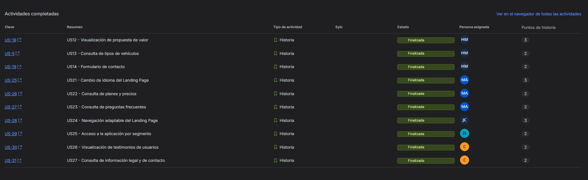
</p>

***Figura.*** Informe del Sprint 1 en Jira: 10 User Stories finalizadas (25 Story Points) y US28 en curso (2 Story Points), que pasa al siguiente sprint.

<p align="center">
  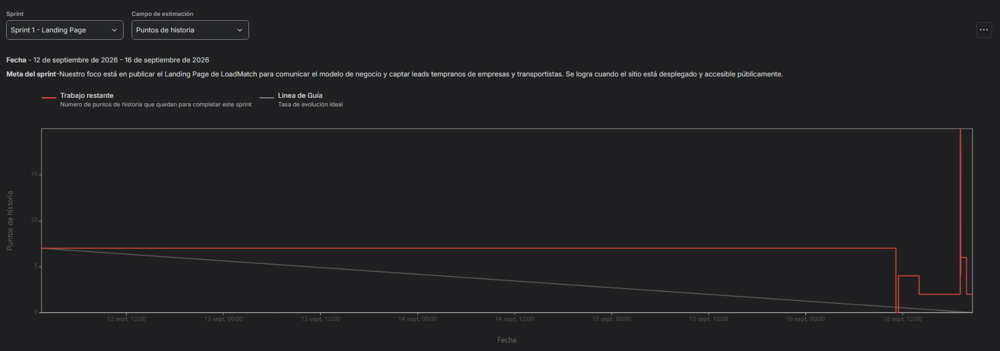
</p>

***Figura.*** Diagrama de trabajo pendiente (*sprint burndown*) del Sprint 1, del 12/09/2026 al 16/09/2026, con la meta del sprint.

<p align="center">
  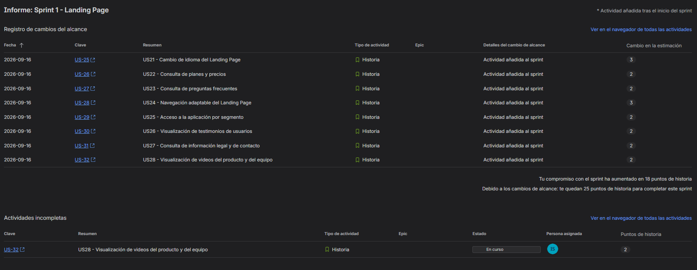
</p>

***Figura.*** Registro de cambios del alcance del Sprint 1.

El sprint se inició con US12, US13 y US14 (7 Story Points). Durante la revisión del sprint, el equipo registró en Jira las historias US21 a US28, que correspondían a secciones ya planificadas y en desarrollo en el repositorio. Estas se incorporaron formalmente el 16/09/2026 y aumentaron el compromiso en 18 Story Points, hasta 27. Por esa razón, el diagrama de trabajo pendiente muestra un salto al final del periodo.

*Nota. Las horas de las tareas no se suman con los Story Points.*

#### 5.2.1.4. Development Evidence for Sprint Review

El incremento se desarrolló con GitFlow: una rama por sección, integración a `develop` mediante Pull Request con *Create a merge commit* y publicación desde `main` con la etiqueta `v1.0.0`. La tabla resume un commit representativo por rama; el historial completo está disponible en el repositorio.

| Repository | Branch | Commit Id | Commit Message | Commit Message Body | Committed on |
| --- | --- | --- | --- | --- | --- |
| Loadmatch-landing-page | feature/project-setup | 8d13c00 | feat(seo): add HTML5 skeleton with SEO and Open Graph meta tags | Esqueleto HTML5 con metadatos | 12/09/2026 |
| Loadmatch-landing-page | feature/design-tokens | 7a8d52c | feat(tokens): add colour, spacing, type and radius design tokens | Tokens del sistema de diseño | 12/09/2026 |
| Loadmatch-landing-page | feature/header-navigation | fee3b18 | feat(nav): add mobile menu toggle with Escape key and focus return | Menú móvil accesible | 12/09/2026 |
| Loadmatch-landing-page | feature/hero-section | 7c94c08 | feat(hero): add hero section with headline, lead and segment CTAs | Propuesta de valor | 12/09/2026 |
| Loadmatch-landing-page | feature/metrics-band | cce648c | feat(metrics): add market indicators band with MTC sources | Indicadores del mercado | 12/09/2026 |
| Loadmatch-landing-page | feature/pricing-plans | b4fa8e7 | feat(pricing): add commission-based pricing section | Precios por comisión | 12/09/2026 |
| Loadmatch-landing-page | feature/faq-accordion | 3187e34 | feat(faq): add accordion behaviour with aria-expanded and hidden panels | Acordeón accesible | 12/09/2026 |
| Loadmatch-landing-page | feature/final-cta | f5af922 | feat(cta): add closing call-to-action band | Banda de cierre | 12/09/2026 |
| Loadmatch-landing-page | feature/i18n-locales | 12f8fb5 | feat(i18n): add English and Latin American Spanish dictionaries | Diccionarios EN/ES | 12/09/2026 |
| Loadmatch-landing-page | feature/how-it-works-tabs | 442300c | feat(tabs): add accessible audience tabs with arrow-key navigation | Pestañas por segmento | 14/09/2026 |
| Loadmatch-landing-page | feature/trust-cards | 4a8eb42 | feat(trust): add trust and verification cards | Tarjetas de confianza | 14/09/2026 |
| Loadmatch-landing-page | feature/youtube-videos | fe734a9 | feat(videos): add LoadMatch product and team video section | Sección de videos | 14/09/2026 |
| Loadmatch-landing-page | feature/cta-app-links | 2eb0ae6 | feat(cta): connect landing page actions to web application | Enlaces a la Web Application | 14/09/2026 |
| Loadmatch-landing-page | feature/audience-sections | b2efd78 | feat(audience): add segment blocks for companies and carriers | Bloques por segmento | 16/09/2026 |
| Loadmatch-landing-page | feature/testimonials-carousel | fb2285f | feat(carousel): add scroll-snap carousel with dot controls on mobile | Carrusel de testimonios | 16/09/2026 |
| Loadmatch-landing-page | feature/site-footer | 32e60ea | feat(footer): add site footer with navigation and legal links | Pie de página | 16/09/2026 |
| Loadmatch-landing-page | feature/legal-pages | 9fa1278 | feat(legal): add terms of service, privacy and cookie policy page | Página legal | 16/09/2026 |
| Loadmatch-landing-page | bugfix/css-structure | 46f4315 | fix(css): restore main, components and responsive stylesheets to their intended content | Corrección de hojas de estilo | 16/09/2026 |
| Loadmatch-landing-page | bugfix/duplicate-header | 6fee99d | fix(html): remove duplicated header and order sections as in the approved design | Corrección de estructura | 16/09/2026 |
| Loadmatch-landing-page | feature/app-screenshots | ecc9159 | feat(img): add application screenshots for the how-it-works steps | Capturas de la aplicación | 16/09/2026 |
| Loadmatch-landing-page | feature/vehicle-types | 920a718 | feat(vehicles): add vehicle types catalogue with cargo capacities | Catálogo de vehículos (US13) | 16/09/2026 |
| Loadmatch-landing-page | feature/contact-form | 81d31b6 | feat(contact): add validated contact form | Formulario de contacto (US14) | 16/09/2026 |
| Loadmatch-landing-page | feature/video-placeholders | ad5be56 | feat(videos): show coming-soon placeholders until the videos are published | Avisos de video | 16/09/2026 |
| Loadmatch-landing-page | release/1.0.0 | b2f1b2e | chore(release): prepare v1.0.0 | CHANGELOG de la versión | 16/09/2026 |

**Repositorio:** [Loadmatch-landing-page](https://github.com/Desarrollo-Open-Source-grupo-5/Loadmatch-landing-page) · **Pull Requests:** #2 al #25 · **Etiqueta:** [`v1.0.0`](https://github.com/Desarrollo-Open-Source-grupo-5/Loadmatch-landing-page/releases/tag/v1.0.0)

**Artefactos de desarrollo**

| Artefacto | Contenido |
| --- | --- |
| `index.html` | Estructura semántica, metadatos, secciones del Landing Page, formulario de contacto y enlaces configurables hacia la Web Application. |
| `assets/css/main.css` | Tokens de color, tipografía Inter, espaciado y estilos base. |
| `assets/css/components.css` | Estilos de cada componente, incluidos catálogo, formulario y avisos de video. |
| `assets/css/responsive.css` | Media queries de 1359, 1023, 767 y 389 px, impresión y reducción de movimiento. |
| `assets/js/main.js` | Enlaces a la aplicación, menú móvil, pestañas, acordeón, carrusel y validación del formulario. |
| `assets/js/i18n.js` | Carga de diccionarios, aplicación de textos y preferencia de idioma. |
| `assets/i18n/en.json`, `es.json` | Textos en inglés (en_US) y español latinoamericano (es_419). |
| `docs/terms-and-conditions.html` | Términos, privacidad, cookies y accesibilidad. |
| `CHANGELOG.md` | Registro de cambios de la versión 1.0.0. |
| `.editorconfig`, `.gitignore`, `.nojekyll`, `LICENSE` | Convenciones de formato, exclusiones, publicación estática y licencia MIT. |

#### 5.2.1.5. Execution Evidence for Sprint Review

La Landing Page se verificó en navegador a 1440, 1024, 768 y 390 px de ancho: sin recursos faltantes, sin errores de consola y sin desplazamiento horizontal. Se comprobaron también las traducciones completas en ambos idiomas y los enlaces a la página legal.

**1. Inicio e indicadores del contexto logístico**

El Hero presenta la propuesta de encontrar transporte sin disponer de flota propia y diferencia las llamadas a la acción de empresa y transportista. La sección de indicadores muestra cifras de contexto atribuidas al MTC, presentadas como antecedentes del problema.

<p align="center">
  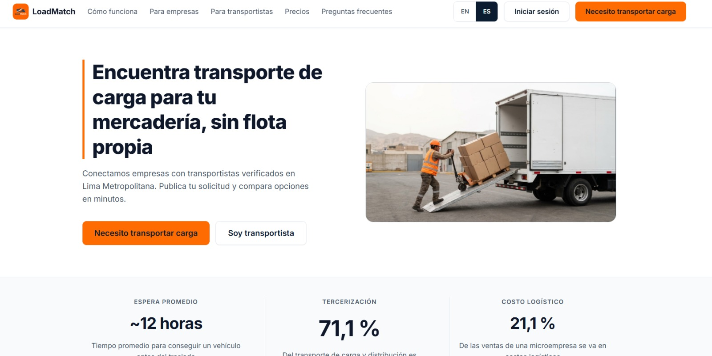
</p>

**2. Funcionamiento, catálogo de vehículos y beneficios por segmento**

La sección «Cómo funciona» contiene pestañas para empresas y transportistas, navegables con clic y con las flechas, Home y End del teclado. Desde el primer paso, el botón «Ver tipos de vehículos» lleva al catálogo (US13), que muestra furgoneta de carga (hasta 1 t), camión ligero (hasta 3 t) y camión mediano (hasta 5 t), con un aviso de que son datos de ejemplo. Las tarjetas posteriores presentan confianza y beneficios por segmento.

<p align="center">
  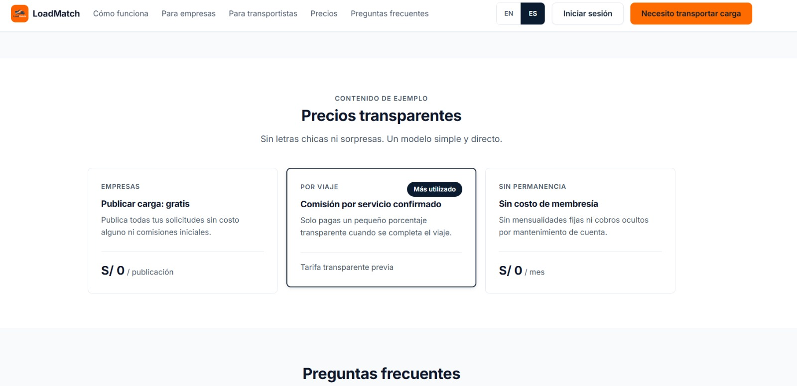
</p>

<p align="center">
  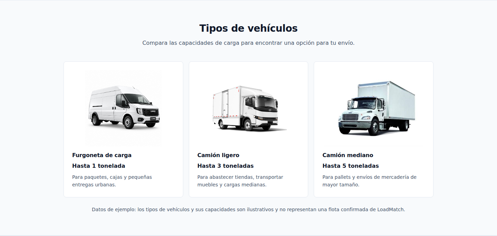
</p>

***Figura.*** Catálogo de tipos de vehículos (US13) con capacidades de carga y aviso de datos de ejemplo.

**3. Testimonios y modelo de precios**

Se incluyen tres testimonios identificados como contenido de ejemplo, con carrusel en móvil. La sección de precios describe la publicación gratuita, la comisión por servicio y la ausencia de membresía mensual.

<p align="center">
  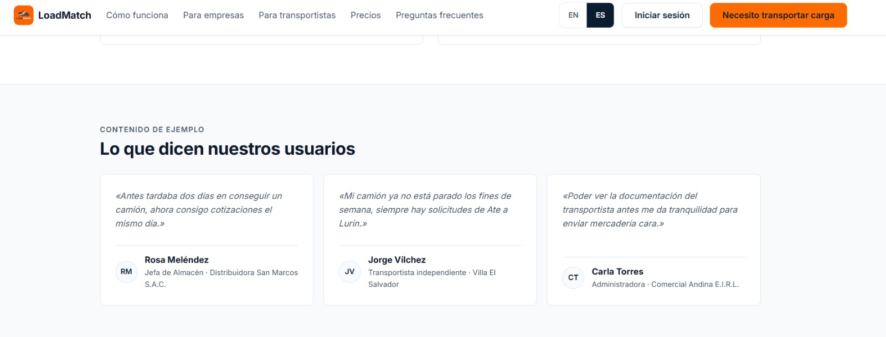
</p>

<p align="center">
  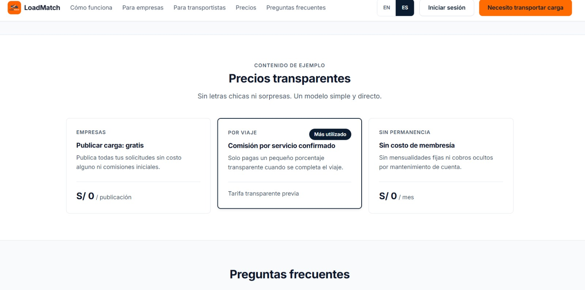
</p>

**4. Preguntas frecuentes y formulario de contacto**

El acordeón incluye cinco preguntas sobre costos, cobertura, validación de transportistas, incidencias y tipos de carga.

El formulario de contacto (US14) solicita nombre, correo, tipo de usuario y mensaje. Al enviarlo con campos vacíos o con un correo inválido, impide el envío y muestra el error debajo de cada campo; con datos válidos, muestra un mensaje de confirmación y limpia el formulario. Es un formulario de demostración: valida en el navegador y todavía no almacena los mensajes, lo que corresponde al contexto Contact del backend.

<p align="center">
  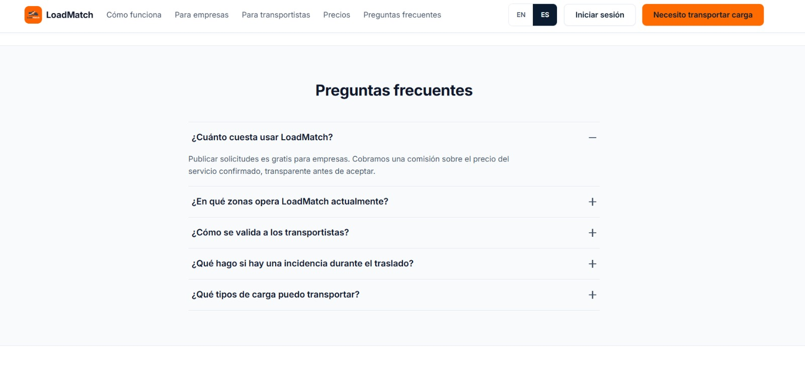
</p>

<p align="center">
  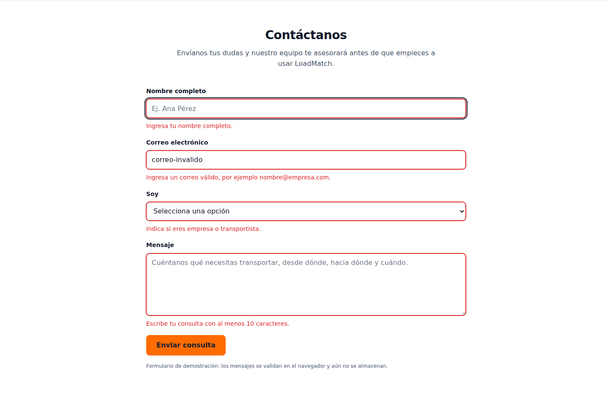
</p>

***Figura.*** Formulario de contacto (US14) enviado con campos vacíos y un correo inválido: cada campo muestra su mensaje de error.

<p align="center">
  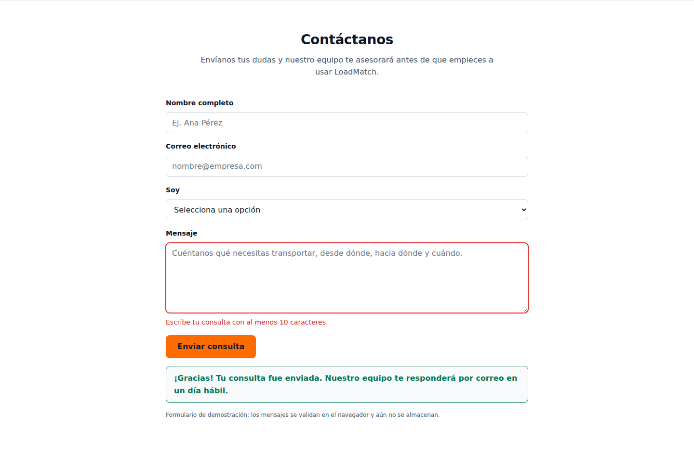
</p>

***Figura.*** Formulario de contacto (US14) tras un envío válido: mensaje de confirmación y campos limpios.

**5. Idiomas, adaptación y accesibilidad**

La selección inicial de idioma prioriza la preferencia guardada, luego el idioma del navegador y finalmente inglés. La página incluye un enlace para saltar al contenido principal, atributos ARIA, foco visible y contraste AA en los pares de color usados.

<p align="center">
  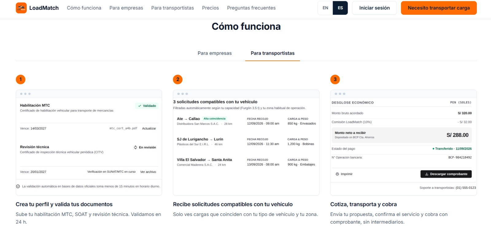
</p>

</br>

<p align="center">
  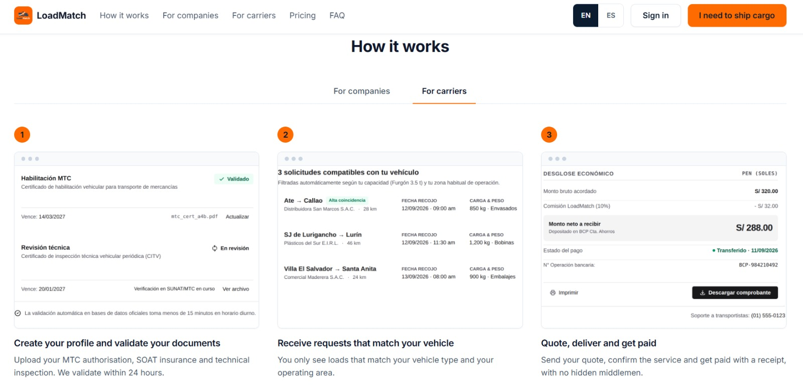
</p>

**6. Llamadas a la acción y videos**

Los botones de registro e inicio de sesión usan `data-app-path`. Mientras `APP_BASE_URL` esté vacía, llevan a la sección correspondiente de la página mediante `data-app-fallback`, sin enlaces rotos. Los dos espacios de video muestran «Video disponible próximamente» hasta la publicación de About-the-Product y About-the-Team en AV2.

**Registro de comprobaciones**

| Verificación | Resultado |
| --- | --- |
| Recursos locales | Sin archivos faltantes ni errores de consola. |
| Propuesta de valor, US12 | Cumple. |
| Catálogo, US13 | Cumple: tipos de vehículos con capacidades. |
| Formulario, US14 | Cumple: validación, mensajes de error y confirmación. |
| Idiomas, US21 | Cumple: textos completos en EN y ES, preferencia guardada. |
| Precios y FAQ, US22 y US23 | Cumple. |
| Navegación adaptable, US24 | Cumple a 1440, 1024, 768 y 390 px. |
| Acceso a la aplicación, US25 | Cumple el escenario sin aplicación desplegada. |
| Testimonios e información legal, US26 y US27 | Cumple. |
| Videos, US28 | Pendiente: avisos de disponibilidad próxima. |

**Video de navegación del Sprint Review:** [Video Sprint 1 Review](https://upcedupe-my.sharepoint.com/shared?id=%2Fpersonal%2Fu202310342%5Fupc%5Fedu%5Fpe%2FDocuments%2FDesarrollo%20de%20Open%20Source%20%2D%202026%2D2&listurl=%2Fpersonal%2Fu202310342%5Fupc%5Fedu%5Fpe%2FDocuments)

#### 5.2.1.6. Services Documentation Evidence for Sprint Review

El incremento del Sprint 1 es un sitio estático y no contiene una API RESTful propia. El uso de `fetch` se limita a cargar los diccionarios de traducción, por lo que no existe documentación OpenAPI/Swagger para esta entrega.

La recepción real de las consultas del formulario de contacto corresponderá al contexto Contact del backend en un sprint posterior.

**Repositorio backend:** [Loadmatch-backend-application](https://github.com/Desarrollo-Open-Source-grupo-5/Loadmatch-backend-application).

#### 5.2.1.7. Software Deployment Evidence for Sprint Review

La versión 1.0.0 se publicó en GitHub Pages desde la rama `main`.

| Evidencia | Detalle |
| --- | --- |
| Repositorio | [Loadmatch-landing-page](https://github.com/Desarrollo-Open-Source-grupo-5/Loadmatch-landing-page) |
| Plataforma | GitHub Pages, rama `main`, carpeta `/ (root)`, HTTPS obligatorio. |
| URL pública | [desarrollo-open-source-grupo-5.github.io/Loadmatch-landing-page](https://desarrollo-open-source-grupo-5.github.io/Loadmatch-landing-page/) |
| Pull Request de publicación | #25, `release/1.0.0` → `main` |
| Commit publicado | `077d002` |
| Etiqueta | `v1.0.0` |
| Fecha de publicación | 16/09/2026 |
| Prueba posterior | Carga de la URL pública, navegación, cambio de idioma y página legal. |

<p align="center">
  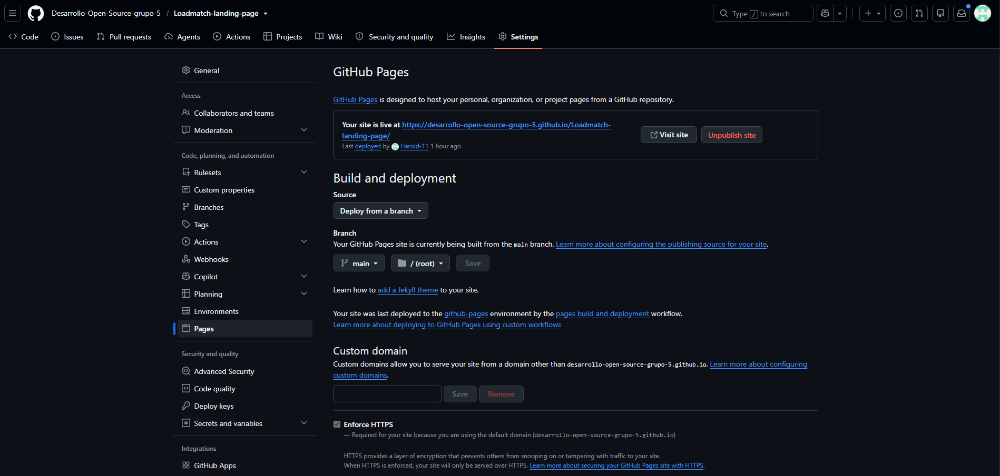
</p>

***Figura.*** Configuración de GitHub Pages en `Settings > Pages`: sitio publicado desde la rama `main`, carpeta `/ (root)`, con HTTPS obligatorio.

<p align="center">
  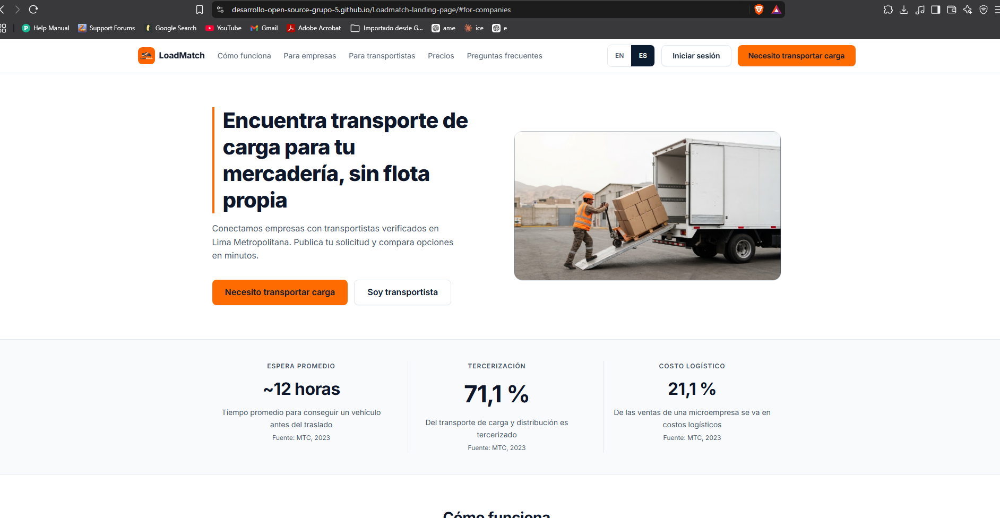
</p>

***Figura.*** Landing Page de LoadMatch abierta en su URL pública de GitHub Pages.

#### 5.2.1.8. Team Collaboration Insights during Sprint

El Landing Page se dividió en ramas por sección, lo que permitió trabajar en paralelo y registrar el aporte de cada integrante. Las ramas se integraron a `develop` mediante Pull Requests con *Create a merge commit*, que conserva los commits individuales, y la versión se publicó mediante una rama `release/1.0.0`.

| Integrante | GitHub | Ramas principales | Commits (sin merges) |
| --- | --- | --- | --- |
| Benigno Montero, Harold Fauskorp | Harold-11 | project-setup, design-tokens, bugfix/css-structure, bugfix/duplicate-header, app-screenshots, vehicle-types, contact-form, video-placeholders, release/1.0.0 | 18 |
| Rivas Castillo, Christoper Steven | CODERT0PH | audience-sections, testimonials-carousel, site-footer, legal-pages | 13 |
| Collantes Artola, Marco Antonio | Markollantes2307 | pricing-plans, faq-accordion, final-cta, i18n-locales | 12 |
| Noriega Collado, Jean Fabio | dumbaskidd | header-navigation, hero-section, metrics-band, readme-docs | 9 |
| Simon Calderon, Ismael Sebastian | Mayel-dev | how-it-works-tabs, trust-cards, youtube-videos, cta-app-links | 9 |

*Nota. Conteo de commits en `main` al 16/09/2026, sin incluir commits de merge.*

**Historial de commits por integrante:**

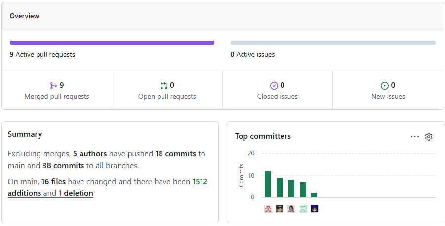

*Desarrollado por: Jean Fabio Noriega Collado (dumbaskidd)*
<p align="center">
  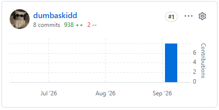
</p>

*Desarrollado por: Ismael Sebastian Simon Calderon (Mayel-dev)*
<p align="center">
  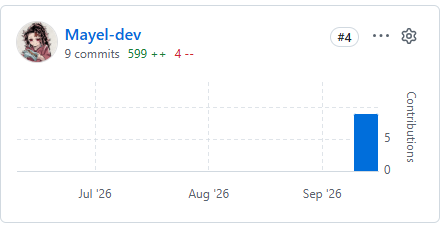
</p>

*Desarrollado por: Christoper Steven Rivas Castillo (CODERT0PH)*
<p align="center">
  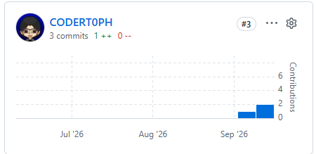
</p>

*Desarrollado por: Harold Fauskorp Benigno Montero (Harold-11)*
<p align="center">
  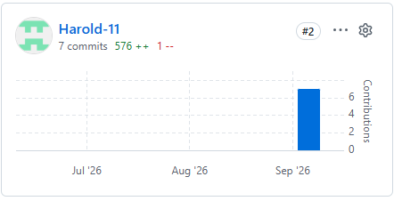
</p>

*Desarrollado por: Marco Antonio Collantes Artola (Markollantes2307)*
<p align="center">
  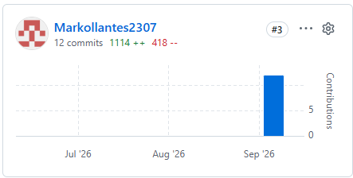
</p>

**Gráficos de colaboradores y actividad durante el sprint:**

<p align="center">
  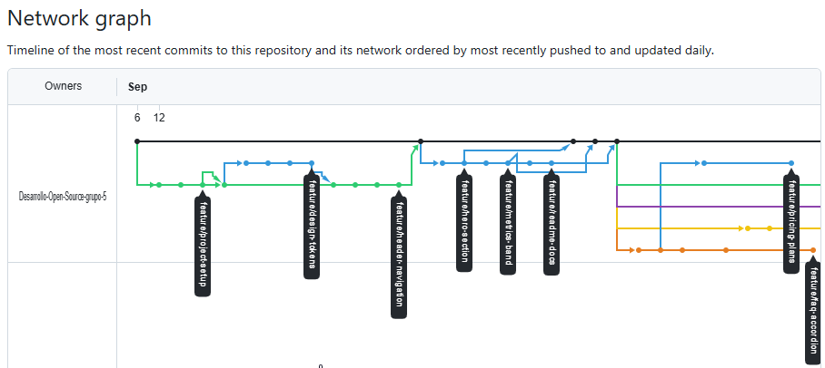
  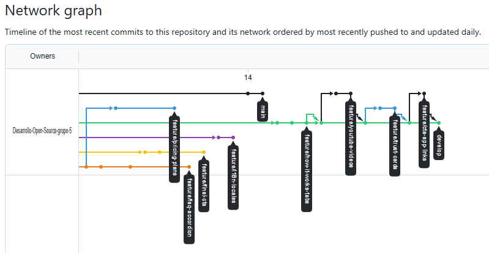
</p>

**Pull Requests:** #2 al #25 en [Loadmatch-landing-page](https://github.com/Desarrollo-Open-Source-grupo-5/Loadmatch-landing-page/pulls?q=is%3Apr+is%3Aclosed), integrados con *Create a merge commit*.
