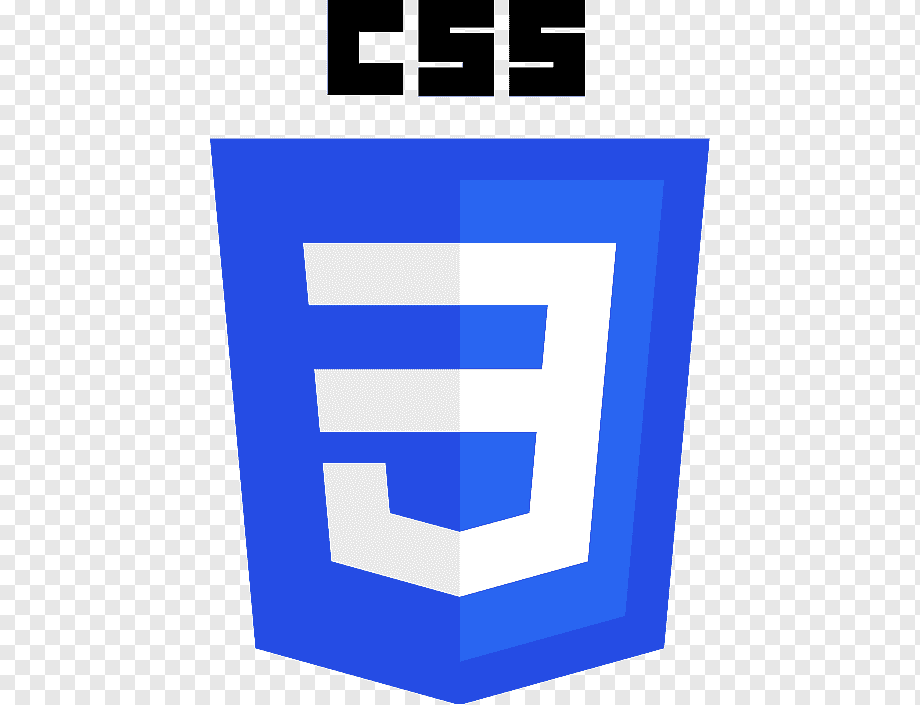

# Capítulo V: Product Implementation, Validation & Deployment

LoadMatch es el producto de CargoLink Labs orientado a conectar empresas que necesitan trasladar mercadería con transportistas que disponen de vehículos compatibles. Este capítulo establece la configuración del desarrollo, la implementación por sprints y los mecanismos de validación y despliegue, manteniendo trazabilidad con los segmentos del Capítulo I, las necesidades del Capítulo II, las User Stories del Capítulo III y el diseño del Capítulo IV.

La presente versión desarrolla el alcance de AV1: Software Configuration Management y Sprint 1 de la Landing Page. 

## 5.1. Software Configuration Management

La Gestión de Configuración de Software (SCM) en el proyecto LoadMatch establece las herramientas, convenciones y prácticas utilizadas para organizar el desarrollo colaborativo de los productos de software. Durante esta fase inicial, el trabajo se enfoca en el desarrollo de la presencia digital estática mediante el Landing Page, utilizando una estructura basada en HTML5, CSS3 y JavaScript, preparada para evolucionar e integrarse con los servicios de la plataforma en sprints posteriores. Su propósito es permitir que cada integrante reproduzca el entorno de trabajo y que cada entrega pueda vincularse con el código, las pruebas y la documentación que la sustentan.

### 5.1.1. Software Development Environment Configuration

Para mantener la consistencia en el entorno de desarrollo y evitar discrepancias de configuración entre los ingenieros de software, se ha estandarizado el siguiente ecosistema de herramientas nativas y de gestión:

| Dominio | Herramienta / Estándar | Propósito Técnico | Tipo de Acceso / Ruta | Imagen |
| --- | --- | --- | --- | --- |
| **Project Management** | Jira Software | Gestión del Product Backlog, Sprints y estimación en Story Points para el seguimiento ágil. | https://www.atlassian.com/es/software/jira |  |
| **Product UX/UI Design** | Figma | Creación de wireframes, prototipos interactivos y diseño del sistema de componentes visuales. | https://www.figma.com/es-la/ |  |
| **Frontend Structure** | Semantic HTML5 | Estructuración semántica del Document Object Model (DOM) para optimización de accesibilidad y SEO. | Estándar W3C |  |
| **Frontend Styling** | CSS3 (Grid/Flexbox) | Diseño responsivo (Mobile-First), animaciones y maquetación sin dependencias de frameworks externos. | Estándar W3C |  |
| **Frontend Logic** | Vanilla JavaScript (ES6+) | Manipulación del DOM, validación de formularios asíncrona y control de eventos interactivos. | Estándar ECMAScript |  |
| **IDE** | Visual Studio Code | Edición de código con extensiones de formateo (Prettier) y análisis estático de JS (ESLint). | https://code.visualstudio.com/ |  |
| **Version Control** | Git + GitHub | Gestión distribuida del código fuente, flujos de integración y revisión de pares (Pull Requests). | https://github.com/ |  |
| **Comunicación** | Google Meet | Videollamadas para coordinación de equipo, reuniones remotas y presentaciones en tiempo real. | https://meet.google.com/ |  |

### 5.1.2. Source Code Management

La gestión del código fuente de LoadMatch se realiza mediante **Git** como sistema de control de versiones distribuido y **GitHub** como plataforma de almacenamiento, colaboración y revisión del código. Los productos de software se mantienen en repositorios independientes dentro de la organización `Desarrollo-Open-Source-grupo-5`, permitiendo separar el Landing Page, la Frontend Web Application, los Web Services y la documentación del proyecto.

Los repositorios utilizados por el equipo son los siguientes:

| Repositorio | Producto |
| --- | --- |
| https://github.com/Desarrollo-Open-Source-grupo-5/Loadmatch-landing-page | Landing Page |
| https://github.com/Desarrollo-Open-Source-grupo-5/Loadmatch-frontend-application | Frontend Web Application |
| https://github.com/Desarrollo-Open-Source-grupo-5/Loadmatch-backend-application | Web Services (RESTful API) |
| https://github.com/Desarrollo-Open-Source-grupo-5/Loadmatch-report | Informe y documentación del proyecto |

Estos enlaces identifican los repositorios declarados.

#### GitFlow Workflow

El equipo utiliza **GitFlow** como estrategia de ramificación para organizar el desarrollo colaborativo. Las funcionalidades son desarrolladas de manera aislada y posteriormente integradas mediante Pull Requests, permitiendo revisar los cambios antes de incorporarlos a las ramas compartidas.

La estructura de ramas definida es la siguiente:

* `main`: contiene las versiones estables del producto que se encuentran preparadas para entrega o despliegue.
* `develop`: rama principal de integración. Recibe las funcionalidades completadas y revisadas antes de preparar una nueva versión estable.
* `feature/*`: ramas utilizadas para desarrollar funcionalidades o User Stories específicas. Se crean a partir de `develop` y, una vez completadas, se integran nuevamente mediante Pull Request.
* `release/*`: ramas utilizadas para preparar una versión candidata a publicación. Permiten realizar ajustes finales antes de integrar la versión en `main`.
* `hotfix/*`: ramas utilizadas para corregir errores críticos detectados en una versión que ya se encuentra publicada. Se crean a partir de `main` y posteriormente sus cambios se integran tanto en `main` como en `develop`.

#### Convención para Feature Branches

Las ramas de funcionalidad utilizan el prefijo `feature/` seguido del identificador de la User Story o de una descripción breve de la funcionalidad en inglés.

Formato:

`feature/<user-story>-<short-description>`

Ejemplos:

* `feature/US12-hero`
* `feature/US13-fleet`
* `feature/US14-contact`
* `feature/design-tokens`

#### Convención para Release Branches

Las ramas de preparación de versiones utilizan el prefijo `release/` seguido del número de versión que se desea publicar.

Formato:

`release/<major>.<minor>.<patch>`

Ejemplos:

* `release/1.0.0`
* `release/1.1.0`

Una vez validada la versión, la rama de release se integra en `main` y sus cambios se sincronizan posteriormente con `develop`.

#### Convención para Hotfix Branches

Las correcciones urgentes sobre versiones publicadas utilizan el prefijo `hotfix/` seguido del número de versión corregida.

Formato:

`hotfix/<major>.<minor>.<patch>`

Ejemplos:

* `hotfix/1.0.1`
* `hotfix/1.1.1`

Las ramas `hotfix/*` se crean desde `main` y, después de validar la corrección, se integran nuevamente en `main` y `develop`.

#### Semantic Versioning

Para identificar las versiones publicadas de los productos de LoadMatch se utiliza **Semantic Versioning 2.0.0 (SemVer)** mediante el formato:

`MAJOR.MINOR.PATCH`

Donde:

* **MAJOR:** se incrementa cuando se introducen cambios incompatibles con versiones anteriores.
* **MINOR:** se incrementa cuando se incorporan nuevas funcionalidades manteniendo compatibilidad con la versión anterior.
* **PATCH:** se incrementa cuando se realizan correcciones compatibles con la versión existente.

Por ejemplo:

* `v1.0.0`: primera versión estable del producto.
* `v1.1.0`: incorporación de nuevas funcionalidades compatibles.
* `v1.1.1`: corrección de errores sobre la versión `v1.1.0`.

#### Conventional Commits

Los commits realizados por el equipo siguen la especificación **Conventional Commits**, utilizando mensajes breves y descriptivos en inglés. Entre los tipos utilizados se encuentran `feat`, `fix`, `style`, `refactor`, `docs` y `chore`.

Ejemplos:

* `feat(pricing): add commission-based pricing section`
* `fix(contact): validate email input`
* `style(responsive): improve mobile layout`
* `docs(chapter5): update sprint evidence`
* `chore(css): remove unused placeholder`

Las funcionalidades desarrolladas en ramas `feature/*` son integradas en `develop` mediante **Pull Requests revisados por otros miembros del equipo**, conservando los commits individuales como evidencia del trabajo colaborativo.

### 5.1.3. Source Code Style Guide & Conventions

Con el propósito de mantener consistencia, legibilidad y facilidad de mantenimiento en el código fuente de LoadMatch, el equipo adopta convenciones comunes para la escritura de HTML, CSS y JavaScript.

Como regla general, **todos los nombres utilizados en el código se escriben en inglés**, incluyendo nombres de clases CSS, identificadores, variables, funciones, archivos y componentes. Esta convención permite mantener una nomenclatura uniforme entre los diferentes productos de software y facilita la colaboración entre los integrantes del equipo.

Ejemplos:

- `contact-form`
- `fleet-card`
- `submitButton`
- `loadVehicles()`
- `pricing-section`

**Convenciones de Estructura y Estilos (HTML5 / CSS3):**

* **HTML Semántico:** Se prioriza el uso de etiquetas semánticas como `<header>`, `<nav>`, `<main>`, `<section>`, `<article>` y `<footer>`, evitando el sobreuso de elementos `
` cuando existe una alternativa semántica adecuada.
* **Nombres descriptivos en inglés:** Los nombres de clases e identificadores deben describir claramente la responsabilidad del elemento y utilizar terminología en inglés.
* **Metodología BEM (Block, Element, Modifier):** Se utiliza para mantener una estructura predecible en los selectores CSS y reducir colisiones entre estilos. Por ejemplo: `.contact-form`, `.contact-form__input` y `.contact-form__button--active`.
* **Variables CSS (Custom Properties):** Los tokens visuales de LoadMatch, como colores, tipografías y espaciados, se centralizan mediante variables definidas en la pseudoclase `:root`.
* **Indentación y formato:** El código debe conservar una indentación consistente y una estructura legible, evitando reglas o declaraciones innecesariamente complejas.
* **Preferencia por clases:** Para la aplicación de estilos reutilizables se prioriza el uso de clases sobre identificadores (`id`).

Para estas convenciones, el equipo toma como referencia **HTML Style Guide and Coding Conventions** y **Google HTML/CSS Style Guide**.

**Convenciones de Lógica (Vanilla JavaScript):**

* **Nomenclatura en inglés:** Las variables, constantes y funciones deben utilizar nombres descriptivos en inglés.
* **Declaración de variables:** Se utiliza `const` por defecto y `let` cuando sea necesario reasignar valores, evitando el uso de `var`.
* **Manipulación de eventos:** Los eventos se registran mediante `addEventListener`, manteniendo separada la lógica JavaScript de la estructura HTML.
* **Alcance de variables:** Se evita crear variables globales innecesarias, manteniendo la lógica encapsulada en funciones o módulos.
* **Funciones descriptivas:** Los nombres de funciones deben representar claramente la acción que realizan, por ejemplo `validateContactForm()` o `toggleFaqItem()`.

**Convenciones de Commits (Conventional Commits):**

Los mensajes de commit siguen la especificación Conventional Commits y se redactan en inglés. Entre los tipos utilizados se encuentran:

* `feat:` Nueva funcionalidad o componente. Ejemplo: `feat(pricing): add commission-based pricing section`.
* `fix:` Corrección de un error existente.
* `style:` Cambios de formato o estilos que no modifican la lógica de negocio.
* `chore:` Tareas de mantenimiento o configuración del proyecto.
* `refactor:` Reestructuración del código sin alterar su comportamiento observable.

**Referencias adoptadas:**

- HTML Style Guide and Coding Conventions: https://www.w3schools.com/html/html5_syntax.asp
- Google HTML/CSS Style Guide: https://google.github.io/styleguide/htmlcssguide.html
- Conventional Commits: https://www.conventionalcommits.org/

### 5.1.4. Software Deployment Configuration

La canalización de despliegue del Landing Page de LoadMatch aprovecha la naturaleza estática de los artefactos (archivos HTML, CSS y JS) utilizando plataformas de alojamiento sin servidor (Serverless Hosting) altamente eficientes.

1. **Plataforma de Despliegue:** GitHub Pages.
2. **Pipeline de Publicación:** Al integrar código en la rama `main` de GitHub, la plataforma detecta los archivos estáticos y distribuye los artefactos a través de su Red de Entrega de Contenido (CDN) global.
3. **Optimización:** Previo al despliegue en la rama principal, se asegura la minificación de los archivos `.css` y `.js`, y la compresión de los assets visuales (imágenes en formato WebP o SVG) para garantizar tiempos de carga ultrarrápidos (Time to Interactive).

---

## 5.2. Landing Page, Services & Applications Implementation

### 5.2.1. Sprint 1

Durante esta primera iteración, el equipo se enfoca en el desarrollo de la primera versión del Landing Page de LoadMatch. Para su implementación se utiliza una estructura basada en HTML5, CSS3 y Vanilla JavaScript, manteniendo una organización clara del Document Object Model (DOM), estilos responsivos y componentes interactivos orientados a comunicar la propuesta de valor de la plataforma.

#### 5.2.1.1. Sprint Planning 1

| Sprint # | Sprint 1 |
| --- | --- |
| **Sprint Planning Background** |  |
| **Date** | 2026-09-01 |
| **Time** | 08:30 PM |
| **Location** | Microsoft Teams |
| **Prepared By** | Christoper Rivas |
| **Attendees (to planning meeting)** | Equipo de Desarrollo LoadMatch |
| **Sprint 0 Review Summary** | N/A — Es el primer Sprint del proyecto. |
| **Sprint 0 Retrospective Summary** | N/A — Es el primer Sprint del proyecto. |
| **Sprint Goal & User Stories** |  |
| **Sprint 1 Goal** | Desarrollar y desplegar la versión inicial del Landing Page de LoadMatch utilizando HTML5, CSS3 y Vanilla JavaScript, con el propósito de comunicar claramente la propuesta de valor y captar usuarios potenciales de empresas y transportistas. El objetivo se considerará cumplido cuando las User Stories US12, US13 y US14 estén implementadas y el Landing Page se encuentre desplegado y accesible públicamente. |
| **Sprint 1 Velocity** | 7 |
| **Sum of Story Points** | 7 |

#### 5.2.1.2. Leadership-and-Collaboration Matrix (LACX)

La distribución de responsabilidades del Sprint 1 considera los principales aspectos técnicos involucrados en el desarrollo del Landing Page. En la matriz, `L` representa al responsable principal (Leader) del aspecto y `C` a los integrantes que participan como colaboradores (Collaborators).

| Team Member | GitHub Username | HTML5 (Structure & SEO) | CSS3 (Styles & Responsiveness) | Vanilla JS (Interactivity) |
| --- | --- | --- | --- | --- |
| Rivas Castillo, Christoper Steven | [usuario real] | L/C | L/C | L/C |
| Benigno Montero, Harold Fauskorp | Harold-11 | L/C | L/C | L/C |
| Simon Calderon, Ismael Sebastian | [usuario real] | L/C | L/C | L/C |

#### 5.2.1.3. Sprint Backlog 1

El Sprint 1 se enfoca en la implementación inicial del Landing Page de LoadMatch y comprende las User Stories correspondientes a la visualización de la propuesta de valor, la consulta de tipos de vehículos y el formulario de contacto. Las tareas técnicas asociadas fueron organizadas y estimadas en Jira para facilitar el seguimiento del trabajo durante la iteración.

   
  <i>Nota. Sprint Board correspondiente al Sprint 1 del proyecto LoadMatch.</i>

**Sprint Board:** https://upc-team-m57tll9j.atlassian.net/jira/software/projects/US/boards/2?sprintStarted=true&filter=&groupBy=none

Este Sprint cubre las siguientes User Stories y tareas:

| User Story Id | User Story Title | Task Id | Task Title | Description | Estimation | Assigned To | Status |
| --- | --- | --- | --- | --- | --- | --- | --- |
| **US12** | Visualización de propuesta de valor | T01 | Maquetación Semántica del Hero | Estructuración HTML5 del Hero Section y la barra de navegación, asegurando jerarquía de etiquetas y accesibilidad. | 8h | Harold Benigno Montero | To-do |
| **US13** | Consulta de tipos de vehículos | T02 | Catálogo CSS Flexbox/Grid | Diseño responsivo del catálogo de vehículos, implementando Media Queries para la adaptación entre dispositivos móviles y de escritorio. | 6h | Harold Benigno Montero | To-do |
| **US14** | Formulario de contacto | T03 | Validación DOM Vanilla JS | Captura de eventos del formulario (`submit`, `input`) mediante JavaScript nativo para validar campos requeridos y formato de correo. | 6h | Harold Benigno Montero | To-do |

#### 5.2.1.4. Development Evidence for Sprint Review

El desarrollo del Sprint 1 se gestiona mediante ramas independientes creadas a partir de `develop`. Cada cambio implementado será registrado mediante commits individuales y posteriormente integrado mediante Pull Requests hacia la rama de integración.

La siguiente tabla registra la evidencia de desarrollo correspondiente a las User Stories incluidas en el Sprint. Los datos pendientes serán completados conforme los cambios sean implementados y publicados en el repositorio.

| Repository | Branch | Commit Id | Commit Message | Commit Message Body | Committed on |
| --- | --- | --- | --- | --- | --- |
| Desarrollo-Open-Source-grupo-5/Loadmatch-landing-page | feature/US12-hero | (pendiente) | (pendiente) | (pendiente) | (pendiente) |
| Desarrollo-Open-Source-grupo-5/Loadmatch-landing-page | feature/US13-fleet | (pendiente) | (pendiente) | (pendiente) | (pendiente) |
| Desarrollo-Open-Source-grupo-5/Loadmatch-landing-page | feature/US14-contact | (pendiente) | (pendiente) | (pendiente) | (pendiente) |

#### 5.2.1.5. Execution Evidence for Sprint Review

Esta sección presentará la evidencia de ejecución correspondiente a las funcionalidades implementadas durante el Sprint 1. Una vez completadas las User Stories planificadas, se incluirán capturas de las principales vistas funcionales del Landing Page de LoadMatch, mostrando su comportamiento en diferentes tamaños de pantalla y las funcionalidades interactivas desarrolladas.

Las evidencias visuales serán incorporadas una vez que la implementación correspondiente al Sprint se encuentre integrada y disponible para revisión.

**Screenshots de las vistas implementadas:** (pendiente)

**Video de navegación y ejecución del producto:** (pendiente)

#### 5.2.1.6. Services Documentation Evidence for Sprint Review

Durante el Sprint 1 no se contempla la implementación de Web Services, bases de datos ni APIs RESTful, debido a que esta primera iteración se encuentra enfocada en el desarrollo y despliegue inicial del Landing Page de LoadMatch.

Por este motivo, no se presentan endpoints ni documentación de servicios para este Sprint. La implementación de los Web Services será abordada en iteraciones posteriores del proyecto.

#### 5.2.1.7. Software Deployment Evidence for Sprint Review

El Landing Page de LoadMatch será desplegado mediante **GitHub Pages** una vez completada e integrada la implementación correspondiente al Sprint 1.

**Enlace del Repositorio:** https://github.com/Desarrollo-Open-Source-grupo-5/Loadmatch-landing-page

**URL del Landing Page Desplegado:** (pendiente)

**Evidencia del proceso de despliegue:** (pendiente)

#### 5.2.1.8. Team Collaboration Insights during Sprint

La exclusión de frameworks pesados en esta fase exigió una coordinación rigurosa a nivel de archivos estáticos. El equipo implementó una estrategia colaborativa basada en la segmentación clara de la hoja de estilos y la modularización de los scripts.

* **Integración CSS Controlada:** Para evitar la sobreescritura de reglas visuales en un entorno sin preprocesadores avanzados, el equipo aplicó la metodología BEM. Los desarrolladores trabajaron en ramas locales y sometieron sus maquetas visuales a revisiones cruzadas (Pull Requests) para verificar la consistencia estética y el uso obligatorio del archivo de variables (`:root`) antes de fusionar el código.
* **Manejo del DOM en Equipo:** Las revisiones de código en JavaScript se centraron en garantizar que la manipulación del DOM no interfiriera con componentes desarrollados por otros miembros, utilizando selectores específicos e instanciando los Event Listeners de forma modular una vez que el documento estuviera completamente cargado (`DOMContentLoaded`). La fluidez de la comunicación a través de Microsoft Teams permitió resolver las discrepancias de diseño de manera inmediata.

**GitHub Collaboration Insights:** (pendiente)
