# Capítulo V: Product Implementation, Validation & Deployment

LoadMatch es el producto de CargoLink Labs orientado a conectar empresas que necesitan trasladar mercadería con transportistas que disponen de vehículos compatibles. Este capítulo establece la configuración del desarrollo, la implementación por sprints y los mecanismos de validación y despliegue, manteniendo trazabilidad con los segmentos del Capítulo I, las necesidades del Capítulo II, las User Stories del Capítulo III y el diseño del Capítulo IV.

La presente versión conserva las evidencias de AV1 y añade el alcance de TB1: Sprint 2 de la Web Application, actualización de los accesos de la Landing Page y despliegue del frontend con una API simulada.

## 5.1. Software Configuration Management

La Gestión de Configuración de Software (SCM) en el proyecto LoadMatch establece las herramientas, convenciones y prácticas utilizadas para organizar el desarrollo colaborativo de la Landing Page y de la Web Application. La landing utiliza HTML5, CSS3 y JavaScript; el frontend utiliza Angular, TypeScript y Angular Material, con JSON Server como API simulada durante TB1. Su propósito es permitir que cada integrante reproduzca el entorno y que cada entrega pueda vincularse con el código y la documentación que la sustentan.

### 5.1.1. Software Development Environment Configuration

Para mantener la consistencia en el entorno de desarrollo y evitar discrepancias de configuración entre los ingenieros de software, se ha estandarizado el siguiente ecosistema de herramientas nativas y de gestión:

| Dominio | Herramienta / Estándar | Propósito Técnico | Tipo de Acceso / Ruta | Imagen |
| --- | --- | --- | --- | --- |
| **Project Management** | Jira Software | Gestión del Product Backlog, Sprints y estimación en Story Points para el seguimiento ágil. | https://www.atlassian.com/es/software/jira |  |
| **Product UX/UI Design** | Figma | Creación de wireframes, prototipos interactivos y diseño del sistema de componentes visuales. | https://www.figma.com/es-la/ |  |
| **Frontend Structure** | Semantic HTML5 | Estructuración semántica del Document Object Model (DOM) para optimización de accesibilidad y SEO. | Estándar W3C |  |
| **Frontend Styling** | CSS3 (Grid/Flexbox) | Diseño responsivo (Mobile-First), animaciones y maquetación sin dependencias de frameworks externos. | Estándar W3C | 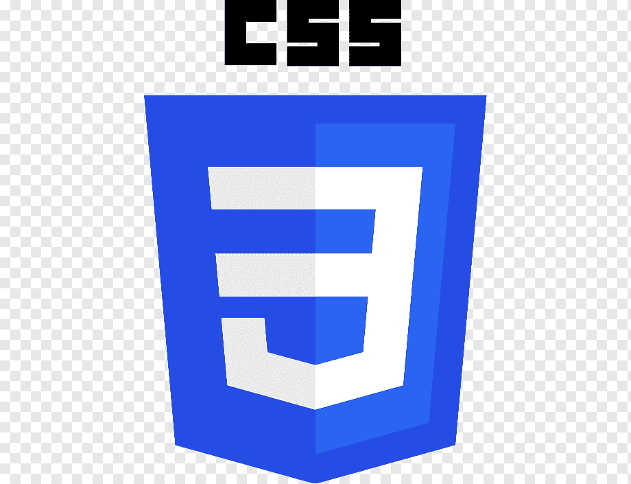 |
| **Frontend Logic** | Vanilla JavaScript (ES6+) | Manipulación del DOM, validación de formularios asíncrona y control de eventos interactivos. | Estándar ECMAScript |  |
| **IDE** | Visual Studio Code | Edición de código con extensiones de formateo (Prettier) y análisis estático de JS (ESLint). | https://code.visualstudio.com/ |  |
| **Version Control** | Git + GitHub | Gestión distribuida del código fuente, flujos de integración y revisión de pares (Pull Requests). | https://github.com/ |  |
| **Comunicación** | Google Meet | Videollamadas para coordinación de equipo, reuniones remotas y presentaciones en tiempo real. | https://meet.google.com/ |  |

Para Sprint 2 se incorporaron Angular 22, Angular Material, TypeScript, RxJS y ngx-translate para las vistas y la internacionalización; JSON Server 0.17 para la API simulada; y Vercel y Render para publicar frontend y mock, respectivamente. Las dependencias y comandos reproducibles se mantienen en el `package.json` del frontend. El entorno local se inicia con `npm ci`, `npm run api` y, en otra terminal del mismo proyecto, `npm start`.

### 5.1.2. Source Code Management

La gestión del código fuente de LoadMatch se realiza mediante **Git** como sistema de control de versiones distribuido y **GitHub** como plataforma de almacenamiento, colaboración y revisión del código. Los productos de software se mantienen en repositorios independientes dentro de la organización `Desarrollo-Open-Source-grupo-5`, permitiendo separar el Landing Page, la Frontend Web Application, los Web Services y la documentación del proyecto.

Los repositorios utilizados por el equipo son los siguientes:

| Repositorio | Producto |
| --- | --- |
| https://github.com/Desarrollo-Open-Source-grupo-5/Loadmatch-landing-page | Landing Page |
| https://github.com/Desarrollo-Open-Source-grupo-5/Loadmatch-frontend-application | Frontend Web Application |
| https://github.com/Desarrollo-Open-Source-grupo-5/Loadmatch-backend-application | Web Services (RESTful API) |
| https://github.com/Desarrollo-Open-Source-grupo-5/Loadmatch-report | Informe y documentación del proyecto |

Estos enlaces identifican los repositorios declarados.

#### GitFlow Workflow

El equipo utiliza **GitFlow** como estrategia de ramificación para organizar el desarrollo colaborativo. Las funcionalidades son desarrolladas de manera aislada y posteriormente integradas mediante Pull Requests, permitiendo revisar los cambios antes de incorporarlos a las ramas compartidas.

La estructura de ramas definida es la siguiente:

**GitFlow Workflow**

| Rama | Propósito | Origen e integración |
| --- | --- | --- |
| `main` | Contiene las versiones estables y aprobadas del proyecto. | Recibe integraciones desde `develop` cuando se valida una entrega final. |
| `develop` | Rama de integración donde se consolidan las funcionalidades de los capítulos. | Recibe las ramas `feature/*` y se integra en `main` al finalizar un ciclo. |
| `feature/Chapter1` | Implementación de entregables e imágenes del Capítulo I (carpeta `assets/images`). | Se crea como rama independiente y apunta a `develop` mediante Pull Request. |
| `feature/Chapter2` | Implementación de entregables e imágenes del Capítulo II (carpeta `assets/images`). | Se crea como rama independiente y apunta a `develop` mediante Pull Request. |
| `feature/Chapter3` | Implementación de entregables e imágenes del Capítulo III (carpeta `assets/images`). | Se crea como rama independiente y apunta a `develop` mediante Pull Request. |
| `feature/Chapter4` | Implementación de entregables e imágenes del Capítulo IV (carpeta `assets/images`). | Se crea como rama independiente y apunta a `develop` mediante Pull Request. |
| `feature/Chapter5` | Implementación de entregables e imágenes del Capítulo V (carpeta `assets/images`). | Se crea como rama independiente y apunta a `develop` mediante Pull Request. |

El GitFlow Workflow es una estrategia de organización de ramas en Git que define cómo se crean, nombran y fusionan las ramas dentro de un proyecto.

Las ramas **feature/** se usan para desarrollar funcionalidades específicas o capítulos, y apuntan a develop para integrarse.

La rama **develop** es la rama de integración, donde se consolidan los cambios antes de pasar a main.

La rama **main** contiene las versiones estables y finales del proyecto.

Los Pull Requests deben documentar la historia relacionada, los cambios realizados, validaciones y evidencia visual, asegurando que otro integrante revise antes de integrar.

**Semantic Versioning 2.0.0**

Cada producto mantendrá su propia numeración `MAJOR.MINOR.PATCH`: `MAJOR` para cambios incompatibles en su contrato público, `MINOR` para nuevas funcionalidades compatibles y `PATCH` para correcciones compatibles. Durante el desarrollo inicial se podrán utilizar versiones `0.y.z`. Los tags, por ejemplo `v1.0.0`, identificarán el commit publicado; no se registrará un tag como existente hasta verificarlo. Referencia: Semantic Versioning 2.0.0.

**Conventional Commits**

Los mensajes se redactarán en inglés con el formato `type(scope): description`. Se utilizarán `feat` para funcionalidades, `fix` para correcciones, `docs` para documentación, `refactor` para reorganización interna y `chore` para mantenimiento. `style` se reservará para formato del código; un cambio visual que agrega o corrige comportamiento se clasificará según su finalidad. Los cambios incompatibles se identificarán con `!` o con un pie `BREAKING CHANGE:`. Referencia: Conventional Commits 1.0.0.

Ejemplos de mensajes propuestos:

```text
feat(hero): explain benefits for shippers and carriers
feat(fleet): display supported vehicle capacities
fix(contact): reject invalid email addresses
docs(sprint1): add execution evidence
```

### 5.1.3. Source Code Style Guide & Conventions

El equipo establece las convenciones de codificación que se aplicarán durante el desarrollo de **LoadMatch** para mantener un código legible, consistente y fácil de mantener. Estas directrices comprenden **HTML, CSS y JavaScript vanilla** para la Landing Page, **TypeScript con Angular** para la Web Application y **Java con Spring Boot** para los Web Services, en correspondencia con el stack tecnológico del curso y la arquitectura definida en el Capítulo IV.

Como regla transversal, los identificadores y comentarios del código se redactarán en **inglés**, manteniendo correspondencia con el *Ubiquitous Language* del Capítulo II. Los textos visibles para los usuarios respetarán el idioma y el tono de comunicación definidos para el producto.

Las convenciones se documentarán en los repositorios correspondientes. Se utilizará **.editorconfig** para establecer reglas comunes de indentación y codificación, **Prettier** para el formato de los archivos compatibles y **ESLint** para el análisis estático de JavaScript y TypeScript. Las configuraciones deberán mantenerse bajo control de versiones para que puedan ser utilizadas por todos los integrantes.

---

#### Convenciones por lenguaje

| Lenguaje | Convenciones del proyecto |
| --- | --- |
| **HTML5** | Utilizar elementos semánticos como `header`, `nav`, `main`, `section` y `footer`. Mantener jerarquía coherente de encabezados, asociar etiquetas con controles de formulario e incluir textos alternativos apropiados para imágenes. Declarar idioma con `lang`. Identificadores descriptivos en `kebab-case`. |
| **CSS3** | Aplicar metodología **BEM** para nombrar clases (ej. `contact-form__input`, `contact-form__button--disabled`). Centralizar colores, tipografías y espaciados mediante variables CSS. Usar **Flexbox/Grid** y media queries para adaptación. Evitar estilos duplicados y selectores excesivamente específicos. |
| **JavaScript vanilla** | Usar `const` por defecto y `let` cuando exista reasignación. Variables y funciones en `camelCase`. Comparación estricta (`===`). Eventos con `addEventListener`. Separar lógica de HTML y manejar estados de carga, éxito y error en operaciones asíncronas. |
| **TypeScript con Angular** | Definir tipos para datos del dominio y contratos de API. Evitar `any` sin justificación. Clases e interfaces en `PascalCase`; propiedades y métodos en `camelCase`. Organizar interfaz en componentes y concentrar acceso a servicios externos en servicios inyectables. Gestionar eventos mediante mecanismos de Angular. |
| **Java con Spring Boot** | Clases e interfaces en `PascalCase`, métodos y atributos en `camelCase`, constantes en `UPPER_SNAKE_CASE`, paquetes en minúsculas. Usar inyección de dependencias por constructores. Separar responsabilidades entre dominio, aplicación, infraestructura e interfaces. Evitar reglas de negocio en controladores REST. |

---

#### Indentación y formato
- **HTML, CSS, JavaScript, TypeScript** → 2 espacios.  
- **Java** → 4 espacios.  
- Usar espacios en lugar de tabulaciones.  
- Guardar archivos en **UTF-8**.  
- Eliminar espacios al final de las líneas y mantener una nueva línea al final de cada archivo.  
- Configuraciones versionadas para asegurar formato uniforme.  

Los comentarios deberán explicar decisiones, restricciones o comportamientos no evidentes. Se evitarán comentarios redundantes que repitan la instrucción.

---

#### Consistencia con el diseño

| Elemento | Convención |
| --- | --- |
| Tipografía principal | **Inter**, con pesos y jerarquías del diseño. |
| Tipografía complementaria | **Liberation Serif**, limitada a títulos y elementos de identidad. |
| Color principal | Primary Orange: `#FE6B00`. |
| Color de interacción | Orange Pressed: `#A04100`. |
| Color estructural oscuro | Dark Navy: `#0B1C30`. |
| Fondo claro | Background Light: `#F8FAFC`. |

- Botones con fondo **Primary Orange** → texto oscuro (contraste).  
- Mensajes de error → texto descriptivo + indicador visual (no solo color).  
- Tokens visuales centralizados para reutilización.  
- En Angular, configuración de **Angular Material** deberá conservar identidad visual de LoadMatch.  
- Adaptación a dispositivos → preservar legibilidad, navegación y accesibilidad.  
- Controles interactivos → etiquetas comprensibles y estado de foco visible para navegación con teclado.  

---

#### Organización de la aplicación y los servicios
La organización del código mantendrá correspondencia con los contextos definidos en el Capítulo IV:  
**IAM, Profiles, Fleet, Document Validation, Freight Publishing, Matching, Trip Execution, Payment, Rating y Contact.**

- En **Angular**: archivos agrupados por funcionalidad/contexto. Componentes → presentación e interacción. Servicios → acceso a API y lógica compartida.  
- En **Spring Boot**: separación clara de responsabilidades:  
  - **Dominio** → entidades, objetos de valor, reglas de negocio.  
  - **Aplicación** → coordinación de casos de uso.  
  - **Infraestructura** → persistencia e integración con servicios externos.  
  - **Interfaces** → controladores REST y contratos de entrada/salida.  

La validación en formularios del navegador facilita la interacción, pero no sustituye las validaciones del backend. Los servicios deberán verificar datos y reglas de negocio antes de modificar el estado de la aplicación.  

Los contratos de entrada/salida de la API se mantendrán separados de las entidades persistentes. Los nombres en español del diseño deberán mapearse a identificadores en inglés en la implementación. Esta correspondencia se documentará y actualizará en el Capítulo IV para conservar trazabilidad.

#### Guías de referencia

El equipo utilizará las siguientes fuentes como apoyo para definir y mantener sus convenciones. Las decisiones específicas adoptadas para LoadMatch quedarán documentadas en cada repositorio.

- **HTML y CSS:** https://google.github.io/styleguide/htmlcssguide.html.
- **JavaScript:** https://google.github.io/styleguide/jsguide.html.
- **TypeScript:** https://www.typescriptlang.org/docs/handbook/intro.html.
- **Angular:** https://angular.dev/style-guide.
- **Java:** https://google.github.io/styleguide/javaguide.html, como referencia complementaria; para la indentación prevalece la regla de cuatro espacios del proyecto.
- **Configuración de formato: EditorConfig** https://editorconfig.org/ **y Prettier**https://prettier.io/docs/.
- **Análisis estático de JavaScript y TypeScript: ESLint** https://eslint.org/docs/latest/ y https://typescript-eslint.io/.

### 5.1.4. Software Deployment Configuration

**Landing Page**

La Landing Page se publica en GitHub Pages desde la rama `main` y la carpeta raíz (`Settings > Pages > Deploy from a branch`, rama `main`, carpeta `/ (root)`), donde se encuentra `index.html`. El archivo `.nojekyll` evita el procesamiento con Jekyll y la opción *Enforce HTTPS* permanece activa. No se usa dominio personalizado. 
Referencia: https://docs.github.com/en/pages/getting-started-with-github-pages/configuring-a-publishing-source-for-your-github-pages-site.

Cada versión se integra primero en `develop`, pasa por una rama `release/x.y.z` que actualiza `CHANGELOG.md`, se fusiona en `main` mediante Pull Request y se etiqueta con Semantic Versioning (`vX.Y.Z`). Antes de publicar se revisan rutas de recursos, navegación, comportamiento móvil, formulario y ausencia de errores de consola; después se abre la URL pública para confirmar el despliegue.

**Web Application, API y persistencia**

La primera versión de la Web Application se publica en Vercel: https://loadmatch-frontend-application.vercel.app/home. La configuración versionada en `vercel.json` identifica Angular como framework, ejecuta `npm run build` y publica `dist/loadmatch-frontend-application/browser`. Una regla de reescritura de `/(.*)` hacia `/index.html` permite abrir y recargar directamente las rutas del cliente.

La versión remota de `src/environments/environment.ts` configura `https://loadmatch-api.onrender.com/api/v1` como URL base de producción. El servicio de Render es JSON Server con datos de muestra; no constituye el backend definitivo de Spring Boot ni una persistencia productiva. La configuración de Java 17 y PostgreSQL/PostGIS corresponde a una etapa posterior.

Para reproducir la publicación del frontend: importar su repositorio en Vercel, utilizar la rama de producción aprobada por el equipo, instalar las dependencias del proyecto, ejecutar el build y publicar el directorio indicado. Después se verifican `/home`, las rutas por perfil, la carga de traducciones y las peticiones HTTPS al mock. Los comandos y directorio de salida proceden del archivo de configuración remoto; las capturas de configuración y despliegue de Vercel y Render se incorporan en 5.2.2.7 y el Anexo K.

Mapbox, PayPal, almacenamiento de archivos y correo son integraciones previstas en el Capítulo IV. Sus credenciales, entornos y disponibilidad deben verificarse antes de documentar una integración operativa. La consulta automática al MTC también permanece condicionada al acceso real a una fuente adecuada, conforme a las restricciones del Capítulo I.

---

## 5.2. Landing Page, Services & Applications Implementation

La implementación de LoadMatch se desarrolla mediante incrementos que transforman los requisitos y diseños en productos de software. Se conserva el Sprint 1 de la Landing Page y se incorpora el Sprint 2, correspondiente a la primera Web Application y su conexión con la landing.

### 5.2.1. Sprint 1

Durante el Sprint 1 se implementó y desplegó la Landing Page de LoadMatch, producto de CargoLink Labs que conecta empresas que necesitan trasladar mercadería con transportistas con capacidad disponible. La página utiliza HTML5, CSS3 y JavaScript vanilla, sin framework de interfaz ni proceso de compilación.

El incremento contiene navegación adaptable, propuesta de valor, indicadores del contexto logístico, explicación del funcionamiento por segmento, catálogo de tipos de vehículos, tarjetas de confianza, beneficios para empresas y transportistas, testimonios, precios por comisión, preguntas frecuentes, formulario de contacto, sección de videos, cierre con llamada a la acción, pie de página y página legal. También incorpora cambio de idioma entre inglés y español, y enlaces preparados hacia la Web Application.

#### 5.2.1.1. Sprint Planning 1

| Sprint # | Sprint 1 |
| --- | --- |
| **Sprint Planning Background** | |
| Date | 07/09/2026 |
| Time | 08:30 p.m. |
| Location | Google meet |
| Prepared By | Christoper Steven Rivas Castillo |
| Attendees (to planning meeting) | Noriega Collado, Jean Fabio<br>Simon Calderon, Ismael Sebastian<br>Collantes Artola, Marco Antonio<br>Benigno Montero, Harold Fauskorp<br>Rivas Castillo, Christoper Steven  |
| Sprint 1 Review Summary | Se publicó la versión 1.0.0 de la Landing Page en GitHub Pages. Se completaron 10 de las 11 User Stories del sprint (25 de 27 Story Points): propuesta de valor, catálogo de vehículos, formulario de contacto, cambio de idioma, precios, preguntas frecuentes, navegación adaptable, acceso a la aplicación por segmento, testimonios e información legal. US28 (videos) queda en curso porque los videos About-the-Product y About-the-Team se publican en AV2; la página muestra un aviso de disponibilidad próxima en su lugar. |
| Sprint 1 Retrospective Summary | El equipo destacó la división del Landing Page en ramas por sección, que permitió trabajar en paralelo y dejar evidencia por integrante. Como aspectos por mejorar se identificaron: registrar en Jira desde el inicio todas las historias del Landing Page (ocho se agregaron durante el sprint), integrar las ramas a `develop` de forma continua para evitar conflictos acumulados, revisar el orden de los archivos CSS antes de fusionar, y contrastar el backlog con los wireframes antes de retirar una sección. Para el Sprint 2 se acordó mantener GitFlow con Pull Requests y *Create a merge commit*, y estimar con más holgura la integración entre ramas. |
| **Sprint Goal & User Stories** | |
| Sprint 1 Goal | Nuestro foco está en publicar el Landing Page de LoadMatch para comunicar el modelo de negocio y captar leads tempranos de empresas y transportistas. Se logra cuando el sitio está desplegado y accesible públicamente. |
| Sprint 1 Velocity | 25 |
| Sum of Story Points | 27 puntos comprometidos: US12 = 3, US13 = 2, US14 = 2, US21 = 3, US22 = 2, US23 = 2, US24 = 3, US25 = 2, US26 = 2, US27 = 2 y US28 = 2. Completados: 25. |

*Nota. El sprint se planificó del 12/09 al 15/09 con US12, US13 y US14 (7 puntos). Durante su ejecución se registraron en Jira las historias US21 a US28, que cubren secciones del Landing Page ya incluidas en el diseño del Capítulo IV, y la fecha de cierre se extendió al 16/09 para completar la integración y el despliegue. US28 se trasladó al Product Backlog al cerrar el sprint.*

#### 5.2.1.2. Aspect Leaders and Collaborators

La matriz LACX identifica al líder (L) y a los colaboradores (C) de cada aspecto del sprint, según las ramas y Pull Requests del repositorio.

| Team Member | GitHub Username | Estructura, estilos e integración | Secciones del Landing Page | Idiomas y contenido comercial | Documentación y despliegue |
| --- | --- | --- | --- | --- | --- |
| Benigno Montero, Harold Fauskorp | Harold-11 | L | C | C | L |
| Noriega Collado, Jean Fabio | dumbaskidd | C | L | - | C |
| Simon Calderon, Ismael Sebastian | Mayel-dev | C | C | - | C |
| Rivas Castillo, Christoper Steven | CODERT0PH | - | C | - | C |
| Collantes Artola, Marco Antonio | Markollantes2307 | - | C | L | - |

*Nota. Emilia participó en la planificación y se retiró del curso durante el sprint, por lo que no figura en la matriz.*

#### 5.2.1.3. Sprint Backlog 1

| User Story Id | User Story Title | Work Item/Task Id | Work Item/Task Title | Description | Estimation | Assigned To | Status |
| --- | --- | --- | --- | --- | --- | --- | --- |
| US12 | Visualización de propuesta de valor | T01 | Implementación del Hero y propuesta de valor | Presentar la conexión entre empresas y transportistas, beneficios y accesos por perfil. | 8 h | Harold Benigno Montero | Done |
| US13 | Consulta de tipos de vehículos | T02 | Implementación del catálogo de vehículos | Sección responsive con tipos de vehículos y capacidades de carga mediante HTML5 y CSS Grid. | 6 h | Harold Benigno Montero | Done |
| US14 | Formulario de contacto | T03 | Implementación del formulario de contacto | Formulario con validación de campos obligatorios y formato de correo, mensajes de error y confirmación. | 6 h | Harold Benigno Montero | Done |
| US21 | Cambio de idioma del Landing Page | T04 | Implementación de diccionarios EN/ES y cargador de idioma | Diccionarios `en.json` y `es.json` y cargador `i18n.js` con preferencia guardada. | 6 h | Marco Collantes Artola | Done |
| US22 | Consulta de planes y precios | T05 | Implementación de la sección de precios por comisión | Tres tarjetas con plan destacado, adaptadas a una columna en tablet. | 4 h | Marco Collantes Artola | Done |
| US23 | Consulta de preguntas frecuentes | T06 | Implementación del acordeón de preguntas frecuentes | Acordeón accesible con `aria-expanded` y paneles ocultos. | 4 h | Marco Collantes Artola | Done |
| US24 | Navegación adaptable del Landing Page | T07 | Implementación de cabecera, menú móvil y adaptación responsive | Cabecera fija, panel de navegación bajo 1360 px, hero y métricas apilados. | 8 h | Jean Fabio Noriega Collado | Done |
| US25 | Acceso a la aplicación por segmento | T08 | Conexión de los botones con la aplicación web | `config.js` con `APP_BASE_URL` y respaldo a secciones internas. | 4 h | Ismael Sebastian Simon Calderon | Done |
| US26 | Visualización de testimonios de usuarios | T09 | Implementación de testimonios y carrusel | Tarjetas con aviso de contenido de ejemplo y carrusel con indicadores y contador. | 4 h | Christoper Steven Rivas Castillo | Done |
| US27 | Consulta de información legal y de contacto | T10 | Implementación del pie de página y páginas legales | Pie de página con navegación y contacto, y página de términos, privacidad, cookies y accesibilidad. | 6 h | Christoper Steven Rivas Castillo | Done |
| US28 | Visualización de videos del producto y del equipo | T11 | Implementación de la sección de videos | Dos marcos 16:9 con pie de foto; los videos se publican en AV2. | 3 h | Ismael Sebastian Simon Calderon | In Progress |

**Tablero:** https://upc-team-m57tll9j.atlassian.net/jira/software/projects/US/boards/2.

**Evidencia del cierre del Sprint 1 en Jira:**

<p align="center">
  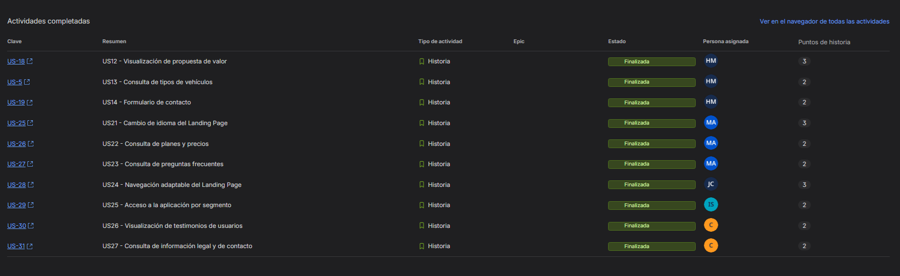
</p>

***Figura.*** Informe del Sprint 1 en Jira: 10 User Stories finalizadas (25 Story Points) y US28 en curso (2 Story Points), que pasa al siguiente sprint.

<p align="center">
  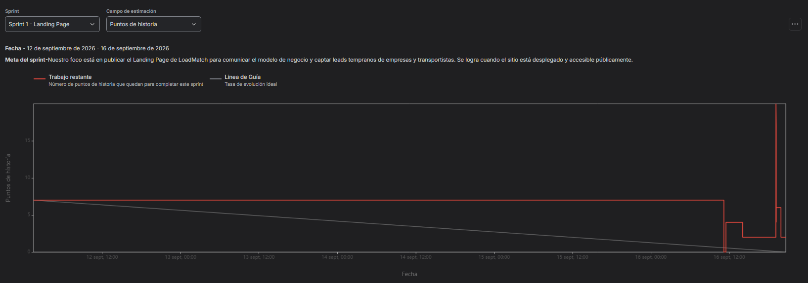
</p>

***Figura.*** Diagrama de trabajo pendiente (*sprint burndown*) del Sprint 1, del 12/09/2026 al 16/09/2026, con la meta del sprint.

<p align="center">
  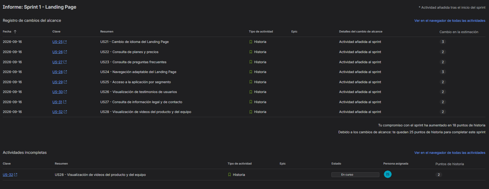
</p>

***Figura.*** Registro de cambios del alcance del Sprint 1.

El sprint se inició con US12, US13 y US14 (7 Story Points). Durante la revisión del sprint, el equipo registró en Jira las historias US21 a US28, que correspondían a secciones ya planificadas y en desarrollo en el repositorio. Estas se incorporaron formalmente el 16/09/2026 y aumentaron el compromiso en 18 Story Points, hasta 27. Por esa razón, el diagrama de trabajo pendiente muestra un salto al final del periodo.

*Nota. Las horas de las tareas no se suman con los Story Points.*

#### 5.2.1.4. Development Evidence for Sprint Review

El incremento se desarrolló con GitFlow: una rama por sección, integración a `develop` mediante Pull Request con *Create a merge commit* y publicación desde `main` con la etiqueta `v1.0.0`. La tabla resume un commit representativo por rama; el historial completo está disponible en el repositorio.

| Repository | Branch | Commit Id | Commit Message | Commit Message Body | Committed on |
| --- | --- | --- | --- | --- | --- |
| Loadmatch-landing-page | feature/project-setup | 8d13c00 | feat(seo): add HTML5 skeleton with SEO and Open Graph meta tags | Esqueleto HTML5 con metadatos | 12/09/2026 |
| Loadmatch-landing-page | feature/design-tokens | 7a8d52c | feat(tokens): add colour, spacing, type and radius design tokens | Tokens del sistema de diseño | 12/09/2026 |
| Loadmatch-landing-page | feature/header-navigation | fee3b18 | feat(nav): add mobile menu toggle with Escape key and focus return | Menú móvil accesible | 12/09/2026 |
| Loadmatch-landing-page | feature/hero-section | 7c94c08 | feat(hero): add hero section with headline, lead and segment CTAs | Propuesta de valor | 12/09/2026 |
| Loadmatch-landing-page | feature/metrics-band | cce648c | feat(metrics): add market indicators band with MTC sources | Indicadores del mercado | 12/09/2026 |
| Loadmatch-landing-page | feature/pricing-plans | b4fa8e7 | feat(pricing): add commission-based pricing section | Precios por comisión | 12/09/2026 |
| Loadmatch-landing-page | feature/faq-accordion | 3187e34 | feat(faq): add accordion behaviour with aria-expanded and hidden panels | Acordeón accesible | 12/09/2026 |
| Loadmatch-landing-page | feature/final-cta | f5af922 | feat(cta): add closing call-to-action band | Banda de cierre | 12/09/2026 |
| Loadmatch-landing-page | feature/i18n-locales | 12f8fb5 | feat(i18n): add English and Latin American Spanish dictionaries | Diccionarios EN/ES | 12/09/2026 |
| Loadmatch-landing-page | feature/how-it-works-tabs | 442300c | feat(tabs): add accessible audience tabs with arrow-key navigation | Pestañas por segmento | 14/09/2026 |
| Loadmatch-landing-page | feature/trust-cards | 4a8eb42 | feat(trust): add trust and verification cards | Tarjetas de confianza | 14/09/2026 |
| Loadmatch-landing-page | feature/youtube-videos | fe734a9 | feat(videos): add LoadMatch product and team video section | Sección de videos | 14/09/2026 |
| Loadmatch-landing-page | feature/cta-app-links | 2eb0ae6 | feat(cta): connect landing page actions to web application | Enlaces a la Web Application | 14/09/2026 |
| Loadmatch-landing-page | feature/audience-sections | b2efd78 | feat(audience): add segment blocks for companies and carriers | Bloques por segmento | 16/09/2026 |
| Loadmatch-landing-page | feature/testimonials-carousel | fb2285f | feat(carousel): add scroll-snap carousel with dot controls on mobile | Carrusel de testimonios | 16/09/2026 |
| Loadmatch-landing-page | feature/site-footer | 32e60ea | feat(footer): add site footer with navigation and legal links | Pie de página | 16/09/2026 |
| Loadmatch-landing-page | feature/legal-pages | 9fa1278 | feat(legal): add terms of service, privacy and cookie policy page | Página legal | 16/09/2026 |
| Loadmatch-landing-page | bugfix/css-structure | 46f4315 | fix(css): restore main, components and responsive stylesheets to their intended content | Corrección de hojas de estilo | 16/09/2026 |
| Loadmatch-landing-page | bugfix/duplicate-header | 6fee99d | fix(html): remove duplicated header and order sections as in the approved design | Corrección de estructura | 16/09/2026 |
| Loadmatch-landing-page | feature/app-screenshots | ecc9159 | feat(img): add application screenshots for the how-it-works steps | Capturas de la aplicación | 16/09/2026 |
| Loadmatch-landing-page | feature/vehicle-types | 920a718 | feat(vehicles): add vehicle types catalogue with cargo capacities | Catálogo de vehículos (US13) | 16/09/2026 |
| Loadmatch-landing-page | feature/contact-form | 81d31b6 | feat(contact): add validated contact form | Formulario de contacto (US14) | 16/09/2026 |
| Loadmatch-landing-page | feature/video-placeholders | ad5be56 | feat(videos): show coming-soon placeholders until the videos are published | Avisos de video | 16/09/2026 |
| Loadmatch-landing-page | release/1.0.0 | b2f1b2e | chore(release): prepare v1.0.0 | CHANGELOG de la versión | 16/09/2026 |

**Repositorio:** https://github.com/Desarrollo-Open-Source-grupo-5/Loadmatch-landing-page · **Pull Requests:** #2 al #25 · **Etiqueta:** v1.0.0 https://github.com/Desarrollo-Open-Source-grupo-5/Loadmatch-landing-page/releases/tag/v1.0.0

**Artefactos de desarrollo**

| Artefacto | Contenido |
| --- | --- |
| `index.html` | Estructura semántica, metadatos, secciones del Landing Page, formulario de contacto y enlaces configurables hacia la Web Application. |
| `assets/css/main.css` | Tokens de color, tipografía Inter, espaciado y estilos base. |
| `assets/css/components.css` | Estilos de cada componente, incluidos catálogo, formulario y avisos de video. |
| `assets/css/responsive.css` | Media queries de 1359, 1023, 767 y 389 px, impresión y reducción de movimiento. |
| `assets/js/main.js` | Enlaces a la aplicación, menú móvil, pestañas, acordeón, carrusel y validación del formulario. |
| `assets/js/i18n.js` | Carga de diccionarios, aplicación de textos y preferencia de idioma. |
| `assets/i18n/en.json`, `es.json` | Textos en inglés (en_US) y español latinoamericano (es_419). |
| `docs/terms-and-conditions.html` | Términos, privacidad, cookies y accesibilidad. |
| `CHANGELOG.md` | Registro de cambios de la versión 1.0.0. |
| `.editorconfig`, `.gitignore`, `.nojekyll`, `LICENSE` | Convenciones de formato, exclusiones, publicación estática y licencia MIT. |

#### 5.2.1.5. Execution Evidence for Sprint Review

La Landing Page se verificó en navegador a 1440, 1024, 768 y 390 px de ancho: sin recursos faltantes, sin errores de consola y sin desplazamiento horizontal. Se comprobaron también las traducciones completas en ambos idiomas y los enlaces a la página legal.

**1. Inicio e indicadores del contexto logístico**

El Hero presenta la propuesta de encontrar transporte sin disponer de flota propia y diferencia las llamadas a la acción de empresa y transportista. La sección de indicadores muestra cifras de contexto atribuidas al MTC, presentadas como antecedentes del problema.

<p align="center">
  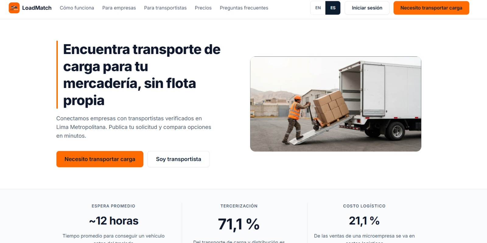
</p>

**2. Funcionamiento, catálogo de vehículos y beneficios por segmento**

La sección «Cómo funciona» contiene pestañas para empresas y transportistas, navegables con clic y con las flechas, Home y End del teclado. Desde el primer paso, el botón «Ver tipos de vehículos» lleva al catálogo (US13), que muestra furgoneta de carga (hasta 1 t), camión ligero (hasta 3 t) y camión mediano (hasta 5 t), con un aviso de que son datos de ejemplo. Las tarjetas posteriores presentan confianza y beneficios por segmento.

<p align="center">
  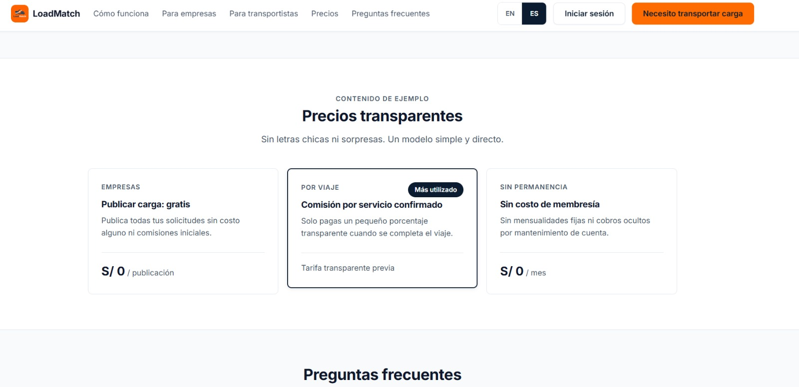
</p>

<p align="center">
  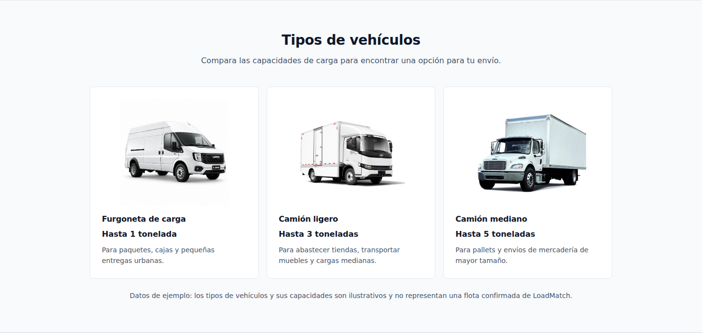
</p>

***Figura.*** Catálogo de tipos de vehículos (US13) con capacidades de carga y aviso de datos de ejemplo.

**3. Testimonios y modelo de precios**

Se incluyen tres testimonios identificados como contenido de ejemplo, con carrusel en móvil. La sección de precios describe la publicación gratuita, la comisión por servicio y la ausencia de membresía mensual.

<p align="center">
  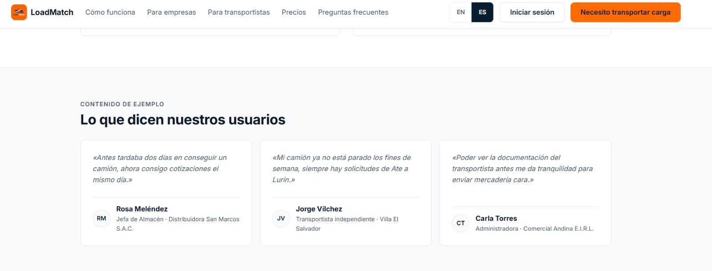
</p>

<p align="center">
  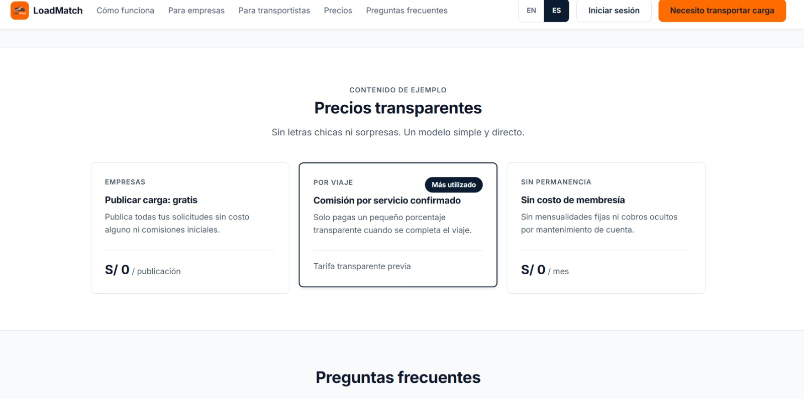
</p>

**4. Preguntas frecuentes y formulario de contacto**

El acordeón incluye cinco preguntas sobre costos, cobertura, validación de transportistas, incidencias y tipos de carga.

El formulario de contacto (US14) solicita nombre, correo, tipo de usuario y mensaje. Al enviarlo con campos vacíos o con un correo inválido, impide el envío y muestra el error debajo de cada campo; con datos válidos, muestra un mensaje de confirmación y limpia el formulario. Es un formulario de demostración: valida en el navegador y todavía no almacena los mensajes, lo que corresponde al contexto Contact del backend.

<p align="center">
  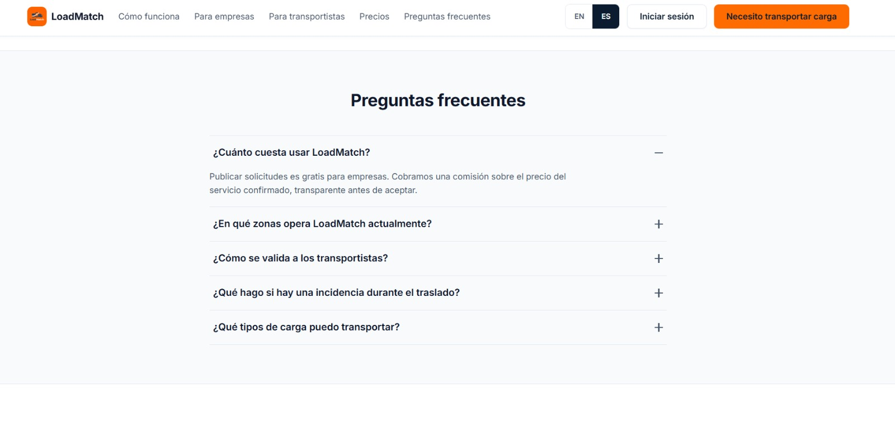
</p>

<p align="center">
  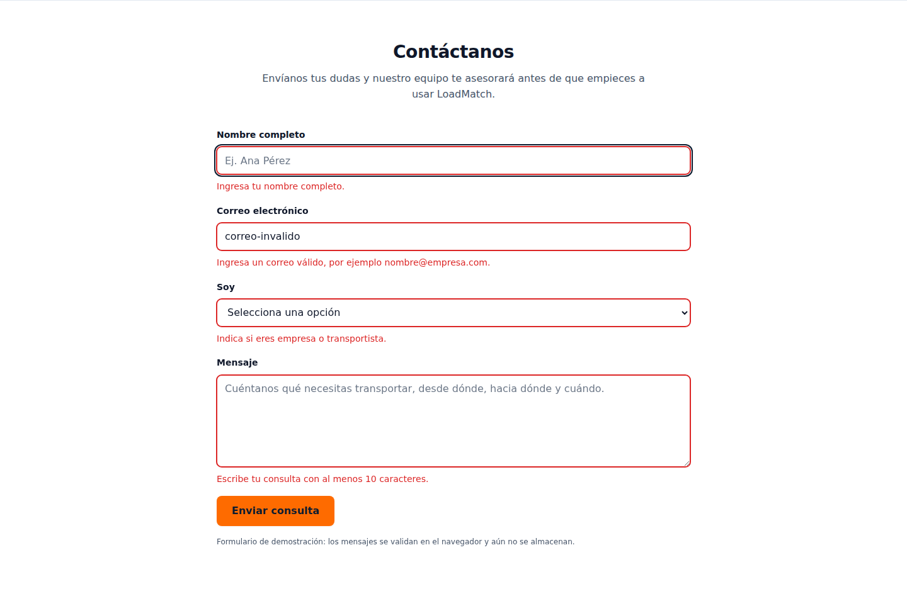
</p>

***Figura.*** Formulario de contacto (US14) enviado con campos vacíos y un correo inválido: cada campo muestra su mensaje de error.

<p align="center">
  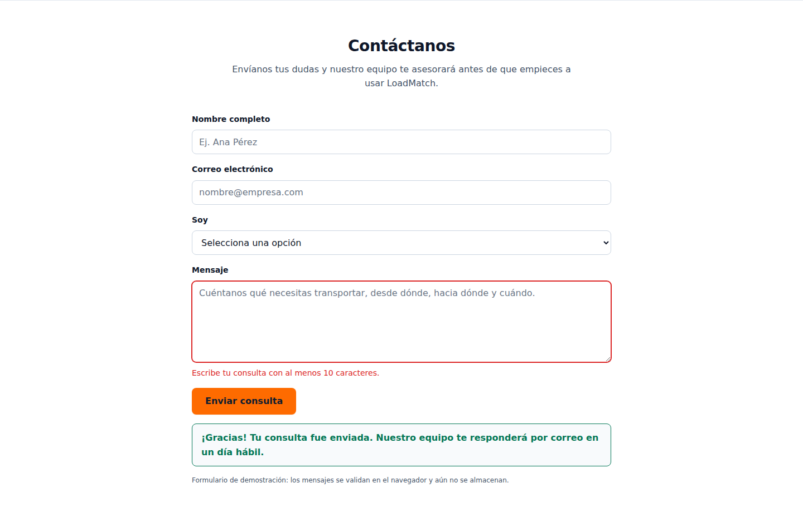
</p>

***Figura.*** Formulario de contacto (US14) tras un envío válido: mensaje de confirmación y campos limpios.

**5. Idiomas, adaptación y accesibilidad**

La selección inicial de idioma prioriza la preferencia guardada, luego el idioma del navegador y finalmente inglés. La página incluye un enlace para saltar al contenido principal, atributos ARIA, foco visible y contraste AA en los pares de color usados.

<p align="center">
  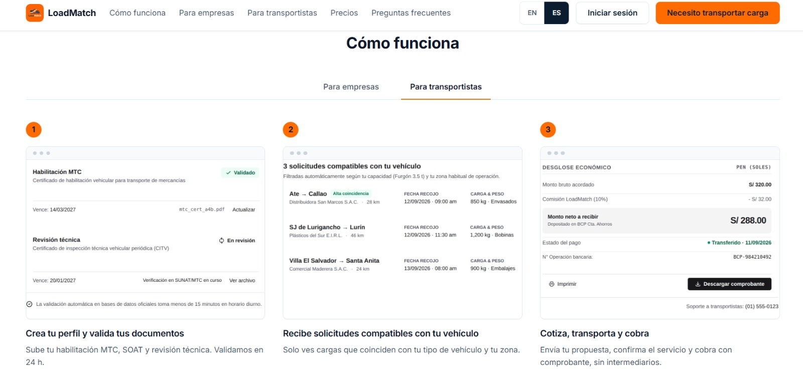
</p>

</br>

<p align="center">
  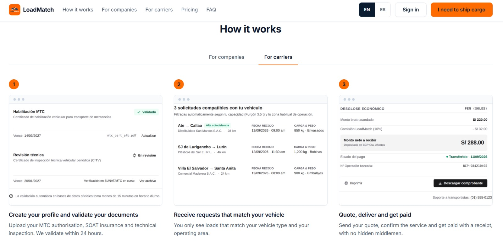
</p>

**6. Llamadas a la acción y videos**

Los botones de registro e inicio de sesión usan `data-app-path`. Mientras `APP_BASE_URL` esté vacía, llevan a la sección correspondiente de la página mediante `data-app-fallback`, sin enlaces rotos. Los dos espacios de video muestran «Video disponible próximamente» hasta la publicación de About-the-Product y About-the-Team en AV2.

**Registro de comprobaciones**

| Verificación | Resultado |
| --- | --- |
| Recursos locales | Sin archivos faltantes ni errores de consola. |
| Propuesta de valor, US12 | Cumple. |
| Catálogo, US13 | Cumple: tipos de vehículos con capacidades. |
| Formulario, US14 | Cumple: validación, mensajes de error y confirmación. |
| Idiomas, US21 | Cumple: textos completos en EN y ES, preferencia guardada. |
| Precios y FAQ, US22 y US23 | Cumple. |
| Navegación adaptable, US24 | Cumple a 1440, 1024, 768 y 390 px. |
| Acceso a la aplicación, US25 | Cumple el escenario sin aplicación desplegada. |
| Testimonios e información legal, US26 y US27 | Cumple. |
| Videos, US28 | Pendiente: avisos de disponibilidad próxima. |

**Video de navegación del Sprint Review:** https://upcedupe-my.sharepoint.com/:v:/g/personal/u202310342_upc_edu_pe/IQDWUFuRbr2mTbmyHe5Unle2ARQ_Ohp6v-p65qkdM2X-FTM?e=1wbyk6

#### 5.2.1.6. Services Documentation Evidence for Sprint Review

El incremento del Sprint 1 es un sitio estático y no contiene una API RESTful propia. El uso de `fetch` se limita a cargar los diccionarios de traducción, por lo que no existe documentación OpenAPI/Swagger para esta entrega.

La recepción real de las consultas del formulario de contacto corresponderá al contexto Contact del backend en un sprint posterior.

**Repositorio backend:** https://github.com/Desarrollo-Open-Source-grupo-5/Loadmatch-backend-application.

#### 5.2.1.7. Software Deployment Evidence for Sprint Review

La versión 1.0.0 se publicó en GitHub Pages desde la rama `main`.

| Evidencia | Detalle |
| --- | --- |
| Repositorio | https://github.com/Desarrollo-Open-Source-grupo-5/Loadmatch-landing-page |
| Plataforma | GitHub Pages, rama `main`, carpeta `/ (root)`, HTTPS obligatorio. |
| URL pública | https://desarrollo-open-source-grupo-5.github.io/Loadmatch-landing-page/ |
| Pull Request de publicación | #25, `release/1.0.0` → `main` |
| Commit publicado | `077d002` |
| Etiqueta | `v1.0.0` |
| Fecha de publicación | 16/09/2026 |
| Prueba posterior | Carga de la URL pública, navegación, cambio de idioma y página legal. |

<p align="center">
  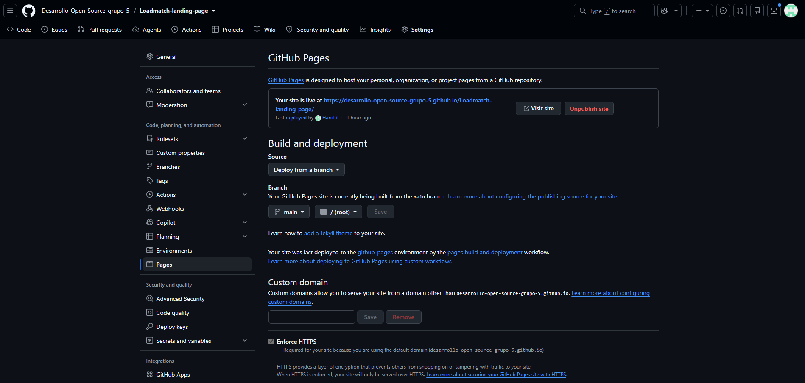
</p>

***Figura.*** Configuración de GitHub Pages en `Settings > Pages`: sitio publicado desde la rama `main`, carpeta `/ (root)`, con HTTPS obligatorio.

<p align="center">
  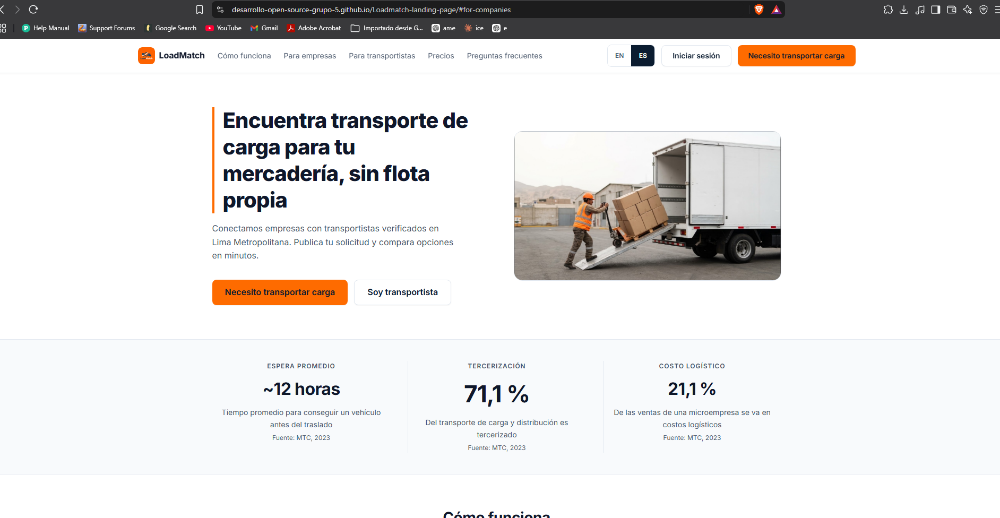
</p>

***Figura.*** Landing Page de LoadMatch abierta en su URL pública de GitHub Pages.

#### 5.2.1.8. Team Collaboration Insights during Sprint

El Landing Page se dividió en ramas por sección, lo que permitió trabajar en paralelo y registrar el aporte de cada integrante. Las ramas se integraron a `develop` mediante Pull Requests con *Create a merge commit*, que conserva los commits individuales, y la versión se publicó mediante una rama `release/1.0.0`.

| Integrante | GitHub | Ramas principales | Commits (sin merges) |
| --- | --- | --- | --- |
| Benigno Montero, Harold Fauskorp | Harold-11 | project-setup, design-tokens, bugfix/css-structure, bugfix/duplicate-header, app-screenshots, vehicle-types, contact-form, video-placeholders, release/1.0.0 | 18 |
| Rivas Castillo, Christoper Steven | CODERT0PH | audience-sections, testimonials-carousel, site-footer, legal-pages | 13 |
| Collantes Artola, Marco Antonio | Markollantes2307 | pricing-plans, faq-accordion, final-cta, i18n-locales | 12 |
| Noriega Collado, Jean Fabio | dumbaskidd | header-navigation, hero-section, metrics-band, readme-docs | 9 |
| Simon Calderon, Ismael Sebastian | Mayel-dev | how-it-works-tabs, trust-cards, youtube-videos, cta-app-links | 9 |

*Nota. Conteo de commits en `main` al 16/09/2026, sin incluir commits de merge.*

**Historial de commits por integrante:**

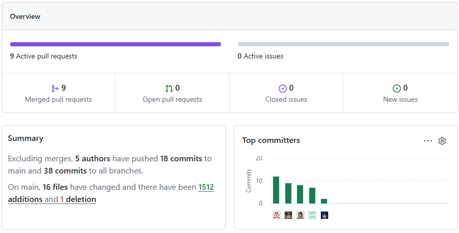

*Desarrollado por: Jean Fabio Noriega Collado (dumbaskidd)*
<p align="center">
  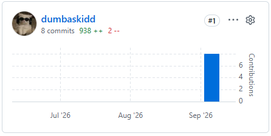
</p>

*Desarrollado por: Ismael Sebastian Simon Calderon (Mayel-dev)*
<p align="center">
  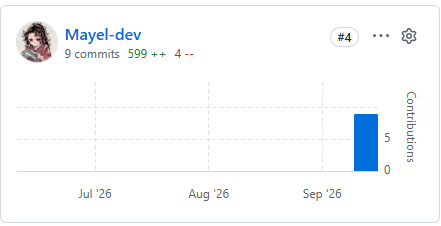
</p>

*Desarrollado por: Christoper Steven Rivas Castillo (CODERT0PH)*
<p align="center">
  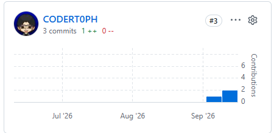
</p>

*Desarrollado por: Harold Fauskorp Benigno Montero (Harold-11)*
<p align="center">
  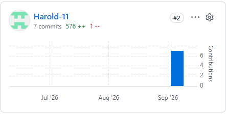
</p>

*Desarrollado por: Marco Antonio Collantes Artola (Markollantes2307)*
<p align="center">
  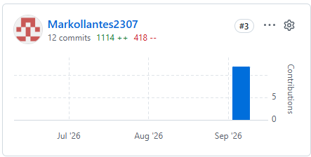
</p>

**Gráficos de colaboradores y actividad durante el sprint:**

<p align="center">
  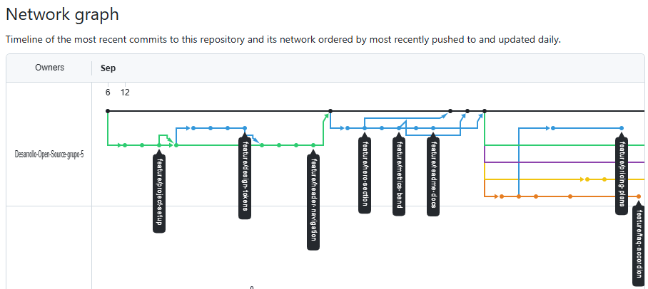
  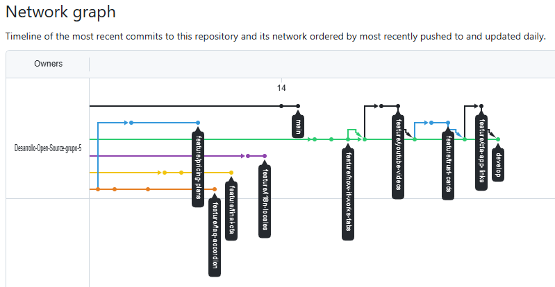
</p>

**Pull Requests:** #2 al #25 en https://github.com/Desarrollo-Open-Source-grupo-5/Loadmatch-landing-page/pulls?q=is%3Apr+is%3Aclosed, integrados con *Create a merge commit*.

---

### 5.2.2. Sprint 2

El Sprint 2, denominado **Web Application**, comprende del 1 al 5 de octubre de 2026 según Jira. El incremento incluye la base Angular por bounded context, selección de perfiles de demostración, publicación y gestión de cargas, búsqueda y detalle de fletes, seguimiento, viajes, historial y consulta documental. Se añade el despliegue del frontend y del mock, y la redirección de los CTA de la Landing Page hacia la aplicación.

Se distingue entre el estado registrado en Jira, el código disponible y el comportamiento demostrado: la captura del informe muestra 18 historias finalizadas por 49 Story Points. Este registro no sustituye las pruebas de aceptación ni demuestra que las integraciones definitivas estén operativas. El backend real, la autenticación y las validaciones externas no se presentan como completados en esta entrega.

#### 5.2.2.1. Sprint Planning 2

El objetivo y periodo provienen de las capturas de Jira proporcionadas por el equipo y fueron contrastados con el Sprint 67 mediante Atlassian el 06/10/2026. La fecha, hora, modalidad, responsable y asistentes de la reunión fueron confirmados por un integrante del equipo para esta actualización del informe. Los horarios de gestión del sprint que se añaden a continuación proceden de Jira y no se confunden con el horario de la reunión.

| Sprint # | Sprint 2 — Web Application |
| --- | --- |
| **Sprint Planning Background** | |
| Periodo del sprint | 2026-10-01 a 2026-10-05 |
| Inicio registrado en Jira | 01/10/2026, 11:35:53 p. m. (America/Lima). |
| Fin previsto registrado en Jira | 05/10/2026, 12:30 p. m. (America/Lima). |
| Cierre registrado en Jira | 05/10/2026, 11:30:17 p. m. (America/Lima); estado Closed. |
| Date (planning meeting) | 01/10/2026. |
| Time | 10:30 p. m. (America/Lima). |
| Location | Virtual. |
| Prepared By | Harold Fauskorp Benigno Montero. |
| Attendees (to planning meeting) | Harold Fauskorp Benigno Montero, Jean Fabio Noriega Collado, Ismael Sebastian Simon Calderon, Christoper Steven Rivas Castillo y Marco Antonio Collantes Artola. |
| Sprint 1 Review Summary | El Sprint 1 publicó la Landing Page. Se documentaron 25 de 27 Story Points completados y US28 pendiente; los accesos a la aplicación dependían de configurar su destino público. |
| Sprint 1 Retrospective Summary | Se identificó la necesidad de registrar el alcance oportunamente en Jira, integrar las ramas de manera continua y contrastar el backlog con los diseños. Sprint 2 mantiene responsabilidades por funcionalidad y evidencia de integración mediante ramas y Pull Requests. |
| **Sprint Goal & User Stories** | |
| Sprint 2 Goal (registrado en Jira) | Nuestro foco está en publicar la primera versión de la Web Application de LoadMatch para que las empresas publiquen y consulten sus solicitudes de carga y los transportistas encuentren fletes disponibles, y en completar el Landing Page con la sección de videos. Se logra cuando la aplicación está desplegada, es accesible desde los botones del Landing Page y respeta el Design System. |
| Sprint 2 Velocity / capacidad inicialmente comprometida | 22 Story Points registrados al inicio; no se interpreta esta cifra como una velocidad histórica medida. |
| Sum of Story Points | 49 Story Points: 22 iniciales + 27 incorporados durante el sprint. |
| Resultado registrado | 18 historias por 49 Story Points y 18 subtareas en estado Finalizada; sprint cerrado. El burndown suministrado desciende a cero. |
| Evaluación del Goal | Se dispone de configuración y URL pública del frontend, mock de producción y enlaces directos desde la landing. La parte de videos requiere confirmar su publicación; US28 figura Finalizada en Jira, pero esa captura no acredita por sí sola videos incrustados ni su reproducción. |

#### 5.2.2.2. Aspect Leaders and Collaborators

La matriz LACX organiza los aspectos de Sprint 2 según las asignaciones visibles en Jira y los cambios identificables en el frontend. Los líderes se presentan como responsables del aspecto documentado; los colaboradores se vinculan con componentes compartidos o integraciones observadas. Esta matriz describe la distribución del incremento y debe contrastarse con el acta si el equipo acordó un liderazgo distinto en la planificación.

| Team Member | GitHub Username | Base Angular, mock e integración | Cargas de empresa y Design System | Búsqueda y filtros | Detalles y seguimiento | Viajes, edición y cancelación | Historial y dashboard |
| --- | --- | --- | --- | --- | --- | --- | --- |
| Benigno Montero, Harold Fauskorp | Harold-11 | L | C | L | C | C | C |
| Noriega Collado, Jean Fabio | dumbaskidd | C | L | — | — | C | — |
| Simon Calderon, Ismael Sebastian | Mayel-dev | C | C | C | L | C | — |
| Rivas Castillo, Christoper Steven | CODERT0PH | — | C | — | — | L | — |
| Collantes Artola, Marco Antonio | Markollantes2307 | — | — | C | — | — | L |

**L:** líder del aspecto. **C:** colaborador. **—:** sin participación específica documentada en ese aspecto. La validación documental está asignada a Jean; los filtros a Marco; la búsqueda inicial a Harold. Los accesos de la landing registran commits de Harold y la preparación del despliegue registra commits de Ismael.

#### 5.2.2.3. Sprint Backlog 2

El backlog prioriza publicar y gestionar solicitudes para empresas y consultar oportunidades y servicios para transportistas. La tabla conserva los IDs funcionales del Capítulo III y añade las claves reales de Jira: por ejemplo, **US09** es la historia funcional y **US-14** su clave en Jira. No son identificadores intercambiables.

**Tablero:** https://upc-team-m57tll9j.atlassian.net/jira/software/projects/US/boards/2. El acceso debe comprobarse con la cuenta del docente; el enlace no garantiza acceso público.


*Figura. Registro de Jira: 18 historias finalizadas, responsables HM, JC, CC, IS y MA y 49 puntos en total. El estado corresponde a la captura suministrada por el equipo.*

**Verificación directa de Jira:** 06/10/2026, zona America/Lima. Se consultaron el Sprint 67 del tablero CL (2), las 18 historias y todas sus subtareas; las consultas se completaron sin páginas adicionales. Las asignaciones y estados de las tablas corresponden a esa consulta, no a una estimación de autoría.

| User Story Id | Jira key | Story Title | Story Points | Assigned To (historia) | Status |
| --- | --- | --- | ---: | --- | --- |
| US28 | [US-32](https://upc-team-m57tll9j.atlassian.net/browse/US-32) | Visualización de videos del producto y del equipo | 2 | Ismael Simon (IS) | Finalizada |
| US49 | [US-69](https://upc-team-m57tll9j.atlassian.net/browse/US-69) | Tema visual con los tokens del Design System | 2 | Jean Noriega (JC) | Finalizada |
| US44 | [US-64](https://upc-team-m57tll9j.atlassian.net/browse/US-64) | Estructura del proyecto Angular por bounded context | 3 | Harold Benigno (HM) | Finalizada |
| US45 | [US-65](https://upc-team-m57tll9j.atlassian.net/browse/US-65) | API simulada para el desarrollo del frontend | 3 | Harold Benigno (HM) | Finalizada |
| US04 | [US-7](https://upc-team-m57tll9j.atlassian.net/browse/US-7) | Creación de solicitud de carga | 5 | Jean Noriega (JC) | Finalizada |
| US37 | [US-57](https://upc-team-m57tll9j.atlassian.net/browse/US-57) | Listado de mis cargas | 2 | Jean Noriega (JC) | Finalizada |
| US06 | [US-10](https://upc-team-m57tll9j.atlassian.net/browse/US-10) | Búsqueda de fletes disponibles | 5 | Harold Benigno (HM) | Finalizada |
| US05 | [US-8](https://upc-team-m57tll9j.atlassian.net/browse/US-8) | Cancelación de solicitud | 2 | Christoper Rivas (CC) | Finalizada |
| US38 | [US-58](https://upc-team-m57tll9j.atlassian.net/browse/US-58) | Edición de solicitud de carga | 2 | Christoper Rivas (CC) | Finalizada |
| US42 | [US-62](https://upc-team-m57tll9j.atlassian.net/browse/US-62) | Datos del transportista asignado | 2 | Ismael Simon (IS) | Finalizada |
| US40 | [US-60](https://upc-team-m57tll9j.atlassian.net/browse/US-60) | Detalle de un flete | 2 | Ismael Simon (IS) | Finalizada |
| US48 | [US-68](https://upc-team-m57tll9j.atlassian.net/browse/US-68) | Internacionalización de la Web Application | 3 | Harold Benigno (HM) | Finalizada |
| US36 | [US-56](https://upc-team-m57tll9j.atlassian.net/browse/US-56) | Dashboard de la empresa | 3 | Marco Collantes (MA) | Finalizada |
| US39 | [US-59](https://upc-team-m57tll9j.atlassian.net/browse/US-59) | Filtros avanzados de búsqueda de fletes | 3 | Marco Collantes (MA) | Finalizada |
| US11 | [US-16](https://upc-team-m57tll9j.atlassian.net/browse/US-16) | Historial de servicios | 2 | Marco Collantes (MA) | Finalizada |
| US09 | [US-14](https://upc-team-m57tll9j.atlassian.net/browse/US-14) | Seguimiento de carga | 3 | Ismael Simon (IS) | Finalizada |
| US35 | [US-55](https://upc-team-m57tll9j.atlassian.net/browse/US-55) | Consulta del estado de validación | 2 | Jean Noriega (JC) | Finalizada |
| US41 | [US-61](https://upc-team-m57tll9j.atlassian.net/browse/US-61) | Mis viajes del transportista | 3 | Christoper Rivas (CC) | Finalizada |

**Subtareas del Sprint Backlog**

**Criterio de estimación:** las historias del Sprint 2 se estimaron con Story Points en Jira, con un total de 49 puntos. Sus valores se muestran en la tabla de historias anterior. Las subtareas descomponen ese trabajo y no tienen estimaciones independientes registradas; no se convierten ni se suman nuevamente los puntos de sus historias.

| User Story Id | Work Item/Task Id | Work Item/Task Title | Assigned To (subtarea) | Status |
| --- | --- | --- | --- | --- |
| US28 | T11 / [US-40](https://upc-team-m57tll9j.atlassian.net/browse/US-40) | Implementación de la sección de videos | Ismael Simon (IS) | Finalizada |
| US49 | T14 / [US-79](https://upc-team-m57tll9j.atlassian.net/browse/US-79) | Configuración del tema de Angular Material con los tokens del Design System | Jean Noriega (JC) | Finalizada |
| US44 | T12 / [US-77](https://upc-team-m57tll9j.atlassian.net/browse/US-77) | Inicialización del proyecto Angular con estructura por bounded context | Harold Benigno (HM) | Finalizada |
| US45 | T13 / [US-78](https://upc-team-m57tll9j.atlassian.net/browse/US-78) | Configuración de json-server con los recursos del dominio | Harold Benigno (HM) | Finalizada |
| US04 | T20 / [US-85](https://upc-team-m57tll9j.atlassian.net/browse/US-85) | Implementación del formulario de publicación de solicitud de carga | Christoper Rivas (CC) | Finalizada |
| US37 | T21 / [US-86](https://upc-team-m57tll9j.atlassian.net/browse/US-86) | Implementación del listado de cargas de la empresa con filtro por estado | Ismael Simon (IS) | Finalizada |
| US06 | T22 / [US-87](https://upc-team-m57tll9j.atlassian.net/browse/US-87) | Implementación de la búsqueda de fletes disponibles con filtros | Harold Benigno (HM) | Finalizada |
| US05 | T23 / [US-88](https://upc-team-m57tll9j.atlassian.net/browse/US-88) | Implementación de la cancelación de solicitud con motivo | Harold Benigno (HM) | Finalizada |
| US38 | T24 / [US-89](https://upc-team-m57tll9j.atlassian.net/browse/US-89) | Implementación de la edición de solicitud publicada | Ismael Simon (IS) | Finalizada |
| US42 | T26 / [US-91](https://upc-team-m57tll9j.atlassian.net/browse/US-91) | Implementación del detalle de la solicitud con los datos del transportista asignado | Ismael Simon (IS) | Finalizada |
| US40 | T27 / [US-92](https://upc-team-m57tll9j.atlassian.net/browse/US-92) | Implementación del detalle de flete para el transportista | Marco Collantes (MA) | Finalizada |
| US48 | T25 / [US-90](https://upc-team-m57tll9j.atlassian.net/browse/US-90) | Configuración de ngx-translate con en.json y es.json y selector de idioma | Jean Noriega (JC) | Finalizada |
| US36 | T28 / [US-93](https://upc-team-m57tll9j.atlassian.net/browse/US-93) | Implementación del dashboard de la empresa | Marco Collantes (MA) | Finalizada |
| US39 | T29 / [US-94](https://upc-team-m57tll9j.atlassian.net/browse/US-94) | Implementación de los filtros avanzados de búsqueda de fletes | Marco Collantes (MA) | Finalizada |
| US11 | T31 / [US-96](https://upc-team-m57tll9j.atlassian.net/browse/US-96) | Implementación del historial de servicios del transportista | Harold Benigno (HM) | Finalizada |
| US09 | T32 / [US-97](https://upc-team-m57tll9j.atlassian.net/browse/US-97) | Implementación del seguimiento de carga para la empresa | Marco Collantes (MA) | Finalizada |
| US35 | T33 / [US-98](https://upc-team-m57tll9j.atlassian.net/browse/US-98) | Implementación de la consulta del estado de validación de documentos | Harold Benigno (HM) | Finalizada |
| US41 | T30 / [US-95](https://upc-team-m57tll9j.atlassian.net/browse/US-95) | Implementación de la vista Mis viajes del transportista | Ismael Simon (IS) | Finalizada |

Las 18 historias y sus 18 subtareas figuran Finalizadas. T11 / US-40 fue trasladada desde Sprint 1 y conserva en su descripción una mención a IDs de YouTube pendientes; su estado cerrado no acredita por sí solo que los videos estén publicados. El equipo proporcionó el enlace y la captura del video de navegación del Sprint 2, incorporados en 5.2.2.5; esa evidencia es distinta de confirmar los videos About-the-Product y About-the-Team incrustados en la landing.

**Diferencias de asignación:** en 10 pares, el responsable de la subtarea no coincide con el de la historia: US04/T20, US37/T21, US05/T23, US38/T24, US48/T25, US40/T27, US41/T30, US11/T31, US09/T32 y US35/T33. Ambas tablas preservan esos valores de Jira. La asignación actual de una subtarea no determina quién escribió el código: las contribuciones técnicas se acreditan por los commits de 5.2.2.4 y 5.2.2.8. El equipo debe revisar esas diferencias para aclarar si representan distribución de trabajo o registros desactualizados; esta revisión documental no modifica Jira.

**Cambios del alcance**


*Figura. Jira registra 27 puntos añadidos al compromiso inicial de 22, dando un alcance final de 49 puntos.*

| Fecha | Historias añadidas | Story Points |
| --- | --- | ---: |
| 2026-10-02 | US05, US38, US42, US40 y US48 | 11 |
| 2026-10-03 | US36, US39, US11, US09, US35 y US41 | 16 |
| **Total añadido** | **11 historias** | **27** |

**Trabajo pendiente y resultado del sprint**


*Figura. El gráfico parte de 22 puntos, aumenta con la incorporación de alcance y desciende hasta cero al final. El aumento no representa retroceso técnico: refleja historias añadidas después de iniciar el sprint. La concentración de cierres al final aconseja registrar estados y validar tareas de manera más continua en la siguiente iteración.*

**Product Backlog restante después del Sprint 2**


*Figuras. El backlog posterior al Sprint 2 registra 28 actividades y 95 Story Points, todas en estado Tareas por hacer. Incluye autenticación, perfiles, gestión de vehículos, acciones de viajes, pagos y servicios del backend. Es alcance pendiente del producto, no trabajo incompleto comprometido dentro del Sprint 2. Los puntos de historia no equivalen a horas estimadas y estas capturas no muestran los IDs de subtareas.*

La consulta directa del backlog del tablero CL realizada el 06/10/2026 confirma las 28 historias y sus 95 Story Points. Se excluyeron épicas y subtareas del conteo para evitar duplicar alcance. US50 / US-70 permanece en Tareas por hacer con 5 puntos.

US50 (pruebas unitarias y despliegue) permanece en el backlog: se distingue la publicación visible del frontend de la aceptación completa de esa historia, que todavía no figura finalizada.

#### 5.2.2.4. Development Evidence for Sprint Review

Las evidencias siguientes corresponden a commits públicos del frontend y la landing consultados para el periodo del Sprint 2. Las fechas se presentan en **America/Lima (UTC−05:00)**; algunos commits fechados el 6 de octubre en UTC pertenecen todavía al 5 de octubre en Lima. La columna de descripción resume el cambio; no se presenta como un body textual del commit.

| Repository | Branch / evidencia de integración | Commit Id | Commit Message | Commit Message Body / descripción | Committed on (Lima) |
| --- | --- | --- | --- | --- | --- |
| Frontend | feature/project-setup-and-shared, PR #1 | [a742387](https://github.com/Desarrollo-Open-Source-grupo-5/Loadmatch-frontend-application/commit/a742387) | chore(setup): configure Angular 22 workspace with Material, ngx-translate, Karma and json-server | Configuración del workspace y dependencias. | 03/10/2026 |
| Frontend | feature/project-setup-and-shared, PR #1 | [a3d17b7](https://github.com/Desarrollo-Open-Source-grupo-5/Loadmatch-frontend-application/commit/a3d17b7) | chore(api): add environments and json-server mock API with seed data | Entornos, API simulada y datos de prueba. | 03/10/2026 |
| Frontend | feature/design-system-theme, integración registrada | [7b15d2d](https://github.com/Desarrollo-Open-Source-grupo-5/Loadmatch-frontend-application/commit/7b15d2d) | feat(shared): add design tokens with WCAG contrast helper | Tokens visuales y apoyo al contraste. | 03/10/2026 |
| Frontend | feature/publish-load-request, integración registrada | [5b5078a](https://github.com/Desarrollo-Open-Source-grupo-5/Loadmatch-frontend-application/commit/5b5078a) | feat(freight-publishing): implement publish load request form with validation | Formulario de solicitud y validación. | 03/10/2026 |
| Frontend | feature/my-load-requests, integración registrada | [7319010](https://github.com/Desarrollo-Open-Source-grupo-5/Loadmatch-frontend-application/commit/7319010) | feat(freight-publishing): implement my load requests list with status filter and actions | Listado y filtros de cargas. | 03/10/2026 |
| Frontend | feature/cancel-and-edit-load-request, PR #2 | [230e6a1](https://github.com/Desarrollo-Open-Source-grupo-5/Loadmatch-frontend-application/commit/230e6a1) | feat(freight-publishing): add cancel load request dialog with reason | Cancelación con motivo. | 04/10/2026 |
| Frontend | feature/cancel-and-edit-load-request, PR #2 | [cb95d33](https://github.com/Desarrollo-Open-Source-grupo-5/Loadmatch-frontend-application/commit/cb95d33) | feat(freight-publishing): add edit mode to the load request form for published requests | Edición de solicitudes publicadas. | 04/10/2026 |
| Frontend | feature/search-available-loads, PR #3 | [7fd8b57](https://github.com/Desarrollo-Open-Source-grupo-5/Loadmatch-frontend-application/commit/7fd8b57) | feat(matching): implement available loads search view and load card | Vista de búsqueda y tarjetas. | 04/10/2026 |
| Frontend | feature/available-load-detail, PR #4 | [c0d2fb7](https://github.com/Desarrollo-Open-Source-grupo-5/Loadmatch-frontend-application/commit/c0d2fb7) | feat(matching): add available load detail view and link it from the load card | Detalle de flete. | 04/10/2026 |
| Frontend | feature/load-request-detail, PR #5 | [ae2aee1](https://github.com/Desarrollo-Open-Source-grupo-5/Loadmatch-frontend-application/commit/ae2aee1) | feat(freight-publishing): add load request detail view with the assigned carrier | Detalle y transportista asignado. | 04/10/2026 |
| Frontend | feature/shipper-dashboard, PR #7 | [57021dd](https://github.com/Desarrollo-Open-Source-grupo-5/Loadmatch-frontend-application/commit/57021dd) | feat(shipper-dashboard): shipper-dashboard component implemented | Dashboard de empresa. | 04/10/2026 |
| Frontend | feature/advanced-load-filters, PR #8 | [0902bc0](https://github.com/Desarrollo-Open-Source-grupo-5/Loadmatch-frontend-application/commit/0902bc0) | feat(advanced-load-filters): updated load search component | Filtros avanzados. | 04/10/2026 |
| Frontend | feature/carrier-trips, PR #12 | [3598ccb](https://github.com/Desarrollo-Open-Source-grupo-5/Loadmatch-frontend-application/commit/3598ccb) | feat(trip-execution): implement my trips grouped as upcoming, in progress and completed | Viajes agrupados por estado. | 04/10/2026 |
| Frontend | feature/load-tracking, PR #13 | [d366330](https://github.com/Desarrollo-Open-Source-grupo-5/Loadmatch-frontend-application/commit/d366330) | feat(trip-execution): implement load tracking with status timeline for shippers | Seguimiento e historial de estados. | 04/10/2026 |
| Frontend | feature/service-history, PR #14 | [ab366db](https://github.com/Desarrollo-Open-Source-grupo-5/Loadmatch-frontend-application/commit/ab366db) | feat(trip-execution): implement service history of completed trips with totals | Historial y totales. | 04/10/2026 |
| Frontend | feature/document-validation-status, PR #15 | [2c77a56](https://github.com/Desarrollo-Open-Source-grupo-5/Loadmatch-frontend-application/commit/2c77a56) | feat(documents): implement document validation status with rejection reasons and expiry warning | Estados de documentos. | 04/10/2026 |
| Frontend | develop → main, PR #16 | [e9a5352](https://github.com/Desarrollo-Open-Source-grupo-5/Loadmatch-frontend-application/commit/e9a5352) | chore(deploy): configure Vercel hosting and SPA routing | Hosting y rutas del cliente. | 05/10/2026 |
| Frontend | main, PR #17 | [9756bac](https://github.com/Desarrollo-Open-Source-grupo-5/Loadmatch-frontend-application/commit/9756bac) | fix(config): point production API to Render | URL HTTPS del mock de producción. | 05/10/2026 |
| Landing Page | main | [a7479af](https://github.com/Desarrollo-Open-Source-grupo-5/Loadmatch-landing-page/commit/a7479af) | feat(cta): redirect landing buttons to web app | Configuración del destino de la Web Application. | 05/10/2026 |
| Landing Page | main | [245b3b9](https://github.com/Desarrollo-Open-Source-grupo-5/Loadmatch-landing-page/commit/245b3b9) | fix(cta): use direct web application links | URL absoluta en los ocho href de los CTA. | 05/10/2026 |

**Repositorios:** [Frontend](https://github.com/Desarrollo-Open-Source-grupo-5/Loadmatch-frontend-application) y [Landing Page](https://github.com/Desarrollo-Open-Source-grupo-5/Loadmatch-landing-page). Los PR #1–#15 evidencian integración de funcionalidades a `develop`; #16 y #17 documentan ajustes de despliegue hacia `main`. Los cambios de CTA están registrados directamente en `main`; no se les atribuye una rama feature o un Pull Request inexistente.

#### 5.2.2.5. Execution Evidence for Sprint Review

El incremento incorpora las vistas de empresa y transportista que se describen a continuación. Las rutas proceden del código frontend; esta relación orienta el recorrido del video y las capturas que deben añadirse. Una ruta implementada no acredita por sí sola que todos sus criterios de aceptación hayan sido ejecutados satisfactoriamente.

| Vista / ruta | Historias relacionadas | Recorrido a documentar |
| --- | --- | --- |
| `/home` | US44 | Seleccionar un perfil de demostración y acceder a sus vistas; no presentarlo como login real. |
| `/shipper/dashboard` | US36 | Mostrar indicadores, últimas operaciones y el caso de empresa sin cargas. |
| `/shipper/load-requests` | US37, US05 | Filtrar solicitudes por estado y cancelar una publicada, mostrando resultado y actualización de lista. |
| `/shipper/load-requests/new` | US04 | Completar el formulario, mostrar campos inválidos y una publicación válida sobre el mock. |
| `/shipper/load-requests/:id/edit` | US38 | Editar una solicitud disponible y mostrar las restricciones de estado. |
| `/shipper/load-requests/:id` | US42 | Consultar detalle, transportista y vehículo; mostrar una solicitud aún sin asignación. |
| `/shipper/tracking/:loadRequestId` | US09 | Mostrar estado e historial del viaje y el mensaje cuando no existe seguimiento. |
| `/carrier/available-loads` | US06, US39 | Buscar fletes, aplicar y limpiar filtros y mostrar un caso sin resultados. |
| `/carrier/available-loads/:id` | US40 | Abrir detalle y comprobar disponibilidad actual del flete. |
| `/carrier/trips` | US41 | Consultar grupos de viajes y caso sin viajes. |
| `/carrier/trips/history` | US11 | Mostrar servicios completados y totales calculados con datos de muestra. |
| `/carrier/documents` | US35 | Comparar estados, motivos de rechazo y avisos de vencimiento; no describirlo como validación oficial del MTC. |
| Landing Page → `/home` | US25, acceso actualizado | Pulsar CTA de empresa, transportista e inicio de sesión y mostrar llegada a la aplicación. Los tres tipos de botón comparten actualmente `/home`; no existen destinos diferenciados de registro/login. |

**Video de navegación del Sprint 2**  
**Link:** [LoadMatch — Sprint 2 Execution Demo | Web Application](https://youtu.be/eCoQdmCrUJg).  
**Duración:** 4 minutos y 38 segundos, según el contador visible en la captura proporcionada por el equipo; está dentro del intervalo orientativo de 3–5 minutos por aplicación.  
**Disponibilidad:** la captura muestra el video como No listado. El acceso mediante enlace debe comprobarse antes de entregar.


*Figura. Reproductor del video de demostración del Sprint 2, en el instante 0:37 de una duración total de 4:38. La captura acredita título y duración visibles; no sustituye una revisión completa del contenido ni una captura de cada recorrido interno.*

**Capturas de ejecución proporcionadas por el equipo**


*Figura. Landing Page en español, ejecutada en `127.0.0.1:5501`, con CTA de empresa, transportista e inicio de sesión. Acredita visualización local, no publicación en GitHub Pages ni el resultado de pulsar los botones.*


*Figura. `/home` de la aplicación desplegada en Vercel, en inglés, con cuatro empresas y tres transportistas para seleccionar perfiles de demostración. Acredita la visualización de la entrada de la aplicación, no la ejecución completa de las historias internas ni autenticación real.*

**Adaptación móvil de las páginas iniciales**


*Figura. Landing publicada en GitHub Pages, en español, mediante emulación de iPhone SE a 375 × 667. Se observan menú compacto, CTA apilados y contenido adaptado al ancho. Acredita la vista móvil inicial y la dirección pública, no la ejecución del menú ni de los botones.*


*Figura. Inicio de la Web Application en Vercel, en inglés, mediante emulación de iPhone SE a 375 × 667. El texto y las tarjetas de empresa se adaptan al ancho visible; el contenido continúa mediante desplazamiento vertical. No es una prueba en un dispositivo físico ni acredita todas las pantallas internas.*

Las evidencias de esta sección incluyen el video de demostración y las capturas desktop y móviles proporcionadas por el equipo. Se distingue su alcance: las capturas muestran las páginas iniciales; las imágenes de Jira muestran planificación y estado del trabajo.

No se traslada a esta entrega el resultado histórico de pruebas de otro checkout ni se afirma una nueva ejecución de tests. Los resultados de build, pruebas y revisión de consola deben acompañarse de la fecha y versión realmente comprobadas por el equipo.

#### 5.2.2.6. Services Documentation Evidence for Sprint Review

Durante Sprint 2 se utilizó JSON Server para desarrollar el frontend con datos de muestra. El repositorio de Web Services definitivos es [Loadmatch-backend-application](https://github.com/Desarrollo-Open-Source-grupo-5/Loadmatch-backend-application). Esta entrega no aporta documentación OpenAPI/Swagger del backend Spring Boot ni commits que acrediten su elaboración; el mock no se presenta como documentación de servicios definitiva.

**Base local:** `http://localhost:3000/api/v1`. **Base configurada en producción:** `https://loadmatch-api.onrender.com/api/v1`.


*Figura. La dirección raíz de Render muestra `{}`. Esta respuesta no acredita por sí sola un fallo ni comprueba los recursos de la API. En una comprobación de solo lectura realizada durante esta revisión, `GET /api/v1/shippers` respondió HTTP 200 con cuatro empresas. La API entrega JSON, no una interfaz web; esta comprobación puntual no valida todos los endpoints.*

| Recurso del mock | Acción de consulta | Uso en el frontend |
| --- | --- | --- |
| `/shippers` | GET | Empresas y selección de perfil de demostración. |
| `/carriers` | GET | Transportistas y datos del asignado. |
| `/vehicle-types` | GET | Catálogo de tipos de vehículo. |
| `/vehicles` | GET | Datos de unidades y capacidad. |
| `/load-requests` | GET | Cargas, búsqueda, detalles y dashboard. |
| `/trips` | GET | Viajes, seguimiento e historial. |
| `/document-types` | GET | Tipos de documentación. |
| `/documents` | GET | Estados de validación documental. |

Los recursos siguen `server/db.json` y el mapeo de `server/routes.json`. La publicación, edición y cancelación de solicitudes operan sobre el mock; no deben atribuirse al backend real. Los contratos formales, parámetros, respuestas y ejemplos interactivos de OpenAPI se incorporarán cuando se implemente y documente el Web Service correspondiente. Los commits `a3d17b7` y `9756bac` evidencian preparación y configuración del mock, no documentación OpenAPI.

#### 5.2.2.7. Software Deployment Evidence for Sprint Review

Sprint 2 incorpora la publicación de la Web Application en Vercel y la configuración de su consumo de JSON Server en Render. La Landing Page permanece en GitHub Pages y recibe una actualización de los enlaces de acceso.

| Producto | URL / configuración | Evidencia disponible |
| --- | --- | --- |
| Landing Page | https://desarrollo-open-source-grupo-5.github.io/Loadmatch-landing-page/ | Commits `a7479af` y `245b3b9`: ocho CTA hacia `/home`. |
| Web Application | https://loadmatch-frontend-application.vercel.app/home | `vercel.json`, commit `e9a5352` y PR #16. |
| API simulada | https://loadmatch-api.onrender.com/api/v1 | Configuración remota de producción, commit `9756bac` y PR #17. |
| Backend Spring Boot | Sin despliegue acreditado en esta entrega | Se mantiene separado del mock. |

**Configuración reproducible del frontend**

```text
Framework: Angular
Build command: npm run build
Output directory: dist/loadmatch-frontend-application/browser
SPA rewrite: /(.*) -> /index.html
Production API: https://loadmatch-api.onrender.com/api/v1
```

La reescritura permite que Vercel entregue el documento de la SPA cuando se solicita una ruta interna. La configuración HTTPS del mock permite que el frontend use una URL pública, en lugar de depender de un servidor localhost del visitante.

**Actualización de la landing:** los ocho enlaces de acción contienen `href="https://loadmatch-frontend-application.vercel.app/home"`, además de la configuración centralizada en `assets/js/config.js`. El enlace absoluto evita que la navegación dependa exclusivamente de la sustitución de href por JavaScript. La entrada común `/home` permite escoger el perfil de demostración; no equivale a completar los destinos de autenticación por segmento previstos en US25.

**Evidencia visual disponible:** la captura `LandingMobilePublished.png`, incorporada en 5.2.2.5, muestra la landing con su dirección pública de GitHub Pages. Las capturas de inicio desktop y móvil muestran la Web Application con su dirección de Vercel.

**Configuración y despliegue de Vercel**


*Figura. Importación del repositorio del frontend desde `main`, preset Angular, instalación mediante `npm ci`, build mediante `npm run build` y salida `dist/loadmatch-frontend-application/browser`. La captura muestra el formulario de configuración anterior al despliegue; el campo de ejemplo de variables de entorno no demuestra una variable configurada.*


*Figura. Panel de producción de Vercel con estado Ready, dominio `loadmatch-frontend-application.vercel.app`, rama `main` y commit `9756bac` — configuración de la API de producción hacia Render. Esta captura acredita el resultado del despliegue, a diferencia del formulario de importación.*

**Configuración y despliegue del servicio real de Render**


*Figura. Servicio `loadmatch-api`, runtime Node, instancia Free, región Virginia, repositorio del frontend y rama `main`, con URL pública y estado Live.*


*Figura. Configuración de build: `npm ci --include=dev`, con Root Directory vacío (raíz del repositorio). La inclusión de dependencias de desarrollo permite disponer de JSON Server, declarado en devDependencies.*


*Figura. Start Command: `npm run api -- --host 0.0.0.0 --port $PORT`; Auto-Deploy: On Commit. El script `api` inicia JSON Server con los recursos y rutas del proyecto; los argumentos permiten escuchar en todas las interfaces y utilizar el puerto asignado al servicio. Pre-Deploy Command está vacío y el Deploy Hook permanece oculto.*


*Figura. Despliegue con indicador de éxito, estado Live y commit `aafd95e` en `main`. La duración de despliegue indicada es 49,3 segundos. El panel advierte que la instancia gratuita puede suspenderse por inactividad y demorar las solicitudes al reactivarse.*

Estas capturas documentan la configuración final de la API simulada, en lugar del formulario de creación mostrado anteriormente. Render ejecuta JSON Server, no el servidor de desarrollo Angular. La configuración y el despliegue de Vercel y Render ya están incluidos; no se asigna una etiqueta de release no acreditada.

#### 5.2.2.8. Team Collaboration Insights during Sprint

El historial público del frontend registra aportes de los cinco integrantes. La tabla identifica cambios representativos y su relación con Jira; no equipara cantidad de commits con calidad del aporte ni reutiliza los conteos del Sprint 1 como cifras de Sprint 2.

| Integrante | GitHub | Trabajo identificable | Commits representativos |
| --- | --- | --- | --- |
| Harold Benigno Montero | Harold-11 | Base Angular, perfiles de demostración, API simulada, navegación, búsqueda y modelos compartidos de viajes/documentos. | `a742387`, `a3d17b7`, `7fd8b57`, `bab819f` |
| Jean Fabio Noriega Collado | dumbaskidd | Tokens, formulario, listado de cargas y consulta de validación documental. | `7b15d2d`, `5b5078a`, `7319010`, `2c77a56` |
| Ismael Sebastian Simon Calderon | Mayel-dev | Detalles de cargas/fletes, transportista asignado, seguimiento y configuración de despliegue. | `c0d2fb7`, `ae2aee1`, `d366330`, `e9a5352` |
| Christoper Steven Rivas Castillo | CODERT0PH | Edición, cancelación de cargas y viajes del transportista. | `230e6a1`, `cb95d33`, `3598ccb` |
| Marco Antonio Collantes Artola | Markollantes2307 | Dashboard, filtros avanzados, historial e integraciones de ramas. | `57021dd`, `0902bc0`, `ab366db` |

**Historial:** [commits del frontend](https://github.com/Desarrollo-Open-Source-grupo-5/Loadmatch-frontend-application/commits/main/) y [commits de la landing](https://github.com/Desarrollo-Open-Source-grupo-5/Loadmatch-landing-page/commits/main/). **Integraciones:** [Pull Requests del frontend](https://github.com/Desarrollo-Open-Source-grupo-5/Loadmatch-frontend-application/pulls?q=is%3Apr+is%3Aclosed).

**GitHub Insights: Contributors de los productos**


*Figura. Contributors de `Loadmatch-landing-page`, con la URL del repositorio visible en la barra del navegador. El gráfico incluye semanas de septiembre y octubre; los conteos corresponden al intervalo mostrado, no exclusivamente al Sprint 2.*


*Figura. Contributors de `Loadmatch-frontend-application`, con la URL del repositorio visible en la barra del navegador. Se observan aportes de los cinco integrantes. El intervalo incluye actividad anterior al 1 de octubre y no constituye un conteo exclusivo del Sprint 2.*

| GitHub Username | Commits visibles en landing | Commits visibles en frontend |
| --- | ---: | ---: |
| Harold-11 | 20 | 27 |
| CODERT0PH | 13 | 9 |
| Markollantes2307 | 12 | 13 |
| Mayel-dev | 9 | 17 |
| dumbaskidd | 8 | 16 |

Los valores se transcriben de las tarjetas de Contributors aportadas por el equipo. No se utilizan como conteos de contribuciones al informe ni como medida de calidad o porcentaje de participación. La evidencia específica del Sprint 2 se vincula con los commits e integraciones documentados en 5.2.2.4.

La colaboración de los productos se documenta con las capturas de Contributors, los commits representativos y los enlaces a sus integraciones. Las imágenes históricas de Sprint 1 se conservan en su sección.

La captura de Contributors del repositorio del **informe** se incorpora por separado en el README y en el Anexo L.3. Muestra aportes de los cinco integrantes y 290 commits acumulados en las tarjetas visibles; estas cifras no se presentan como commits exclusivos del Sprint 2.

Como oportunidad de mejora, el burndown y el registro de alcance muestran incorporación tardía de historias y cierres concentrados. El siguiente sprint debe registrar tareas y estimaciones antes de comprometerlas, mantener actualizado el avance de subtareas y reunir evidencias de ejecución y despliegue junto con la implementación.

**Historial de commits por integrante:**

*Desarrollado por: Jean Fabio Noriega Collado (dumbaskidd)*
<p align="center">
  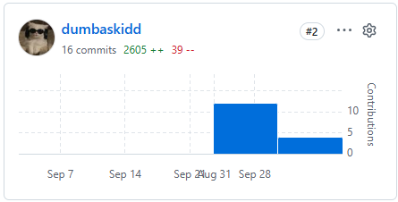
</p>

*Desarrollado por: Ismael Sebastian Simon Calderon (Mayel-dev)*
<p align="center">
  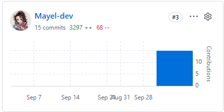
</p>

*Desarrollado por: Christoper Steven Rivas Castillo (CODERT0PH)*
<p align="center">
  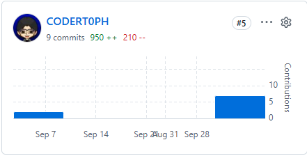
</p>

*Desarrollado por: Harold Fauskorp Benigno Montero (Harold-11)*
<p align="center">
  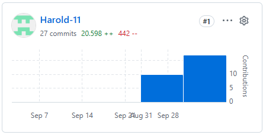
</p>

*Desarrollado por: Marco Antonio Collantes Artola (Markollantes2307)*
<p align="center">
  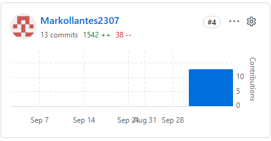
</p>
